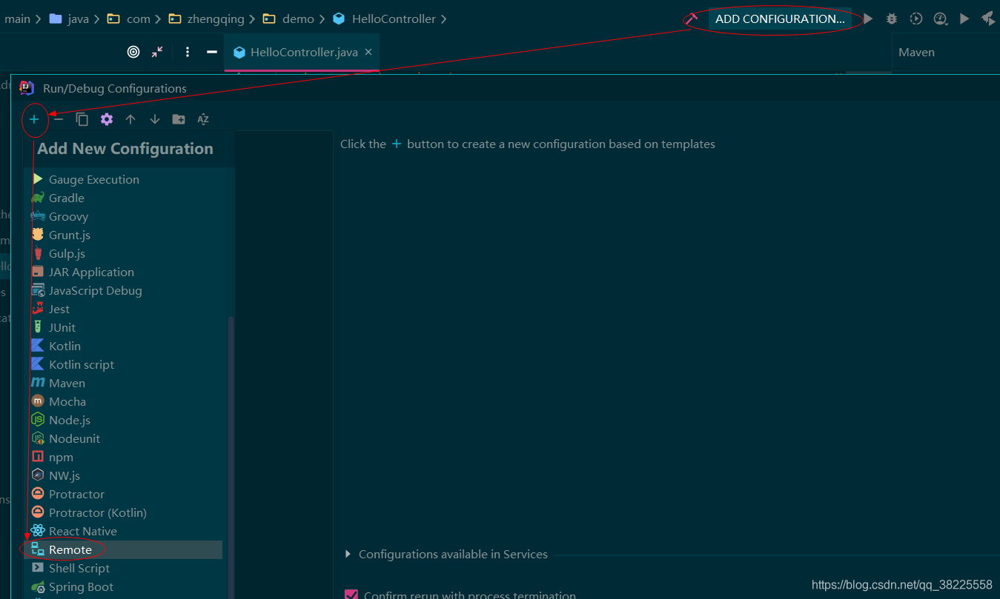
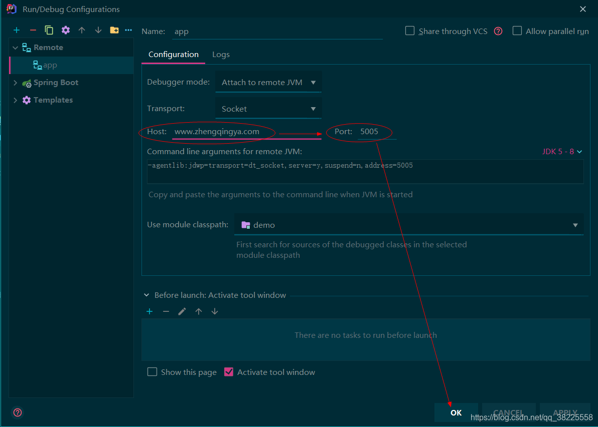
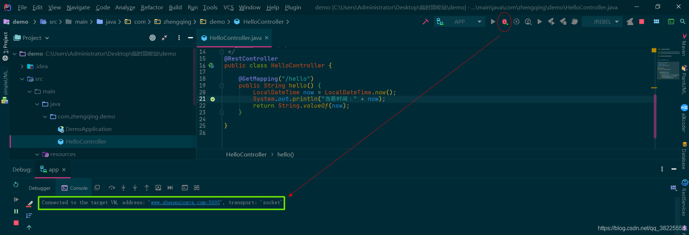
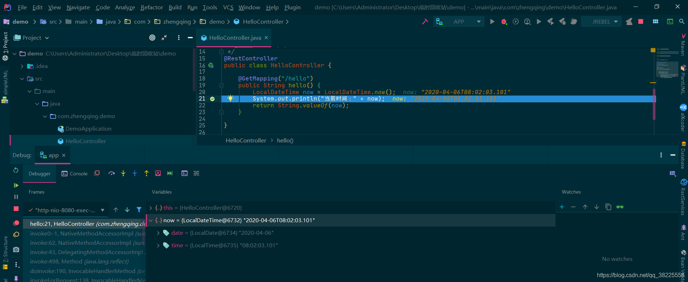

### 一、前言

###### 基本环境

1. IntelliJ IDEA 2019.3
2. SpringBoot项目
3. Docker部署运行项目

### 二、docker部署运行springboot项目

注：`address` 是开启的远程端口，本地会通过监听这个端口来实现远程调试！！！

```shell
docker run -d -p 8080:8080 -p 5005:5005 --name app \
-v /IT_zhengqing/code_test/app.jar:/tmp/app.jar \
java:latest \
java -agentlib:jdwp=transport=dt_socket,server=y,suspend=n,address=5005 -jar /tmp/app.jar
```

### 三、通过idea在本地进行远程调试

###### ① 选择`Remote`



###### ② 填写项目所运行的远程主机`Host`和端口`Port`，其它参数默认即可~

注：这里端口是远程项目运行时所配置的address中的端口哦！！！



###### ③ 启动本地调试



###### ④ 本地debug测试

在本地打个断点，然后访问远程api接口 ex: [zhengqingya.com:8080/hello](http://zhengqingya.com:8080/hello) ，可以看到本地idea中打的断点生效 ~




---


### 本文案例demo源码

[https://gitee.com/zhengqingya/java-workspace](https://gitee.com/zhengqingya/java-workspace)
