### 一、前言

> [https://github.com/Nepxion/Discovery](https://github.com/Nepxion/Discovery)

Discovery【探索】微服务框架，基于Spring Cloud & Spring Cloud Alibaba，Discovery服务注册发现、Ribbon负载均衡、Feign和RestTemplate调用、Spring Cloud Gateway和Zuul过滤等组件全方位增强的企业级微服务开源解决方案，更贴近企业级需求，更具有企业级的插件引入、开箱即用特征...

### 二、环境准备

1. 运行nacos服务
    > 基于docker环境运行nacos可参考：[https://gitee.com/zhengqingya/docker-compose](https://gitee.com/zhengqingya/docker-compose)

2. 下载代码：[https://github.com/Nepxion/DiscoveryGuide](https://github.com/Nepxion/DiscoveryGuide) (注：用simple分支)
    > 温馨小提示：如果依赖下载不了，尝试将`discovery`版本修改为`6.5.0`
    > 也可直接用小编的代码：[https://gitee.com/zhengqingya/java-workspace](https://gitee.com/zhengqingya/java-workspace)
3. 代码导入idea中启动运行所需服务
    > 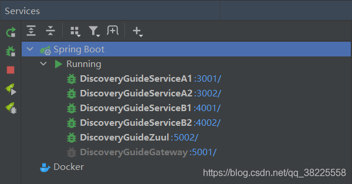
4. ① 访问测试 [http://127.0.0.1:5001/discovery-guide-service-a/invoke/gateway](http://127.0.0.1:5001/discovery-guide-service-a/invoke/gateway)
    ② 访问测试 [http://127.0.0.1:5002/discovery-guide-service-a/invoke/zuul](http://127.0.0.1:5002/discovery-guide-service-a/invoke/zuul)


### 三、全链路蓝绿发布

>**经典场景**：当调用请求从网关或者服务发起的时候，通过`Header` | `Parameter` | `Cookie`一种或者几种参数进行驱动，在路由过滤中，根据这些参数，选择在配置中心配置的`蓝路由` | `绿路由` | `兜底路由`的规则策略（Json格式），并把命中的规则策略转化为策略路由Header（n-d-开头），实现全链路传递。每个端到端服务接收到策略路由Header后，执行负载均衡时，该Header跟注册中心的对应元数据进行相关比较，不符合条件的实例进行过滤，从而实现全链路蓝绿发布

>**实施概要**：只涉及当前正在发布的服务，例如，对于 `〔网关〕`->`〔A服务〕`->`〔B服务〕`->`〔C服务〕`->`〔D服务〕`调用链来说，如果当前只是B服务和C服务正在实施发布，那么，只需要把B服务和C服务配置到规则策略中，其它则不需要配置。发布结束后，即B服务和C服务的所有实例都完全一致，例如，版本号都只有唯一一个，那么清除掉在配置中心配置的规则策略即可，从而进行下一轮全链路蓝绿发布

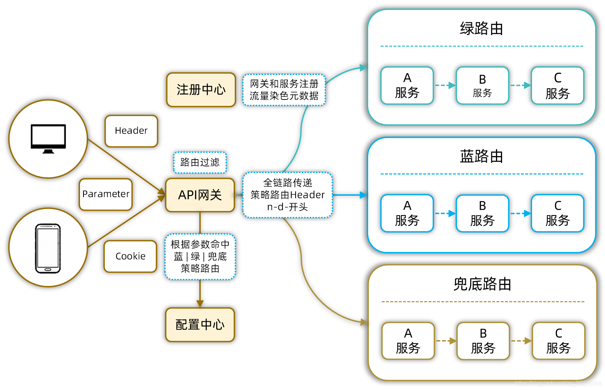

#### 1、全链路`版本匹配`蓝绿发布

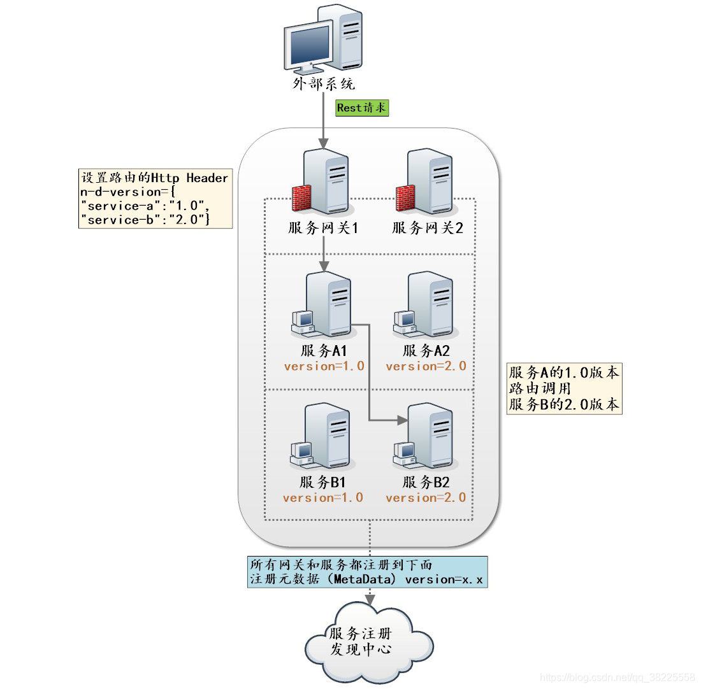


nacos中增加Spring Cloud Gateway的版本匹配蓝绿发布策略配置
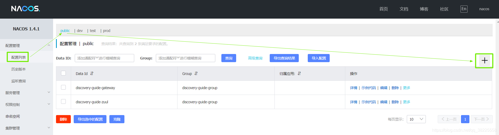

|  |  |
|--|--|
| Data ID | discovery-guide-gateway |
| Group | discovery-guide-group |
| 配置格式 | XML |

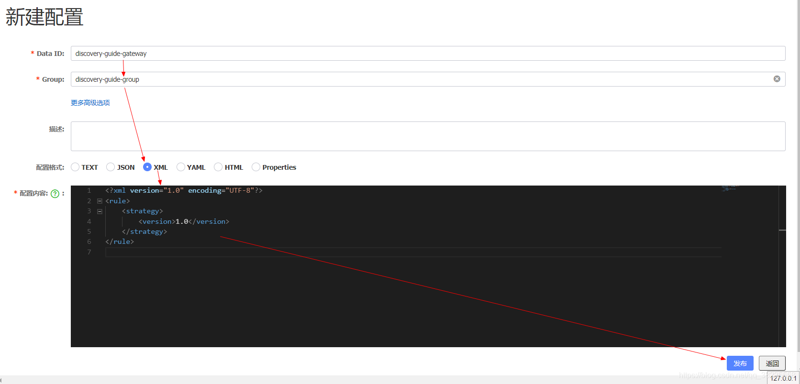


###### 策略①-`每个服务的版本统一指定`: 从Spring Cloud Gateway发起的`调用全链路`都走`1.0`版本服务，配置内容如下

```xml
<?xml version="1.0" encoding="UTF-8"?>
<rule>
    <strategy>
        <version>1.0</version>
    </strategy>
</rule>
```

访问测试 [http://127.0.0.1:5001/discovery-guide-service-a/invoke/gateway](http://127.0.0.1:5001/discovery-guide-service-a/invoke/gateway)

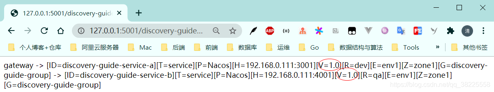

###### 策略②-`每个服务的版本分别指定`: 从Spring Cloud Gateway发起的调用走`1.0版本的a服务` -> `走1.1版本的b服务`，配置内容如下

```xml
<?xml version="1.0" encoding="UTF-8"?>
<rule>
    <strategy>
        <version>{"discovery-guide-service-a":"1.0", "discovery-guide-service-b":"1.1"}</version>
    </strategy>
</rule>
```

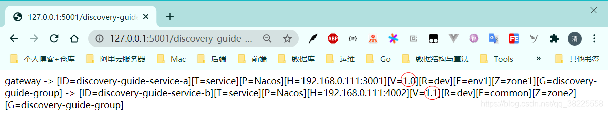


如果上述表达式还未满足需求，可以采用`通配表达式`方式

```
* - 表示调用范围为所有版本
1.* - 表示调用范围为1开头的所有版本
```

ex：

```xml
<?xml version="1.0" encoding="UTF-8"?>
<rule>
    <strategy>
        <version>{"discovery-guide-service-a":"1.0*", "discovery-guide-service-b":"1.?"}</version>
    </strategy>
</rule>
```

#### 2、全链路`区域匹配`蓝绿发布

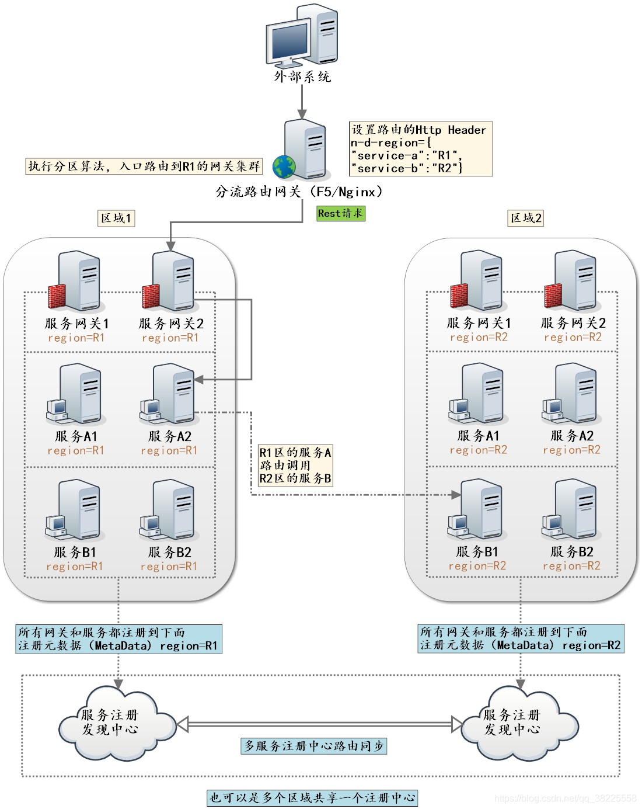


nacos中增加Zuul的区域匹配蓝绿发布策略配置

|  |  |
|--|--|
| Data ID | discovery-guide-zuul |
| Group | discovery-guide-group |
| 配置格式 | XML |

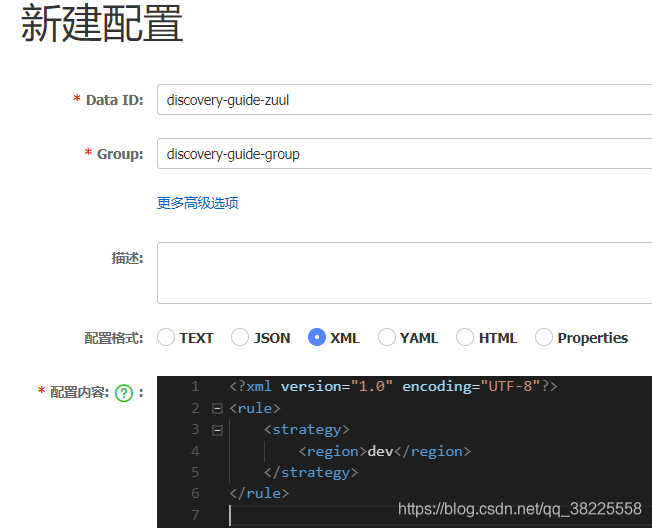

###### 策略①-`每个服务的区域统一指定`: 从Zuul发起的`调用全链路`都走`dev区域`服务，配置内容如下

```xml
<?xml version="1.0" encoding="UTF-8"?>
<rule>
    <strategy>
        <region>dev</region>
    </strategy>
</rule>
```

访问测试 [http://127.0.0.1:5002/discovery-guide-service-a/invoke/zuul](http://127.0.0.1:5002/discovery-guide-service-a/invoke/zuul)

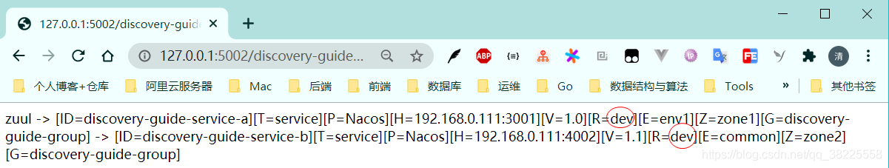


###### 策略②-`每个服务的区域分别指定`: 从Zuul发起的调用走`dev区域的a服务` -> `走qa区域的b服务`，配置内容如下

```xml
<?xml version="1.0" encoding="UTF-8"?>
<rule>
    <strategy>
        <region>{"discovery-guide-service-a":"dev", "discovery-guide-service-b":"qa"}</region>
    </strategy>
</rule>
```

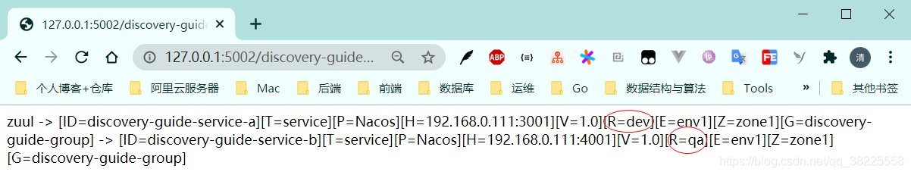


如果上述表达式还未满足需求，可以采用`通配表达式`方式

```
* - 表示调用范围为所有区域
d* - 表示调用范围为d开头的所有区域
```

ex：

```xml
<?xml version="1.0" encoding="UTF-8"?>
<rule>
    <strategy>
        <region>{"discovery-guide-service-a":"d*;q?", "discovery-guide-service-b":"dev"}</region>
    </strategy>
</rule>
```

#### 3、全链路`IP地址和端口匹配`蓝绿发布

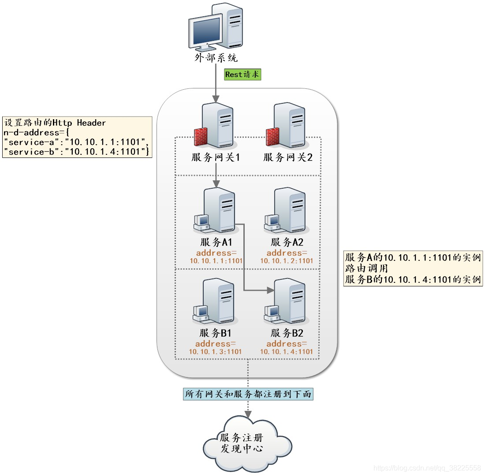

nacos中增加Zuul的IP地址和端口匹配蓝绿发布策略配置

|  |  |
|--|--|
| Data ID | discovery-guide-zuul |
| Group | discovery-guide-group |
| 配置格式 | XML |


###### 策略①-`每个服务的IP地址或端口统一指定`: 从Zuul发起的调用走`指定IP地址和端口`/`IP地址`/`端口`，配置内容如下

```xml
<?xml version="1.0" encoding="UTF-8"?>
<rule>
    <strategy>
        <!-- 注：ip不能为127.0.0.1或localhost -->
        <!-- <address>3001</address> -->
        <address>192.168.0.111</address>
        <!-- <address>192.168.0.111:3001</address> -->
    </strategy>
</rule>
```

访问测试 [http://127.0.0.1:5002/discovery-guide-service-a/invoke/zuul](http://127.0.0.1:5002/discovery-guide-service-a/invoke/zuul)
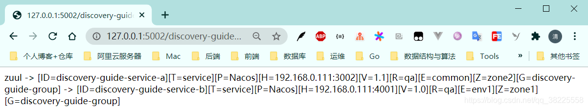

###### 策略②-`每个服务的IP地址或端口分别指定`: 从Zuul发起的调用走`3001端口的a服务`->`走4001端口的b服务`，配置内容如下

```xml
<?xml version="1.0" encoding="UTF-8"?>
<rule>
    <strategy>
        <address>{"discovery-guide-service-a":"3002", "discovery-guide-service-b":"4001"}</address>
    </strategy>
</rule>
```

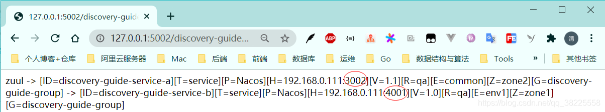

如果上述表达式还未满足需求，可以采用`通配表达式`方式

```
* - 表示调用范围为所有端口
3* - 表示调用范围为3开头的所有端口
```

ex：

```xml
<?xml version="1.0" encoding="UTF-8"?>
<rule>
    <strategy>
        <address>{"discovery-guide-service-a":"3*;400?", "discovery-guide-service-b":"4001"}</address>
    </strategy>
</rule>
```

---

> 今日分享语句：
> 我发现，一个人在放弃给别人留好印象的负担之后，原来心里会如此踏实。
