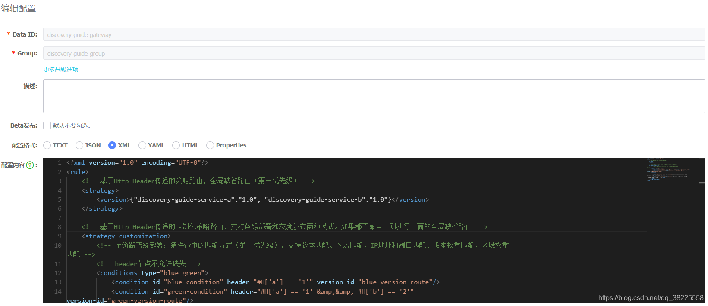
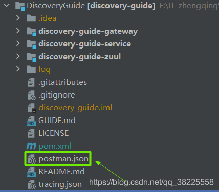
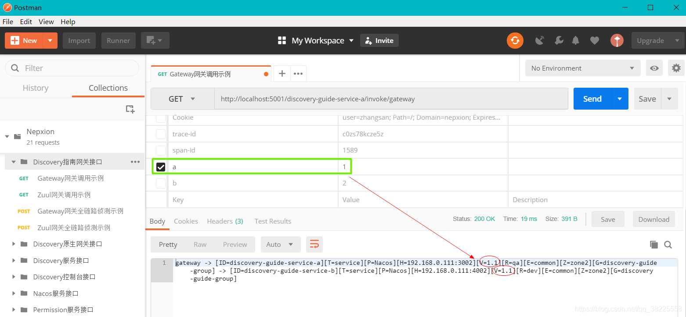
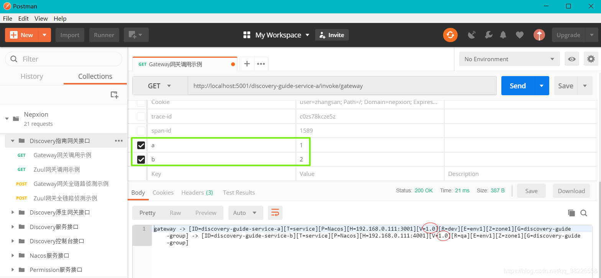

### 一、前言

全链路蓝绿发布参考：[https://zhengqing.blog.csdn.net/article/details/113065844](https://zhengqing.blog.csdn.net/article/details/113065844)

本文将基于之前的环境来进行`全链路条件蓝绿发布`

### 二、全链路条件蓝绿发布

#### 1、全链路`版本条件匹配`蓝绿发布

nacos中增加Spring Cloud Gateway的版本条件匹配蓝绿发布策略配置

|  |  |
|--|--|
| Data ID | discovery-guide-gateway |
| Group | discovery-guide-group |
| 配置格式 | XML |



##### 规则策略配置

```xml
<?xml version="1.0" encoding="UTF-8"?>
<rule>
    <!-- 基于Http Header传递的策略路由，全局缺省路由（第三优先级） -->
    <strategy>
        <version>{"discovery-guide-service-a":"1.0", "discovery-guide-service-b":"1.0"}</version>
    </strategy>

    <!-- 基于Http Header传递的定制化策略路由，支持蓝绿部署和灰度发布两种模式。如果都不命中，则执行上面的全局缺省路由 -->
    <strategy-customization>
        <!-- 全链路蓝绿部署：条件命中的匹配方式（第一优先级），支持版本匹配、区域匹配、IP地址和端口匹配、版本权重匹配、区域权重匹配 -->
        <!-- header节点不允许缺失 -->
        <conditions type="blue-green">
            <condition id="blue-condition" header="#H['a'] == '1'" version-id="blue-version-route"/>
            <condition id="green-condition" header="#H['a'] == '1' &amp;&amp; #H['b'] == '2'" version-id="green-version-route"/>
        </conditions>

        <routes>
            <route id="blue-version-route" type="version">{"discovery-guide-service-a":"1.1", "discovery-guide-service-b":"1.1"}</route>    
            <route id="green-version-route" type="version">{"discovery-guide-service-a":"1.0", "discovery-guide-service-b":"1.0"}</route>
        </routes>
    </strategy-customization>
</rule>
```

测试：
打开`Postman`，导入Postman的测试脚本`postman.json`（位于根目录下）

在Postman中执行目录结构下`〔Nepxion〕`->`〔Discovery指南网关接口〕`->`〔Gateway网关调用示例〕`，调用地址为[http://localhost:5001/discovery-guide-service-a/invoke/gateway](http://localhost:5001/discovery-guide-service-a/invoke/gateway)，相关的Header值已经预设，供开发者修改。执行通过Spring Cloud Gateway网关发起的调用，结果如下:


##### 规则策略解释

> 温馨小提示：为准确体现相关变量（例如上文中的 a ）支持`Header`/`Parameter`/`Cookie`
> 
| 版本 | 表达式 |
|--|--|
| 6.6.0版本之前 | `header="#H['a'] == '1'"` |
| 6.6.0版本开始 | `expression="#H['a'] == '1'"`，兼容`header="#H['a'] == '1'"` |

###### ① 当外部调用带有的Header/Parameter/Cookies中的值`a=1 && b=2`，执行`绿路由`

`<condition>`节点中 `header="#H['a'] == '1' &amp;&amp; #H['b'] == '2'"` 对应的 `version-id="green-version-route"` ，找到下面`<route>`节点中 `id="green-version-route" type="version"` 的那项，那么路由即为

```
{"discovery-guide-service-a":"1.0", "discovery-guide-service-b":"1.0"}
```

###### ② 当外部调用带有的Header/Parameter/Cookies中的值`a=1`，执行`蓝路由`

`<condition>`节点中 `header="#H['a'] == '1'"` 对应的 `version-id="blue-version-route"`，找到下面`<route>`节点中 `id="blue-version-route" type="version"` 的那项，那么路由即为

```
{"discovery-guide-service-a":"1.1", "discovery-guide-service-b":"1.1"}
```

###### ③ 当外部调用带有的Header/Parameter/Cookies中的值都`不命中`，或`未传值`，执行`兜底路由`

1. 执行`<strategy>`节点中的全局缺省路由，那么路由即为

```
{"discovery-guide-service-a":"1.0", "discovery-guide-service-b":"1.0"}
```

2. 如果全局缺省路由未配置，则执行Spring Cloud Ribbon轮询策略
   
###### ④ 假如不愿意从网关外部传入Header/Parameter/Cookies，那么支持策略下内置Header来决策蓝绿发布，可以代替外部传入Header/Parameter/Cookies，参考如下配置

```xml
<headers>
   <header key="a" value="1"/>
</headers>
```

内置Header一般使用场景为定时Job的服务定时去调用其它服务，希望实施蓝绿灰度发布。当服务侧配置了内置Header，而网关也传递给对应Header给该服务，通过开关来决定，网关传递的Header为优先还是服务侧内置的Header优先


> `注：Spring Cloud Gateway在Finchley版不支持该方式!!!`

###### ⑤ 路由类型支持如下

1. `蓝` | `绿` | `兜底`
2. `蓝 | 兜底`，即`绿路由缺省`，那么`兜底路由`则为`绿路由`
3. 如果`蓝路由和路由都缺省`，那就只有`兜底路由`（全局缺省路由），即为`全链路版本匹配蓝绿发布`的路由场景

###### ⑥ 策略总共支持5种，可以单独一项使用，也可以多项叠加使用

1. `version` 版本
2. `region` 区域
3. `address` IP地址和端口
4. `version-weight` 版本权重
5. `region-weight` 区域权重

###### ⑦ 策略支持Spring Spel的条件表达式方式

###### ⑧ 策略支持Spring Matcher的通配方式

#### 2、全链路`区域条件匹配`蓝绿发布
参考`全链路版本条件匹配蓝绿发布`，用法相似，只需要把规则策略中

1. 属性`version-id`替换成`region-id`
2. 属性`type="version"`替换成`type="region"`
3. 节点`route`对应的Json中版本替换成区域

#### 3、全链路`IP地址和端口条件匹配`蓝绿发布
参考`全链路版本条件匹配蓝绿发布`，用法相似，只需要把规则策略中

1. 属性`version-id`替换成`address-id`
2. 属性`type="version"`替换成`type="address"`
3. 节点`route`对应的Json中版本替换成IP地址和端口

### 三、本文案例demo

[https://gitee.com/zhengqingya/java-workspace](https://gitee.com/zhengqingya/java-workspace)

---

> 今日分享语句：
> 要取得成功，我们必须进行尝试。有时候，我们这样做会完全失败。最成功的人士都经历过失败。但是他们坚持了下来。他们中的大多数人都不会不顾后果地承担风险。实际上，他们总是竭尽所能地尽量减少他们前进道路上的风险。他们总是能从失败中汲取教训，这样做通常为他们以后的成功奠定了基础。
