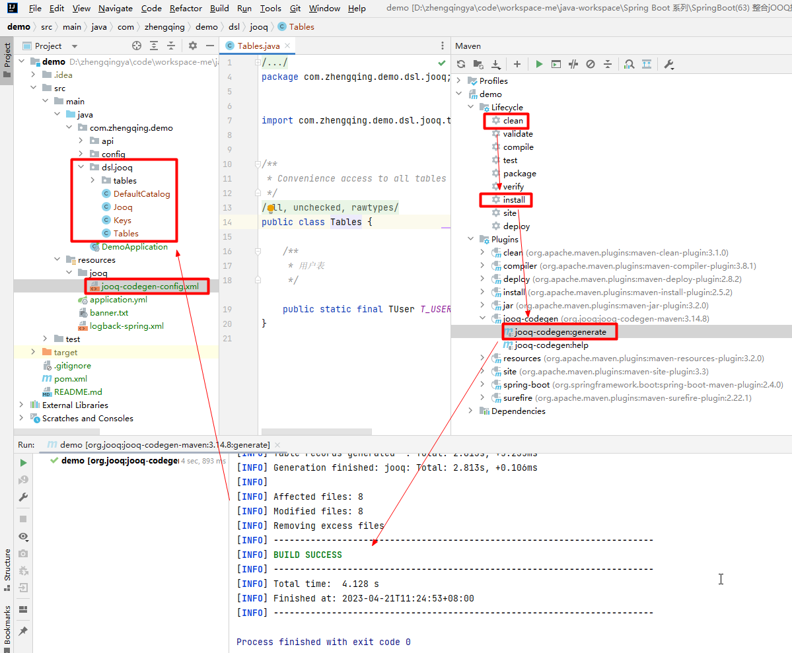

# jOOQ

- https://github.com/jOOQ/jOOQ
- http://www.jooq.org
- [Spring Boot和jOOQ整合](https://jooq.diamondfsd.com/learn/section-8-spring-boot-jooq.html)

jOOQ is the best way to write SQL in Java

一个ORM框架，利用其生成的Java代码和流畅的API，可以快速构建有类型约束的安全的SQL语句。

代码生成

