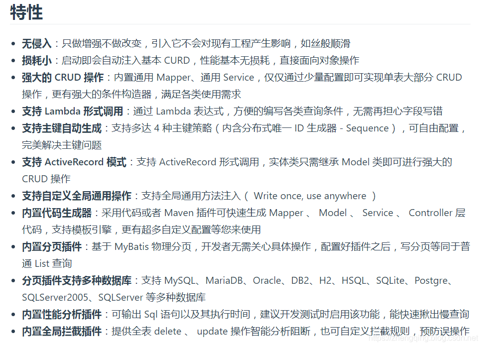
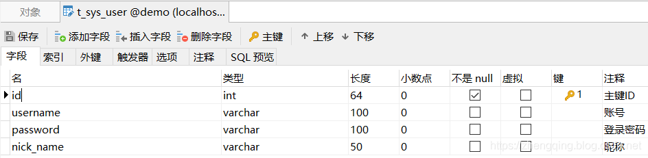
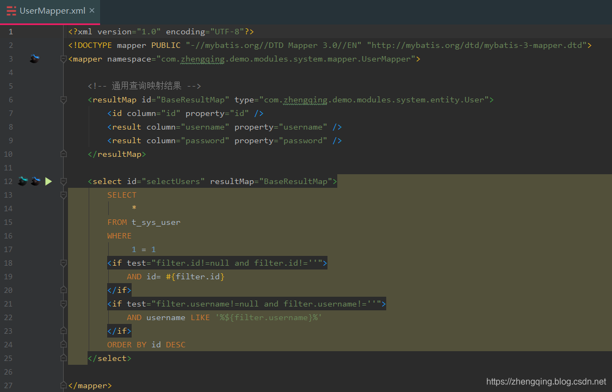
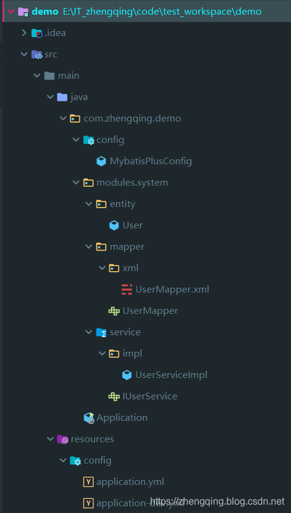

### 一、前言

本文小编将基于 `SpringBoot` 整合 `MyBatis-Plus` ， **MyBatis-Plus** 是一个 MyBatis 的增强工具，在 MyBatis 的基础上做增强并且不改变原本功能 ~ 


### 二、SpringBoot整合MyBatis-Plus

###### 基本环境
1. spring-boot 2.1.8
2. mybatis-plus 2.2.0
3. mysql 5.7.24 
4. maven项目

#### 1、`pom.xml`中引入`MyBatis-Plus`相关依赖

> 下面直接贴出小编的整个文件内容以作参考，避免因为部分细节缺失导致错误

```xml
<?xml version="1.0" encoding="UTF-8"?>
<project xmlns="http://maven.apache.org/POM/4.0.0" xmlns:xsi="http://www.w3.org/2001/XMLSchema-instance"
         xsi:schemaLocation="http://maven.apache.org/POM/4.0.0 https://maven.apache.org/xsd/maven-4.0.0.xsd">
    <modelVersion>4.0.0</modelVersion>
    <parent>
        <groupId>org.springframework.boot</groupId>
        <artifactId>spring-boot-starter-parent</artifactId>
        <version>2.1.8.RELEASE</version>
        <relativePath/> <!-- lookup parent from repository -->
    </parent>
    <groupId>com.zhengqing</groupId>
    <artifactId>demo</artifactId>
    <version>0.0.1-SNAPSHOT</version>
    <name>demo</name>
    <description>Demo project for Spring Boot</description>

    <properties>
        <java.version>1.8</java.version>
        <mybatis-plus-boot-starter.version>2.2.0</mybatis-plus-boot-starter.version>
        <mysql.version>5.1.40</mysql.version>
        <commons-lang3.version>3.6</commons-lang3.version>
        <hutool-all.version>4.6.2</hutool-all.version>
    </properties>

    <dependencies>
        <dependency>
            <groupId>org.springframework.boot</groupId>
            <artifactId>spring-boot-starter-web</artifactId>
        </dependency>
        <dependency>
            <groupId>org.springframework.boot</groupId>
            <artifactId>spring-boot-starter-test</artifactId>
            <scope>test</scope>
        </dependency>

        <!-- mybatis-plus begin =================================== -->
        <dependency>
            <groupId>org.springframework.boot</groupId>
            <artifactId>spring-boot-starter-jdbc</artifactId>
        </dependency>
        <dependency>
            <groupId>com.baomidou</groupId>
            <artifactId>mybatis-plus-boot-starter</artifactId>
            <version>${mybatis-plus-boot-starter.version}</version>
        </dependency>
        <!-- mybatis-plus end -->

        <!-- ========================= 数据库相关 ========================== -->
        <dependency>
            <groupId>mysql</groupId>
            <artifactId>mysql-connector-java</artifactId>
            <version>${mysql.version}</version>
        </dependency>
        <!-- 阿里数据库连接池 -->
        <dependency>
            <groupId>com.alibaba</groupId>
            <artifactId>druid</artifactId>
            <version>1.0.18</version>
        </dependency>

        <!-- ========================= 常用库依赖 ========================== -->
        <!-- lombok插件 -->
        <dependency>
            <groupId>org.projectlombok</groupId>
            <artifactId>lombok</artifactId>
            <optional>true</optional>
        </dependency>
        <!-- Hutool工具类 -->
        <dependency>
            <groupId>cn.hutool</groupId>
            <artifactId>hutool-all</artifactId>
            <version>${hutool-all.version}</version>
        </dependency>
        <!-- StringUtils工具类 -->
        <dependency>
            <groupId>org.apache.commons</groupId>
            <artifactId>commons-lang3</artifactId>
            <version>${commons-lang3.version}</version>
        </dependency>
    </dependencies>

    <build>
        <!-- 注：maven默认是不编译，因此加上如下resources才会生产对应的xml文件 目的：解决mybatis映射关系不对应问题  start =============== -->
        <resources>
            <resource>
                <directory>src/main/java</directory>
                <includes>
                    <include>**/*.xml</include>
                </includes>
                <filtering>false</filtering>
            </resource>
            <resource>
                <directory>src/main/resources</directory>
            </resource>
        </resources>
        <testResources>
            <testResource>
                <directory>src/main/java</directory>
                <includes>
                    <include>**/*.xml</include>
                </includes>
                <filtering>false</filtering>
            </testResource>
        </testResources>
        <!-- 注：maven默认是不编译，因此加上如下resources才会生产对应的xml文件 目的：解决mybatis映射关系不对应问题  end =============== -->

        <plugins>
            <plugin>
                <groupId>org.springframework.boot</groupId>
                <artifactId>spring-boot-maven-plugin</artifactId>
            </plugin>
        </plugins>
    </build>
</project>
```

#### 2、MyBatis-Plus配置类

> 这里主要配置分页插件 和 @MapperScan注解扫描 Mapper 文件夹

```java
@EnableTransactionManagement
@Configuration
@MapperScan("com.zhengqing.demo.modules.**.mapper*") // 扫描 Mapper 文件夹 【注：根据自己的项目结构配置】
public class MybatisPlusConfig {
    /**
     * mybatis-plus分页插件<br>
     * 文档：https://mp.baomidou.com/guide/page.html <br>
     */
    @Bean
    public PaginationInterceptor paginationInterceptor() {
        return new PaginationInterceptor();
    }
}
```

#### 3、`application.yml`中配置数据库以及mybatis-plus相关配置

> **温馨小提示**：注意修改自己的数据库连接配置信息哦~

```yml
# 配置端口
server:
  port: 8080
  servlet:
    #    context-path: /api
    application-display-name: demo

spring:
    application:
        name: demo
    profiles:
      active: dev
    # 配置数据源
    datasource:
      url: jdbc:mysql://127.0.0.1:3306/demo?allowMultiQueries=true&useUnicode=true&characterEncoding=UTF8&zeroDateTimeBehavior=convertToNull&useSSL=false # MySQL在高版本需要指明是否进行SSL连接 解决则加上 &useSSL=false
      name: demo
      username: root
      password: root
      # 使用druid数据源
      type: com.alibaba.druid.pool.DruidDataSource
      driver-class-name: com.mysql.jdbc.Driver
      filters: stat
      maxActive: 20
      initialSize: 1
      maxWait: 60000
      minIdle: 1
      timeBetweenEvictionRunsMillis: 60000
      minEvictableIdleTimeMillis: 300000
      validationQuery: select 'x'
      testWhileIdle: true
      testOnBorrow: false
      testOnReturn: false
      poolPreparedStatements: true
      maxOpenPreparedStatements: 20

management:
  security:
    enabled: false

# mybatis-plus相关配置
mybatis-plus:
  # xml扫描，多个目录用逗号或者分号分隔（告诉 Mapper 所对应的 XML 文件位置）
  mapper-locations: classpath:**/*Mapper.xml
  # 以下配置均有默认值,可以不设置
  global-config:
    #主键类型  0:"数据库ID自增", 1:"用户输入ID",2:"全局唯一ID (数字类型唯一ID)", 3:"全局唯一ID UUID";
    id-type: 0
    #字段策略 0:"忽略判断",1:"非 NULL 判断"),2:"非空判断"
    field-strategy: 2
    #驼峰下划线转换
    db-column-underline: true
    #刷新mapper 调试神器
    refresh-mapper: false
    #数据库大写下划线转换
    #capital-mode: true
    #序列接口实现类配置
    #key-generator: com.baomidou.springboot.xxx
    #逻辑删除配置
    #logic-delete-value: 0 # 逻辑已删除值(默认为 1)
    #logic-not-delete-value: 1 # 逻辑未删除值(默认为 0)
    #自定义填充策略接口实现
#    meta-object-handler: com.zhengqing.config.MyMetaObjectHandler
    #自定义SQL注入器
    #sql-injector: com.baomidou.springboot.xxx
  configuration:
    # 是否开启自动驼峰命名规则映射:从数据库列名到Java属性驼峰命名的类似映射
    map-underscore-to-camel-case: true
    cache-enabled: false
    # 如果查询结果中包含空值的列，则 MyBatis 在映射的时候，不会映射这个字段
#    call-setters-on-nulls: true
    # 这个配置会将执行的sql打印出来，在开发或测试的时候可以用
#    log-impl: org.apache.ibatis.logging.stdout.StdOutImpl
    # 解决oracle更新数据为null时无法转换报错，mysql不会出现此情况
    jdbc-type-for-null: 'null'
```

### 三、模拟业务代码  - 对用户信息表做CRUD

#### 1、数据库新建`t_sys_user`用户表


#### 2、编写实体类

> **温馨小提示** :  实体类继承MyBatis-Plus的 `Model` 类 + `Mapper`类继承MyBatis-Plus的`BaseMapper`类  -> 可支持 `ActiveRecord` 动态语法调用

```java
@Data
@TableName("t_sys_user")
public class User extends Model<User> {

    private static final long serialVersionUID = 1L;

    /**
     * 主键ID
     */
	@TableId(value="id", type= IdType.AUTO)
	private Integer id;
    /**
     * 账号
     */
	@TableField("username")
	private String username;
    /**
     * 登录密码
     */
	@TableField("password")
	private String password;
    /**
     * 昵称
     */
	@TableField("nick_name")
	private String nickName;

	@Override
	protected Serializable pkVal() {
		return this.id;
	}
}
```

#### 3、编写Mapper类

```java
public interface UserMapper extends BaseMapper<User> { }
```

### 四、测试CRUD

> **温馨小提示**：以下CRUD均采用 ActiveRecord 动态语法，

```java
@RunWith(SpringRunner.class)
@SpringBootTest
public class ApplicationTests {
    /**
     * 新增数据
     */
    @Test
    public void testAdd() throws Exception{
        User entity = new User();
        entity.setUsername("admin");
        entity.setPassword("123456");
        entity.setNickName("管理员");
        entity.insert();
    }

    /**
     * 更新数据
     */
    @Test
    public void testUpdate() throws Exception{
        User entity = new User();
        entity.setId(1);
        entity.setUsername("test");
        entity.setPassword("123456");
        entity.setNickName("测试号");
        entity.updateById();
    }

    /**
     * 删除数据
     */
    @Test
    public void testDelete() throws Exception{
        User entity = new User();
        entity.deleteById(1);
    }


    /**
     * 查询指定id数据
     */
    @Test
    public void testSelectById() throws Exception{
        User entity = new User();
        User user = entity.selectById(1);
        System.out.println(user);
    }

    /**
     * 查询所有数据
     */
    @Test
    public void testSelectAll() throws Exception{
        User entity = new User();
        List list = entity.selectList(null);
        System.out.println(list);
    }

    /**
     * 查询所有数据 - 分页
     */
    @Test
    public void testSelectAllPage() throws Exception{
        User entity = new User();
        Page<User> page = entity.selectPage(new Page<User>(1, 10), null);
        System.out.println(page);
    }
}
```

### 五、原生MyBatis方式

这个案例就放文末demo源码吧，不多说，也就是自己写sql语句处理对应业务


### 六、总结

1. 引入相关依赖
2. MyBatis-Plus核心配置 - 扫包、别名、分页插件等
3. 编写业务代码测试

总体来说相对简单，关于MyBatis-Plus更多的语法和功能可参考MyBatis-Plus官网文档

> [https://mp.baomidou.com/guide/crud-interface.html#mapper-crud-%E6%8E%A5%E5%8F%A3](https://mp.baomidou.com/guide/crud-interface.html#mapper-crud-%E6%8E%A5%E5%8F%A3)

**整体项目结构**：


---

### 本文案例源码

[https://gitee.com/zhengqingya/java-workspace](https://gitee.com/zhengqingya/java-workspace)

##### 项目实战可参考：

###### GitHub地址：[https://github.com/zhengqingya/code-generator](https://github.com/zhengqingya/code-generator)

###### 码云地址：[https://gitee.com/zhengqingya/code-generator](https://gitee.com/zhengqingya/code-generator)

