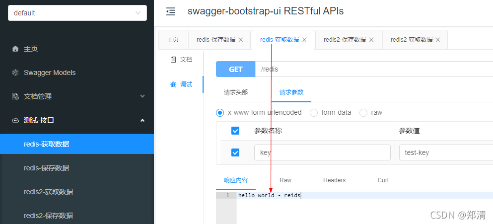
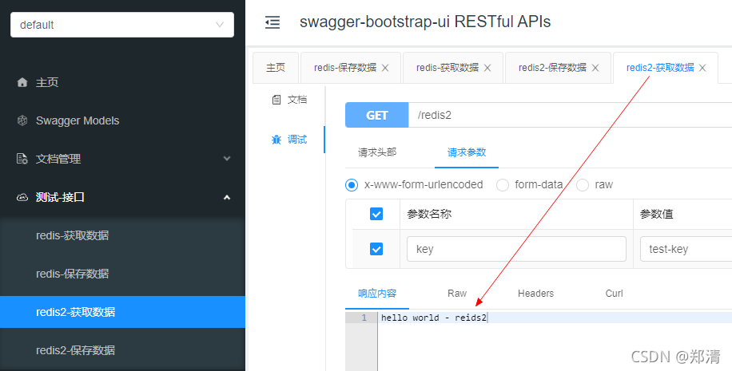

@[TOC](文章目录)


### 一、前言

SpringBoot整合Redis可参考 [https://zhengqing.blog.csdn.net/article/details/103494966](https://zhengqing.blog.csdn.net/article/details/103494966)

本文将基于以下环境实现Redis的多数据源配置

1. springboot2.4.0
2. redis6.0.8

### 二、Redis多数据源配置

#### 1、`pom.xml`依赖

```xml
<!-- redis -->
<dependency>
    <groupId>org.springframework.boot</groupId>
    <artifactId>spring-boot-starter-data-redis</artifactId>
</dependency>
<!-- jedis -->
<dependency>
    <groupId>redis.clients</groupId>
    <artifactId>jedis</artifactId>
</dependency>
```

#### 2、`application.yml`配置

```yml
spring:
  # Redis数据源
  redis:
    # Redis数据库索引（默认为0）
    database: 0
    # Redis服务器地址
    host: 127.0.0.1
    # Redis服务器连接端口
    port: 6379
    # 连接超时时间（毫秒
    timeout: 6000
    # Redis服务器连接密码（默认为空）
    password:
    jedis:
      pool:
        max-active: 1000  # 连接池最大连接数（使用负值表示没有限制）
        max-wait: -1      # 连接池最大阻塞等待时间（使用负值表示没有限制）
        max-idle: 10      # 连接池中的最大空闲连接
        min-idle: 5       # 连接池中的最小空闲连接
  # Redis数据源2
  redis2:
    # Redis数据库索引（默认为0）
    database: 1
    # Redis服务器地址
    host: 127.0.0.1
    # Redis服务器连接端口
    port: 6379
    # 连接超时时间（毫秒
    timeout: 6000
    # Redis服务器连接密码（默认为空）
    password:
    jedis:
      pool:
        max-active: 1000  # 连接池最大连接数（使用负值表示没有限制）
        max-wait: -1      # 连接池最大阻塞等待时间（使用负值表示没有限制）
        max-idle: 10      # 连接池中的最大空闲连接
        min-idle: 5       # 连接池中的最小空闲连接
```

#### 3、Redis配置类

```java
@Configuration
public class RedisConfig {

    // ========================= ↓↓↓↓↓↓ 默认redis配置 ↓↓↓↓↓↓ =========================

    @Bean
    @SuppressWarnings("all")
    public StringRedisTemplate redisTemplate(RedisConnectionFactory factory) {
        return this.buildRedisTemplate(factory);
    }

    protected StringRedisTemplate buildRedisTemplate(RedisConnectionFactory factory) {
        StringRedisTemplate template = new StringRedisTemplate(factory);
        template.setConnectionFactory(factory);
        Jackson2JsonRedisSerializer jackson2JsonRedisSerializer = new Jackson2JsonRedisSerializer(Object.class);
        ObjectMapper om = new ObjectMapper();
        om.setVisibility(PropertyAccessor.ALL, JsonAutoDetect.Visibility.ANY);
        om.enableDefaultTyping(ObjectMapper.DefaultTyping.NON_FINAL);
        jackson2JsonRedisSerializer.setObjectMapper(om);
        StringRedisSerializer stringRedisSerializer = new StringRedisSerializer();
        // key采用String的序列化方式
        template.setKeySerializer(stringRedisSerializer);
        // hash的key也采用String的序列化方式
        template.setHashKeySerializer(stringRedisSerializer);
        // value序列化方式采用jackson
        template.setValueSerializer(jackson2JsonRedisSerializer);
        // hash的value序列化方式采用jackson
        template.setHashValueSerializer(jackson2JsonRedisSerializer);
        template.afterPropertiesSet();
        return template;
    }

    // ========================= ↓↓↓↓↓↓ 第2个redis配置 ↓↓↓↓↓↓ =========================

    @Bean(name = "redisTemplate2")
    public StringRedisTemplate redisTemplate2(@Value("${spring.redis2.host}") String host,
                                              @Value("${spring.redis2.port}") int port,
                                              @Value("${spring.redis2.database:0}") int database,
                                              @Value("${spring.redis2.password}") String password
    ) {
        return buildRedisTemplate(this.buildConnectionFactory(host, password, port, database, this.jedisPoolConfig()));
    }


    public JedisConnectionFactory buildConnectionFactory(String host, String password, int port, int database, JedisPoolConfig jedisPoolConfig) {
        RedisStandaloneConfiguration redisStandaloneConfiguration = new RedisStandaloneConfiguration();
        redisStandaloneConfiguration.setHostName(host);
        redisStandaloneConfiguration.setDatabase(database);
        redisStandaloneConfiguration.setPort(port);
        redisStandaloneConfiguration.setPassword(password);
        JedisClientConfiguration.JedisPoolingClientConfigurationBuilder jedisBuilder = (JedisClientConfiguration.JedisPoolingClientConfigurationBuilder) JedisClientConfiguration.builder();
        jedisBuilder.poolConfig(jedisPoolConfig);
        JedisClientConfiguration jedisClientConfiguration = jedisBuilder.build();
        return new JedisConnectionFactory(redisStandaloneConfiguration, jedisClientConfiguration);
    }

    @Bean
    public JedisPoolConfig jedisPoolConfig() {
        JedisPoolConfig jedisPoolConfig = new JedisPoolConfig();
        // 最大连接数
        jedisPoolConfig.setMaxTotal(100);
        // 最小空闲连接数
        jedisPoolConfig.setMinIdle(20);
        // 当池内没有可用的连接时，最大等待时间
        jedisPoolConfig.setMaxWaitMillis(10000);
        return jedisPoolConfig;
    }

}
```

### 三、测试

```java
@Slf4j
@RestController
@RequestMapping("")
@Api(tags = "测试-接口")
public class IndexController {

    private final String KEY = "test-key";

    @Autowired
//    @Resource(name = "redisTemplate")
    private StringRedisTemplate redisTemplate;

    @Resource(name = "redisTemplate2")
    private StringRedisTemplate redisTemplate2;

    @PostMapping("redis")
    @ApiOperation("redis-保存数据")
    public String saveData(String key) {
        this.redisTemplate.opsForValue().set(key, "hello world - reids");
        return "SUCCESS";
    }

    @GetMapping("redis")
    @ApiOperation("redis-获取数据")
    public String getData(String key) {
        String dataStr = this.redisTemplate.opsForValue().get(key);
        log.info("{}", dataStr);
        return dataStr;
    }


    @PostMapping("redis2")
    @ApiOperation("redis2-保存数据")
    public String saveData2(String key) {
        this.redisTemplate2.opsForValue().set(key, "hello world - reids2");
        return "SUCCESS";
    }

    @GetMapping("redis2")
    @ApiOperation("redis2-获取数据")
    public String getData2(String key) {
        String dataStr = this.redisTemplate2.opsForValue().get(key);
        log.info("{}", dataStr);
        return dataStr;
    }

}
```

访问接口文档：[http://127.0.0.1:8080/doc.html](http://127.0.0.1:8080/doc.html)




### 四、本文案例demo源码

[https://gitee.com/zhengqingya/java-workspace](https://gitee.com/zhengqingya/java-workspace)


---

> 今日分享语句：
> 为了自己想要的未来，你要相信，挺过这段难熬的时间，一切都会好起来的，所以你必须得满怀信心的坚持下去。
