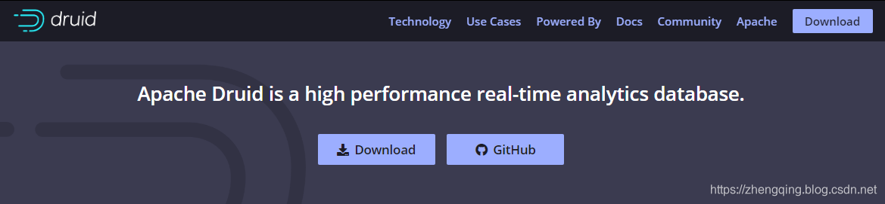
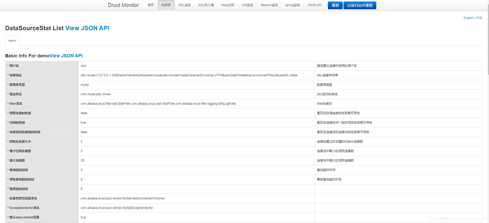
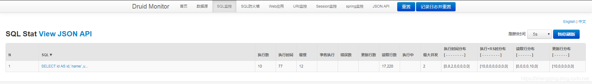
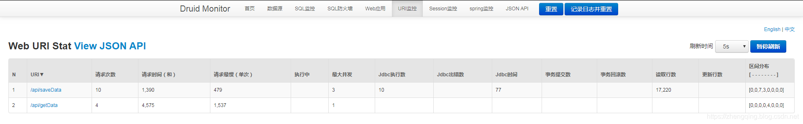

### 一、前言

###### Druid是什么？

Druid是Java语言中最好的数据库连接池，能够提供强大的监控和扩展功能。

> 更多可参考官方文档：[https://github.com/alibaba/druid/](https://github.com/alibaba/druid/)


###### 本文将基于	` springboot 2.1.8.RELEASE ` + ` mybatis-plus 2.2.0 ` 来整合  `Druid` 连接池


### 二、springboot 整合 druid 入门

#### 1、`pom.xml` 中引入 `druid` 依赖

```xml
<!-- 阿里druid数据库连接池 -->
<dependency>
     <groupId>com.alibaba</groupId>
     <artifactId>druid</artifactId>
     <version>1.1.10</version>
 </dependency>
```

#### 2、`application.yml` 中配置 druid

```yml
spring:
  # 配置数据源
  datasource:
    url: jdbc:mysql://127.0.0.1:3306/demo?allowMultiQueries=true&useUnicode=true&characterEncoding=UTF8&zeroDateTimeBehavior=convertToNull&useSSL=false # MySQL在高版本需要指明是否进行SSL连接 解决则加上 &useSSL=false
    name: demo
    username: root
    password: root
    platform: mysql
    driver-class-name: com.mysql.jdbc.Driver
    #  ===================== ↓↓↓↓↓↓  使用druid数据源  ↓↓↓↓↓↓ =====================
    # 连接池类型，druid连接池springboot暂无法默认支持，需要自己配置bean
    type: com.alibaba.druid.pool.DruidDataSource
    initialSize: 5   # 连接池初始化连接数量
    minIdle: 5       # 连接池最小空闲数
    maxActive: 20    # 连接池最大活跃连接数
    maxWait: 60000                        # 配置获取连接等待超时的时间
    timeBetweenEvictionRunsMillis: 60000  # 配置间隔多久才进行一次检测，检测需要关闭的空闲连接，单位是毫秒
    minEvictableIdleTimeMillis: 300000    # 配置一个连接在池中最小生存的时间，单位是毫秒
    validationQuery: SELECT 1 FROM DUAL   # 连接是否有效的查询语句
    testWhileIdle: true
    testOnBorrow: false
    testOnReturn: false
    # 打开PSCache，并且指定每个连接上PSCache的大小
    poolPreparedStatements: true
    maxPoolPreparedStatementPerConnectionSize: 20
    removeAbandoned: true
    # 配置监控统计拦截的filters，去掉后监控界面sql无法统计，【 'stat':监控统计  'wall'：用于防火墙，防御sql注入   'slf4j':日志 】
    filters: stat,wall,slf4j
    # 通过connectProperties属性来打开mergeSql功能；慢SQL记录
    connectionProperties: druid.stat.mergeSql=true;druid.stat.slowSqlMillis=5000
    #useGlobalDataSourceStat: true  # 合并多个DruidDataSource的监控数据
    loginUsername: admin # SQL监控后台登录用户名
    loginPassword: admin  # SQL监控后台登录用户密码
```

#### 3、druid核心配置类

```java
/**
 * <p> Druid核心配置类 - 注册bean </p>
 *
 * @author : zhengqing
 * @description : Druid连接池监控平台 http://127.0.0.1:8080/druid/index.html
 * @date : 2019/12/19 18:20
 */
@Configuration
public class DruidConfig {

    @Value("${spring.datasource.loginUsername}")
    private String loginUsername;

    @Value("${spring.datasource.loginPassword}")
    private String loginPassword;

    /**
     * 配置Druid监控
     *
     * @param :
     * @return: org.springframework.boot.web.servlet.ServletRegistrationBean
     */
    @Bean
    public ServletRegistrationBean druidServlet() {
        // 注册服务
        ServletRegistrationBean servletRegistrationBean = new ServletRegistrationBean(new StatViewServlet(), "/druid/*");
        // IP白名单(为空表示,所有的都可以访问,多个IP的时候用逗号隔开)
        servletRegistrationBean.addInitParameter("allow", "127.0.0.1");
        // IP黑名单 (存在共同时，deny优先于allow)
        servletRegistrationBean.addInitParameter("deny", "127.0.0.2");
        // 设置控制台登录的用户名和密码
        servletRegistrationBean.addInitParameter("loginUsername", loginUsername);
        servletRegistrationBean.addInitParameter("loginPassword", loginPassword);
        // 是否能够重置数据
        servletRegistrationBean.addInitParameter("resetEnable", "false");
        return servletRegistrationBean;
    }

    /**
     * 配置web监控的filter
     *
     * @param :
     * @return: org.springframework.boot.web.servlet.FilterRegistrationBean
     */
    @Bean
    public FilterRegistrationBean webStatFilter() {
        FilterRegistrationBean filterRegistrationBean = new FilterRegistrationBean(new WebStatFilter());
        // 添加过滤规则
        Map<String, String> initParams = new HashMap<>(1);
        // 设置忽略请求
        initParams.put("exclusions", "*.js,*.gif,*.jpg,*.bmp,*.png,*.css,*.ico,/druid/*");
        filterRegistrationBean.setInitParameters(initParams);
        filterRegistrationBean.addInitParameter("profileEnable", "true");
        filterRegistrationBean.addInitParameter("principalCookieName", "USER_COOKIE");
        filterRegistrationBean.addInitParameter("principalSessionName", "");
        filterRegistrationBean.addInitParameter("aopPatterns", "com.example.demo.service");
        // 验证所有请求
        filterRegistrationBean.addUrlPatterns("/*");
        return filterRegistrationBean;
    }

    /**
     * 配置数据源 【 将所有前缀为spring.datasource下的配置项都加载到DataSource中 】
     *
     * @param :
     * @return: javax.sql.DataSource
     */
    @Bean(name = "dataSource")
    @ConfigurationProperties(prefix = "spring.datasource")
    public DataSource dataSource() {
        return new DruidDataSource();
    }

    /**
     * 配置事物管理器
     *
     * @param :
     * @return: org.springframework.jdbc.datasource.DataSourceTransactionManager
     */
    @Bean(name = "transactionManager")
    public DataSourceTransactionManager transactionManager() {
        return new DataSourceTransactionManager(dataSource());
    }


    /**
     * ↓↓↓↓↓↓  配置spring监控  ↓↓↓↓↓↓
     * DruidStatInterceptor: druid提供的拦截器
     *
     * @param :
     * @return: com.alibaba.druid.support.spring.stat.DruidStatInterceptor
     */
    @Bean
    public DruidStatInterceptor druidStatInterceptor() {
        DruidStatInterceptor dsInterceptor = new DruidStatInterceptor();
        return dsInterceptor;
    }

    /**
     * 使用正则表达式配置切点
     *
     * @param :
     * @return: org.springframework.aop.support.JdkRegexpMethodPointcut
     */
    @Bean
    @Scope("prototype")
    public JdkRegexpMethodPointcut druidStatPointcut() {
        JdkRegexpMethodPointcut pointcut = new JdkRegexpMethodPointcut();
        pointcut.setPattern("com.zhengqing.demo.modules.*.api.*");
        return pointcut;
    }

    /**
     * DefaultPointcutAdvisor类定义advice及 pointcut 属性。advice指定使用的通知方式，也就是druid提供的DruidStatInterceptor类，pointcut指定切入点
     *
     * @param druidStatInterceptor
     * @param druidStatPointcut:
     * @return: org.springframework.aop.support.DefaultPointcutAdvisor
     */
    @Bean
    public DefaultPointcutAdvisor druidStatAdvisor(DruidStatInterceptor druidStatInterceptor, JdkRegexpMethodPointcut druidStatPointcut) {
        DefaultPointcutAdvisor defaultPointAdvisor = new DefaultPointcutAdvisor();
        defaultPointAdvisor.setPointcut(druidStatPointcut);
        defaultPointAdvisor.setAdvice(druidStatInterceptor);
        return defaultPointAdvisor;
    }

}
```

#### 4、访问 [http://127.0.0.1:8080/druid/index.html](http://127.0.0.1:8080/druid/index.html) 查看监控信息






### 本文案例demo源码

[https://gitee.com/zhengqingya/java-workspace](https://gitee.com/zhengqingya/java-workspace)
