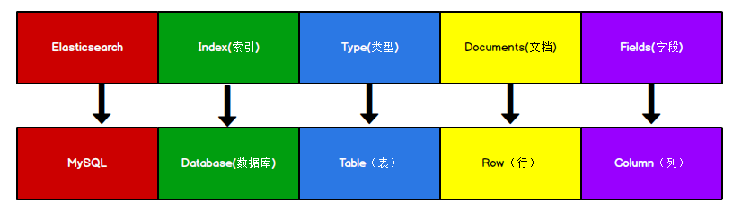

# 倒排索引

正排索引（传统）

| id   | content              |
| ---- | -------------------- |
| 1001 | my name is zhang san |
| 1002 | my name is li si     |

倒排索引

| keyword | id         |
| ------- | ---------- |
| name    | 1001, 1002 |
| zhang   | 1001       |

Elasticsearch 是**面向文档型数据库**，一条数据在这里就是一个文档。 

Elasticsearch 存储文档数据 和 关系型数据库 MySQL 存储数据的概念进行一个类比

> ES 里的 Index 可以看做一个库，而 Types 相当于表， Documents 则相当于表的行。这里 Types 的概念已经被逐渐弱化， Elasticsearch 6.X 中，一个 index 下已经只能包含一个type， Elasticsearch 7.X 中, Type 的概念已经被删除了。
