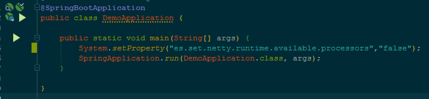
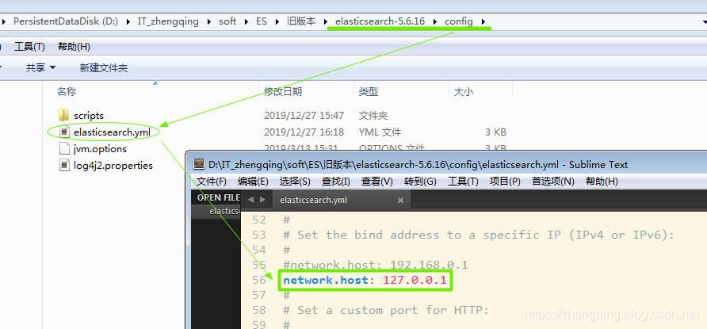
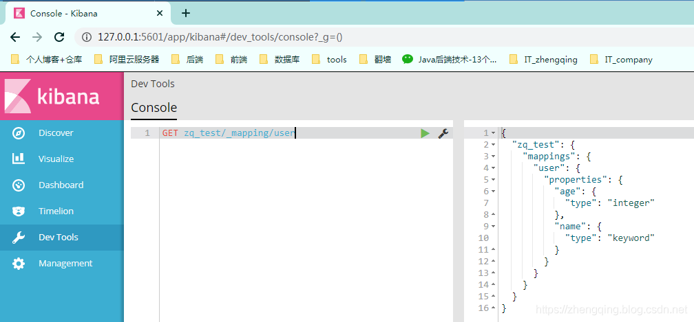

### 一、前言

本文将基于`springboot 2.1.8.RELEASE` 来整合 `Elasticsearch`

环境：`elasticsearch-5.6.16`


> 温馨小提示： `ES服务端`或` Kibana客户端`官网下载地址： [https://www.elastic.co/downloads/past-releases](https://www.elastic.co/downloads/past-releases)

### 二、Spring Boot 整合 Elasticsearch

#### 1、`pom.xml`中引入es依赖

```xml
<!-- spring data es -->
<dependency>
    <groupId>org.springframework.boot</groupId>
    <artifactId>spring-boot-starter-data-elasticsearch</artifactId>
</dependency>
```

#### 2、`application.yml`中配置es

```yml
spring:
  # es相关配置
  data:
    elasticsearch:
      # 配置集群名
      cluster-name: elasticsearch   # 访问 es服务端 `http://127.0.0.1:9200/` 填写 `cluster_name` 对应的值
      # 配置节点信息，逗号分隔，如果没有指定，则启动ClientNode 【 注：9200->图形界面端、9300->程序端 】
      cluster-nodes: 127.0.0.1:9300
      # 开启 Elasticsearch 仓库(默认值:true)
      repositories:
        enabled: true
```

#### 3、redis和es冲突问题

如上配置后，可以先启动一下项目，可能运行后会出现如下问题：

```java
org.springframework.beans.factory.BeanCreationException: Error creating bean with name 'elasticsearchClient' defined in class path resource [org/springframework/boot/autoconfigure/data/elasticsearch/ElasticsearchAutoConfiguration.class]: Bean instantiation via factory method failed; nested exception is org.springframework.beans.BeanInstantiationException: Failed to instantiate [org.elasticsearch.client.transport.TransportClient]: Factory method 'elasticsearchClient' threw exception; nested exception is java.lang.IllegalStateException: availableProcessors is already set to [8], rejecting [8]
```

> 错误原因：程序的其他地方使用了Netty，这里指redis。这影响在实例化传输客户端之前初始化处理器的数量。 实例化传输客户端时，我们尝试初始化处理器的数量。 由于在其他地方使用Netty，因此已经初始化并且Netty会对此进行防范，因此首次实例化会因看到的非法状态异常而失败。

解决：在启动类中加上如下配置

```java
System.setProperty("es.set.netty.runtime.available.processors","false");
```



注：虽然上面的方式能解决错误，服务可以正常启动，但是启动测试类时还是会报错哦！！！

因此es配置文件中需配置在`RedisConfig`之前装配，并且指定初始化时再一次添加忽略es中netty的一些配置！！！

`ElasticsearchConfig` 配置文件如下：

```java
@Configuration
@AutoConfigureBefore(RedisConfig.class) // `RedisConfig.class`为redis配置文件
public class ElasticsearchConfig {

    @PostConstruct
    void init() {
        System.setProperty("es.set.netty.runtime.available.processors", "false");
    }

    @Bean(name = "elasticsearchTemplate")
    public ElasticsearchTemplate elasticsearchTemplate(Client client, ElasticsearchConverter converter) {
        try {
            return new ElasticsearchTemplate(client, converter);
        } catch (Exception ex) {
            throw new IllegalStateException(ex);
        }
    }

    @Bean
    public ElasticsearchConverter elasticsearchConverter(
            SimpleElasticsearchMappingContext mappingContext) {
        return new MappingElasticsearchConverter(mappingContext);
    }

    @Bean
    public SimpleElasticsearchMappingContext mappingContext() {
        return new SimpleElasticsearchMappingContext();
    }

}
```

#### 4、问题：failed to load elasticsearch nodes

如果出现如下问题：

```java
failed to load elasticsearch nodes : org.elasticsearch.client.transport.NoNodeAvailableException: None of the configured nodes are available: [{#transport#-1}{6VrRZl9ISEy3MT0rx2Vd2w}{127.0.0.1}{127.0.0.1:9300}]
```

① 尝试修改es服务端配置文件 `network.host: 127.0.0.1`

② `cluster-name`集群名是否一致


③ 如果检查完以上2种情况后，还是报同样的错误，就要考虑是否为版本问题哦，小编刚开始处于新鲜感使用的是目前最新版`elasticsearch-7.5.1`，而`spring-boot-starter-data-elasticsearch`中的`spring-data-elasticsearch3.1.10.RELEASE`版本不支持高版本的es，因此版本选择要注意哦！！！

### 三、Elasticsearch增删改查API

#### 1、创建索引并建立类型映射

> 温馨小提示：注意包名不要导错哦！！！

```java
import lombok.AllArgsConstructor;
import lombok.Data;
import lombok.NoArgsConstructor;
import org.springframework.data.annotation.Id;
import org.springframework.data.elasticsearch.annotations.Document;
import org.springframework.data.elasticsearch.annotations.Field;
import org.springframework.data.elasticsearch.annotations.FieldType;

/**
 * <p> 测试 </p>
 *
 * @author : zhengqing
 * @description : indexName:索引库     type:类型（可理解为mysql数据库中的表名）
 * @date : 2019/12/27 14:47
 */
@Data
@NoArgsConstructor
@AllArgsConstructor
@Document(indexName = "zq_test", type = "user")
public class User {
    @Id
    private Long id;

    @Field(type = FieldType.Keyword)
    private String name;

//    @Field(type = FieldType.Text, analyzer = "ik_max_word", searchAnalyzer = "ik_max_word")
    private String intro;

    @Field(type = FieldType.Integer)
    private Integer age;
}
```

```java
@Component
public interface UserRepository extends ElasticsearchRepository<User, Long> { }
```

```java
@RunWith(SpringRunner.class)
@SpringBootTest(classes = DemoApplication.class)
public class ESTest {

    @Autowired
    private ElasticsearchTemplate template;

    /**
     * 创建索引,并且建立类型映射
     */
    @Test
    public void test() throws Exception {
        // 创建索引
        template.createIndex(User.class);
        // 类型映射 - 自定义映射
        template.putMapping(User.class);
    }

}
```

运行后，在 [http://127.0.0.1:5601/app/kibana#/dev_tools](http://127.0.0.1:5601/app/kibana#/dev_tools) 中执行命令 `GET zq_test/_mapping/user` 查看类型映射



#### 2、简单的增删改查

```java
@RunWith(SpringRunner.class)
@SpringBootTest(classes = DemoApplication.class)
public class ESTest {

    @Autowired
    private UserRepository repository;

    @Test // 新增1个
    public void testAdd() throws Exception {
        User user = new User(1L, "zheng qing", "zheng qing is a programmer!", 18);
        repository.save(user);
    }

    @Test // 批量添加
    public void testBatchAdd() throws Exception {
        List<User> list = new ArrayList<>();
        for (int i = 0; i < 20; i++) {
            User user = new User(i + 2L, "zheng qing" + i + 1, "zheng qing is a programmer!", 18 + i );
            list.add(user);
        }
        repository.saveAll(list);
    }

    @Test // 获取1个
    public void testGetOne() throws Exception {
        System.out.println(repository.findById(1L));
    }

    @Test // 获取全部
    public void testGetAll() throws Exception {
        Iterable<User> all = repository.findAll();
        for (User user : all) {
            System.out.println(user);
        }
    }

    @Test // 新增、修改 （判断是否有id即可~）
    public void testUpdate() throws Exception {
        Optional<User> byId = repository.findById(1L);
        User user = byId.get();
        System.out.println(user);
        user.setName("zq");
        repository.save(user);
        System.out.println(repository.findById(1L));
    }

    @Test  // 删除
    public void testDel() throws Exception {
        repository.deleteById(1L);
        //repository.deleteAll();;
    }
    
}
```

#### 3、高级查询(过滤)+分页+排序

```java
@RunWith(SpringRunner.class)
@SpringBootTest(classes = DemoApplication.class)
public class ESTest {

    @Autowired
    private UserRepository repository;

    @Test // DSL查询与过滤+分页+排序
    public void testNativeSearchQueryBuilder() throws Exception {
        NativeSearchQueryBuilder builder = new NativeSearchQueryBuilder();
        BoolQueryBuilder bool = QueryBuilders.boolQuery();
        //模糊查询
        bool.must(QueryBuilders.matchQuery("intro", "zheng"));
        //精确过滤
        List<QueryBuilder> filters = bool.filter();
        filters.add(QueryBuilders.rangeQuery("age").gte(0).lte(200));
        builder.withQuery(bool); //query bool must(filter)
        //排序
        builder.withSort(SortBuilders.fieldSort("age").order(SortOrder.ASC));
        //分页   注：当前页从0开始
        builder.withPageable(PageRequest.of(0, 10));
        //截取字段
        builder.withSourceFilter(new FetchSourceFilter(new String[]{"name", "age"}, null));
        //构造查询条件
        NativeSearchQuery query = builder.build();
        //查询
        Page<User> page = repository.search(query);
        System.out.println("总数:" + page.getTotalElements());
        System.out.println("总页数:" + page.getTotalPages());
        for (User user : page.getContent()) {
            System.out.println(user);
        }
    }

}
```

### 本文案例demo源码

[https://gitee.com/zhengqingya/java-workspace](https://gitee.com/zhengqingya/java-workspace)
