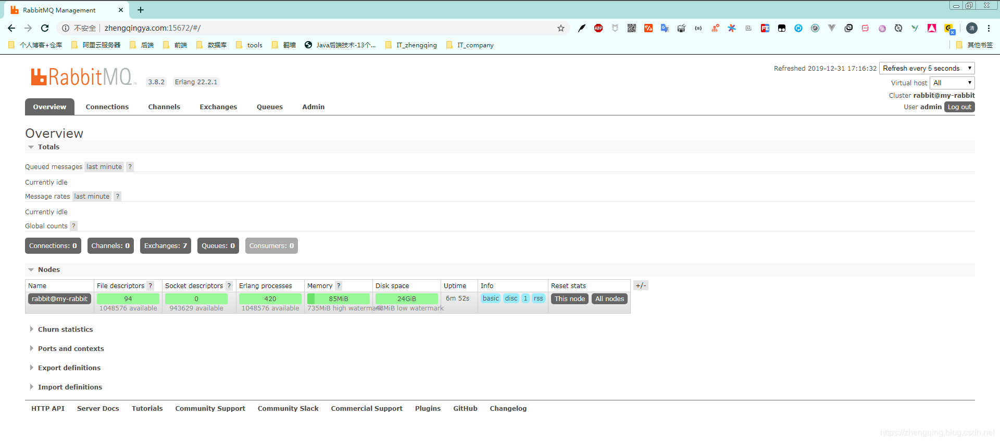
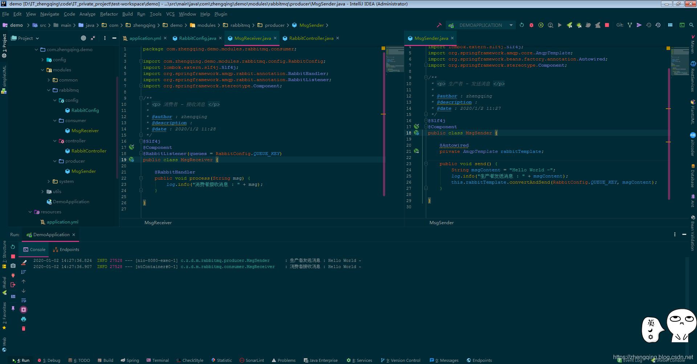

### 一、前言

`RabbitMQ`是实现了`AMQP`(高级消息队列协议)的开源消息中间件，RabbitMQ服务器是用`Erlang`(面向并发的编程语言)编写的。

RabbitMQ官网下载地址：[https://www.rabbitmq.com/download.html](https://www.rabbitmq.com/download.html)

Docker部署则执行如下命令即可

```shell
# RABBITMQ_DEFAULT_USER:用户名，RABBITMQ_DEFAULT_PASS:密码 这里修改为自己的即可
docker run -d --name rabbitmq -p 5672:5672 -p 15672:15672 -v `pwd`/rabbitmq/data:/var/lib/rabbitmq --hostname my-rabbit --restart=always -e RABBITMQ_DEFAULT_VHOST=my_vhost -e RABBITMQ_DEFAULT_USER=admin -e RABBITMQ_DEFAULT_PASS=admin rabbitmq:3-management
```


> 温馨小提示：本文只是简单的通过`rabbitmq`去`发送消息`和`接收消息`，适用于新手简单入门了解~

### 二、SpringBoot 整合 RabbitMQ

#### 1、`pom.xml` 中引入 `rabbitmq` 依赖

```xml

<dependency>
    <groupId>org.springframework.boot</groupId>
    <artifactId>spring-boot-starter-amqp</artifactId>
</dependency>
```

#### 2、`application.yml` 中配置 `rabbitmq`

```yml
spring:
  # RabbitMQ配置
  rabbitmq:
    host: 127.0.0.1
    port: 5672
    # 填写自己安装rabbitmq时设置的账号密码，默认账号密码为`guest`
    username: admin
    password: admin
    virtual-host: my_vhost # 填写自己的虚拟机名，对应可查看 `127.0.0.1:15672/#/users` 下Admin中的`Can access virtual hosts`信息
    listener:
      simple:
        # 表示消息确认方式，其有三种配置方式，分别是none、manual和auto；默认auto
        acknowledge-mode: auto
        # 最小的消费者数量
        concurrency: 5
        # 最大的消费者数量
        max-concurrency: 10
        # 指定一个请求能处理多少个消息，如果有事务的话，必须大于等于transaction数量.
        prefetch: 3
        retry:
          # 是否开启重试
          enabled: true
          # 最大重试次数
          max-attempts: 5
          # 第一次和第二次尝试发布或传递消息之间的间隔（单位：毫秒）
          initial-interval: 30000
```

#### 3、rabbitmq配置文件 - 配置一个简单的Queue(消息队列)

> 生产者发送消息到队列，消费者从队列中获取消息

```java

@Configuration
public class RabbitConfig {

    public static final String QUEUE_KEY = "hello_world";

    @Bean
    public Queue queue() {
        // durable: true 标识开启消息队列持久化 (队列当中的消息在重启rabbitmq服务的时候还会存在)
        return new Queue(QUEUE_KEY, true);
    }

}
```

#### 4、生产者 - 发送消息

```java

@Slf4j
@Component
public class MsgSender {

    @Autowired
    private AmqpTemplate rabbitTemplate;

    public void send() {
        String msgContent = "Hello World ~";
        log.info("生产者发送消息 : " + msgContent);
        this.rabbitTemplate.convertAndSend(RabbitConfig.QUEUE_KEY, msgContent);
    }

}
```

#### 5、消费者 - 接收消息

```java

@Slf4j
@Component
@RabbitListener(queues = RabbitConfig.QUEUE_KEY)
public class MsgReceiver {

    @RabbitHandler
    public void process(String msg) {
        log.info("消费者接收消息 : " + msg);
    }

}
```

#### 6、测试

```java

@RestController
public class RabbitController {

    @Autowired
    private MsgSender msgSender;

    @GetMapping(value = "/sendMsg", produces = "application/json;charset=utf-8")
    @ApiOperation(value = "发送消息", httpMethod = "GET", response = ApiResult.class)
    public ApiResult sendMsg() {
        msgSender.send();
        return ApiResult.ok();
    }

}
```

#### 7、运行项目，访问 [http://127.0.0.1:8080/sendMsg](http://127.0.0.1:8080/sendMsg)



### 本文案例demo源码

[https://gitee.com/zhengqingya/java-workspace](https://gitee.com/zhengqingya/java-workspace)


