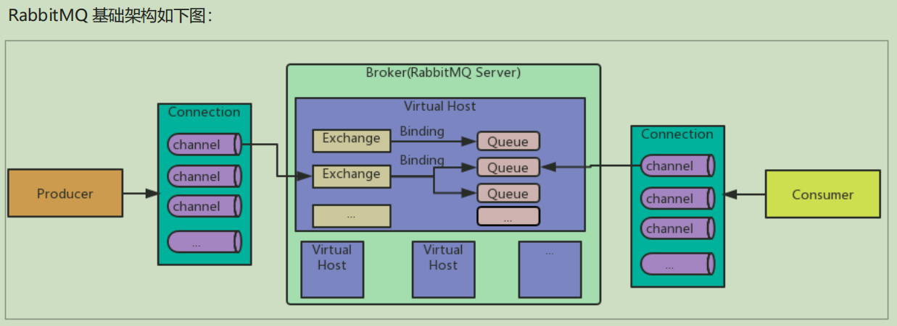
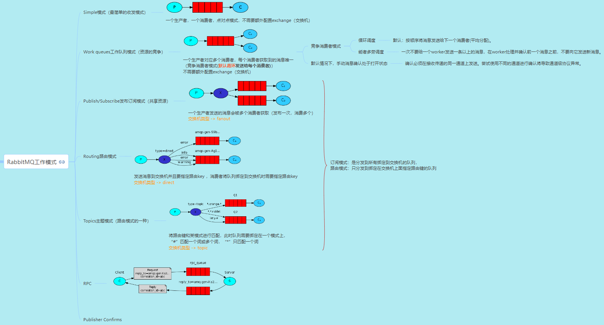

# RabbitMQ

https://www.rabbitmq.com/

RabbitMQ是一个开源的消息中间件（Message Broker），用于在应用程序和系统之间传递和存储消息。它实现了高度可靠、可扩展和灵活的消息队列协议，为分布式系统提供了强大的异步通信能力。

RabbitMQ基于AMQP（Advanced Message Queuing Protocol，高级消息队列协议）标准进行设计和实现。它支持多种编程语言和平台，使不同的应用程序能够使用各自偏好的编程语言进行消息的发送和接收。

RabbitMQ的核心概念包括以下几个要素：

1. Producer（生产者）：负责发送消息到RabbitMQ服务器。
2. Consumer（消费者）：订阅队列并接收处理消息。
3. Queue（队列）：存储消息直到消费者准备好接收。
4. Exchange（交换机）：接收来自生产者的消息，并根据特定规则将消息路由到一个或多个队列中。
5. Binding（绑定）：定义交换机和队列之间的关系，用于消息的过滤和路由。

通过使用RabbitMQ，你可以实现解耦和异步通信，以及构建可靠的分布式系统。它被广泛应用于诸如微服务架构、任务队列、日志处理、事件驱动等场景，提供了可靠性、灵活性和扩展性，以满足不同应用的需求。

---

