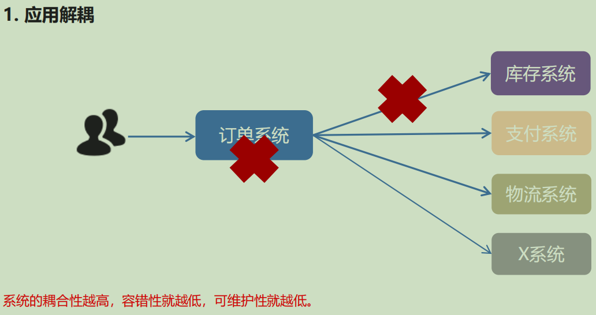
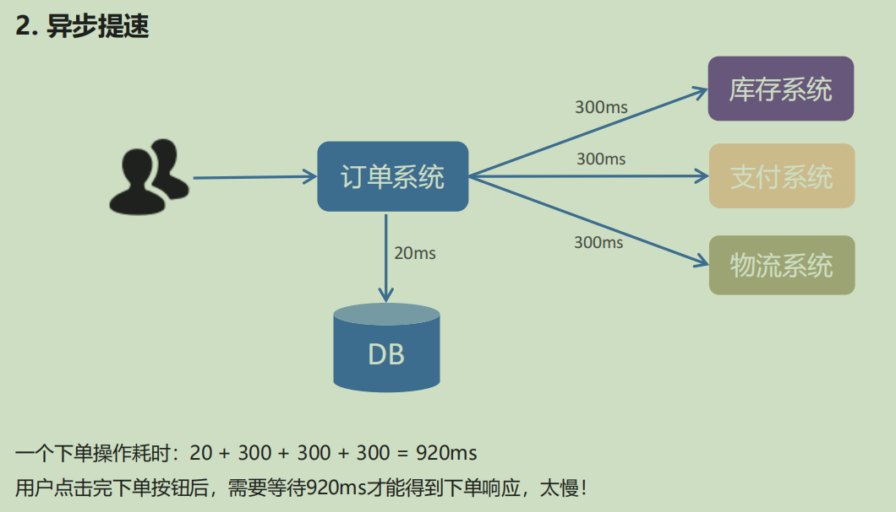
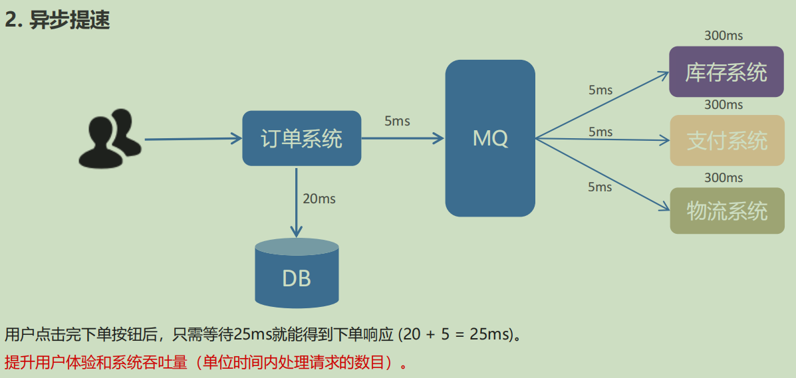
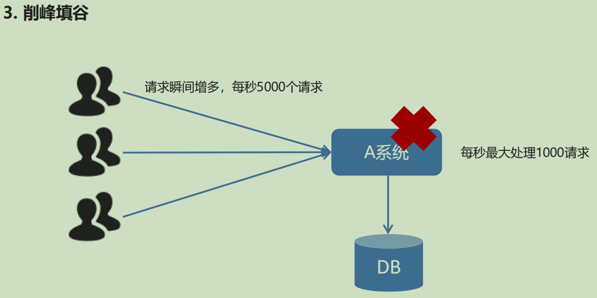
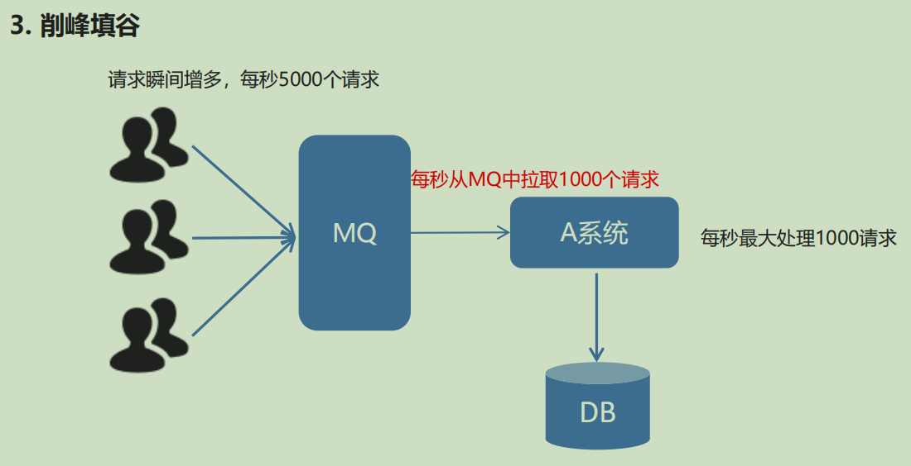
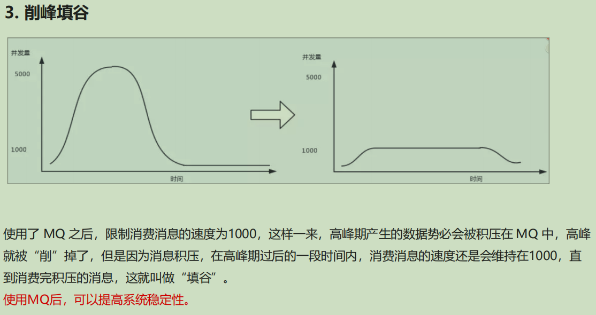

# MQ优势和劣势

### 优势：

应用解耦

异步提速

削峰填谷

### 劣势：

⚫ **系统可用性降低**

系统引入的外部依赖越多，系统稳定性越差。一旦 MQ 宕机，就会对业务造成影响。
如何保证MQ的高可用？

⚫ **系统复杂度提高**

MQ 的加入大大增加了系统的复杂度，以前系统间是同步的远程调用，现在是通过 MQ 进行异步调用。
如何保证消息没有被重复消费？怎么处理消息丢失情况？那么保证消息传递的顺序性？

⚫ **一致性问题**

A 系统处理完业务，通过 MQ 给B、C、D三个系统发消息数据，如果 B 系统、C 系统处理成功，D 系统处理失败。
如何保证消息数据处理的一致性？

