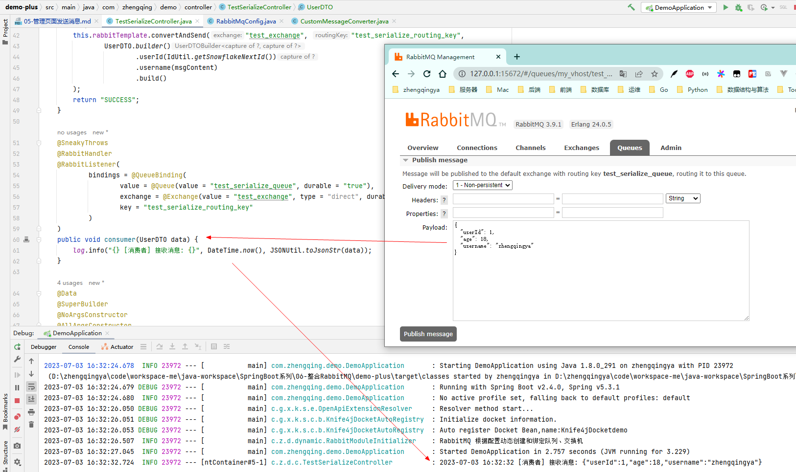
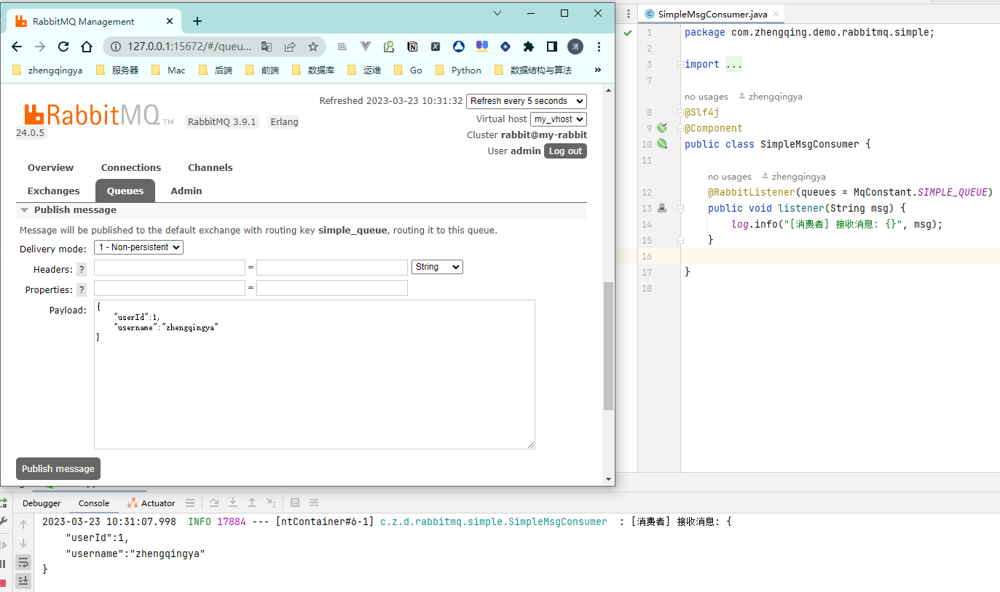

# 管理页面发送消息

项目里有消息转换器的时候可以直接发送对象消息

---

如果没有消息转换器，消费者只能用`String`接收数据

网上说的配置，经尝试无效

在 `Headers` 中添加

- key:`typeId`, value:`com.zhengqing.demo.rabbitmq.simple.SimpleMsgConsumer.UserBO`

在 `Properties` 中添加

- key:`content_type`, value:`text/json`
- key:`content_encoding`, value:`UTF-8`
