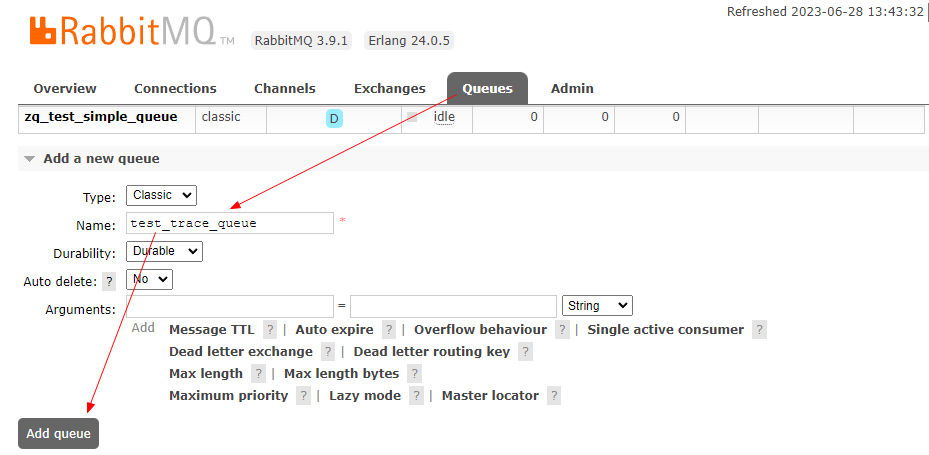
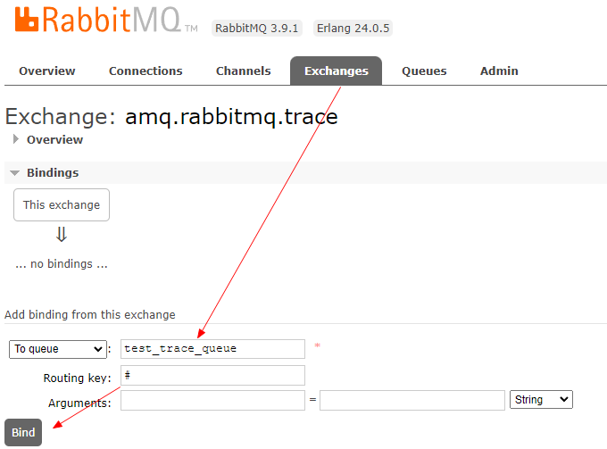
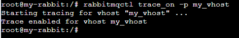
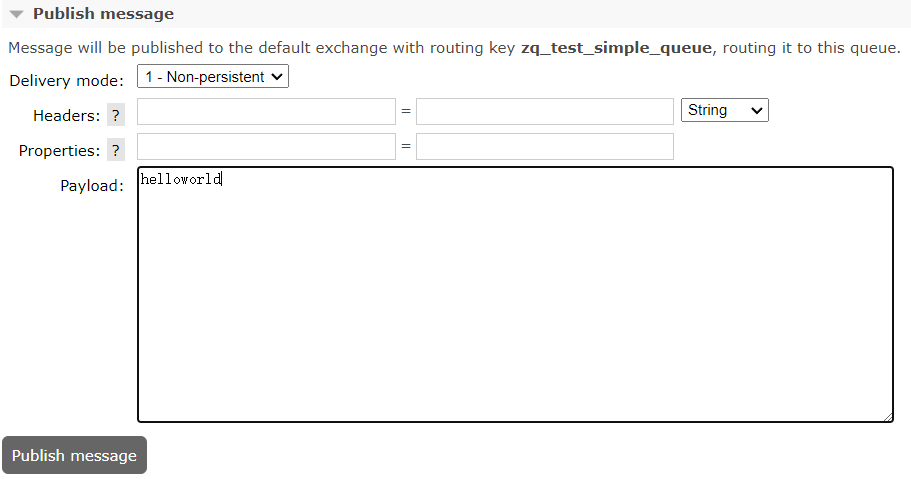
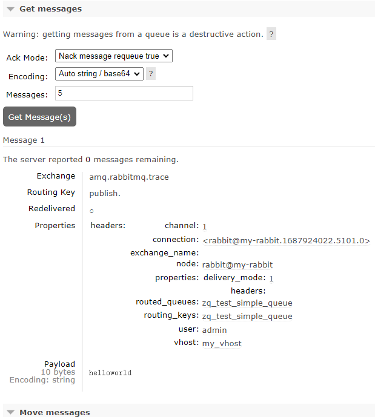
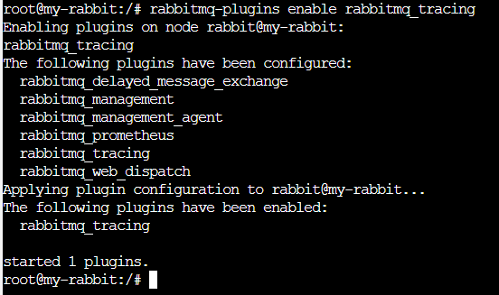
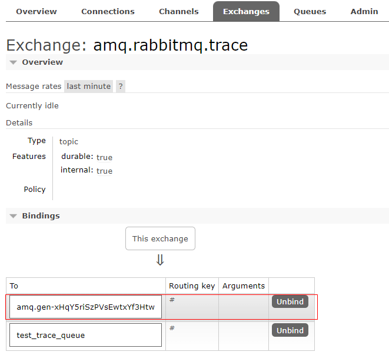
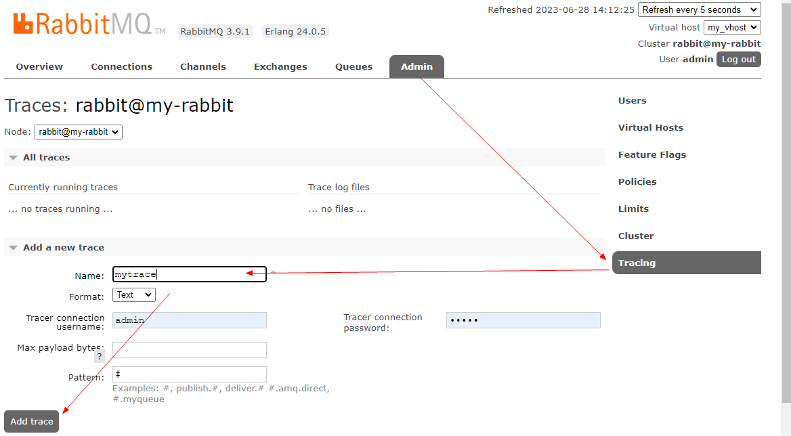
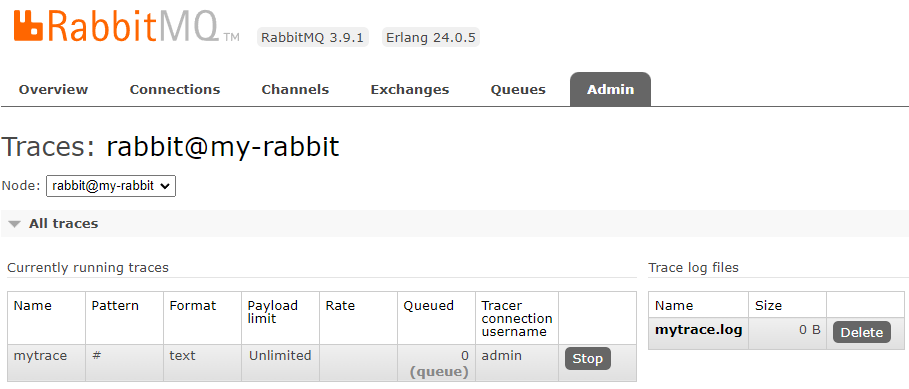
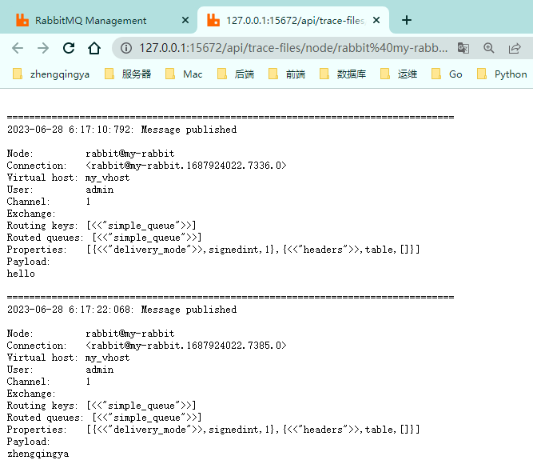

# 消息追踪

> tips：打开 trace 会影响消息写入功能，适当打开后请关闭。

### 一、Firehose

Firehose的原理是将生产者或者消费者的消息按指定的格式发送到默认交换器上。
默认交换器为`amq.rabbitmq.trace`，它是一个topic类型的交换器，发送到其上的消息路由键为publish.{exchangename}和deliver.{queuename}，
其中exchangename和queuename为交换器和队列的名称，分别对应生产者投递到交换器的消息和消费者从队列中获取的消息。

#### 1、创建一个队列 `test_trace_queue`



#### 2、将默认交换机`amq.rabbitmq.trace`与队列`test_trace_queue`绑定并监听所有消息



#### 3、开启Firehose

```shell
# 进入容器
docker exec -it rabbitmq /bin/bash

# 开启Firehose
rabbitmqctl trace_on [-p vhost]
# 关闭Firehose
rabbitmqctl trace_off [-p vhost]
```



#### 4、测试

往队列`zq_test_simple_queue`中发送一条消息时，与`amq.rabbitmq.trace`绑定的`test_trace_queue`队列也会收到一条消息

`zq_test_simple_queue`

`test_trace_queue`


### 二、rabbitmq_tracing插件

相当于Firehose的GUI版本

#### 1、启用rabbitmq_tracing插件

```shell
# 进入容器
docker exec -it rabbitmq /bin/bash
# 启用rabbitmq_tracing插件
rabbitmq-plugins enable rabbitmq_tracing
# 禁用
rabbitmq-plugins disable rabbitmq_tracing
```



会自动创建一个队列与`amq.rabbitmq.trace`绑定


在Web管理界面`Admin`右侧会多出`Tracing`选项

#### 2、`Admin` -> `Tracing` -> 添加响应的trace



- `Name`：为即将创建的trace任务取个名称。
- `Format`：表示输出的消息日志格式，有Text和JSON两种，Text格式的日志方便人类阅读，JSON格式方便程序解析，JSON格式的payload（消息体）默认会采用Base64进行编码。
- `Max payload bytes`：表示每条消息的最大限制，单位为B。eg: 设置此值为10，那么当有超过10B的消息经过RabbitMQ流转时，在记录到trace文件的时候会被截断。
- `Pattern`：表示用来匹配的模式。和Firehose的类似。
  如“#”匹配所有消息流入流出的情况，即当有客户端生产消息或者消费消息的时候，会把相应的消息日志都记录下来；
  “publish.#”匹配所有消息流入的情况；
  “deliver.#”匹配所有消息流出的情况。

之后可以查看`mytrace.log`日志文件内容


#### 3、测试

往队列中发送消息，然后到`mytrace.log`日志文件中查看记录



也可以到容器中的`/var/tmp/rabbitmq-tracing`目录下查看日志

```shell
# 进入容器
docker exec -it rabbitmq /bin/bash
# 查看日志
tail -fn10 /var/tmp/rabbitmq-tracing/mytrace.log
```
