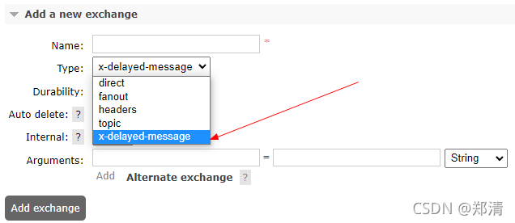
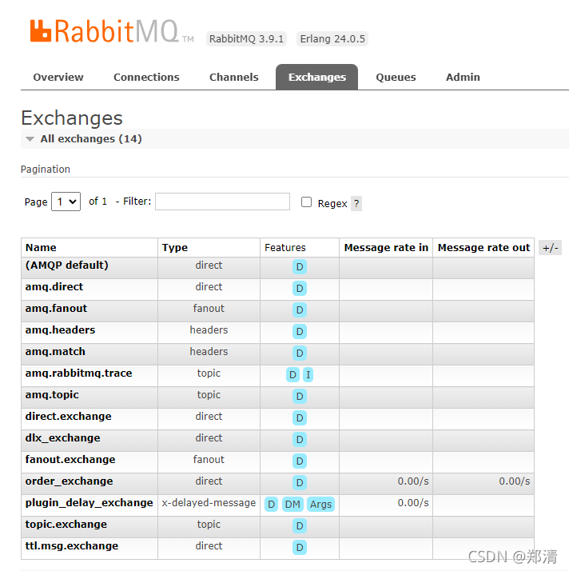
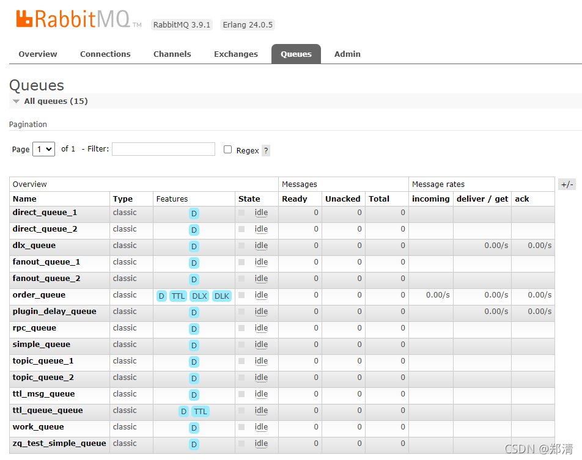

@[TOC](文章目录)

### 一、前言

本文将基于springboot2.4.0+rabbitmq来简单实现延时消费

场景举例：用户在商城购买商品提交订单支付的时候，假如有个30分钟内未支付订单则取消订单操作，这个时候我们就可以使用mq的延时消费来解决这一问题。

> 温馨小提示：本文rabbitmq版本为3.9.1

### 二、RabbitMQ实现延时消费

1. TTL+DLX
2. rabbitmq-delayed-message-exchange插件

两种方式分别如下图

>
可查看 [https://www.processon.com/view/link/616970e01e085306d74115c2](https://www.processon.com/view/link/616970e01e085306d74115c2)


#### 区别

1. 方式1-【TTL+死信队列】： 对队列中的消息设置过期时间，如果先设置1条消息过期时间为30分钟，再设置1条消息过期时间为10分钟，此时需要前1条消息消费完之后，才会消费第2条消息，队列先进先出。
   消息成为死信的三种情况：
    1. 队列消息长度到达限制；
    2. 消费者拒接消费消息，并且不重回队列；
    3. 原队列存在消息过期设置，消息到达超时时间未被消费；
2. 方式2-【延迟队列】：不用考虑消息的先后，只要消费过期时间到了，就消费它。

下面开始编写demo吧

mq相关变量

```java
public interface MqConstant {

    /**
     * 死信队列
     */
    String DLX_EXCHANGE = "dlx_exchange";
    String DLX_QUEUE = "dlx_queue";
    String DLX_ROUTING_KEY = "dlx_routing_key";

    /**
     * 普通订单队列 - 过期时间-30分钟
     */
    String ORDER_EXCHANGE = "order_exchange";
    String ORDER_QUEUE = "order_queue";
    String ORDER_ROUTING_KEY = "order_routing_key";
    int ORDER_QUEUE_TTL_TIME = 1000 * 60 * 30;

    /**
     * 延时队列 - mq插件方式'rabbitmq-delayed-message-exchange'
     */
    String PLUGIN_DELAY_EXCHANGE = "plugin_delay_exchange";
    String PLUGIN_DELAY_ROUTING_KEY = "plugin_delay_routing_key";
    String PLUGIN_DELAY_QUEUE = "plugin_delay_queue";

}
```

#### 法一：TTL+死信队列 - （ `TTL`+`DLX` ）

```java

@Configuration
public class DlxConfig {

    // ======================== ↓↓↓↓↓↓ 死信队列 ↓↓↓↓↓↓ ========================

    /**
     * 死信交换机
     */
    @Bean
    public DirectExchange dlxExchange() {
        return new DirectExchange(MqConstant.DLX_EXCHANGE, true, false);
    }

    /**
     * 死信队列
     */
    @Bean
    public Queue dlxQueue() {
        return new Queue(MqConstant.DLX_QUEUE, true, false, false);
    }

    /**
     * 绑定死信交换机和死信队列
     */
    @Bean
    public Binding dlxBinding() {
        return BindingBuilder.bind(dlxQueue())
                .to(dlxExchange())
                .with(MqConstant.DLX_ROUTING_KEY);
    }

    // ======================== ↓↓↓↓↓↓ 普通消费队列 ↓↓↓↓↓↓ ========================

    /**
     * 普通消费队列
     */
    @Bean
    public Queue orderQueue() {
        Map<String, Object> args = Maps.newHashMap();
        // 设置消息过期时间
        args.put("x-message-ttl", MqConstant.ORDER_QUEUE_TTL_TIME);
        // 设置死信交换机
        args.put("x-dead-letter-exchange", MqConstant.DLX_EXCHANGE);
        // 设置死信
        args.put("x-dead-letter-routing-key", MqConstant.DLX_ROUTING_KEY);
        return new Queue(MqConstant.ORDER_QUEUE, true, false, false, args);
    }

    @Bean
    public DirectExchange orderExchange() {
        return new DirectExchange(MqConstant.ORDER_EXCHANGE, true, false);
    }

    @Bean
    public Binding orderBinding() {
        return BindingBuilder.bind(orderQueue())
                .to(orderExchange())
                .with(MqConstant.ORDER_ROUTING_KEY);
    }

}
```

```java

@Slf4j
@Component
public class DlxProducer {

    @Autowired
    private AmqpTemplate rabbitTemplate;

    public void send() {
        String msgContent = "Hello World " + DateTime.now();
        log.info("{} [生产者] 发送消息: {}", DateTime.now(), msgContent);
        // 单条消息设置过期时间，如果队列中也设置了过期时间，以两者的最小过期时间计算
        this.rabbitTemplate.convertAndSend(MqConstant.ORDER_EXCHANGE, MqConstant.ORDER_ROUTING_KEY, msgContent, message -> {
            message.getMessageProperties().setExpiration("3000");
            return message;
        });
    }

}
```

```java

@Slf4j
@Component
public class DlxListener {

    @SneakyThrows(Exception.class)
    @RabbitHandler
    @RabbitListener(queues = MqConstant.ORDER_QUEUE)
    public void orderMsg(String msg) {
        log.info("----------------------------------------------");
        log.info("[消费者] 普通订单队列-接收消息: {}", msg);
        // TODO 逻辑实现...
        ThreadUtil.sleep(5, TimeUnit.SECONDS);
        throw new Exception("失败了...");
    }

    /**
     * 队列延时消费
     */
    @RabbitHandler
    @RabbitListener(queues = MqConstant.DLX_QUEUE)
    public void dlxMsg(String msg) {
        log.info("----------------------------------------------");
        log.info("{} [消费者] 死信队列-接收消息: {}", DateTime.now(), msg);
    }

}
```

```java

@Api(tags = "测试mq-死信队列")
@RestController
@RequestMapping("/mq")
public class DlxController {

    @Autowired
    private DlxProducer dlxProducer;

    @ApiOperation("sendDlxMsg")
    @PostMapping("sendDlxMsg")
    public String sendDlxMsg() {
        this.dlxProducer.send();
        return "SUCCESS";
    }

}
```

#### 法二：延迟队列 - MQ插件`rabbitmq-delayed-message-exchange`

###### docker-compose部署rabbitmq并安装延时插件

>
插件下载地址：[https://github.com/rabbitmq/rabbitmq-delayed-message-exchange/releases](https://github.com/rabbitmq/rabbitmq-delayed-message-exchange/releases)

```shell
# 环境准备
git clone https://gitee.com/zhengqingya/docker-compose.git
cd docker-compose/Liunx
# 当前目录下所有文件赋予权限(读、写、执行)
chmod -R 777 ./rabbitmq
# 运行 [ 注：如果之前有安装过，需要清除浏览器缓存和删除rabbitmq相关的存储数据(如:这里映射到宿主机的data数据目录)，再重装，否则会出现一定问题！ ]
docker-compose -f docker-compose-rabbitmq.yml -p rabbitmq up -d

# 进入容器
docker exec -it rabbitmq /bin/bash
# 启用延时插件
rabbitmq-plugins enable rabbitmq_delayed_message_exchange
# 查看已安装插件
rabbitmq-plugins list
```

安装成功之后，交换机类型会多一个`x-delayed-message`



###### 编写代码

```java

@Configuration
public class DelayConfig {

    @Bean
    public CustomExchange orderDelayExchange() {
        Map<String, Object> args = Maps.newHashMap();
        args.put("x-delayed-type", "direct");
        return new CustomExchange(MqConstant.PLUGIN_DELAY_EXCHANGE, "x-delayed-message", true, false, args);
    }

    @Bean
    public Queue orderDelayQueue() {
        return new Queue(MqConstant.PLUGIN_DELAY_QUEUE, true);
    }

    @Bean
    public Binding orderDelayBinding() {
        return BindingBuilder.bind(orderDelayQueue())
                .to(orderDelayExchange())
                .with(MqConstant.PLUGIN_DELAY_ROUTING_KEY)
                .noargs();
    }

}
```

```java

@Slf4j
@Component
public class DelayProducer {

    @Autowired
    private AmqpTemplate rabbitTemplate;

    public void send() {
        String msgContent = "Hello World " + DateTime.now();
        log.info("{} [生产者] 发送消息: {}", DateTime.now(), msgContent);
        this.rabbitTemplate.convertAndSend(MqConstant.PLUGIN_DELAY_EXCHANGE,
                MqConstant.PLUGIN_DELAY_ROUTING_KEY,
                msgContent, message -> {
                    // 配置消息延时时间-3秒
                    message.getMessageProperties().setHeader("x-delay", 1000 * 3);
                    return message;
                });
    }

}
```

```java

@Slf4j
@Component
public class DelayListener {

    @RabbitHandler
    @RabbitListener(queues = MqConstant.PLUGIN_DELAY_QUEUE)
    public void delayMsg(String msg) {
        log.info("----------------------------------------------");
        log.info("{} [消费者] 接收消息: {}", DateTime.now(), msg);
    }

}
```

```java

@Api(tags = "测试mq-延时队列")
@RestController
@RequestMapping("/mq")
public class DelayController {

    @Autowired
    private DelayProducer delayProducer;

    @ApiOperation("sendDelayMsg")
    @PostMapping("sendDelayMsg")
    public String sendDelayMsg() {
        this.delayProducer.send();
        return "SUCCESS";
    }

}
```

### 三、测试

启动项目，调用api进行测试即可 `^_^`

[http://127.0.0.1/doc.html#/home](http://127.0.0.1/doc.html#/home)




### 本文案例demo源码

[https://gitee.com/zhengqingya/java-workspace](https://gitee.com/zhengqingya/java-workspace)


---

> 今日分享语句：
> 人，最好的心态是平静；最好的状态是简单；最好的感觉是自由；最好的心情是童心。`^_^`
