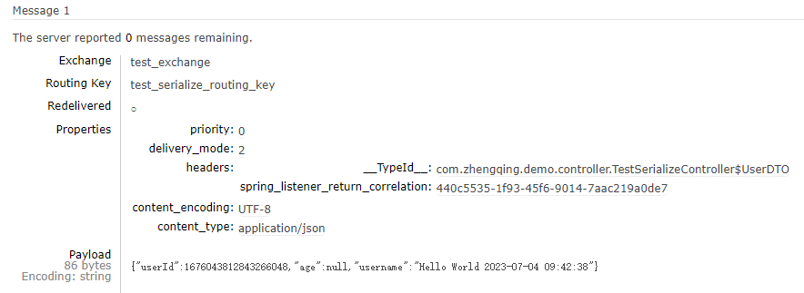

# 自定义消息转换器优化序列化问题

由于实体类字段变更或类名修改等原因导致消费者序列化问题，可以通过自定义消息转换器在优化处理这一问题

### 1、配置

```java
package com.zhengqing.demo.config;

import org.springframework.amqp.rabbit.config.SimpleRabbitListenerContainerFactory;
import org.springframework.amqp.rabbit.connection.ConnectionFactory;
import org.springframework.amqp.rabbit.core.RabbitTemplate;
import org.springframework.amqp.support.converter.Jackson2JsonMessageConverter;
import org.springframework.context.annotation.Bean;
import org.springframework.context.annotation.Configuration;

@Configuration
public class RabbitMqConfig {

    /**
     * 生产者配置
     */
    @Bean
    public RabbitTemplate rabbitTemplate(ConnectionFactory connectionFactory) {
        RabbitTemplate rabbitTemplate = new RabbitTemplate();
        rabbitTemplate.setConnectionFactory(connectionFactory);
        /**
         * 配置自定义消息转换器
         * rabbitmq默认的消息转换器 {@link org.springframework.amqp.support.converter.SimpleMessageConverter}
         */
        rabbitTemplate.setMessageConverter(new CustomMessageConverter());
        // json消息转换器
//        rabbitTemplate.setMessageConverter(new Jackson2JsonMessageConverter());
        return rabbitTemplate;
    }

    /**
     * 消费者配置
     */
    @Bean
    public SimpleRabbitListenerContainerFactory rabbitListenerContainerFactory(ConnectionFactory connectionFactory) {
        SimpleRabbitListenerContainerFactory factory = new SimpleRabbitListenerContainerFactory();
        factory.setConnectionFactory(connectionFactory);
        /**
         * 配置自定义消息转换器
         * rabbitmq默认的消息转换器 {@link org.springframework.amqp.support.converter.SimpleMessageConverter}
         */
        factory.setMessageConverter(new CustomMessageConverter());
        // json消息转换器
//        rabbitTemplate.setMessageConverter(new Jackson2JsonMessageConverter());
        return factory;
    }
}
```

### 2、自定义消息转换器

```java
package com.zhengqing.demo.config;

import cn.hutool.json.JSONUtil;
import org.springframework.amqp.core.Message;
import org.springframework.amqp.core.MessageProperties;
import org.springframework.amqp.support.converter.AbstractJackson2MessageConverter;
import org.springframework.amqp.support.converter.Jackson2JsonMessageConverter;
import org.springframework.amqp.support.converter.MessageConverter;

public class CustomMessageConverter implements MessageConverter {

    @Override
    public Message toMessage(Object object, MessageProperties messageProperties) {
        // 生产者发送消息转换
        String msg = "";
        if (object instanceof String) {
            msg = String.valueOf(object);
        } else {
            msg = JSONUtil.toJsonStr(object);
        }
        return new Message(msg.getBytes(), messageProperties);
    }

    @Override
    public Object fromMessage(Message message) {
        try {
            String msg = new String(message.getBody(), "UTF-8");
            String targetClassName = message.getMessageProperties().getInferredArgumentType().getTypeName();
            if (String.class.getName().equals(targetClassName)) {
                return msg;
            } else {
                // 返回反序列化后的对象 tips：可以有效解决由于实体类字段变更或类名修改等原因导致消费者序列化问题，很nice！！！
                Class<?> targetClass = Class.forName(targetClassName);
                return JSONUtil.toBean(msg, targetClass);
                /**
                 * 消费者也可配置使用 {@link Jackson2JsonMessageConverter} 转换器
                 * 最终走 {@link AbstractJackson2MessageConverter#fromMessage(Message, Object)}
                 */
//                return new Jackson2JsonMessageConverter().fromMessage(message);
            }
        } catch (Exception e) {
            e.printStackTrace();
        }
        return null;
    }
}
```

### 3、其它

也可以在生产者和消费者都配置 `Jackson2JsonMessageConverter` 转换器，这个也兼容String/Object类型



#### json消息转换器问题

1. 但如果在生产者或管理后台发json格式或对象数据，消费者接收用String类型会报错

```shell
Caused by: com.fasterxml.jackson.databind.exc.MismatchedInputException: Cannot deserialize instance of `java.lang.String` out of START_OBJECT token
 at [Source: (String)"{"userId":1676044959200968704,"age":null,"username":"Hello World 2023-07-04 09:47:12","username2":null}"; line: 1, column: 1]
```

2. java之前用的默认配置通过生产者发送对象消息还未消费，然后再配置json消息转换器，消费者再消费也会出现不能正常消费问题

#### 解决

这时候用上面的自定义消息转换器就可以完美兼容不同类型的消息数据，毕竟是自己搞的，哈哈哈 ^_^

