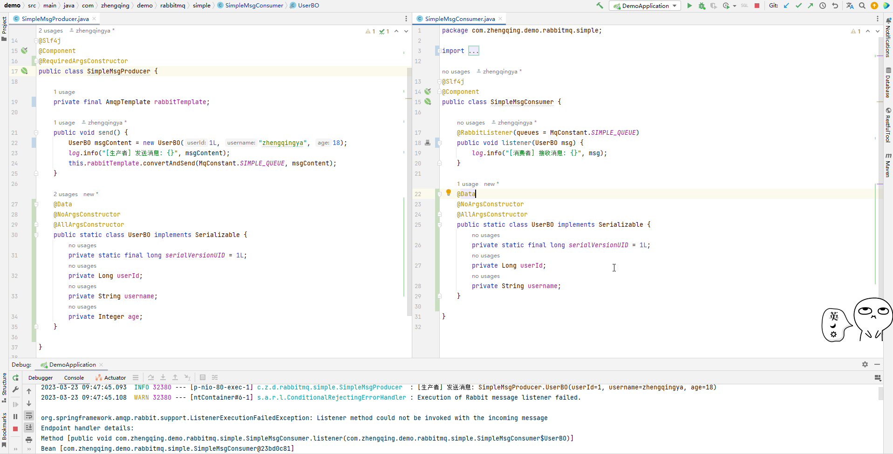
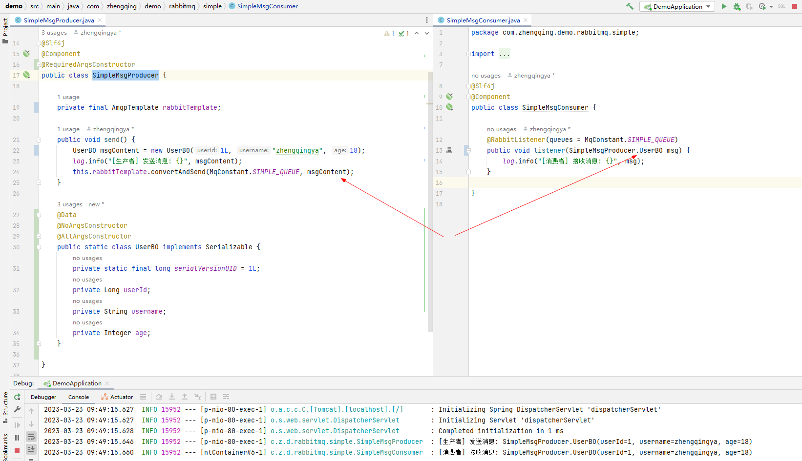
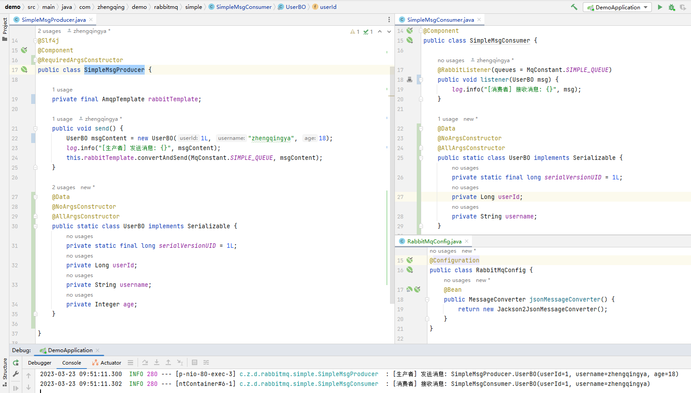
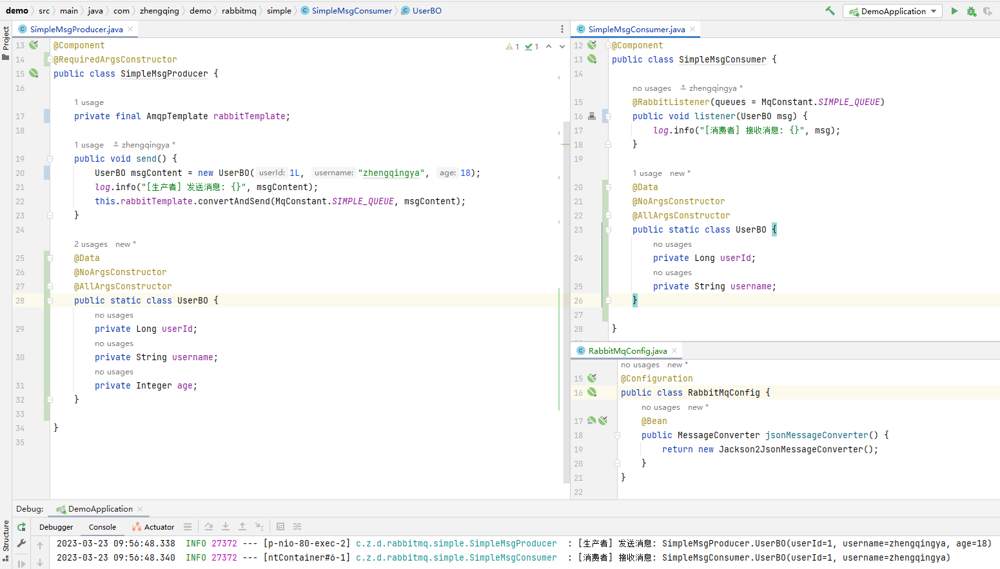

### 问题

Listener method could not be invoked with the incoming message

```shell
2023-03-23 09:35:15.912  INFO 36324 --- [p-nio-80-exec-2] c.z.d.rabbitmq.simple.SimpleMsgProducer  : [生产者] 发送消息: SimpleMsgProducer.UserBO(userId=1, username=zhengqingya, age=18)
2023-03-23 09:35:15.913  WARN 36324 --- [ntContainer#6-1] s.a.r.l.ConditionalRejectingErrorHandler : Execution of Rabbit message listener failed.

org.springframework.amqp.rabbit.support.ListenerExecutionFailedException: Listener method could not be invoked with the incoming message
Endpoint handler details:
Method [public void com.zhengqing.demo.rabbitmq.simple.SimpleMsgConsumer.listener(java.lang.String)]
Bean [com.zhengqing.demo.rabbitmq.simple.SimpleMsgConsumer@51888019]
	at org.springframework.amqp.rabbit.listener.adapter.MessagingMessageListenerAdapter.invokeHandler(MessagingMessageListenerAdapter.java:223) ~[spring-rabbit-2.3.1.jar:2.3.1]
	at org.springframework.amqp.rabbit.listener.adapter.MessagingMessageListenerAdapter.invokeHandlerAndProcessResult(MessagingMessageListenerAdapter.java:148) ~[spring-rabbit-2.3.1.jar:2.3.1]
	at org.springframework.amqp.rabbit.listener.adapter.MessagingMessageListenerAdapter.onMessage(MessagingMessageListenerAdapter.java:133) ~[spring-rabbit-2.3.1.jar:2.3.1]
	at org.springframework.amqp.rabbit.listener.AbstractMessageListenerContainer.doInvokeListener(AbstractMessageListenerContainer.java:1632) ~[spring-rabbit-2.3.1.jar:2.3.1]
	at org.springframework.amqp.rabbit.listener.AbstractMessageListenerContainer.actualInvokeListener(AbstractMessageListenerContainer.java:1551) ~[spring-rabbit-2.3.1.jar:2.3.1]
	at org.springframework.amqp.rabbit.listener.AbstractMessageListenerContainer.invokeListener(AbstractMessageListenerContainer.java:1539) ~[spring-rabbit-2.3.1.jar:2.3.1]
	at org.springframework.amqp.rabbit.listener.AbstractMessageListenerContainer.doExecuteListener(AbstractMessageListenerContainer.java:1530) ~[spring-rabbit-2.3.1.jar:2.3.1]
	at org.springframework.amqp.rabbit.listener.AbstractMessageListenerContainer.executeListener(AbstractMessageListenerContainer.java:1474) ~[spring-rabbit-2.3.1.jar:2.3.1]
	at org.springframework.amqp.rabbit.listener.SimpleMessageListenerContainer.doReceiveAndExecute(SimpleMessageListenerContainer.java:966) [spring-rabbit-2.3.1.jar:2.3.1]
	at org.springframework.amqp.rabbit.listener.SimpleMessageListenerContainer.receiveAndExecute(SimpleMessageListenerContainer.java:912) [spring-rabbit-2.3.1.jar:2.3.1]
	at org.springframework.amqp.rabbit.listener.SimpleMessageListenerContainer.access$1600(SimpleMessageListenerContainer.java:83) [spring-rabbit-2.3.1.jar:2.3.1]
	at org.springframework.amqp.rabbit.listener.SimpleMessageListenerContainer$AsyncMessageProcessingConsumer.mainLoop(SimpleMessageListenerContainer.java:1287) [spring-rabbit-2.3.1.jar:2.3.1]
	at org.springframework.amqp.rabbit.listener.SimpleMessageListenerContainer$AsyncMessageProcessingConsumer.run(SimpleMessageListenerContainer.java:1193) [spring-rabbit-2.3.1.jar:2.3.1]
	at java.lang.Thread.run(Thread.java:748) [na:1.8.0_291]
Caused by: org.springframework.messaging.converter.MessageConversionException: Cannot convert from [com.zhengqing.demo.rabbitmq.simple.SimpleMsgProducer$UserBO] to [java.lang.String] for GenericMessage [payload=SimpleMsgProducer.UserBO(userId=1, username=zhengqingya, age=18), headers={amqp_receivedDeliveryMode=PERSISTENT, amqp_receivedRoutingKey=simple_queue, amqp_deliveryTag=2, amqp_consumerQueue=simple_queue, amqp_redelivered=false, id=19c04fcf-bd07-4123-20a4-b364dcc87f4a, amqp_consumerTag=amq.ctag-Q0XQ-UOS__L9rWIf63fbJA, amqp_lastInBatch=false, contentType=application/x-java-serialized-object, timestamp=1679535315913}]
	at org.springframework.messaging.handler.annotation.support.PayloadMethodArgumentResolver.resolveArgument(PayloadMethodArgumentResolver.java:145) ~[spring-messaging-5.3.1.jar:5.3.1]
	at org.springframework.messaging.handler.invocation.HandlerMethodArgumentResolverComposite.resolveArgument(HandlerMethodArgumentResolverComposite.java:117) ~[spring-messaging-5.3.1.jar:5.3.1]
	at org.springframework.messaging.handler.invocation.InvocableHandlerMethod.getMethodArgumentValues(InvocableHandlerMethod.java:148) ~[spring-messaging-5.3.1.jar:5.3.1]
	at org.springframework.messaging.handler.invocation.InvocableHandlerMethod.invoke(InvocableHandlerMethod.java:116) ~[spring-messaging-5.3.1.jar:5.3.1]
	at org.springframework.amqp.rabbit.listener.adapter.HandlerAdapter.invoke(HandlerAdapter.java:53) ~[spring-rabbit-2.3.1.jar:2.3.1]
	at org.springframework.amqp.rabbit.listener.adapter.MessagingMessageListenerAdapter.invokeHandler(MessagingMessageListenerAdapter.java:220) ~[spring-rabbit-2.3.1.jar:2.3.1]
	... 13 common frames omitted

2023-03-23 09:35:15.914  WARN 36324 --- [ntContainer#6-1] ingErrorHandler$DefaultExceptionStrategy : Fatal message conversion error; message rejected; it will be dropped or routed to a dead letter exchange, if so configured: (Body:'[B@29b35c45(byte[310])' MessageProperties [headers={}, contentType=application/x-java-serialized-object, contentLength=0, receivedDeliveryMode=PERSISTENT, priority=0, redelivered=false, receivedExchange=, receivedRoutingKey=simple_queue, deliveryTag=2, consumerTag=amq.ctag-Q0XQ-UOS__L9rWIf63fbJA, consumerQueue=simple_queue])
2023-03-23 09:35:15.914 ERROR 36324 --- [ntContainer#6-1] o.s.a.r.l.SimpleMessageListenerContainer : Execution of Rabbit message listener failed, and the error handler threw an exception

org.springframework.amqp.AmqpRejectAndDontRequeueException: Error Handler converted exception to fatal
	at org.springframework.amqp.rabbit.listener.ConditionalRejectingErrorHandler.handleError(ConditionalRejectingErrorHandler.java:146) ~[spring-rabbit-2.3.1.jar:2.3.1]
	at org.springframework.amqp.rabbit.listener.AbstractMessageListenerContainer.invokeErrorHandler(AbstractMessageListenerContainer.java:1436) [spring-rabbit-2.3.1.jar:2.3.1]
	at org.springframework.amqp.rabbit.listener.AbstractMessageListenerContainer.handleListenerException(AbstractMessageListenerContainer.java:1720) [spring-rabbit-2.3.1.jar:2.3.1]
	at org.springframework.amqp.rabbit.listener.AbstractMessageListenerContainer.executeListener(AbstractMessageListenerContainer.java:1495) [spring-rabbit-2.3.1.jar:2.3.1]
	at org.springframework.amqp.rabbit.listener.SimpleMessageListenerContainer.doReceiveAndExecute(SimpleMessageListenerContainer.java:966) [spring-rabbit-2.3.1.jar:2.3.1]
	at org.springframework.amqp.rabbit.listener.SimpleMessageListenerContainer.receiveAndExecute(SimpleMessageListenerContainer.java:912) [spring-rabbit-2.3.1.jar:2.3.1]
	at org.springframework.amqp.rabbit.listener.SimpleMessageListenerContainer.access$1600(SimpleMessageListenerContainer.java:83) [spring-rabbit-2.3.1.jar:2.3.1]
	at org.springframework.amqp.rabbit.listener.SimpleMessageListenerContainer$AsyncMessageProcessingConsumer.mainLoop(SimpleMessageListenerContainer.java:1287) [spring-rabbit-2.3.1.jar:2.3.1]
	at org.springframework.amqp.rabbit.listener.SimpleMessageListenerContainer$AsyncMessageProcessingConsumer.run(SimpleMessageListenerContainer.java:1193) [spring-rabbit-2.3.1.jar:2.3.1]
	at java.lang.Thread.run(Thread.java:748) [na:1.8.0_291]
Caused by: org.springframework.amqp.rabbit.support.ListenerExecutionFailedException: Listener method could not be invoked with the incoming message
Endpoint handler details:
Method [public void com.zhengqing.demo.rabbitmq.simple.SimpleMsgConsumer.listener(java.lang.String)]
Bean [com.zhengqing.demo.rabbitmq.simple.SimpleMsgConsumer@51888019]
	at org.springframework.amqp.rabbit.listener.adapter.MessagingMessageListenerAdapter.invokeHandler(MessagingMessageListenerAdapter.java:223) ~[spring-rabbit-2.3.1.jar:2.3.1]
	at org.springframework.amqp.rabbit.listener.adapter.MessagingMessageListenerAdapter.invokeHandlerAndProcessResult(MessagingMessageListenerAdapter.java:148) ~[spring-rabbit-2.3.1.jar:2.3.1]
	at org.springframework.amqp.rabbit.listener.adapter.MessagingMessageListenerAdapter.onMessage(MessagingMessageListenerAdapter.java:133) ~[spring-rabbit-2.3.1.jar:2.3.1]
	at org.springframework.amqp.rabbit.listener.AbstractMessageListenerContainer.doInvokeListener(AbstractMessageListenerContainer.java:1632) [spring-rabbit-2.3.1.jar:2.3.1]
	at org.springframework.amqp.rabbit.listener.AbstractMessageListenerContainer.actualInvokeListener(AbstractMessageListenerContainer.java:1551) [spring-rabbit-2.3.1.jar:2.3.1]
	at org.springframework.amqp.rabbit.listener.AbstractMessageListenerContainer.invokeListener(AbstractMessageListenerContainer.java:1539) [spring-rabbit-2.3.1.jar:2.3.1]
	at org.springframework.amqp.rabbit.listener.AbstractMessageListenerContainer.doExecuteListener(AbstractMessageListenerContainer.java:1530) [spring-rabbit-2.3.1.jar:2.3.1]
	at org.springframework.amqp.rabbit.listener.AbstractMessageListenerContainer.executeListener(AbstractMessageListenerContainer.java:1474) [spring-rabbit-2.3.1.jar:2.3.1]
	... 6 common frames omitted
Caused by: org.springframework.messaging.converter.MessageConversionException: Cannot convert from [com.zhengqing.demo.rabbitmq.simple.SimpleMsgProducer$UserBO] to [java.lang.String] for GenericMessage [payload=SimpleMsgProducer.UserBO(userId=1, username=zhengqingya, age=18), headers={amqp_receivedDeliveryMode=PERSISTENT, amqp_receivedRoutingKey=simple_queue, amqp_deliveryTag=2, amqp_consumerQueue=simple_queue, amqp_redelivered=false, id=19c04fcf-bd07-4123-20a4-b364dcc87f4a, amqp_consumerTag=amq.ctag-Q0XQ-UOS__L9rWIf63fbJA, amqp_lastInBatch=false, contentType=application/x-java-serialized-object, timestamp=1679535315913}]
	at org.springframework.messaging.handler.annotation.support.PayloadMethodArgumentResolver.resolveArgument(PayloadMethodArgumentResolver.java:145) ~[spring-messaging-5.3.1.jar:5.3.1]
	at org.springframework.messaging.handler.invocation.HandlerMethodArgumentResolverComposite.resolveArgument(HandlerMethodArgumentResolverComposite.java:117) ~[spring-messaging-5.3.1.jar:5.3.1]
	at org.springframework.messaging.handler.invocation.InvocableHandlerMethod.getMethodArgumentValues(InvocableHandlerMethod.java:148) ~[spring-messaging-5.3.1.jar:5.3.1]
	at org.springframework.messaging.handler.invocation.InvocableHandlerMethod.invoke(InvocableHandlerMethod.java:116) ~[spring-messaging-5.3.1.jar:5.3.1]
	at org.springframework.amqp.rabbit.listener.adapter.HandlerAdapter.invoke(HandlerAdapter.java:53) ~[spring-rabbit-2.3.1.jar:2.3.1]
	at org.springframework.amqp.rabbit.listener.adapter.MessagingMessageListenerAdapter.invokeHandler(MessagingMessageListenerAdapter.java:220) ~[spring-rabbit-2.3.1.jar:2.3.1]
	... 13 common frames omitted
```

生产者发送消息和消费者接收消息的实体类没有对应



### 解决

#### 单个处理

让生产者和消费者的实体类对应



#### 全局处理

定义消息转换器

```
@Bean
public MessageConverter jsonMessageConverter() {
    return new Jackson2JsonMessageConverter();
}
```



这个时候不实现`Serializable`序列化也是可以正常收发消息的


