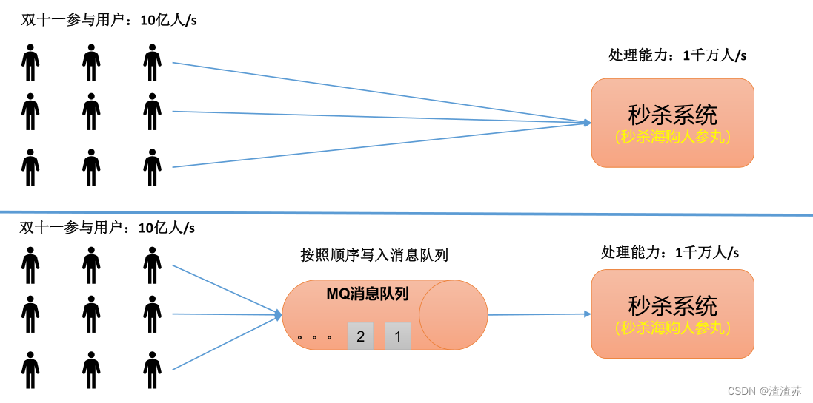
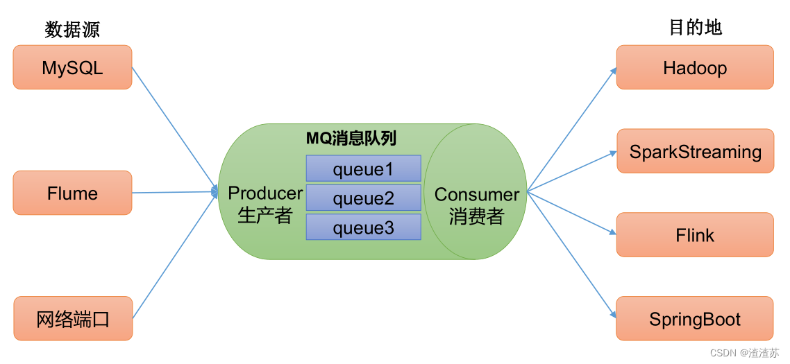
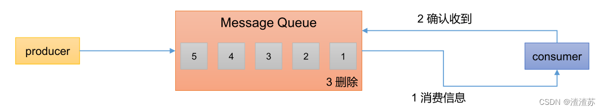
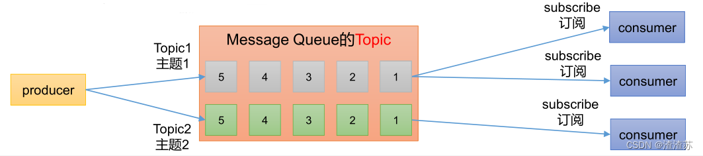
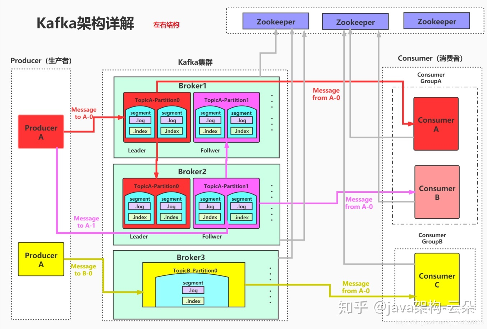

# Kafka简介

### 一、定义

官网：https://kafka.apache.org/

**Kafka 传统定义**：Kafka是一个分布式的基于 发布/订阅模式 的消息队列（Message Queue），主要应用于大数据实时处理领域。

发布/订阅：消息的发布者不会将消息直接发送给特定的订阅者，而是将发布的消息 分为不同的类别，订阅者只接收感兴趣的消息。

**Kafka 最新定义** ：Kafka是一个开源分布式事件流媒体平台（Event Streaming Platform）， 被数千家公司用于高性能数据管道、流媒体分析、数据集成和关键任务应用。

```
# 什么是事件流？
    - 事件流是人体中枢神经系统的数字等效物。它是“永远在线”世界的技术基础，在这个世界中，企业越来越多地由软件定义和自动化，并且软件的用户更多地是软件。
    - 从技术上讲，事件流是从事件源（如数据库、传感器、移动设备、云服务和软件应用程序）以事件流的形式实时捕获数据的实践；持久存储这些事件流以供以后检索；实时和回顾性地操作、处理和响应事件流；并根据需要将事件流路由到不同的目标技术。因此，事件流确保了数据的连续流动和解释，以便正确的信息在正确的时间出现在正确的位置。

# 我可以将事件流用于什么？
    事件流应用于众多行业和组织的各种用例。它的许多例子包括：
    - 实时处理支付和金融交易，例如在证券交易所、银行和保险中。
    - 实时跟踪和监控汽车、卡车、车队和货运，例如在物流和汽车行业。
    - 持续捕获和分析来自物联网设备或其他设备的传感器数据，例如工厂和风电场。
    - 收集并立即响应客户互动和订单，例如零售、酒店和旅游行业以及移动应用程序。
    - 监测住院病人，预测病情变化，确保在紧急情况下及时治疗。
    - 连接、存储和提供公司不同部门产生的数据。
    - 作为数据平台、事件驱动架构和微服务的基础。

# Apache Kafka® 是一个事件流平台。这意味着什么？
    Kafka 结合了三个关键功能，因此您可以 通过一个经过实战考验的解决方案实现端到端的事件流 用例：
    1. 发布（写入）和订阅（读取）事件流，包括从其他系统持续导入/导出数据 。
    2. 根据需要持久可靠地 存储事件流。
    3. 在事件发生时或回顾性 地处理事件流。

所有这些功能都以分布式、高度可扩展、弹性、容错和安全的方式提供。Kafka 可以部署在裸机硬件、虚拟机和容器上，也可以部署在本地和云端。您可以在自行管理 Kafka 环境和使用各种供应商提供的完全托管服务之间进行选择。
```

### 二、消息队列

常见消息队列：Kafka 、 ActiveMQ 、 RabbitMQ 、RocketMQ 等。

在大数据场景主要采用 Kafka 作为消息队列。在 JavaEE 开发中主要采用 ActiveMQ、RabbitMQ、RocketMQ。

#### 1、传统消息队列的应用场景

传统的消息队列的主要应用场景包括：缓存/消峰、解耦和异步通信。

缓冲/消峰：有助于控制和优化数据流经过系统的速度，解决生产消息和消费消息的处理速度不一致的情况。


解耦：允许你独立的扩展或修改两边的处理过程，只要确保它们遵守同样的接口约束。


异步通信：允许用户把一个消息放入队列，但并不立即处理它，然后在需要的时候再去处理它们。


#### 2、消息队列的两种模式

1）点对点模式

* 消费者主动拉取数据，消息收到后清除消息



2）发布/订阅模式

* 可以有多个topic主题（浏览、点赞、收藏、评论等）
* 消费者消费数据之后，不删除数据
* 每个消费者相互独立，都可以消费到数据



### 三、Kafka基础架构

1. 为方便扩展，并提高吞吐量，一个topic分为多个partition
2. 配合分区的设计，提出消费者组的概念，组内每个消费者并行消费
3. 为提高可用性，为每个partition增加若干副本，类似NameNode HA
4. ZK中记录谁是leader，Kafka2.8.0以后也可以配置不采用ZK


1. **Producer**：消息生产者，就是向 Kafka broker 发消息的客户端。
2. **Consumer**：消息消费者，向 Kafka broker 取消息的客户端。
3. **Consumer Group**（CG）：消费者组，由多个 consumer 组成。
   消费者组内每个消费者负责消费不同分区的数据，一个分区只能由一个组内消费者消费；消费者组之间互不影响。所有的消费者都属于某个消费者组，即消费者组是逻辑上的一个订阅者。
4. **Broker**：一台 Kafka 服务器就是一个 broker。一个集群由多个 broker 组成。一个broker 可以容纳多个 topic。
5. **Topic**：可以理解为一个队列，生产者和消费者面向的都是一个 topic。
6. **Partition**：为了实现扩展性，一个非常大的 topic 可以分布到多个 broker（即服务器）上，
   一个 topic 可以分为多个 partition，每个 partition 是一个有序的队列。
7. **Replica**：副本。一个 topic 的每个分区都有若干个副本，一个 Leader 和若干个Follower。
8. **Leader**：每个分区多个副本的“主”，生产者发送数据的对象，以及消费者消费数据的对象都是 Leader。
9. **Follower**：每个分区多个副本中的“从”，实时从 Leader 中同步数据，保持和Leader 数据的同步。
   Leader 发生故障时，某个Follower 会成为新的 Leader。


