# Kafka 生产者

### 一、生产者消息发送流程

#### 1、发送原理

在消息发送的过程中，涉及到了两个线程——main 线程和 Sender 线程。
在 main 线程中创建了一个双端队列 RecordAccumulator。
main 线程将消息发送给 RecordAccumulator，Sender 线程不断从 RecordAccumulator 中拉取消息发送到 Kafka Broker。

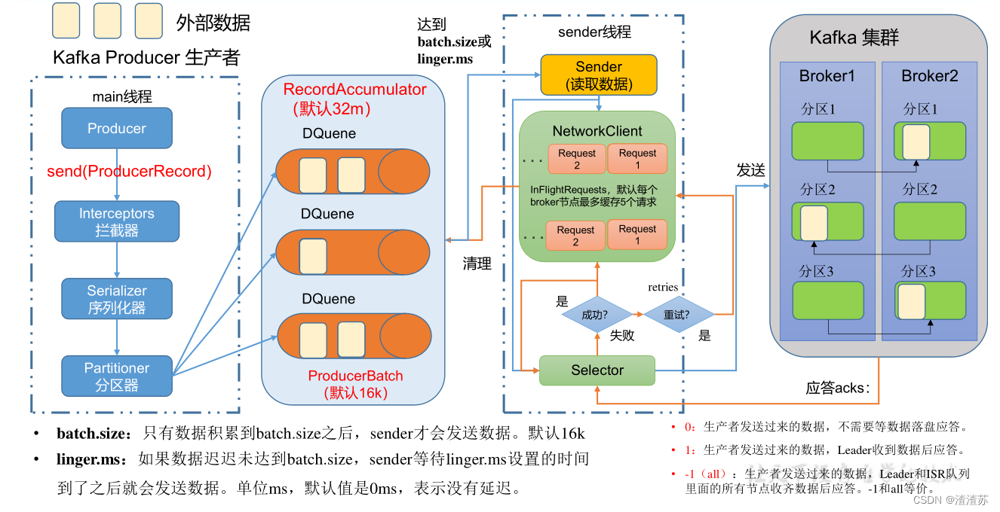

#### 2、生产者重要参数列表

| 参数名称                                  | 描述                                                                                                                                                                    |
|---------------------------------------|-----------------------------------------------------------------------------------------------------------------------------------------------------------------------|
| bootstrap.servers                     | 生 产 者 连 接 集 群 所 需 的 broker 地 址 清 单 。 例 如 hadoop102:9092,hadoop103:9092,hadoop104:9092，可以 设置 1 个或者多个，中间用逗号隔开。注意这里并非 需要所有的 broker 地址，因为生产者从给定的 broker 里查找到其他 broker 信息。 |
| key.serializer 和 value.serializer     | 指定发送消息的 key 和 value 的序列化类型。一定要写 全类名。                                                                                                                                  |
| buffer.memory                         | RecordAccumulator 缓冲区总大小，默认 32m。                                                                                                                                      |
| batch.size                            | 缓冲区一批数据最大值，默认 16k。适当增加该值，可 以提高吞吐量，但是如果该值设置太大，会导致数据 传输延迟增加。                                                                                                            |
| linger.ms                             | 如果数据迟迟未达到 batch.size，sender 等待 linger.time 之后就会发送数据。单位 ms，默认值是 0ms，表示没 有延迟。生产环境建议该值大小为 5-100ms 之间。                                                                    |
| acks                                  | 0：生产者发送过来的数据，不需要等数据落盘应答。 1：生产者发送过来的数据，Leader 收到数据后应答。 -1（all）：生产者发送过来的数据，Leader+和 isr 队列 里面的所有节点收齐数据后应答。默认值是-1，-1 和 all 是等价的。                                         |
| max.in.flight.requests.per.connection | 允许最多没有返回 ack 的次数，默认为 5，开启幂等性 要保证该值是 1-5 的数字。                                                                                                                          |
| retries                               | 当消息发送出现错误的时候，系统会重发消息。retries 表示重试次数。默认是 int 最大值，2147483647。 如果设置了重试，还想保证消息的有序性，需要设置 MAX_IN_FLIGHT_REQUESTS_PER_CONNECTION=1 否则在重试此失败消息的时候，其他的消息可能发送 成功了。              |
| retry.backoff.ms                      | 两次重试之间的时间间隔，默认是 100ms。                                                                                                                                                |
| enable.idempotence                    | 是否开启幂等性，默认 true，开启幂等性。                                                                                                                                                |
| compression.type                      | 生产者发送的所有数据的压缩方式。默认是 none，也 就是不压缩。 支持压缩类型：none、gzip、snappy、lz4 和 zstd。                                                                                                 |

### 二、异步发送 API

#### 1、普通异步发送

需求：创建 Kafka 生产者，采用异步的方式发送到 Kafka Broker

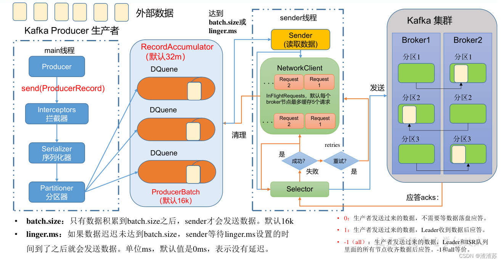

```
<dependency>
    <groupId>org.apache.kafka</groupId>
    <artifactId>kafka-clients</artifactId>
    <version>3.4.0</version>
</dependency>
```

```java
package com.zhengqing.demo.producer;

import org.apache.kafka.clients.producer.KafkaProducer;
import org.apache.kafka.clients.producer.ProducerConfig;
import org.apache.kafka.clients.producer.ProducerRecord;
import org.apache.kafka.common.serialization.StringSerializer;
import org.junit.Test;
import org.springframework.boot.logging.LogLevel;
import org.springframework.boot.logging.LoggingSystem;

import java.util.Properties;

public class KafkaProducerTest {

    @Test
    public void test() throws Exception {
        this.updateLogLevel();
        // 1. 创建 kafka 生产者的配置对象
        Properties properties = new Properties();
        // 2. 给 kafka 配置对象添加配置信息：bootstrap.servers
        properties.put(ProducerConfig.BOOTSTRAP_SERVERS_CONFIG, "127.0.0.1:9092");
        // key,value 序列化（必须）：key.serializer，value.serializer
        properties.put(ProducerConfig.KEY_SERIALIZER_CLASS_CONFIG, StringSerializer.class.getName());
        properties.put(ProducerConfig.VALUE_SERIALIZER_CLASS_CONFIG, StringSerializer.class.getName());
        // 3. 创建 kafka 生产者对象
        KafkaProducer<String, String> kafkaProducer = new KafkaProducer<String, String>(properties);
        // 4. 调用 send 方法,发送消息
        for (int i = 0; i < 5; i++) {
            kafkaProducer.send(new ProducerRecord<>("my-topic", "zhengqingya: " + i));
        }
        // 5. 关闭资源
        kafkaProducer.close();
    }

    private void updateLogLevel() {
        LoggingSystem loggingSystem = LoggingSystem.get(LoggingSystem.class.getClassLoader());
        loggingSystem.setLogLevel("org.apache.kafka", LogLevel.WARN);
    }
}
```

控制台消费者查看是否接收到消息

```shell
docker exec -it kafka-1 /opt/bitnami/kafka/bin/kafka-console-consumer.sh --bootstrap-server kafka-1:9092 --topic my-topic
```

#### 2、带回调函数的异步发送

回调函数会在 producer 收到 ack 时调用，为异步调用，该方法有两个参数，分别是元数据信息（RecordMetadata）和异常信息（Exception），
如果 Exception 为 null，说明消息发送成功，如果 Exception 不为 null，说明消息发送失败。
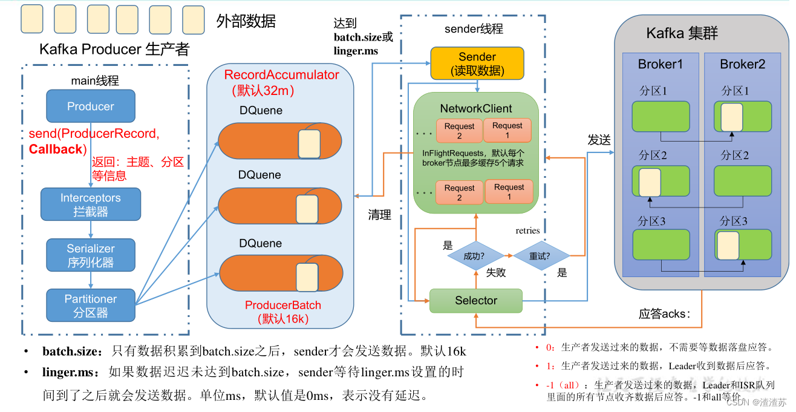

> tips：消息发送失败会自动重试，不需要我们在回调函数中手动重试。

```java
package com.zhengqing.demo.producer;

import org.apache.kafka.clients.producer.*;
import org.apache.kafka.common.serialization.StringSerializer;
import org.junit.Test;
import org.springframework.boot.logging.LogLevel;
import org.springframework.boot.logging.LoggingSystem;

import java.util.Properties;

public class KafkaProducerTest_02 {

    @Test
    public void test() throws Exception {
        this.updateLogLevel();
        // 1. 创建 kafka 生产者的配置对象
        Properties properties = new Properties();
        // 2. 给 kafka 配置对象添加配置信息：bootstrap.servers
        properties.put(ProducerConfig.BOOTSTRAP_SERVERS_CONFIG, "127.0.0.1:9092");
        // key,value 序列化（必须）：key.serializer，value.serializer
        properties.put(ProducerConfig.KEY_SERIALIZER_CLASS_CONFIG, StringSerializer.class.getName());
        properties.put(ProducerConfig.VALUE_SERIALIZER_CLASS_CONFIG, StringSerializer.class.getName());
        // 3. 创建 kafka 生产者对象
        KafkaProducer<String, String> kafkaProducer = new KafkaProducer<String, String>(properties);
        // 4. 调用 send 方法,发送消息
        for (int i = 0; i < 5; i++) {
            kafkaProducer.send(new ProducerRecord<>("my-topic", "zhengqingya: " + i), new Callback() {
                @Override
                public void onCompletion(RecordMetadata recordMetadata, Exception e) {
                    if (e == null) {
                        // 没有异常,输出信息到控制台
                        System.out.println("主题：" + recordMetadata.topic() + "->" + "分区：" + recordMetadata.partition());
                    } else {
                        // 出现异常打印
                        e.printStackTrace();
                    }
                }
            });
        }
        // 5. 关闭资源
        kafkaProducer.close();
    }

    private void updateLogLevel() {
        LoggingSystem loggingSystem = LoggingSystem.get(LoggingSystem.class.getClassLoader());
        loggingSystem.setLogLevel("org.apache.kafka", LogLevel.WARN);
    }
}
```

日志

```shell
主题：my-topic->分区：0
主题：my-topic->分区：0
主题：my-topic->分区：0
主题：my-topic->分区：0
主题：my-topic->分区：0
```

### 三、同步发送 API

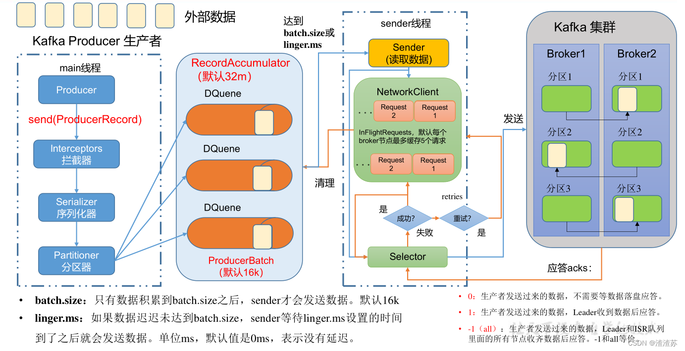

只需在异步发送的基础上，再调用一下 get()方法即可。

```
// 同步发送
kafkaProducer.send(new ProducerRecord<>("my-topic", "zhengqingya: sync")).get();
```

### 四、生产者分区

#### 1、分区好处

* （1）便于合理使用存储资源，每个Partition在一个Broker上存储，可以把海量的数据按照分区切割成一块一块数据存储在多台Broker上。合理控制分区的任务，可以实现负载均衡的效果。
* （2）提高并行度，生产者可以以分区为单位发送数据；消费者可以以分区为单位进行消费数据。

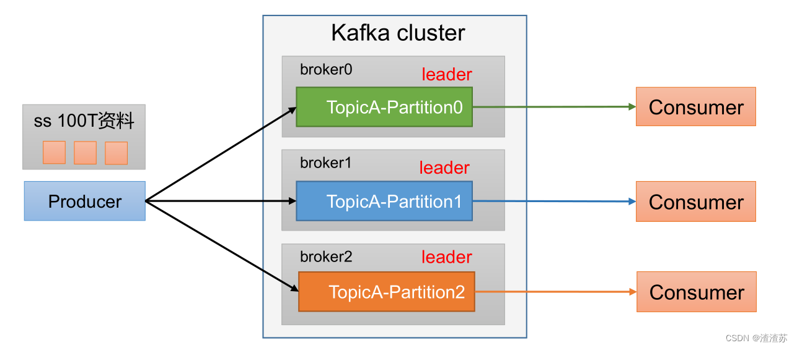

#### 2、生产者发送消息的分区策略

默认的分区器 `org.apache.kafka.clients.producer.internals.DefaultPartitioner`

查看 `org.apache.kafka.clients.producer.ProducerRecord`

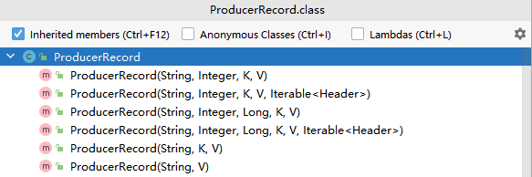

```
// 指明partition的情况下，直接将指明的值作为partition值；例如partition=0，所有数据写入分区0
public ProducerRecord(String topic, Integer partition, Long timestamp, K key, V value, Iterable<Header> headers)
public ProducerRecord(String topic, Integer partition, Long timestamp, K key, V value)
public ProducerRecord(String topic, Integer partition, K key, V value, Iterable<Header> headers)
public ProducerRecord(String topic, Integer partition, K key, V value)

// 没有指明partition值但有key的情况下，将key的hash值与topic的partition数进行取余得到partition值；例如：key1的hash值=5， key2的hash值=6 ，topic的partition数=2，那么key1 对应的value1写入1号分区，key2对应的value2写入0号分区。
public ProducerRecord(String topic, K key, V value)

// 既没有partition值又没有key值的情况下，Kafka采用Sticky Partition（黏性分区器），会随机选择一个分区，并尽可能一直使用该分区，待该分区的batch已满或者已完成，Kafka再随机一个分区进行使用（和上一次的分区不同）。例如：第一次随机选择0号分区，等0号分区当前批次满了（默认16k）或者linger.ms设置的时间到， Kafka再随机一个分区进行使用（如果还是0会继续随机）。
public ProducerRecord(String topic, V value)
```

```java
package com.zhengqing.demo.producer;

import org.apache.kafka.clients.producer.*;
import org.apache.kafka.common.serialization.StringSerializer;
import org.junit.Test;
import org.springframework.boot.logging.LogLevel;
import org.springframework.boot.logging.LoggingSystem;

import java.util.Properties;

public class KafkaProducerTest_04_partition {

    @Test
    public void test() throws Exception {
        this.updateLogLevel();
        // 1. 创建 kafka 生产者的配置对象
        Properties properties = new Properties();
        // 2. 给 kafka 配置对象添加配置信息：bootstrap.servers
        properties.put(ProducerConfig.BOOTSTRAP_SERVERS_CONFIG, "127.0.0.1:9092");
        // key,value 序列化（必须）：key.serializer，value.serializer
        properties.put(ProducerConfig.KEY_SERIALIZER_CLASS_CONFIG, StringSerializer.class.getName());
        properties.put(ProducerConfig.VALUE_SERIALIZER_CLASS_CONFIG, StringSerializer.class.getName());
        // 3. 创建 kafka 生产者对象
        KafkaProducer<String, String> kafkaProducer = new KafkaProducer<String, String>(properties);
        // 4. 调用 send 方法,发送消息
        for (int i = 0; i < 5; i++) {
            // 指定分区发送
            kafkaProducer.send(new ProducerRecord<>("my-topic", 2, "", "zhengqingya: " + i), new Callback() {
                @Override
                public void onCompletion(RecordMetadata recordMetadata, Exception e) {
                    if (e == null) {
                        // 没有异常,输出信息到控制台
                        System.out.println("主题：" + recordMetadata.topic() + "->" + "分区：" + recordMetadata.partition());
                    } else {
                        // 出现异常打印
                        e.printStackTrace();
                    }
                }
            });

            /**
             * 不指定分区，指定key
             *  key = a --> 1
             *  key = b --> 2
             */
            kafkaProducer.send(new ProducerRecord<>("my-topic", "a", "zhengqingya: " + i), new Callback() {
                @Override
                public void onCompletion(RecordMetadata recordMetadata, Exception e) {
                    if (e == null) {
                        // 没有异常,输出信息到控制台
                        System.out.println("主题：" + recordMetadata.topic() + "->" + "分区：" + recordMetadata.partition());
                    } else {
                        // 出现异常打印
                        e.printStackTrace();
                    }
                }
            });
        }

        // 5. 关闭资源
        kafkaProducer.close();
    }

    private void updateLogLevel() {
        LoggingSystem loggingSystem = LoggingSystem.get(LoggingSystem.class.getClassLoader());
        loggingSystem.setLogLevel("org.apache.kafka", LogLevel.WARN);
    }
}
```

#### 3、自定义分区器

1. 定义类实现 Partitioner 接口
2. 重写 partition()方法
3. 在生产者的配置中添加分区器参数 & 使用

```java
package com.zhengqing.demo.producer;

import org.apache.kafka.clients.producer.*;
import org.apache.kafka.common.Cluster;
import org.apache.kafka.common.serialization.StringSerializer;
import org.junit.Test;
import org.springframework.boot.logging.LogLevel;
import org.springframework.boot.logging.LoggingSystem;

import java.util.Map;
import java.util.Properties;

public class KafkaProducerTest_05_partition_custom {

    /**
     * 自定义分区器
     */
    public static class MyPartitioner implements Partitioner {
        /**
         * 返回信息对应的分区
         *
         * @param topic      主题
         * @param key        消息的 key
         * @param keyBytes   消息的 key 序列化后的字节数组
         * @param value      消息的 value
         * @param valueBytes 消息的 value 序列化后的字节数组
         * @param cluster    集群元数据可以查看分区信息
         * @return
         */
        @Override
        public int partition(String topic, Object key, byte[] keyBytes, Object value, byte[] valueBytes, Cluster cluster) {
            // 获取消息
            String msgValue = value.toString();
            // 创建 partition
            int partition;
            // 判断消息是否包含xx值
            if (msgValue.contains("zhengqingya")) {
                partition = 0;
            } else {
                partition = 1;
            }
            // 返回分区号
            return partition;
        }

        // 关闭资源
        @Override
        public void close() {
        }

        // 配置方法
        @Override
        public void configure(Map<String, ?> configs) {
        }
    }


    @Test
    public void test() throws Exception {
        this.updateLogLevel();
        // 1. 创建 kafka 生产者的配置对象
        Properties properties = new Properties();
        // 2. 给 kafka 配置对象添加配置信息：bootstrap.servers
        properties.put(ProducerConfig.BOOTSTRAP_SERVERS_CONFIG, "127.0.0.1:9092");
        // key,value 序列化（必须）：key.serializer，value.serializer
        properties.put(ProducerConfig.KEY_SERIALIZER_CLASS_CONFIG, StringSerializer.class.getName());
        properties.put(ProducerConfig.VALUE_SERIALIZER_CLASS_CONFIG, StringSerializer.class.getName());
        // 添加自定义分区器
        properties.put(ProducerConfig.PARTITIONER_CLASS_CONFIG, MyPartitioner.class.getName());
        // 3. 创建 kafka 生产者对象
        KafkaProducer<String, String> kafkaProducer = new KafkaProducer<>(properties);
        // 4. 调用 send 方法,发送消息
        for (int i = 0; i < 5; i++) {
            kafkaProducer.send(new ProducerRecord<>("my-topic", "zhengqingya: " + i), new Callback() {
                @Override
                public void onCompletion(RecordMetadata recordMetadata, Exception e) {
                    if (e == null) {
                        // 没有异常,输出信息到控制台
                        System.out.println("主题：" + recordMetadata.topic() + "->" + "分区：" + recordMetadata.partition());
                    } else {
                        // 出现异常打印
                        e.printStackTrace();
                    }
                }
            });
        }

        // 5. 关闭资源
        kafkaProducer.close();
    }

    private void updateLogLevel() {
        LoggingSystem loggingSystem = LoggingSystem.get(LoggingSystem.class.getClassLoader());
        loggingSystem.setLogLevel("org.apache.kafka", LogLevel.WARN);
    }
}
```

### 五、生产经验 -- 生产者如何提高吞吐量

- batch.size：批次大小，默认16k
- linger.ms：等待时间，修改为5-100ms
- compression.type：压缩snappy
- RecordAccumulator：缓冲区大小，修改为64m

```
// batch.size：批次大小，默认 16K
properties.put(ProducerConfig.BATCH_SIZE_CONFIG, 16384);
// linger.ms：等待时间，默认 0
properties.put(ProducerConfig.LINGER_MS_CONFIG, 1);
// RecordAccumulator：缓冲区大小，默认 32M：buffer.memory
properties.put(ProducerConfig.BUFFER_MEMORY_CONFIG, 33554432);
// compression.type：压缩，默认 none，可配置值 gzip、snappy、lz4 和 zstd
properties.put(ProducerConfig.COMPRESSION_TYPE_CONFIG, "snappy");
```

### 六、生产经验 -- 数据可靠性

回顾发送流程

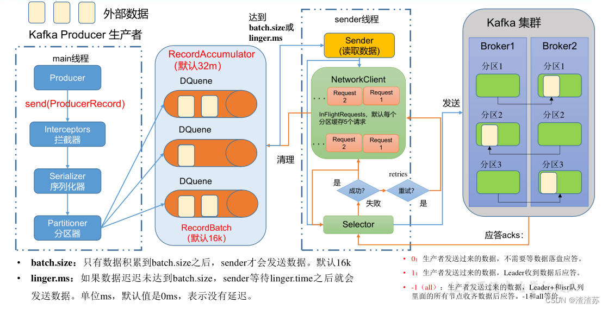

ack 应答原理

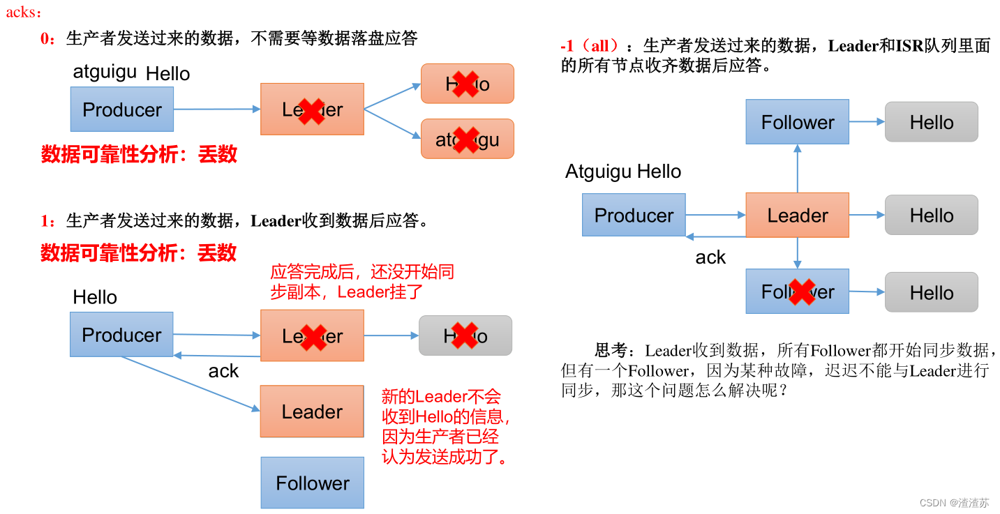

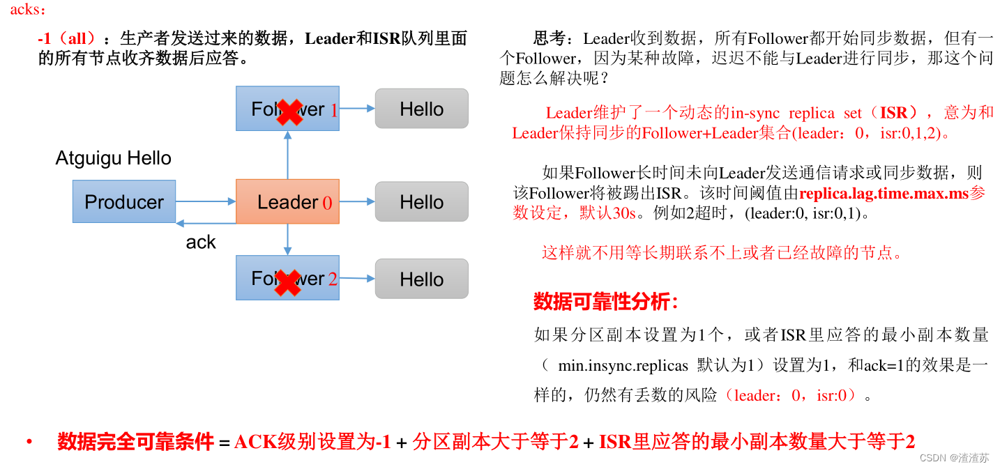

可靠性总结：

- acks=0，生产者发送过来数据就不管了，可靠性差，效率高；
- acks=1，生产者发送过来数据Leader应答，可靠性中等，效率中等；
- acks=-1，生产者发送过来数据Leader和ISR队列里面所有Follwer应答，可靠性高，效率低；

在生产环境中，acks=0很少使用；acks=1，一般用于传输普通日志，允许丢个别数据；acks=-1，一般用于传输和钱相关的数据，对可靠性要求比较高的场景。

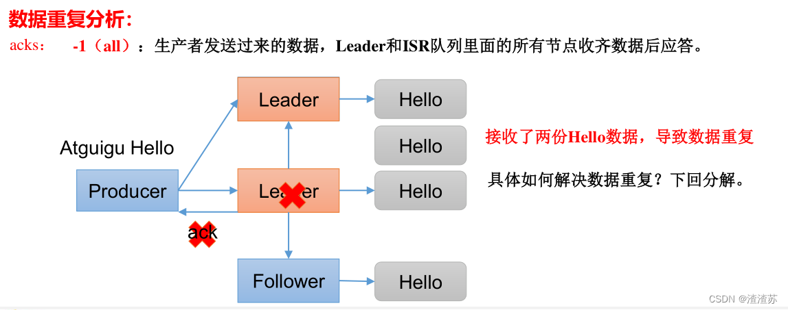

代码配置

```
// 设置 acks
properties.put(ProducerConfig.ACKS_CONFIG, "all");
// 重试次数 retries，默认是 int 最大值，2147483647
properties.put(ProducerConfig.RETRIES_CONFIG, 3);
```

### 七、生产经验 -- 数据去重

#### 1、数据传递语义

- 至少一次（At Least Once）= ACK级别设置为-1 + 分区副本大于等于2 + ISR里应答的最小副本数量大于等于2
- 最多一次（At Most Once）= ACK级别设置为0

总结：

- At Least Once 可以保证数据不丢失，但是不能保证数据不重复；
- At Most Once 可以保证数据不重复，但是不能保证数据不丢失。

精确一次（Exactly Once）：对于一些非常重要的信息，比如和钱相关的数据，要求数据既不能重复也不丢失。

Kafka 0.11版本以后，引入了一项重大特性：幂等性和事务。

#### 2、幂等性

幂等性就是指Producer不论向Broker发送多少次重复数据，Broker端都只会持久化一条，保证了不重复。

精确一次（Exactly Once） = 幂等性 + 至少一次（ ack=-1 + 分区副本数>=2 + ISR最小副本数量>=2）

重复数据的判断标准：具有<PID, Partition, SeqNumber>相同主键的消息提交时，Broker只会持久化一条。
其中PID是Kafka每次重启都会分配一个新的；Partition表示分区号；Sequence Number是单调自增的。

所以幂等性只能保证的是在单分区单会话内不重复。
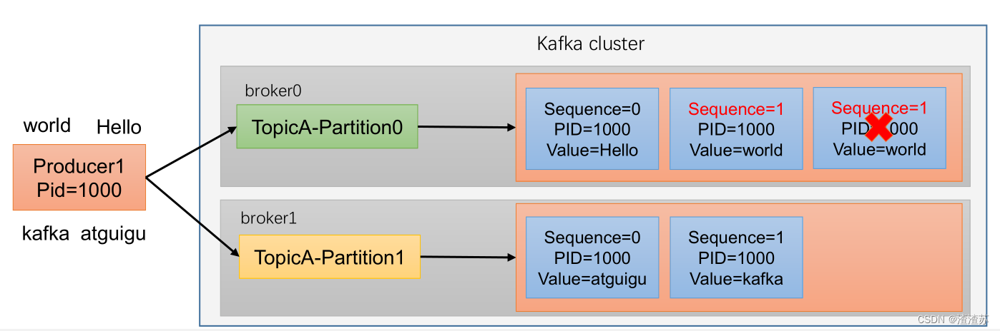

如何使用幂等性？
开启参数 `enable.idempotence` 默认为 true，false 关闭。

#### 3、生产者事务

1）Kafka 事务原理

说明：开启事务，必须开启幂等性。
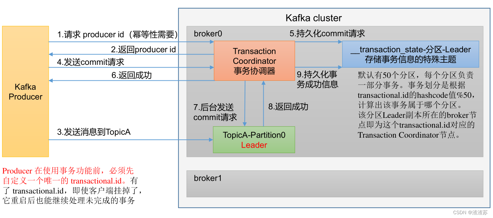

2）Kafka 的事务一共有如下 5 个 API

```
// 1 初始化事务
void initTransactions();
// 2 开启事务
void beginTransaction() throws ProducerFencedException;
// 3 在事务内提交已经消费的偏移量（主要用于消费者）
void sendOffsetsToTransaction(Map<TopicPartition, OffsetAndMetadata> offsets, String consumerGroupId) throws ProducerFencedException;
// 4 提交事务
void commitTransaction() throws ProducerFencedException;
// 5 放弃事务（类似于回滚事务的操作）
void abortTransaction() throws ProducerFencedException;
```

3）单个 Producer，使用事务保证消息的仅一次发送

```java
package com.zhengqing.demo.producer;

import org.apache.kafka.clients.producer.KafkaProducer;
import org.apache.kafka.clients.producer.ProducerConfig;
import org.apache.kafka.clients.producer.ProducerRecord;
import org.apache.kafka.common.serialization.StringSerializer;
import org.junit.Test;
import org.springframework.boot.logging.LogLevel;
import org.springframework.boot.logging.LoggingSystem;

import java.util.Properties;

public class KafkaProducerTest_08_transaction {

    @Test
    public void test() throws Exception {
        this.updateLogLevel();
        // 1. 创建 kafka 生产者的配置对象
        Properties properties = new Properties();
        // 2. 给 kafka 配置对象添加配置信息：bootstrap.servers
        properties.put(ProducerConfig.BOOTSTRAP_SERVERS_CONFIG, "127.0.0.1:9092");
        // key,value 序列化（必须）：key.serializer，value.serializer
        properties.put(ProducerConfig.KEY_SERIALIZER_CLASS_CONFIG, StringSerializer.class.getName());
        properties.put(ProducerConfig.VALUE_SERIALIZER_CLASS_CONFIG, StringSerializer.class.getName());

        // 设置事务 id（必须），事务 id 任意起名
        properties.put(ProducerConfig.TRANSACTIONAL_ID_CONFIG, "transaction_id_0");

        // 3. 创建 kafka 生产者对象
        KafkaProducer<String, String> kafkaProducer = new KafkaProducer<>(properties);

        // 初始化事务
        kafkaProducer.initTransactions();
        // 开启事务
        kafkaProducer.beginTransaction();

        try {
            // 4. 调用 send 方法,发送消息
            for (int i = 0; i < 5; i++) {
                kafkaProducer.send(new ProducerRecord<>("my-topic", "zhengqingya: " + i));
            }
//            int i = 1 / 0;
            // 提交事务
            kafkaProducer.commitTransaction();
        } catch (Exception e) {
            System.err.println("异常：" + e.getMessage());
            // 终止事务
            kafkaProducer.abortTransaction();
        } finally {
            // 5. 关闭资源
            kafkaProducer.close();
        }
    }

    private void updateLogLevel() {
        LoggingSystem loggingSystem = LoggingSystem.get(LoggingSystem.class.getClassLoader());
        loggingSystem.setLogLevel("org.apache.kafka", LogLevel.WARN);
    }
}
```

### 八、生产经验 -- 数据有序

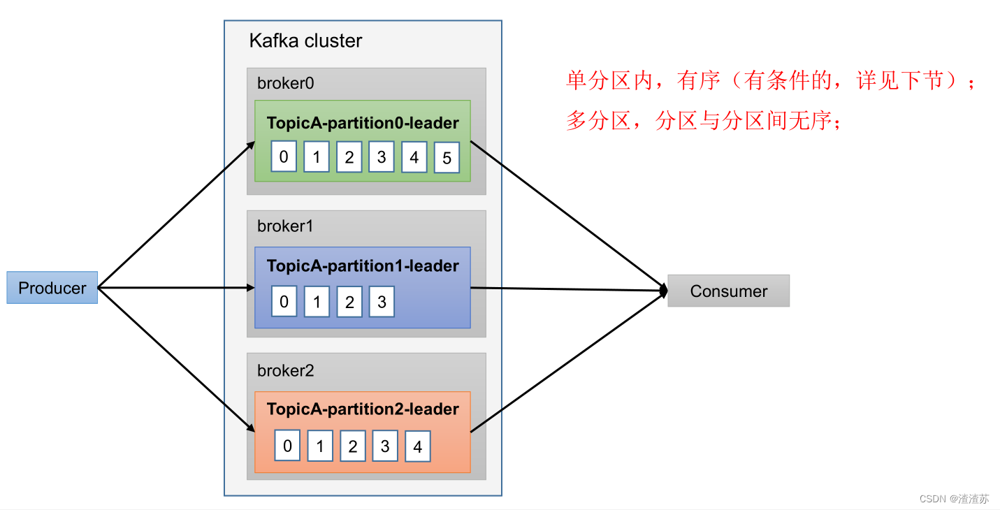

### 九、生产经验 -- 数据乱序

1. kafka在1.x版本之前保证数据单分区有序，条件如下：
   max.in.flight.requests.per.connection=1（不需要考虑是否开启幂等性）。
2. kafka在1.x及以后版本保证数据单分区有序，条件如下：
    * 开启幂等性
        * max.in.flight.requests.per.connection需要设置小于等于5。
    * 未开启幂等性
        * max.in.flight.requests.per.connection需要设置为1。
        * 原因说明：因为在kafka1.x以后，启用幂等后，kafka服务端会缓存producer发来的最近5个request的元数据，  
          故无论如何，都可以保证最近5个request的数据都是有序的。

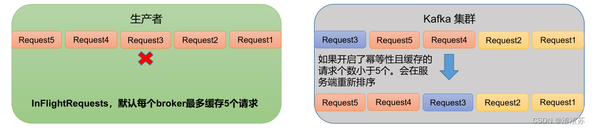
