# Kafka Broker

### 一、Kafka Broker 工作流程

#### 1、Zookeeper 存储的 Kafka 信息

可以通过桌面可视化工具[PrettyZoo](https://github.com/vran-dev/PrettyZoo)查看


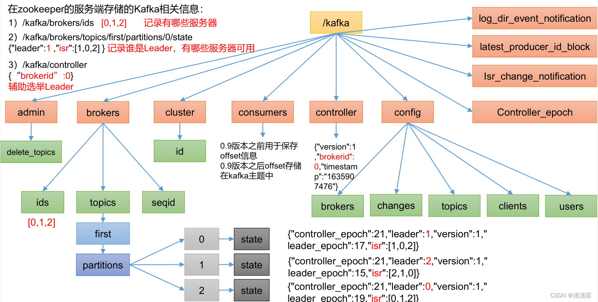

#### 2、Kafka Broker 总体工作流程


模拟 Kafka 上下线，Zookeeper 中数据变化

1. 查看 /kafka/brokers/ids 路径上的节点
   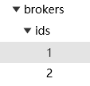
2. 查看 /kafka/controller 路径上的数据

```
{
  "version" : 2,
  "brokerid" : 2,
  "timestamp" : "1688524276281",
  "kraftControllerEpoch" : -1
}
```

3. 查看 /kafka/brokers/topics/my-topic/partitions/0/state 路径上的数据

```
{
  "controller_epoch" : 1,
  "leader" : 1,
  "version" : 1,
  "leader_epoch" : 0,
  "isr" : [ 1 ]
}
```

4. 停止某一台kafka
5. 再次查看 /kafka/brokers/ids 路径上的节点
   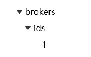
6. 再次查看 /kafka/controller 路径上的数据。

```
{
  "version" : 2,
  "brokerid" : 1,
  "timestamp" : "1688526359063",
  "kraftControllerEpoch" : -1
}
```

7. 再次查看 /kafka/brokers/topics/my-topic/partitions/0/state 路径上的数据。

```
{
  "controller_epoch" : 1,
  "leader" : 1,
  "version" : 1,
  "leader_epoch" : 0,
  "isr" : [ 1 ]
}
```

8. 启动之前停止的kafka
9. 再次观察相应内容
    - /kafka/brokers/ids
    - /kafka/controller
    - /kafka/brokers/topics/my-topic/partitions/0/state

#### 3、Broker 重要参数

| 参数名称                                    | 描述                                                                              |
|-----------------------------------------|---------------------------------------------------------------------------------|
| replica.lag.time.max.ms                 | ISR 中，如果 Follower 长时间未向 Leader 发送通 信请求或同步数据，则该 Follower 将被踢出 ISR。 该时间阈值，默认 30s。 |
| auto.leader.rebalance.enable            | 默认是 true。 自动 Leader Partition 平衡。                                               |
| leader.imbalance.per.broker.percentage  | 默认是 10%。每个 broker 允许的不平衡的 leader 的比率。如果每个 broker 超过了这个值，控制器 会触发 leader 的平衡。     |
| leader.imbalance.check.interval.seconds | 默认值 300 秒。检查 leader 负载是否平衡的间隔时间。                                                |
| log.segment.bytes                       | Kafka 中 log 日志是分成一块块存储的，此配置是 指 log 日志划分 成块的大小，默认值 1G。                           |
| log.index.interval.bytes                | 默认 4kb，kafka 里面每当写入了 4kb 大小的日志 （.log），然后就往 index 文件里面记录一个索引。                    |
| log.retention.hours                     | Kafka 中数据保存的时间，默认 7 天。                                                          |
| log.retention.minutes                   | Kafka 中数据保存的时间，分钟级别，默认关闭。                                                       |
| log.retention.ms                        | Kafka 中数据保存的时间，毫秒级别，默认关闭。                                                       |
| log.retention.check.interval.ms         | 检查数据是否保存超时的间隔，默认是 5 分钟。                                                         |
| log.retention.bytes                     | 默认等于-1，表示无穷大。超过设置的所有日志总 大小，删除最早的 segment。                                       |
| log.cleanup.policy                      | 默认是 delete，表示所有数据启用删除策略； 如果设置值为 compact，表示所有数据启用压缩策 略。                          |
| num.io.threads                          | 默认是 8。负责写磁盘的线程数。整个参数值要占 总核数的 50%。                                               |
| num.replica.fetchers                    | 副本拉取线程数，这个参数占总核数的 50%的 1/3                                                      |
| num.network.threads                     | 默认是 3。数据传输线程数，这个参数占总核数的 50%的 2/3 。                                              |
| log.flush.interval.messages             | 强制页缓存刷写到磁盘的条数，默认是 long 的最 大值，9223372036854775807。一般不建议修改， 交给系统自己管理。             |
| log.flush.interval.ms                   | 每隔多久，刷数据到磁盘，默认是 null。一般不建 议修改，交给系统自己管理。                                         |

### 二、生产经验 -- 节点服役和退役

> tips: 在docker上操作的时候，新节点可在zookeeper上看到，但KafkaMap中虽然可以正常看到Broker数量，但点进详情时，新加的节点不在...
> 故以后实战的时候再检验下，可能是集群部署方式有问题？？
> 通过执行 `docker exec -it kafka-3 /opt/bitnami/kafka/bin/kafka-topics.sh --bootstrap-server kafka-3:9095 --list`
> 查看新节点上的主题发现是同步过来的；
> 由于新版本的kafka集群使用的Kraft模式，所以在这里，我就没多花时间研究了...

准备 broker0、broker1、broker2 共3台kafka服务
> [docker-compose-kafka-3.4.1-cluster-zookepper.yml](./docker-compose-kafka-3.4.1-cluster-zookepper.yml)

然后创建主题：my-topic 分区：3 副本：3

```shell
# 创建主题
docker exec -it kafka-1 /opt/bitnami/kafka/bin/kafka-topics.sh --create --bootstrap-server kafka-1:9092 --topic my-topic --partitions 3 --replication-factor 3
```

#### 服役新节点

运行一个新的kafka容器，记得`broker.id`参数修改（在docker-compose中参数为`KAFKA_CFG_BROKER_ID`）

执行负载均衡操作

##### 1、创建一个要均衡的主题

```shell
cat> ./topics-to-move.json <<EOF
{
    "topics": [
    	{"topic": "my-topic"}
    ],
    "version": 1
}
EOF

# 将文件拷贝到容器中
docker cp ./topics-to-move.json kafka-1:/topics-to-move.json
```

##### 2、生成一个负载均衡的计划

```shell
docker exec -it kafka-1 /opt/bitnami/kafka/bin/kafka-reassign-partitions.sh --bootstrap-server kafka-1:9092 --topics-to-move-json-file topics-to-move.json --broker-list "0,1,2,3" --generate
# 日志：
# Current partition replica assignment
# {"version":1,"partitions":[{"topic":"my-topic","partition":0,"replicas":[3,1,0],"log_dirs":["any","any","any"]},{"topic":"my-topic","partition":1,"replicas":[1,0,2],"log_dirs":["any","any","any"]},{"topic":"my-topic","partition":2,"replicas":[0,2,3],"log_dirs":["any","any","any"]}]}
# 
# Proposed partition reassignment configuration
# {"version":1,"partitions":[{"topic":"my-topic","partition":0,"replicas":[0,1,2],"log_dirs":["any","any","any"]},{"topic":"my-topic","partition":1,"replicas":[1,2,3],"log_dirs":["any","any","any"]},{"topic":"my-topic","partition":2,"replicas":[2,3,0],"log_dirs":["any","any","any"]}]}
```

##### 3、创建副本存储计划（所有副本存储在 broker0、broker1、broker2、broker3 中）

```shell
cat> ./increase-replication-factor.json <<EOF
{
    "version":1,
    "partitions":[
        {"topic":"my-topic","partition":0,"replicas":[2,3,0],"log_dirs":["any","any","any"]},
        {"topic":"my-topic","partition":1,"replicas":[3,0,1],"log_dirs":["any","any","any"]},
        {"topic":"my-topic","partition":2,"replicas":[0,1,2],"log_dirs":["any","any","any"]}
    ]
}
EOF

# 将文件拷贝到容器中
docker cp ./increase-replication-factor.json kafka-1:/increase-replication-factor.json
```

##### 4、执行副本存储计划

```shell
docker exec -it kafka-1 /opt/bitnami/kafka/bin/kafka-reassign-partitions.sh --bootstrap-server kafka-1:9092 --reassignment-json-file increase-replication-factor.json --execute
# 日志：
# Current partition replica assignment
# 
# {"version":1,"partitions":[{"topic":"my-topic","partition":0,"replicas":[3,1,0],"log_dirs":["any","any","any"]},{"topic":"my-topic","partition":1,"replicas":[1,0,2],"log_dirs":["any","any","any"]},{"topic":"my-topic","partition":2,"replicas":[0,2,3],"log_dirs":["any","any","any"]}]}
# 
# Save this to use as the --reassignment-json-file option during rollback
# Successfully started partition reassignments for my-topic-0,my-topic-1,my-topic-2
```

##### 5、验证副本存储计划

```shell
docker exec -it kafka-1 /opt/bitnami/kafka/bin/kafka-reassign-partitions.sh --bootstrap-server kafka-1:9092 --reassignment-json-file increase-replication-factor.json --verify
# 日志：
# Status of partition reassignment:
# Reassignment of partition my-topic-0 is completed.
# Reassignment of partition my-topic-1 is completed.
# Reassignment of partition my-topic-2 is completed.
# 
# Clearing broker-level throttles on brokers 0,1,2,3
# Clearing topic-level throttles on topic my-topic
```

#### 退役旧节点

和服役新节点操作一样

```shell
# 1、创建一个要均衡的主题
cat> ./topics-to-move.json <<EOF
{
    "topics": [
    	{"topic": "my-topic"}
    ],
    "version": 1
}
EOF
# 将文件拷贝到容器中
docker cp ./topics-to-move.json kafka-1:/topics-to-move.json

# 2、生成一个负载均衡的计划  --broker-list减少节点3
docker exec -it kafka-1 /opt/bitnami/kafka/bin/kafka-reassign-partitions.sh --bootstrap-server kafka-1:9092 --topics-to-move-json-file topics-to-move.json --broker-list "0,1,2" --generate

# 3、创建副本存储计划（所有副本存储在 broker0、broker1、broker2 中）
cat> ./increase-replication-factor.json <<EOF
{
    "version":1,
    "partitions":[
        {"topic":"my-topic","partition":0,"replicas":[2,0,1],"log_dirs":["any","any","any"]},
        {"topic":"my-topic","partition":1,"replicas":[0,1,2],"log_dirs":["any","any","any"]},
        {"topic":"my-topic","partition":2,"replicas":[1,2,0],"log_dirs":["any","any","any"]}
    ]
}
EOF
# 将文件拷贝到容器中
docker cp ./increase-replication-factor.json kafka-1:/increase-replication-factor.json

# 4、执行副本存储计划
docker exec -it kafka-1 /opt/bitnami/kafka/bin/kafka-reassign-partitions.sh --bootstrap-server kafka-1:9092 --reassignment-json-file increase-replication-factor.json --execute

# 5、验证副本存储计划
docker exec -it kafka-1 /opt/bitnami/kafka/bin/kafka-reassign-partitions.sh --bootstrap-server kafka-1:9092 --reassignment-json-file increase-replication-factor.json --verify
```

然后停止旧kafka节点即可

### 三、Kafka 副本

#### 1、副本基本信息

1. Kafka 副本作用：提高数据可靠性。
2. Kafka 默认副本 1 个，生产环境一般配置为 2 个，保证数据可靠性；太多副本会增加磁盘存储空间，增加网络上数据传输，降低效率。
3. Kafka 中副本分为：Leader 和 Follower。Kafka 生产者只会把数据发往 Leader，然后 Follower 找 Leader 进行同步数据。
4. Kafka 分区中的所有副本统称为 AR（Assigned Repllicas）。

AR = ISR + OSR

ISR，表示和 Leader 保持同步的 Follower 集合。
如果 Follower 长时间未向 Leader 发送通信请求或同步数据，则该 Follower 将被踢出 ISR。
该时间阈值由 replica.lag.time.max.ms参数设定，默认 30s。
Leader 发生故障之后，就会从 ISR 中选举新的 Leader。

OSR，表示 Follower 与 Leader 副本同步时，延迟过多的副本。

#### 2、Leader 选举流程

Kafka 集群中有一个 broker 的 Controller 会被选举为 Controller Leader，负责管理集群broker 的上下线，
所有 topic 的分区副本分配和 Leader 选举等工作。Controller 的信息同步工作是依赖于 Zookeeper 的。

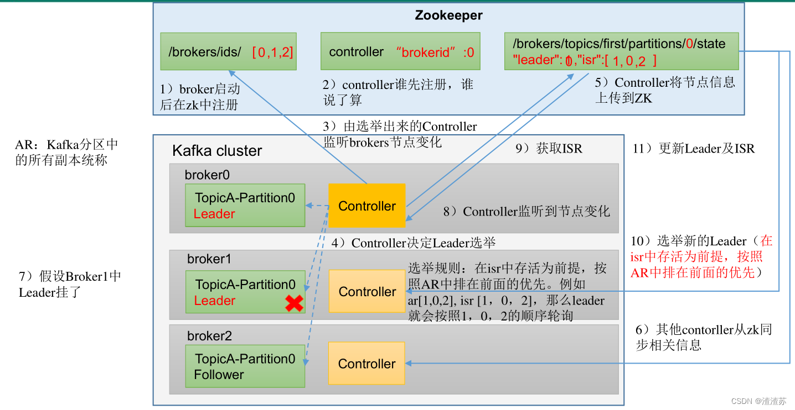

（1）创建一个新的 topic，4 个分区，4 个副本

```shell
docker exec -it kafka-1 /opt/bitnami/kafka/bin/kafka-topics.sh --create --bootstrap-server kafka-1:9092 --topic my-topic-2 --partitions 4 --replication-factor 4
```

（2）查看 Leader 分布情况

```shell
docker exec -it kafka-1 /opt/bitnami/kafka/bin/kafka-topics.sh --bootstrap-server kafka-1:9092 --describe --topic my-topic-2
# Topic: my-topic-2       TopicId: jKsm3H0rTU6Nxm7lKy7oaQ PartitionCount: 4       ReplicationFactor: 4    Configs:
#         Topic: my-topic-2       Partition: 0    Leader: 3       Replicas: 3,1,0,2       Isr: 3,1,0,2
#         Topic: my-topic-2       Partition: 1    Leader: 1       Replicas: 1,0,2,3       Isr: 1,0,2,3
#         Topic: my-topic-2       Partition: 2    Leader: 0       Replicas: 0,2,3,1       Isr: 0,2,3,1
#         Topic: my-topic-2       Partition: 3    Leader: 2       Replicas: 2,3,1,0       Isr: 2,3,1,0
```

（3）停止某一台kafka `kafka-3`，并查看 Leader 分区情况

```shell
docker stop kafka-3
docker exec -it kafka-1 /opt/bitnami/kafka/bin/kafka-topics.sh --bootstrap-server kafka-1:9092 --describe --topic my-topic-2
# Topic: my-topic-2       TopicId: jKsm3H0rTU6Nxm7lKy7oaQ PartitionCount: 4       ReplicationFactor: 4    Configs:
#         Topic: my-topic-2       Partition: 0    Leader: 1       Replicas: 3,1,0,2       Isr: 1,0,2
#         Topic: my-topic-2       Partition: 1    Leader: 1       Replicas: 1,0,2,3       Isr: 1,0,2
#         Topic: my-topic-2       Partition: 2    Leader: 0       Replicas: 0,2,3,1       Isr: 0,2,1
#         Topic: my-topic-2       Partition: 3    Leader: 2       Replicas: 2,3,1,0       Isr: 2,1,0
```

（4）再停止一台kafka `kafka-2`，并查看 Leader 分区情况

```shell
docker stop kafka-2
docker exec -it kafka-1 /opt/bitnami/kafka/bin/kafka-topics.sh --bootstrap-server kafka-1:9092 --describe --topic my-topic-2
# Topic: my-topic-2       TopicId: jKsm3H0rTU6Nxm7lKy7oaQ PartitionCount: 4       ReplicationFactor: 4    Configs:
#         Topic: my-topic-2       Partition: 0    Leader: 1       Replicas: 3,1,0,2       Isr: 1,0
#         Topic: my-topic-2       Partition: 1    Leader: 1       Replicas: 1,0,2,3       Isr: 1,0
#         Topic: my-topic-2       Partition: 2    Leader: 0       Replicas: 0,2,3,1       Isr: 0,1
#         Topic: my-topic-2       Partition: 3    Leader: 1       Replicas: 2,3,1,0       Isr: 1,0
```

（5）启动之前停止的某一台kafka `kafka-3`，并查看 Leader 分区情况

```shell
docker start kafka-3
docker exec -it kafka-1 /opt/bitnami/kafka/bin/kafka-topics.sh --bootstrap-server kafka-1:9092 --describe --topic my-topic-2
# Topic: my-topic-2       TopicId: jKsm3H0rTU6Nxm7lKy7oaQ PartitionCount: 4       ReplicationFactor: 4    Configs:
#         Topic: my-topic-2       Partition: 0    Leader: 1       Replicas: 3,1,0,2       Isr: 1,0,3
#         Topic: my-topic-2       Partition: 1    Leader: 1       Replicas: 1,0,2,3       Isr: 1,0,3
#         Topic: my-topic-2       Partition: 2    Leader: 0       Replicas: 0,2,3,1       Isr: 0,1,3
#         Topic: my-topic-2       Partition: 3    Leader: 1       Replicas: 2,3,1,0       Isr: 1,0,3
```

（6）启动之前停止的另外一台kafka  `kafka-2`，并查看 Leader 分区情况

```shell
docker start kafka-2
docker exec -it kafka-1 /opt/bitnami/kafka/bin/kafka-topics.sh --bootstrap-server kafka-1:9092 --describe --topic my-topic-2
# Topic: my-topic-2       TopicId: jKsm3H0rTU6Nxm7lKy7oaQ PartitionCount: 4       ReplicationFactor: 4    Configs:
#         Topic: my-topic-2       Partition: 0    Leader: 1       Replicas: 3,1,0,2       Isr: 1,0,3,2
#         Topic: my-topic-2       Partition: 1    Leader: 1       Replicas: 1,0,2,3       Isr: 1,0,3,2
#         Topic: my-topic-2       Partition: 2    Leader: 0       Replicas: 0,2,3,1       Isr: 0,1,3,2
#         Topic: my-topic-2       Partition: 3    Leader: 1       Replicas: 2,3,1,0       Isr: 1,0,3,2
```

（7）停止掉`kafka-0`，并查看 Leader 分区情况

```shell
docker stop kafka-0
docker exec -it kafka-1 /opt/bitnami/kafka/bin/kafka-topics.sh --bootstrap-server kafka-1:9092 --describe --topic my-topic-2
# Topic: my-topic-2       TopicId: jKsm3H0rTU6Nxm7lKy7oaQ PartitionCount: 4       ReplicationFactor: 4    Configs:
#         Topic: my-topic-2       Partition: 0    Leader: 3       Replicas: 3,1,0,2       Isr: 1,3,2
#         Topic: my-topic-2       Partition: 1    Leader: 1       Replicas: 1,0,2,3       Isr: 1,3,2
#         Topic: my-topic-2       Partition: 2    Leader: 2       Replicas: 0,2,3,1       Isr: 1,3,2
#         Topic: my-topic-2       Partition: 3    Leader: 2       Replicas: 2,3,1,0       Isr: 1,3,2
```

#### 3、Leader 和 Follower 故障处理细节

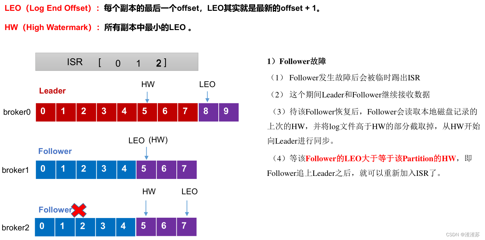
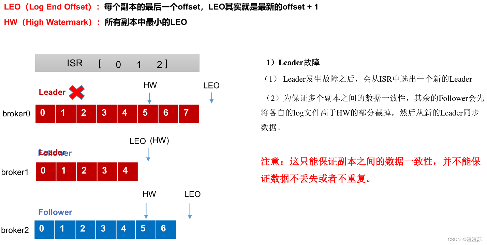

#### 4、分区副本分配

如果 kafka 服务器只有 4 个节点，那么设置 kafka 的分区数大于服务器台数，在 kafka底层如何分配存储副本呢？

eg:

```shell
# 创建主题 16 分区，3 个副本
docker exec -it kafka-1 /opt/bitnami/kafka/bin/kafka-topics.sh --create --bootstrap-server kafka-1:9092 --topic my-topic-second --partitions 16 --replication-factor 3
# 查看分区和副本情况
docker exec -it kafka-1 /opt/bitnami/kafka/bin/kafka-topics.sh --bootstrap-server kafka-1:9092 --describe --topic my-topic-second
# Topic: my-topic-second  TopicId: 6Eq3tUoES6SdI4k-_4mhTg PartitionCount: 16      ReplicationFactor: 3    Configs:
#         Topic: my-topic-second  Partition: 0    Leader: 0       Replicas: 0,2,3 Isr: 0,2,3
#         Topic: my-topic-second  Partition: 1    Leader: 2       Replicas: 2,3,1 Isr: 2,3,1
#         Topic: my-topic-second  Partition: 2    Leader: 3       Replicas: 3,1,0 Isr: 3,1,0
#         Topic: my-topic-second  Partition: 3    Leader: 1       Replicas: 1,0,2 Isr: 1,0,2
#         Topic: my-topic-second  Partition: 4    Leader: 0       Replicas: 0,3,1 Isr: 0,3,1
#         Topic: my-topic-second  Partition: 5    Leader: 2       Replicas: 2,1,0 Isr: 2,1,0
#         Topic: my-topic-second  Partition: 6    Leader: 3       Replicas: 3,0,2 Isr: 3,0,2
#         Topic: my-topic-second  Partition: 7    Leader: 1       Replicas: 1,2,3 Isr: 1,2,3
#         Topic: my-topic-second  Partition: 8    Leader: 0       Replicas: 0,1,2 Isr: 0,1,2
#         Topic: my-topic-second  Partition: 9    Leader: 2       Replicas: 2,0,3 Isr: 2,0,3
#         Topic: my-topic-second  Partition: 10   Leader: 3       Replicas: 3,2,1 Isr: 3,2,1
#         Topic: my-topic-second  Partition: 11   Leader: 1       Replicas: 1,3,0 Isr: 1,3,0
#         Topic: my-topic-second  Partition: 12   Leader: 0       Replicas: 0,2,3 Isr: 0,2,3
#         Topic: my-topic-second  Partition: 13   Leader: 2       Replicas: 2,3,1 Isr: 2,3,1
#         Topic: my-topic-second  Partition: 14   Leader: 3       Replicas: 3,1,0 Isr: 3,1,0
#         Topic: my-topic-second  Partition: 15   Leader: 1       Replicas: 1,0,2 Isr: 1,0,2
```

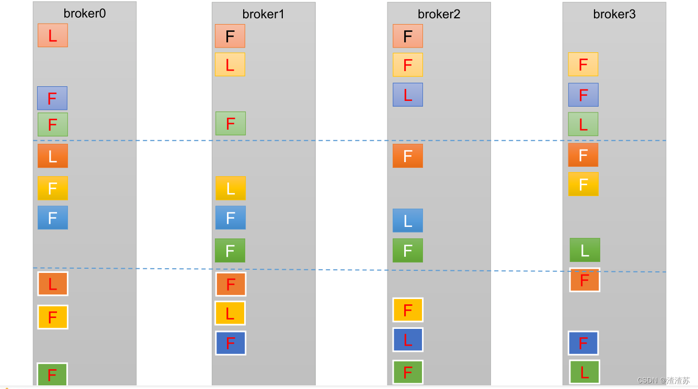

#### 5、生产经验 -- 手动调整分区副本存储

在生产环境中，每台服务器的配置和性能不一致，但是Kafka只会根据自己的代码规则创建对应的分区副本，就会导致个别服务器存储压力较大。所有需要手动调整分区副本的存储。

需求：创建一个新的topic，4个分区，两个副本。将该topic的所有副本都存储到broker0和broker1两台服务器上。
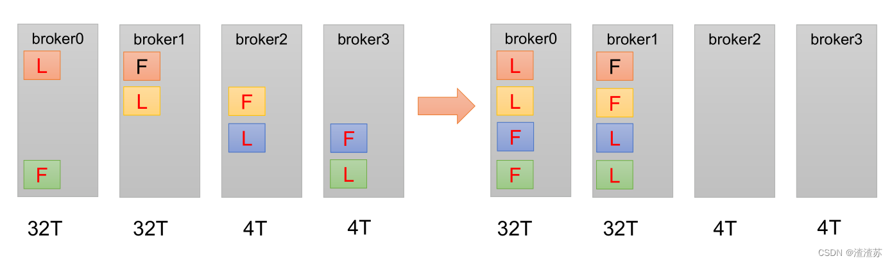

手动调整分区副本存储的步骤如下：

```shell
# 1、创建主题
docker exec -it kafka-1 /opt/bitnami/kafka/bin/kafka-topics.sh --create --bootstrap-server kafka-1:9092 --topic my-topic-three --partitions 4 --replication-factor 2

# 2、查看分区和副本情况
docker exec -it kafka-1 /opt/bitnami/kafka/bin/kafka-topics.sh --bootstrap-server kafka-1:9092 --describe --topic my-topic-three
# Topic: my-topic-three   TopicId: ykOXg7esTpi7ESOjBOiXIw PartitionCount: 4       ReplicationFactor: 2    Configs:
#         Topic: my-topic-three   Partition: 0    Leader: 3       Replicas: 3,1   Isr: 3,1
#         Topic: my-topic-three   Partition: 1    Leader: 1       Replicas: 1,0   Isr: 1,0
#         Topic: my-topic-three   Partition: 2    Leader: 0       Replicas: 0,2   Isr: 0,2
#         Topic: my-topic-three   Partition: 3    Leader: 2       Replicas: 2,3   Isr: 2,3

# 3、创建副本存储计划（所有副本都指定存储在 broker0、broker1 中）
cat> ./increase-replication-factor.json <<EOF
{
    "version":1,
    "partitions":[
        {"topic":"my-topic-three","partition":0,"replicas":[0,1]},
        {"topic":"my-topic-three","partition":1,"replicas":[0,1]},
        {"topic":"my-topic-three","partition":2,"replicas":[1,0]},
        {"topic":"my-topic-three","partition":3,"replicas":[1,0]}
    ]
}
EOF
# 将文件拷贝到容器中
docker cp ./increase-replication-factor.json kafka-1:/increase-replication-factor.json

# 4、执行副本存储计划
docker exec -it kafka-1 /opt/bitnami/kafka/bin/kafka-reassign-partitions.sh --bootstrap-server kafka-1:9092 --reassignment-json-file increase-replication-factor.json --execute

# 5、验证副本存储计划
docker exec -it kafka-1 /opt/bitnami/kafka/bin/kafka-reassign-partitions.sh --bootstrap-server kafka-1:9092 --reassignment-json-file increase-replication-factor.json --verify

# 6、查看分区副本存储情况
docker exec -it kafka-1 /opt/bitnami/kafka/bin/kafka-topics.sh --bootstrap-server kafka-1:9092 --describe --topic my-topic-three
# Topic: my-topic-three   TopicId: ykOXg7esTpi7ESOjBOiXIw PartitionCount: 4       ReplicationFactor: 2    Configs:
#         Topic: my-topic-three   Partition: 0    Leader: 0       Replicas: 0,1   Isr: 1,0
#         Topic: my-topic-three   Partition: 1    Leader: 1       Replicas: 0,1   Isr: 1,0
#         Topic: my-topic-three   Partition: 2    Leader: 0       Replicas: 1,0   Isr: 0,1
#         Topic: my-topic-three   Partition: 3    Leader: 1       Replicas: 1,0   Isr: 1,0
```

#### 6、生产经验 -- Leader Partition 负载平衡

正常情况下，Kafka本身会自动把Leader Partition均匀分散在各个机器上，来保证每台机器的读写吞吐量都是均匀的。
但是如果某些broker宕机，会导致Leader Partition过于集中在其他少部分几台broker上，这会导致少数几台broker的读写请求压力过高，
其他宕机的broker重启之后都是follower partition，读写请求很低，造成集群负载不均衡。
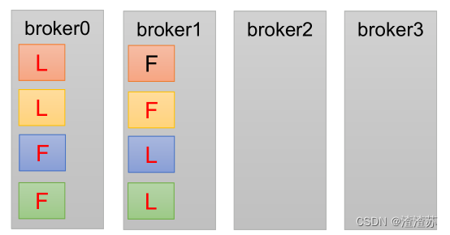

- `auto.leader.rebalance.enable`，默认是true。自动Leader Partition 平衡
- `leader.imbalance.per.broker.percentage`，默认是10%。每个broker允许的不平衡的leader的比率。如果每个broker超过了这个值，控制器会触发leader的平衡。
- `leader.imbalance.check.interval.seconds`，默认值300秒。检查leader负载是否平衡的间隔时间。

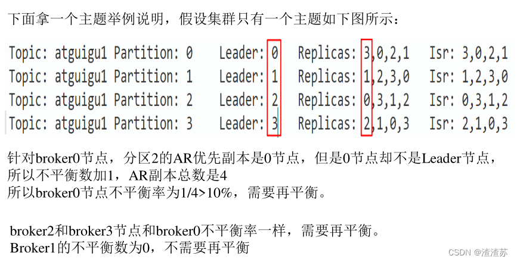

| 参数名称                                    | 描述                                                                                |
|-----------------------------------------|-----------------------------------------------------------------------------------|
| auto.leader.rebalance.enable            | 默认是 true。 自动 Leader Partition 平衡。生产环境中，leader 重选举的代价比较大，可能会带来性能影响，建议设置为 false 关闭。 |
| leader.imbalance.per.broker.percentage  | 默认是 10%。每个 broker 允许的不平衡的 leader的比率。如果每个 broker 超过了这个值，控制器  会触发 leader 的平衡。       |
| leader.imbalance.check.interval.seconds | 默认值 300 秒。检查 leader 负载是否平衡的间隔 时间。                                                 |

#### 7、生产经验 -- 增加副本因子

在生产环境当中，由于某个主题的重要等级需要提升，我们考虑增加副本。副本数的增加需要先制定计划，然后根据计划执行。

```shell
# 1、创建主题
docker exec -it kafka-1 /opt/bitnami/kafka/bin/kafka-topics.sh --create --bootstrap-server kafka-1:9092 --topic my-topic-four --partitions 3 --replication-factor 1
# 2、查看分区副本存储情况
docker exec -it kafka-1 /opt/bitnami/kafka/bin/kafka-topics.sh --bootstrap-server kafka-1:9092 --describe --topic my-topic-four
# Topic: my-topic-four    TopicId: i_vpWCe9TceicZbvzMhRzA PartitionCount: 3       ReplicationFactor: 1    Configs:
#         Topic: my-topic-four    Partition: 0    Leader: 1       Replicas: 1     Isr: 1
#         Topic: my-topic-four    Partition: 1    Leader: 0       Replicas: 0     Isr: 0
#         Topic: my-topic-four    Partition: 2    Leader: 2       Replicas: 2     Isr: 2

# 开始手动增加副本存储
# 3、创建副本存储计划（所有副本都指定存储在 broker0、broker1、broker2 中）
cat> ./increase-replication-factor.json <<EOF
{
    "version":1,
    "partitions":[
        {"topic":"my-topic-four","partition":0,"replicas":[0,1,2]},
        {"topic":"my-topic-four","partition":1,"replicas":[0,1,2]},
        {"topic":"my-topic-four","partition":2,"replicas":[0,1,2]}
    ]
}
EOF
# 将文件拷贝到容器中
docker cp ./increase-replication-factor.json kafka-1:/increase-replication-factor.json

# 4、执行副本存储计划
docker exec -it kafka-1 /opt/bitnami/kafka/bin/kafka-reassign-partitions.sh --bootstrap-server kafka-1:9092 --reassignment-json-file increase-replication-factor.json --execute

# 5、验证副本存储计划
docker exec -it kafka-1 /opt/bitnami/kafka/bin/kafka-reassign-partitions.sh --bootstrap-server kafka-1:9092 --reassignment-json-file increase-replication-factor.json --verify

# 6、查看分区副本存储情况
docker exec -it kafka-1 /opt/bitnami/kafka/bin/kafka-topics.sh --bootstrap-server kafka-1:9092 --describe --topic my-topic-four
# Topic: my-topic-four    TopicId: i_vpWCe9TceicZbvzMhRzA PartitionCount: 3       ReplicationFactor: 3    Configs:
#         Topic: my-topic-four    Partition: 0    Leader: 1       Replicas: 0,1,2 Isr: 1,2,0
#         Topic: my-topic-four    Partition: 1    Leader: 0       Replicas: 0,1,2 Isr: 0,2,1
#         Topic: my-topic-four    Partition: 2    Leader: 2       Replicas: 0,1,2 Isr: 2,0,1
```

### 四、文件存储

#### 1、文件存储机制

1）Topic 数据的存储机制

Topic是逻辑上的概念，而partition是物理上的概念，每个partition对应于一个log文件，该log文件中存储的就是Producer生产的数据。
Producer生产的数据会被不断追加到该log文件末端，为防止log文件过大导致数据定位效率低下，Kafka采取了分片和索引机制，将每个partition分为多个segment。
每个segment包括：“.index”文件、“.log”文件和.timeindex等文件。
这些文件位于一个文件夹下，该文件夹的命名规则为：topic名称+分区序号，例如：first-0。


2）思考：Topic 数据到底存储在什么位置？

```shell
# 创建主题
docker exec -it kafka-1 /opt/bitnami/kafka/bin/kafka-topics.sh --create --bootstrap-server kafka-1:9092 --topic my-topic-msg --partitions 2 --replication-factor 1
# 控制台生产者发送消息
docker exec -it kafka-1 /opt/bitnami/kafka/bin/kafka-console-producer.sh --bootstrap-server kafka-1:9092 --topic my-topic-msg
>hello world
```

查看数据

```shell
docker exec -it kafka-1 ls /bitnami/kafka/data/my-topic-msg-1
# 00000000000000000000.index
# 00000000000000000000.log
# 00000000000000000000.timeindex
# leader-epoch-checkpoint
# partition.

# 直接查看 log 日志，发现是乱码...
docker exec -it kafka-1 cat /bitnami/kafka/data/my-topic-msg-1/00000000000000000000.log
# 通过工具查看 index 和 log 信息
docker exec -it kafka-1 /opt/bitnami/kafka/bin/kafka-run-class.sh kafka.tools.DumpLogSegments --files /bitnami/kafka/data/my-topic-msg-1/00000000000000000000.log
# Dumping /bitnami/kafka/data/my-topic-msg-1/00000000000000000000.log
# Log starting offset: 0
```

3）index 文件和 log 文件详解
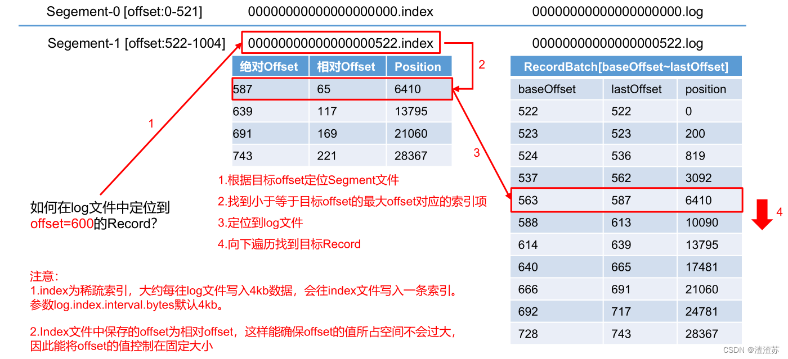

说明：日志存储参数配置

| 参数                       | 描述                                                                 |
|--------------------------|--------------------------------------------------------------------|
| log.segment.bytes        | Kafka 中 log 日志是分成一块块存储的，此配置是指 log 日志划分成块的大小，默认值 1G。                |
| log.index.interval.bytes | 默认 4kb，kafka 里面每当写入了 4kb 大小的日志（.log），然后就 往 index 文件里面记录一个索引。 稀疏索引。 |

#### 2、文件清理策略

Kafka 中默认的日志保存时间为 7 天，可以通过调整如下参数修改保存时间。

- `log.retention.hours`，最低优先级小时，默认 7 天。
- `log.retention.minutes`，分钟。
- `log.retention.ms`，最高优先级毫秒。
- `log.retention.check.interval.ms`，负责设置检查周期，默认 5 分钟。

那么日志一旦超过了设置的时间，怎么处理呢？

Kafka 中提供的日志清理策略有 delete 和 compact 两种。

##### delete 日志删除：将过期数据删除

`log.cleanup.policy = delete` 所有数据启用删除策略

1. 基于时间：默认打开。以 segment 中所有记录中的最大时间戳作为该文件时间戳。
2. 基于大小：默认关闭。超过设置的所有日志总大小，删除最早的 segment。log.retention.bytes，默认等于-1，表示无穷大。

思考：如果一个 segment 中有一部分数据过期，一部分没有过期，怎么处理？
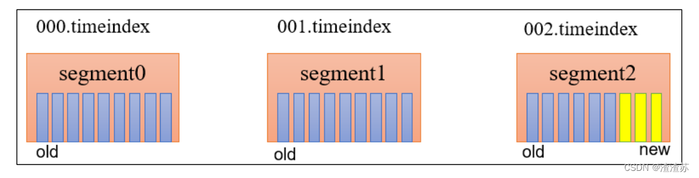

##### compact 日志压缩

compact日志压缩：对于相同key的不同value值，只保留最后一个版本。

`log.cleanup.policy = compact` 所有数据启用压缩策略
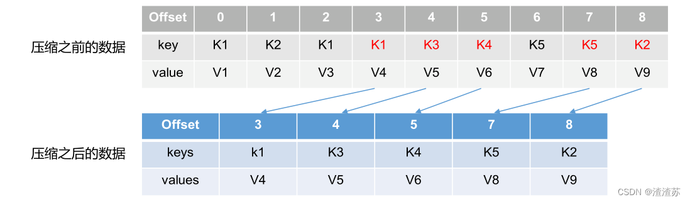

压缩后的offset可能是不连续的，比如上图中没有6，当从这些offset消费消息时，将会拿到比这个offset大的offset对应的消息，实际上会拿到offset为7的消息，并从这个位置开始消费。

这种策略只适合特殊场景，比如消息的key是用户ID，value是用户的资料，通过这种压缩策略，整个消息集里就保存了所有用户最新的资料。

### 五、高效读写数据

1. Kafka 本身是分布式集群，可以采用分区技术，并行度高
2. 读数据采用稀疏索引，可以快速定位要消费的数据
3. 顺序写磁盘
   Kafka 的 producer 生产数据，要写入到 log 文件中，写的过程是一直追加到文件末端，为顺序写。官网有数据表明，同样的磁盘，顺序写能到
   600M/s，而随机写只有 100K/s。这与磁盘的机械机构有关，顺序写之所以快，是因为其省去了大量磁头寻址的时间。
   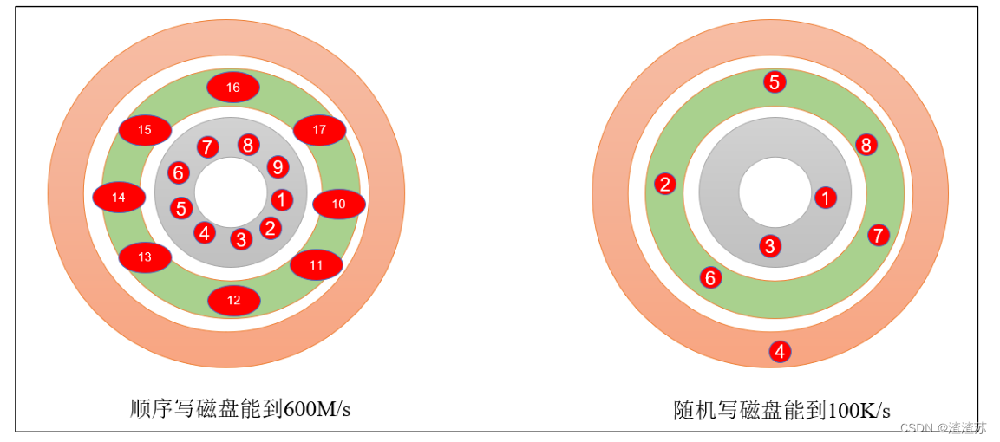
4. 页缓存 + 零拷贝技术
    1. 零拷贝：Kafka的数据加工处理操作交由Kafka生产者和Kafka消费者处理。Kafka Broker应用层不关心存储的数据，所以就不用走应用层，传输效率高。
    2. PageCache页缓存：Kafka重度依赖底层操作系统提供的PageCache功能。当上层有写操作时，操作系统只是将数据写入PageCache。
       当读操作发生时，先从PageCache中查找，如果找不到，再去磁盘中读取。实际上PageCache是把尽可能多的空闲内存都当做了磁盘缓存来使用。
       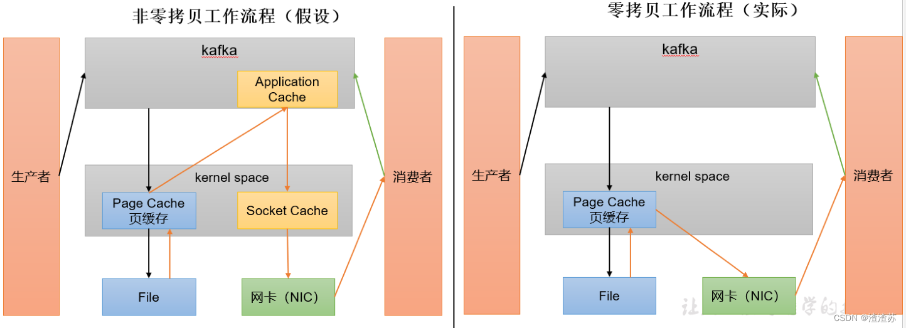

| 参数                          | 描述                                                                |
|-----------------------------|-------------------------------------------------------------------|
| log.flush.interval.messages | 强制页缓存刷写到磁盘的条数，默认是 long 的最大值，9223372036854775807。一般不建议修改，交给系统自己管理。 |
| log.flush.interval.ms       | 每隔多久，刷数据到磁盘，默认是 null。一般不建议修改，交给系统自己管理。                            |
