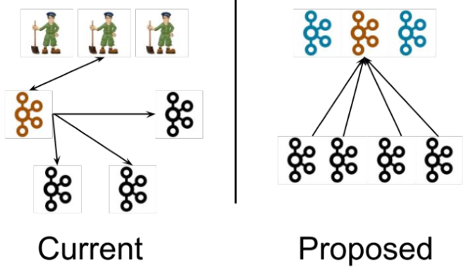

# Kafka-Kraft 模式

### 一、Kafka-Kraft 架构

左图为 Kafka 现有架构，元数据在 zookeeper 中，运行时动态选举 controller，由controller 进行 Kafka 集群管理。
右图为 kraft 模式架构（实验性），不再依赖 zookeeper 集群，而是用三台 controller 节点代替 zookeeper，
元数据保存在 controller 中，由 controller 直接进行 Kafka 集群管理。

这样做的好处有以下几个：

- Kafka 不再依赖外部框架，而是能够独立运行；
- controller 管理集群时，不再需要从 zookeeper 中先读取数据，集群性能上升；
- 由于不依赖 zookeeper，集群扩展时不再受到 zookeeper 读写能力限制；
- controller 不再动态选举，而是由配置文件规定。这样我们可以有针对性的加强controller 节点的配置，而不是像以前一样对随机controller节点的高负载束手无策。

### 二、Kafka-Kraft 集群部署

见 https://gitee.com/zhengqingya/docker-compose

备份版：[`3.5.0-cluster-kraft`](./docker-compose-kafka-3.5.0-cluster-kraft.yml)
