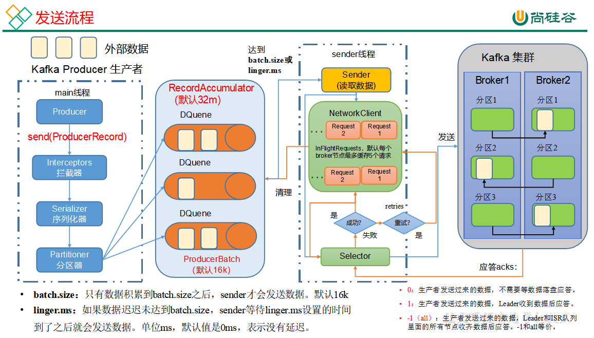

# Kafka调优-生产者

3.1.1 Updating Broker Configs

From Kafka version 1.1 onwards, some of the broker configs can be updated without restarting the broker. See the Dynamic
Update Mode column in Broker Configs for the update mode of each broker config.

- **read-only:** Requires a broker restart for update
- **per-broker:** May be updated dynamically for each broker
- **cluster-wide:** May be updated dynamically as a cluster-wide default.

May also be updated as a per-broker value for testing.

### 一、Kafka生产者核心参数配置



| 参数名称                                  | 描述                                                                                                                                                |
|---------------------------------------|---------------------------------------------------------------------------------------------------------------------------------------------------|
| bootstrap.servers                     | 生产者连接集群所需的broker地址清单。例如hadoop102:9092,hadoop103:9092,hadoop104:9092，可以设置1个或者多个，中间用逗号隔开。注意这里并非需要所有的broker地址，因为生产者从给定的broker里查找到其他broker信息。         |
| key.serializer和value.serializer       | 指定发送消息的key和value的序列化类型。一定要写全类名。                                                                                                                   |
| buffer.memory                         | RecordAccumulator缓冲区总大小，默认32m。                                                                                                                    |
| batch.size                            | 缓冲区一批数据最大值，默认16k。适当增加该值，可以提高吞吐量，但是如果该值设置太大，会导致数据传输延迟增加。                                                                                           |
| linger.ms                             | 如果数据迟迟未达到batch.size，sender等待linger.time之后就会发送数据。单位ms，默认值是0ms，表示没有延迟。生产环境建议该值大小为5-100ms之间。                                                         |
| acks                                  | 0：生产者发送过来的数据，不需要等数据落盘应答。1：生产者发送过来的数据，Leader收到数据后应答。-1（all）：生产者发送过来的数据，Leader+和isr队列里面的所有节点收齐数据后应答。默认值是-1，-1和all是等价的。                              |
| max.in.flight.requests.per.connection | 允许最多没有返回ack的次数，默认为5，开启幂等性要保证该值是 1-5的数字。                                                                                                           |
| retries                               | 当消息发送出现错误的时候，系统会重发消息。retries表示重试次数。默认是int最大值，2147483647。如果设置了重试，还想保证消息的有序性，需要设置MAX_IN_FLIGHT_REQUESTS_PER_CONNECTION=1否则在重试此失败消息的时候，其他的消息可能发送成功了。 |
| retry.backoff.ms                      | 两次重试之间的时间间隔，默认是100ms。                                                                                                                             |
| enable.idempotence                    | 是否开启幂等性，默认true，开启幂等性。                                                                                                                             |
| compression.type                      | 生产者发送的所有数据的压缩方式。默认是none，也就是不压缩。支持压缩类型：none、gzip、snappy、lz4和zstd。                                                                                  |

### 二、生产者如何提高吞吐量

| 参数名称             | 描述                                                                                        |
|------------------|-------------------------------------------------------------------------------------------|
| buffer.memory    | RecordAccumulator缓冲区总大小，默认32m。                                                            |
| batch.size       | 缓冲区一批数据最大值，默认16k。适当增加该值，可以提高吞吐量，但是如果该值设置太大，会导致数据传输延迟增加。                                   |
| linger.ms        | 如果数据迟迟未达到batch.size，sender等待linger.time之后就会发送数据。单位ms，默认值是0ms，表示没有延迟。生产环境建议该值大小为5-100ms之间。 |
| compression.type | 生产者发送的所有数据的压缩方式。默认是none，也就是不压缩。支持压缩类型：none、gzip、snappy、lz4和zstd。                          |

### 三、数据可靠性

| 参数名称 | 描述                                                                                                                   |
|------|----------------------------------------------------------------------------------------------------------------------|
| acks | 0：生产者发送过来的数据，不需要等数据落盘应答。1：生产者发送过来的数据，Leader收到数据后应答。-1（all）：生产者发送过来的数据，Leader+和isr队列里面的所有节点收齐数据后应答。默认值是-1，-1和all是等价的。 |

- 至少一次（At Least Once）= ACK级别设置为-1 + 分区副本大于等于2 + ISR里应答的最小副本数量大于等于2

### 四、数据去重

| 参数名称               | 描述                      |
|--------------------|-------------------------|
| enable.idempotence | 是否开启幂等性，默认true，表示开启幂等性。 |

Kafka的事务一共有如下5个API

```
// 1、初始化事务
void initTransactions();
// 2、开启事务
void beginTransaction() throws ProducerFencedException;
// 3、在事务内提交已经消费的偏移量（主要用于消费者）
void sendOffsetsToTransaction(Map<TopicPartition, OffsetAndMetadata> offsets,String consumerGroupId) throws ProducerFencedException;
// 4、提交事务
void commitTransaction() throws ProducerFencedException;
// 5、放弃事务（类似于回滚事务的操作）
void abortTransaction() throws ProducerFencedException;
```

### 五、数据有序

单分区内，有序（有条件的，不能乱序）；多分区，分区与分区间无序；

### 六、数据乱序

| 参数名称                                  | 描述                                      |
|---------------------------------------|-----------------------------------------|
| enable.idempotence                    | 是否开启幂等性，默认true，表示开启幂等性。                 |
| max.in.flight.requests.per.connection | 允许最多没有返回ack的次数，默认为5，开启幂等性要保证该值是 1-5的数字。 |
