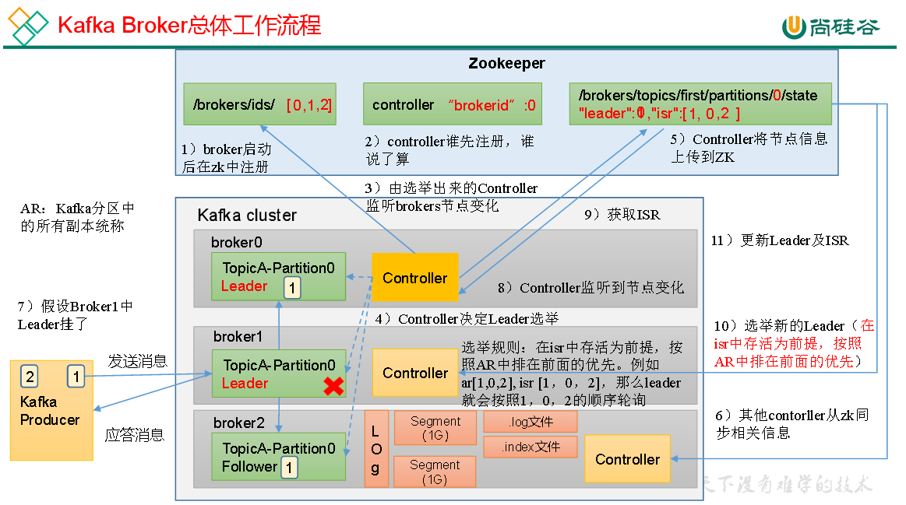

# Kafka调优-Broker

### 一、Broker核心参数配置

| 参数名称                                    | 描述                                                                   |
|-----------------------------------------|----------------------------------------------------------------------|
| replica.lag.time.max.ms                 | ISR中，如果Follower长时间未向Leader发送通信请求或同步数据，则该Follower将被踢出ISR。该时间阈值，默认30s。 |
| auto.leader.rebalance.enable            | 默认是true。 自动Leader Partition 平衡。建议关闭。                                 |
| leader.imbalance.per.broker.percentage  | 默认是10%。每个broker允许的不平衡的leader的比率。如果每个broker超过了这个值，控制器会触发leader的平衡。    |
| leader.imbalance.check.interval.seconds | 默认值300秒。检查leader负载是否平衡的间隔时间。                                         |
| log.segment.bytes                       | Kafka中log日志是分成一块块存储的，此配置是指log日志划分 成块的大小，默认值1G。                       |
| log.index.interval.bytes                | 默认4kb，kafka里面每当写入了4kb大小的日志（.log），然后就往index文件里面记录一个索引。                |
| log.retention.hours                     | Kafka中数据保存的时间，默认7天。                                                  |
| log.retention.minutes                   | Kafka中数据保存的时间，分钟级别，默认关闭。                                             |
| log.retention.ms                        | Kafka中数据保存的时间，毫秒级别，默认关闭。                                             |
| log.retention.check.interval.ms         | 检查数据是否保存超时的间隔，默认是5分钟。                                                |
| log.retention.bytes                     | 默认等于-1，表示无穷大。超过设置的所有日志总大小，删除最早的segment。                              |
| log.cleanup.policy                      | 默认是delete，表示所有数据启用删除策略；如果设置值为compact，表示所有数据启用压缩策略。                   |
| num.io.threads                          | 默认是8。负责写磁盘的线程数。整个参数值要占总核数的50%。                                       |
| num.replica.fetchers                    | 默认是1。副本拉取线程数，这个参数占总核数的50%的1/3                                        |
| num.network.threads                     | 默认是3。数据传输线程数，这个参数占总核数的50%的2/3 。                                      |
| log.flush.interval.messages             | 强制页缓存刷写到磁盘的条数，默认是long的最大值，9223372036854775807。一般不建议修改，交给系统自己管理。      |
| log.flush.interval.ms                   | 每隔多久，刷数据到磁盘，默认是null。一般不建议修改，交给系统自己管理。                                |

### 二、Leader Partition负载平衡

| 参数名称                                    | 描述                                                                          |
|-----------------------------------------|-----------------------------------------------------------------------------|
| auto.leader.rebalance.enable            | 默认是true。自动Leader Partition 平衡。生产环境中，leader重选举的代价比较大，可能会带来性能影响，建议设置为false关闭。 |
| leader.imbalance.per.broker.percentage  | 默认是10%。每个broker允许的不平衡的leader的比率。如果每个broker超过了这个值，控制器会触发leader的平衡。           |
| leader.imbalance.check.interval.seconds | 默认值300秒。检查leader负载是否平衡的间隔时间。                                                |

### 三、自动创建主题

如果broker端配置参数`auto.create.topics.enable`设置为true（默认值是true），
那么当生产者向一个未创建的主题发送消息时，会自动创建一个分区数为num.partitions（默认值为1）、副本因子为default.replication.factor（默认值为1）的主题。
除此之外，当一个消费者开始从未知主题中读取消息时，或者当任意一个客户端向未知主题发送元数据请求时，都会自动创建一个相应主题。
这种创建主题的方式是非预期的，增加了主题管理和维护的难度。生产环境建议将该参数设置为false。

