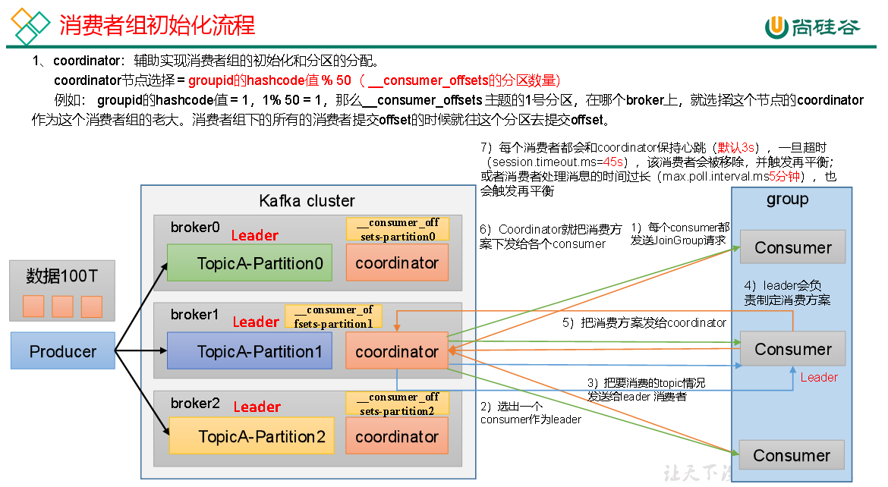
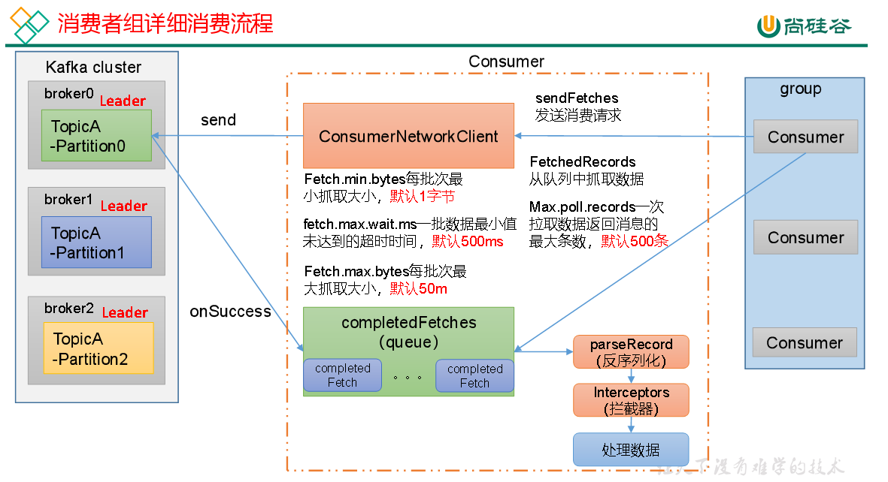

# Kafka调优-消费者

### 一、Kafka消费者核心参数配置




| 参数名称                                | 描述                                                                                                                                                                           |
|-------------------------------------|------------------------------------------------------------------------------------------------------------------------------------------------------------------------------|
| bootstrap.servers                   | 向Kafka集群建立初始连接用到的host/port列表。                                                                                                                                                |
| key.deserializer和value.deserializer | 指定接收消息的key和value的反序列化类型。一定要写全类名。                                                                                                                                             |
| group.id                            | 标记消费者所属的消费者组。                                                                                                                                                                |
| enable.auto.commit                  | 默认值为true，消费者会自动周期性地向服务器提交偏移量。                                                                                                                                                |
| auto.commit.interval.ms             | 如果设置了 enable.auto.commit 的值为true， 则该值定义了消费者偏移量向Kafka提交的频率，默认5s。                                                                                                              |
| auto.offset.reset                   | 当Kafka中没有初始偏移量或当前偏移量在服务器中不存在（如，数据被删除了），该如何处理？ earliest：自动重置偏移量到最早的偏移量。 latest：默认，自动重置偏移量为最新的偏移量。 none：如果消费组原来的（previous）偏移量不存在，则向消费者抛异常。 anything：向消费者抛异常。                   |
| offsets.topic.num.partitions        | __consumer_offsets的分区数，默认是50个分区。不建议修改。                                                                                                                                       |
| heartbeat.interval.ms               | Kafka消费者和coordinator之间的心跳时间，默认3s。该条目的值必须小于session.timeout.ms ，也不应该高于 session.timeout.ms的1/3。不建议修改。                                                                           |
| session.timeout.ms                  | Kafka消费者和coordinator之间连接超时时间，默认45s。超过该值，该消费者被移除，消费者组执行再平衡。                                                                                                                   |
| max.poll.interval.ms                | 消费者处理消息的最大时长，默认是5分钟。超过该值，该消费者被移除，消费者组执行再平衡。                                                                                                                                  |
| fetch.min.bytes                     | 默认1个字节。消费者获取服务器端一批消息最小的字节数。                                                                                                                                                  |
| fetch.max.wait.ms                   | 默认500ms。如果没有从服务器端获取到一批数据的最小字节数。该时间到，仍然会返回数据。                                                                                                                                 |
| fetch.max.bytes                     | 默认Default: 52428800（50 m）。消费者获取服务器端一批消息最大的字节数。如果服务器端一批次的数据大于该值（50m）仍然可以拉取回来这批数据，因此，这不是一个绝对最大值。一批次的大小受message.max.bytes （broker config）or max.message.bytes （topic config）影响。 |
| max.poll.records                    | 一次poll拉取数据返回消息的最大条数，默认是500条。                                                                                                                                                 |

### 二、消费者再平衡

| 参数名称                          | 描述                                                                                                               |
|-------------------------------|------------------------------------------------------------------------------------------------------------------|
| heartbeat.interval.ms         | Kafka消费者和coordinator之间的心跳时间，默认3s。该条目的值必须小于 session.timeout.ms，也不应该高于 session.timeout.ms 的1/3。                    |
| session.timeout.ms            | Kafka消费者和coordinator之间连接超时时间，默认45s。超过该值，该消费者被移除，消费者组执行再平衡。                                                       |
| max.poll.interval.ms          | 消费者处理消息的最大时长，默认是5分钟。超过该值，该消费者被移除，消费者组执行再平衡。                                                                      |
| partition.assignment.strategy | 消费者分区分配策略，默认策略是Range + CooperativeSticky。Kafka可以同时使用多个分区分配策略。可以选择的策略包括：Range、RoundRobin、Sticky、CooperativeSticky |

### 三、指定Offset消费

```
kafkaConsumer.seek(topic, 1000);
```

### 四、指定时间消费

```
HashMap<TopicPartition, Long> timestampToSearch = new HashMap<>();
timestampToSearch.put(topicPartition, System.currentTimeMillis() - 1 * 24 * 3600 * 1000);
kafkaConsumer.offsetsForTimes(timestampToSearch);
```

### 五、消费者事务

见 [Kafka消费者.md](./08-Kafka消费者.md)

### 六、消费者如何提高吞吐量

增加分区数:

```shell
# 修改分区数 3->6（注意：分区数只能增加，不能减少）
docker exec -it kafka-1 /opt/bitnami/kafka/bin/kafka-topics.sh --bootstrap-server kafka-1:9092 --alter --topic my-topic --partitions 6
```

| 参数名称             | 描述                                                                                                                                                                           |
|------------------|------------------------------------------------------------------------------------------------------------------------------------------------------------------------------|
| fetch.max.bytes  | 默认Default: 52428800（50 m）。消费者获取服务器端一批消息最大的字节数。如果服务器端一批次的数据大于该值（50m）仍然可以拉取回来这批数据，因此，这不是一个绝对最大值。一批次的大小受message.max.bytes （broker config）or max.message.bytes （topic config）影响。 |
| max.poll.records | 一次poll拉取数据返回消息的最大条数，默认是500条                                                                                                                                                  |
