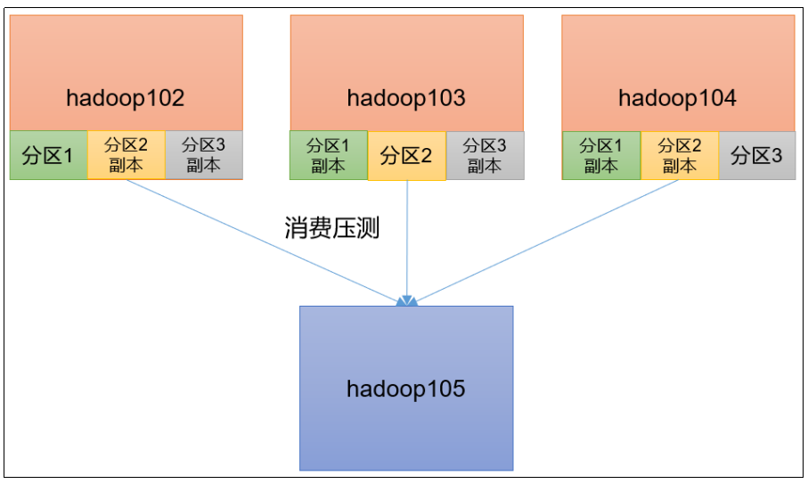

# Kafka调优-总体

### 一、如何提升吞吐量

如何提升吞吐量？

#### 1、提升生产吞吐量

1. `buffer.memory`：发送消息的缓冲区大小，默认值是32m，可以增加到64m。
2. `batch.size`：默认是16k。如果batch设置太小，会导致频繁网络请求，吞吐量下降；如果batch太大，会导致一条消息需要等待很久才能被发送出去，增加网络延时。
3. `linger.ms`: 默认是0，意思就是消息必须立即被发送。
   一般设置一个5-100毫秒。如果linger.ms设置的太小，会导致频繁网络请求，吞吐量下降；如果linger.ms太长，会导致一条消息需要等待很久才能被发送出去，增加网络延时。
4. `compression.type`：默认是none，不压缩，但是也可以使用lz4压缩，效率还是不错的，压缩之后可以减小数据量，提升吞吐量，但是会加大producer端的CPU开销。

#### 2、增加分区

#### 3、消费者提高吞吐量

1. 调整fetch.max.bytes大小，默认是50m。
2. 调整max.poll.records大小，默认是500条。

#### 4、增加下游消费者处理能力

### 二、数据精准一次

#### 1、生产者角度

- acks设置为-1 （acks=-1）。
- 幂等性（enable.idempotence = true） + 事务 。

#### 2、broker服务端角度

- 分区副本大于等于2 （--replication-factor 2）。
- ISR里应答的最小副本数量大于等于2 （min.insync.replicas = 2）。

#### 3、消费者

- 事务 + 手动提交offset （enable.auto.commit = false）。
- 消费者输出的目的地必须支持事务（MySQL、Kafka）。

### 三、合理设置分区数

1. 创建一个只有1个分区的topic。
2. 测试这个topic的producer吞吐量和consumer吞吐量。
3. 假设他们的值分别是Tp和Tc，单位可以是MB/s。
4. 然后假设总的目标吞吐量是Tt，那么分区数 = Tt / min（Tp，Tc）。

例如：producer吞吐量 = 20m/s；consumer吞吐量 = 50m/s，期望吞吐量100m/s；

- 分区数 = 100 / 20 = 5分区
- 分区数一般设置为：3-10个
- 分区数不是越多越好，也不是越少越好，需要搭建完集群，进行压测，再灵活调整分区个数。

### 四、单条日志大于1m

| 参数名称                    | 描述                                                                                                                                                                           |
|-------------------------|------------------------------------------------------------------------------------------------------------------------------------------------------------------------------|
| message.max.bytes       | 默认1m，broker端接收每个批次消息最大值。                                                                                                                                                     |
| max.request.size        | 默认1m，生产者发往broker每个请求消息最大值。针对topic级别设置消息体的大小。                                                                                                                                 |
| replica.fetch.max.bytes | 默认1m，副本同步数据，每个批次消息最大值。                                                                                                                                                       |
| fetch.max.bytes         | 默认Default: 52428800（50 m）。消费者获取服务器端一批消息最大的字节数。如果服务器端一批次的数据大于该值（50m）仍然可以拉取回来这批数据，因此，这不是一个绝对最大值。一批次的大小受message.max.bytes （broker config）or max.message.bytes （topic config）影响。 |

### 五、服务器挂了

在生产环境中，如果某个Kafka节点挂掉。

正常处理办法：

1. 先尝试重新启动一下，如果能启动正常，那直接解决。
2. 如果重启不行，考虑增加内存、增加CPU、网络带宽。
3. 如果将kafka整个节点误删除，如果副本数大于等于2，可以按照服役新节点的方式重新服役一个新节点，并执行负载均衡。

### 六、集群压力测试

#### 1、Kafka压测

用Kafka官方自带的脚本，对Kafka进行压测。

- 生产者压测：kafka-producer-perf-test.sh
- 消费者压测：kafka-consumer-perf-test.sh



#### 2、Kafka Producer压力测试

```shell
# 1、创建一个 test topic，设置为3个分区3个副本
docker exec -it kafka-1 /opt/bitnami/kafka/bin/kafka-topics.sh --create --bootstrap-server kafka-1:9092 --topic test --partitions 3 --replication-factor 3

# 2、测试
#    参数说明：
#         - `record-size` 是一条信息有多大，单位是字节，本次测试设置为1k。
#         - `num-records` 是总共发送多少条信息，本次测试设置为10万条。
#         - `throughput` 是每秒多少条信息，设成-1，表示不限流，尽可能快的生产数据，可测出生产者最大吞吐量。本次实验设置为每秒钟1万条。
#         - `producer-props` 后面可以配置生产者相关参数，batch.size配置为16k。
docker exec -it kafka-1 /opt/bitnami/kafka/bin/kafka-producer-perf-test.sh --topic test --record-size 1024 --num-records 100000 --throughput 10000 --producer-props bootstrap.servers=kafka-1:9092,kafka-2:9093 batch.size=16384 linger.ms=0
# 输出结果：
#   24961 records sent, 4992.2 records/sec (4.88 MB/sec), 1681.4 ms avg latency, 2533.0 ms max latency.
#   34380 records sent, 6871.9 records/sec (6.71 MB/sec), 3251.4 ms avg latency, 4231.0 ms max latency.
#   38355 records sent, 7667.9 records/sec (7.49 MB/sec), 4278.2 ms avg latency, 4820.0 ms max latency.
#   100000 records sent, 6504.911208 records/sec (6.35 MB/sec), 3265.71 ms avg latency, 4820.00 ms max latency, 3559 ms 50th, 4595 ms 95th, 4778 ms 99th, 4804 ms 99.9th.

# 3、调整batch.size大小 -- 默认值是16k -> 32k
docker exec -it kafka-1 /opt/bitnami/kafka/bin/kafka-producer-perf-test.sh --topic test --record-size 1024 --num-records 100000 --throughput 10000 --producer-props bootstrap.servers=kafka-1:9092,kafka-2:9093 batch.size=32768 linger.ms=0
# 输出结果：
#   49760 records sent, 9952.0 records/sec (9.72 MB/sec), 33.2 ms avg latency, 254.0 ms max latency.
#   50141 records sent, 10026.2 records/sec (9.79 MB/sec), 20.2 ms avg latency, 72.0 ms max latency.
#   100000 records sent, 9977.052779 records/sec (9.74 MB/sec), 26.70 ms avg latency, 254.00 ms max latency, 20 ms 50th, 85 ms 95th, 156 ms 99th, 184 ms 99.9th.

# 4、调整batch.size大小 -- 默认值是16k -> 4k
docker exec -it kafka-1 /opt/bitnami/kafka/bin/kafka-producer-perf-test.sh --topic test --record-size 1024 --num-records 100000 --throughput 10000 --producer-props bootstrap.servers=kafka-1:9092,kafka-2:9093 batch.size=4096 linger.ms=0
# 输出结果：
#   12817 records sent, 2563.4 records/sec (2.50 MB/sec), 1981.1 ms avg latency, 3764.0 ms max latency.
#   16692 records sent, 3338.4 records/sec (3.26 MB/sec), 5422.0 ms avg latency, 7119.0 ms max latency.
#   17346 records sent, 3468.5 records/sec (3.39 MB/sec), 7274.8 ms avg latency, 7847.0 ms max latency.
#   17388 records sent, 3477.6 records/sec (3.40 MB/sec), 7193.3 ms avg latency, 7389.0 ms max latency.
#   18081 records sent, 3616.2 records/sec (3.53 MB/sec), 6910.2 ms avg latency, 7145.0 ms max latency.
#   100000 records sent, 3339.009650 records/sec (3.26 MB/sec), 6114.23 ms avg latency, 7847.00 ms max latency, 6825 ms 50th, 7373 ms 95th, 7624 ms 99th, 7831 ms 99.9th.

# 5、调整linger.ms时间 -- 默认是0ms -> 50ms
docker exec -it kafka-1 /opt/bitnami/kafka/bin/kafka-producer-perf-test.sh --topic test --record-size 1024 --num-records 100000 --throughput 10000 --producer-props bootstrap.servers=kafka-1:9092,kafka-2:9093 batch.size=4096 linger.ms=50
# 输出结果：
#   15679 records sent, 3135.8 records/sec (3.06 MB/sec), 1831.0 ms avg latency, 3444.0 ms max latency.
#   17271 records sent, 3454.2 records/sec (3.37 MB/sec), 5034.5 ms avg latency, 6731.0 ms max latency.
#   17289 records sent, 3457.8 records/sec (3.38 MB/sec), 7077.3 ms avg latency, 7332.0 ms max latency.
#   17931 records sent, 3586.2 records/sec (3.50 MB/sec), 7042.3 ms avg latency, 7242.0 ms max latency.
#   18579 records sent, 3715.8 records/sec (3.63 MB/sec), 6787.1 ms avg latency, 7165.0 ms max latency.
#   100000 records sent, 3487.358326 records/sec (3.41 MB/sec), 5789.79 ms avg latency, 7332.00 ms max latency, 6739 ms 50th, 7174 ms 95th, 7261 ms 99th, 7320 ms 99.9th.

# 6、调整压缩方式 -- 默认的压缩方式是none -> snappy
docker exec -it kafka-1 /opt/bitnami/kafka/bin/kafka-producer-perf-test.sh --topic test --record-size 1024 --num-records 100000 --throughput 10000 --producer-props bootstrap.servers=kafka-1:9092,kafka-2:9093 batch.size=4096 linger.ms=50 compression.type=snappy
# 输出结果：
#   14035 records sent, 2807.0 records/sec (2.74 MB/sec), 1990.6 ms avg latency, 3620.0 ms max latency.
#   16500 records sent, 3300.0 records/sec (3.22 MB/sec), 5253.4 ms avg latency, 6986.0 ms max latency.
#   16806 records sent, 3361.2 records/sec (3.28 MB/sec), 7375.8 ms avg latency, 7661.0 ms max latency.
#   16149 records sent, 3229.8 records/sec (3.15 MB/sec), 7389.6 ms avg latency, 7662.0 ms max latency.
#   17862 records sent, 3571.7 records/sec (3.49 MB/sec), 7372.7 ms avg latency, 7650.0 ms max latency.
#   17922 records sent, 3583.0 records/sec (3.50 MB/sec), 6862.8 ms avg latency, 7216.0 ms max latency.
#   100000 records sent, 3305.566574 records/sec (3.23 MB/sec), 6175.93 ms avg latency, 7662.00 ms max latency, 7142 ms 50th, 7554 ms 95th, 7634 ms 99th, 7655 ms 99.9th.

# 7、调整压缩方式 -- 默认的压缩方式是none -> lz4
docker exec -it kafka-1 /opt/bitnami/kafka/bin/kafka-producer-perf-test.sh --topic test --record-size 1024 --num-records 100000 --throughput 10000 --producer-props bootstrap.servers=kafka-1:9092,kafka-2:9093 batch.size=4096 linger.ms=50 compression.type=lz4
# 输出结果：
#   13930 records sent, 2786.0 records/sec (2.72 MB/sec), 2040.3 ms avg latency, 3648.0 ms max latency.
#   18045 records sent, 3609.0 records/sec (3.52 MB/sec), 5214.0 ms avg latency, 6865.0 ms max latency.
#   18099 records sent, 3619.8 records/sec (3.53 MB/sec), 6810.5 ms avg latency, 7129.0 ms max latency.
#   18339 records sent, 3667.8 records/sec (3.58 MB/sec), 6758.8 ms avg latency, 6931.0 ms max latency.
#   18627 records sent, 3725.4 records/sec (3.64 MB/sec), 6656.3 ms avg latency, 6809.0 ms max latency.
#   100000 records sent, 3499.072746 records/sec (3.42 MB/sec), 5797.26 ms avg latency, 7129.00 ms max latency, 6658 ms 50th, 6916 ms 95th, 6991 ms 99th, 7118 ms 99.9th.

# 8、调整压缩方式 -- 默认的压缩方式是none -> gzip
docker exec -it kafka-1 /opt/bitnami/kafka/bin/kafka-producer-perf-test.sh --topic test --record-size 1024 --num-records 100000 --throughput 10000 --producer-props bootstrap.servers=kafka-1:9092,kafka-2:9093 batch.size=4096 linger.ms=50 compression.type=gzip
# 输出结果：
#   21016 records sent, 4202.4 records/sec (4.10 MB/sec), 1672.6 ms avg latency, 2931.0 ms max latency.
#   26660 records sent, 5332.0 records/sec (5.21 MB/sec), 4076.8 ms avg latency, 5291.0 ms max latency.
#   26940 records sent, 5385.8 records/sec (5.26 MB/sec), 6308.9 ms avg latency, 7608.0 ms max latency.
#   100000 records sent, 5099.439062 records/sec (4.98 MB/sec), 5049.94 ms avg latency, 7763.00 ms max latency, 5402 ms 50th, 7626 ms 95th, 7744 ms 99th, 7757 ms 99.9th.

# 9、调整缓存大小 -- 默认生产者端缓存大小32m -> 64m
docker exec -it kafka-1 /opt/bitnami/kafka/bin/kafka-producer-perf-test.sh --topic test --record-size 1024 --num-records 100000 --throughput 10000 --producer-props bootstrap.servers=kafka-1:9092,kafka-2:9093 batch.size=4096 linger.ms=50 compression.type=gzip buffer.memory=67108864
# 输出结果：
#   22496 records sent, 4499.2 records/sec (4.39 MB/sec), 1483.9 ms avg latency, 2806.0 ms max latency.
#   27090 records sent, 5416.9 records/sec (5.29 MB/sec), 3926.3 ms avg latency, 5095.0 ms max latency.
#   28880 records sent, 5774.8 records/sec (5.64 MB/sec), 6132.6 ms avg latency, 7223.0 ms max latency.
#   100000 records sent, 5304.476979 records/sec (5.18 MB/sec), 4877.97 ms avg latency, 8844.00 ms max latency, 5077 ms 50th, 8381 ms 95th, 8694 ms 99th, 8827 ms 99.9th.
```

#### 3、Kafka Consumer压力测试

```shell
# 1、consumer.properties配置文件中配置一次拉取条数为500
cat> ./consumer.properties <<EOF
max.poll.records=500
EOF
# 将文件拷贝到容器中
docker cp ./consumer.properties kafka-1:/consumer.properties

# 2、消费10万条日志进行压测
docker exec -it kafka-1 /opt/bitnami/kafka/bin/kafka-consumer-perf-test.sh --bootstrap-server kafka-1:9092,kafka-2:9093 --topic test --messages 100000 --consumer.config consumer.properties
# 输出结果：
#   start.time, end.time, data.consumed.in.MB, MB.sec, data.consumed.in.nMsg, nMsg.sec, rebalance.time.ms, fetch.time.ms, fetch.MB.sec, fetch.nMsg.sec
#   2023-07-07 02:54:24:631, 2023-07-07 02:54:30:761, 98.1211, 16.0067, 100476, 16390.8646, 3911, 2219, 44.2186, 45279.8558

# 3、一次拉取条数修改为2000 再压测
cat> ./consumer.properties <<EOF
max.poll.records=500
EOF
# 将文件拷贝到容器中
docker cp ./consumer.properties kafka-1:/consumer.properties
docker exec -it kafka-1 /opt/bitnami/kafka/bin/kafka-consumer-perf-test.sh --bootstrap-server kafka-1:9092,kafka-2:9093 --topic test --messages 100000 --consumer.config consumer.properties
# 输出结果：
#   start.time, end.time, data.consumed.in.MB, MB.sec, data.consumed.in.nMsg, nMsg.sec, rebalance.time.ms, fetch.time.ms, fetch.MB.sec, fetch.nMsg.sec
#   2023-07-07 02:56:14:664, 2023-07-07 02:56:20:100, 98.1133, 18.0488, 100468, 18481.9720, 3215, 2221, 44.1753, 45235.4795

# 4、调整fetch.max.bytes大小为100m （拉取一批数据大小100m） 再压测
cat> ./consumer.properties <<EOF
fetch.max.bytes=104857600
EOF
# 将文件拷贝到容器中
docker cp ./consumer.properties kafka-1:/consumer.properties
docker exec -it kafka-1 /opt/bitnami/kafka/bin/kafka-consumer-perf-test.sh --bootstrap-server kafka-1:9092,kafka-2:9093 --topic test --messages 100000 --consumer.config consumer.properties
# 输出结果：
#   start.time, end.time, data.consumed.in.MB, MB.sec, data.consumed.in.nMsg, nMsg.sec, rebalance.time.ms, fetch.time.ms, fetch.MB.sec, fetch.nMsg.sec
#   2023-07-07 02:58:37:264, 2023-07-07 02:58:42:774, 98.1211, 17.8078, 100476, 18235.2087, 3286, 2224, 44.1192, 45178.0576
```
