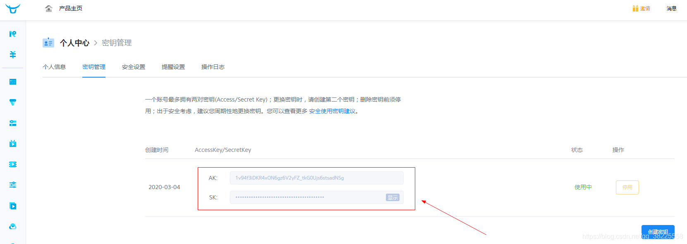
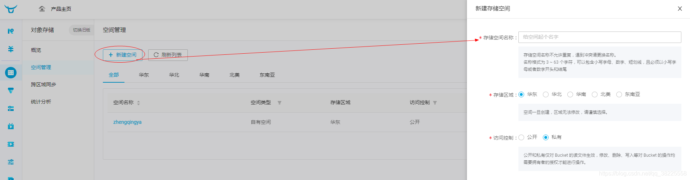
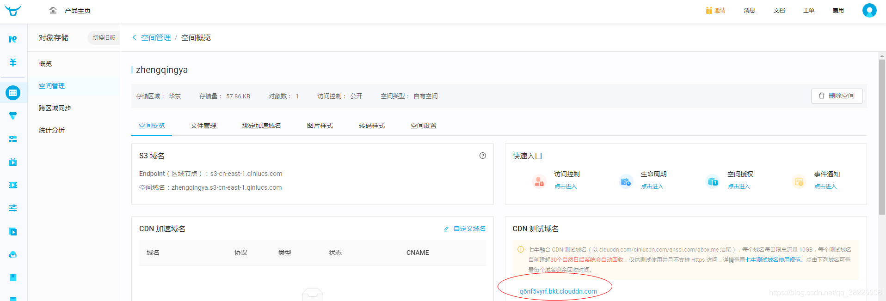

### 一、前言

本文将基于`springboot2.1.8.RELEASE`整合`七牛云`实现`文件上传`

> 本文参考 [https://www.keppel.fun/articles/2019/02/27/1551262881214.html](https://www.keppel.fun/articles/2019/02/27/1551262881214.html)

### 二、准备(`AccessKey`、`SecretKey`、`对象储存空间名称`、`存储区域`、`访问域名`)

#### 1、先到[七牛云官网](https://portal.qiniu.com)获取`AccessKey/SecretKey`

> 温馨小提示：没有账号的可以先注册一个使用~



#### 2、在对象储存中创建一个空间，然后拿到`存储空间名称`、`存储区域`、`访问域名`

> 温馨小提示：这里只是为了体验七牛云的文件上传功能，在访问控制处可暂时选择公开，后面是可以修改权限的，不用担心~


新建成功之后，七牛云给了一个测试域名可供使用一个月


### 三、SpringBoot集成七牛云

#### 1、`pom.xml`中引入依赖

```xml
<!-- https://mvnrepository.com/artifact/com.qiniu/qiniu-java-sdk -->
<dependency>
    <groupId>com.qiniu</groupId>
    <artifactId>qiniu-java-sdk</artifactId>
    <version>7.2.28</version>
</dependency>
<!-- https://mvnrepository.com/artifact/com.google.code.gson/gson -->
<dependency>
    <groupId>com.google.code.gson</groupId>
    <artifactId>gson</artifactId>
    <version>2.8.5</version>
</dependency>
```

#### 2、`application.yml`中配置七牛云

```yml
# ========================== ↓↓↓↓↓↓ 七牛云配置 ↓↓↓↓↓↓ ==========================
qiniu:
  accessKey: xxx
  secretKey: xxx
  # 对象储存
  bucket: zhengqingya # 空间名称
  zone: huadong # 存储区域
  domain: q6nf5vyrf.bkt.clouddn.com # 访问域名
```

#### 3、七牛云配置类

```java
@Configuration
public class QiniuConfig {

    @Value("${qiniu.accessKey}")
    private String accessKey;

    @Value("${qiniu.secretKey}")
    private String secretKey;

    @Value("${qiniu.zone}")
    private String zone;

    /**
     * 配置空间的存储区域
     */
    @Bean
    public com.qiniu.storage.Configuration qiNiuConfig() {
        switch (zone) {
            case "huadong":
                return new com.qiniu.storage.Configuration(Zone.huadong());
            case "huabei":
                return new com.qiniu.storage.Configuration(Zone.huabei());
            case "huanan":
                return new com.qiniu.storage.Configuration(Zone.huanan());
            case "beimei":
                return new com.qiniu.storage.Configuration(Zone.beimei());
            default:
                throw new MyException("存储区域配置错误");
        }
    }

    /**
     * 构建一个七牛上传工具实例
     */
    @Bean
    public UploadManager uploadManager() {
        return new UploadManager(qiNiuConfig());
    }

    /**
     * 认证信息实例
     */
    @Bean
    public Auth auth() {
        return Auth.create(accessKey, secretKey);
    }

    /**
     * 构建七牛空间管理实例
     */
    @Bean
    public BucketManager bucketManager() {
        return new BucketManager(auth(), qiNiuConfig());
    }

    @Bean
    public Gson gson() {
        return new Gson();
    }

}
```

#### 4、编写文件上传与删除方法

服务类：

```java
public interface IQiniuService {

    /**
     * 以文件的形式上传
     *
     * @param file
     * @param fileName:
     * @return: java.lang.String
     */
    String uploadFile(File file, String fileName) throws QiniuException;

    /**
     * 以流的形式上传
     *
     * @param inputStream
     * @param fileName:
     * @return: java.lang.String
     */
    String uploadFile(InputStream inputStream, String fileName) throws QiniuException;

    /**
     * 删除文件
     *
     * @param key:
     * @return: java.lang.String
     */
    String delete(String key) throws QiniuException;

}
```

服务实现类：

```java
@Service
public class QiniuServiceImpl implements IQiniuService, InitializingBean {

    @Autowired
    private UploadManager uploadManager;

    @Autowired
    private BucketManager bucketManager;

    @Autowired
    private Auth auth;

    @Value("${qiniu.bucket}")
    private String bucket;

    @Value("${qiniu.domain}")
    private String domain;

    /**
     * 定义七牛云上传的相关策略
     */
    private StringMap putPolicy;

    @Override
    public String uploadFile(File file, String fileName) throws QiniuException {
        Response response = this.uploadManager.put(file, fileName, getUploadToken());
        int retry = 0;
        while (response.needRetry() && retry < 3) {
            response = this.uploadManager.put(file, fileName, getUploadToken());
            retry++;
        }
        if (response.statusCode == 200) {
            return "http://" + domain + "/" + fileName;
        }
        return "上传失败!";
    }

    @Override
    public String uploadFile(InputStream inputStream, String fileName) throws QiniuException {
        Response response = this.uploadManager.put(inputStream, fileName, getUploadToken(), null, null);
        int retry = 0;
        while (response.needRetry() && retry < 3) {
            response = this.uploadManager.put(inputStream, fileName, getUploadToken(), null, null);
            retry++;
        }
        if (response.statusCode == 200) {
            return "http://" + domain + "/" + fileName;
        }
        return "上传失败!";
    }


    @Override
    public String delete(String key) throws QiniuException {
        Response response = bucketManager.delete(this.bucket, key);
        int retry = 0;
        while (response.needRetry() && retry++ < 3) {
            response = bucketManager.delete(bucket, key);
        }
        return response.statusCode == 200 ? "删除成功!" : "删除失败!";
    }

    @Override
    public void afterPropertiesSet() throws Exception {
        this.putPolicy = new StringMap();
        putPolicy.put("returnBody", "{\"key\":\"$(key)\",\"hash\":\"$(etag)\",\"bucket\":\"$(bucket)\",\"width\":$(imageInfo.width), \"height\":${imageInfo.height}}");
    }

    /**
     * 获取上传凭证
     */
    private String getUploadToken() {
        return this.auth.uploadToken(bucket, null, 3600, putPolicy);
    }

}
```

### 四、测试文件上传与删除

```java
@RunWith(SpringRunner.class)
@SpringBootTest(classes = DemoApplication.class)
public class QiniuTest {

    @Autowired
    private IQiniuService qiniuService;

    @Test
    public void testUpload() throws QiniuException {
        String result = qiniuService.uploadFile(new File("D:\\IT_zhengqing\\image\\helloworld.jpg"), "helloworld");
        System.out.println("访问地址： " + result);
    }

    @Test
    public void testDelete() throws QiniuException {
        String result = qiniuService.delete("helloworld");
        System.out.println(result);
    }

}
```

### 本文案例demo源码

[https://gitee.com/zhengqingya/java-workspace](https://gitee.com/zhengqingya/java-workspace)
