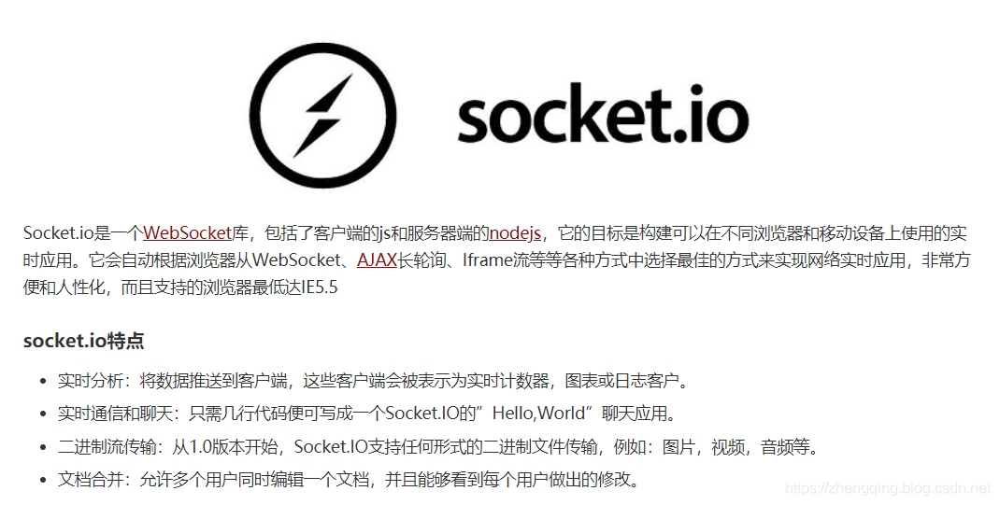
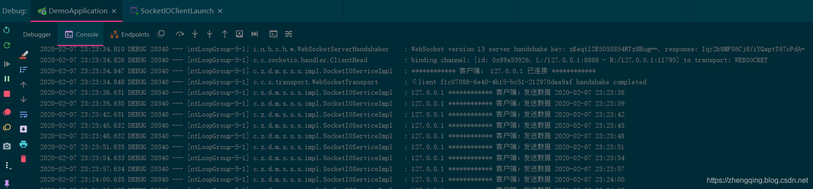
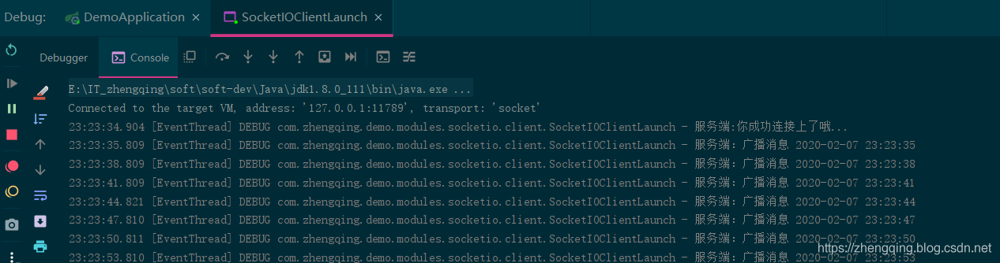
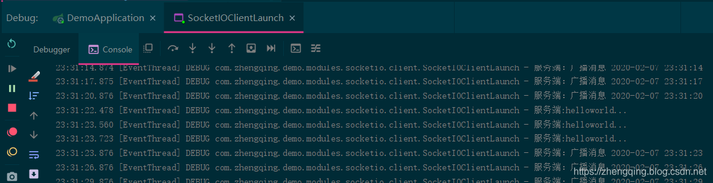

### 一、前言

##### `websocket`和`socket.io`区别？

###### websocket

1. 一种让客户端和服务器之间能进行双向实时通信的技术
2. 使用时，虽然主流浏览器都已经支持，但仍然可能有不兼容的情况
3. 适合用于client和基于node搭建的服务端使用

###### socket.io

1. 将WebSocket、AJAX和其它的通信方式全部封装成了统一的通信接口
2. 使用时，不用担心兼容问题，底层会自动选用最佳的通信方式
3. 适合进行服务端和客户端双向数据通信

w3cschool上对socket.io的描述如下：


##### 本文将实现

1. 基于`springboot2.1.8.RELEASE`集成`netty-socketio` ： 仿`node.js`实现的`socket.io服务端`
2. 集成`socket.io-client`： `socket.io客户端`
3. 实现`服务端`与`客户端`之间的`通信`


### 二、`Java`集成`socket.io`服务端

#### 1、`pom.xml`中引入所需依赖

> 温馨小提示：这里为了方便将后面需要的客户端`socket.io-client`依赖一起直接引入了哦~

```xml
<!-- netty-socketio： 仿`node.js`实现的socket.io服务端 -->
<dependency>
    <groupId>com.corundumstudio.socketio</groupId>
    <artifactId>netty-socketio</artifactId>
    <version>1.7.7</version>
</dependency>
<!-- socket.io客户端 -->
<dependency>
    <groupId>io.socket</groupId>
    <artifactId>socket.io-client</artifactId>
    <version>1.0.0</version>
</dependency>
```

#### 2、`application.yml`中配置`socket.io`服务端

```yml
# netty-socketio 配置
socketio:
  host: 127.0.0.1
  port: 8888
  # 设置最大每帧处理数据的长度，防止他人利用大数据来攻击服务器
  maxFramePayloadLength: 1048576
  # 设置http交互最大内容长度
  maxHttpContentLength: 1048576
  # socket连接数大小（如只监听一个端口boss线程组为1即可）
  bossCount: 1
  workCount: 100
  allowCustomRequests: true
  # 协议升级超时时间（毫秒），默认10秒。HTTP握手升级为ws协议超时时间
  upgradeTimeout: 1000000
  # Ping消息超时时间（毫秒），默认60秒，这个时间间隔内没有接收到心跳消息就会发送超时事件
  pingTimeout: 6000000
  # Ping消息间隔（毫秒），默认25秒。客户端向服务器发送一条心跳消息间隔
  pingInterval: 25000
```

#### 3、`socket.io服务端`配置类

```java
@Configuration
public class SocketIOConfig {

    @Value("${socketio.host}")
    private String host;

    @Value("${socketio.port}")
    private Integer port;

    @Value("${socketio.bossCount}")
    private int bossCount;

    @Value("${socketio.workCount}")
    private int workCount;

    @Value("${socketio.allowCustomRequests}")
    private boolean allowCustomRequests;

    @Value("${socketio.upgradeTimeout}")
    private int upgradeTimeout;

    @Value("${socketio.pingTimeout}")
    private int pingTimeout;

    @Value("${socketio.pingInterval}")
    private int pingInterval;

    @Bean
    public SocketIOServer socketIOServer() {
        SocketConfig socketConfig = new SocketConfig();
        socketConfig.setTcpNoDelay(true);
        socketConfig.setSoLinger(0);
        com.corundumstudio.socketio.Configuration config = new com.corundumstudio.socketio.Configuration();
        config.setSocketConfig(socketConfig);
        config.setHostname(host);
        config.setPort(port);
        config.setBossThreads(bossCount);
        config.setWorkerThreads(workCount);
        config.setAllowCustomRequests(allowCustomRequests);
        config.setUpgradeTimeout(upgradeTimeout);
        config.setPingTimeout(pingTimeout);
        config.setPingInterval(pingInterval);
        return new SocketIOServer(config);
    }

}
```

#### 4、`socket.io服务端`服务层

服务类

```java
public interface ISocketIOService {
    /**
     * 启动服务
     */
    void start();

    /**
     * 停止服务
     */
    void stop();

    /**
     * 推送信息给指定客户端
     *
     * @param userId:     客户端唯一标识
     * @param msgContent: 消息内容
     */
    void pushMessageToUser(String userId, String msgContent);
}
```

服务实现类：

```java
@Slf4j
@Service(value = "socketIOService")
public class SocketIOServiceImpl implements ISocketIOService {

    /**
     * 存放已连接的客户端
     */
    private static Map<String, SocketIOClient> clientMap = new ConcurrentHashMap<>();

    /**
     * 自定义事件`push_data_event`,用于服务端与客户端通信
     */
    private static final String PUSH_DATA_EVENT = "push_data_event";

    @Autowired
    private SocketIOServer socketIOServer;

    /**
     * Spring IoC容器创建之后，在加载SocketIOServiceImpl Bean之后启动
     */
    @PostConstruct
    private void autoStartup() {
        start();
    }

    /**
     * Spring IoC容器在销毁SocketIOServiceImpl Bean之前关闭,避免重启项目服务端口占用问题
     */
    @PreDestroy
    private void autoStop() {
        stop();
    }

    @Override
    public void start() {
        // 监听客户端连接
        socketIOServer.addConnectListener(client -> {
            log.debug("************ 客户端： " + getIpByClient(client) + " 已连接 ************");
            // 自定义事件`connected` -> 与客户端通信  （也可以使用内置事件，如：Socket.EVENT_CONNECT）
            client.sendEvent("connected", "你成功连接上了哦...");
            String userId = getParamsByClient(client);
            if (userId != null) {
                clientMap.put(userId, client);
            }
        });

        // 监听客户端断开连接
        socketIOServer.addDisconnectListener(client -> {
            String clientIp = getIpByClient(client);
            log.debug(clientIp + " *********************** " + "客户端已断开连接");
            String userId = getParamsByClient(client);
            if (userId != null) {
                clientMap.remove(userId);
                client.disconnect();
            }
        });

        // 自定义事件`client_info_event` -> 监听客户端消息
        socketIOServer.addEventListener(PUSH_DATA_EVENT, String.class, (client, data, ackSender) -> {
            // 客户端推送`client_info_event`事件时，onData接受数据，这里是string类型的json数据，还可以为Byte[],object其他类型
            String clientIp = getIpByClient(client);
            log.debug(clientIp + " ************ 客户端：" + data);
        });

        // 启动服务
        socketIOServer.start();

        // broadcast: 默认是向所有的socket连接进行广播，但是不包括发送者自身，如果自己也打算接收消息的话，需要给自己单独发送。
        new Thread(() -> {
            int i = 0;
            while (true) {
                try {
                    // 每3秒发送一次广播消息
                    Thread.sleep(3000);
                    socketIOServer.getBroadcastOperations().sendEvent("myBroadcast", "广播消息 " + DateUtil.now());
                } catch (InterruptedException e) {
                    e.printStackTrace();
                }
            }
        }).start();
    }

    @Override
    public void stop() {
        if (socketIOServer != null) {
            socketIOServer.stop();
            socketIOServer = null;
        }
    }

    @Override
    public void pushMessageToUser(String userId, String msgContent) {
        SocketIOClient client = clientMap.get(userId);
        if (client != null) {
            client.sendEvent(PUSH_DATA_EVENT, msgContent);
        }
    }

    /**
     * 获取客户端url中的userId参数（这里根据个人需求和客户端对应修改即可）
     *
     * @param client: 客户端
     * @return: java.lang.String
     */
    private String getParamsByClient(SocketIOClient client) {
        // 获取客户端url参数（这里的userId是唯一标识）
        Map<String, List<String>> params = client.getHandshakeData().getUrlParams();
        List<String> userIdList = params.get("userId");
        if (!CollectionUtils.isEmpty(userIdList)) {
            return userIdList.get(0);
        }
        return null;
    }

    /**
     * 获取连接的客户端ip地址
     *
     * @param client: 客户端
     * @return: java.lang.String
     */
    private String getIpByClient(SocketIOClient client) {
        String sa = client.getRemoteAddress().toString();
        String clientIp = sa.substring(1, sa.indexOf(":"));
        return clientIp;
    }

}
```

### 三、`Java`开发`socket.io`客户端

1. `socket.emit`：发送数据到服务端事件
2. `socket.on`： 监听服务端事件


```java
@Slf4j
public class SocketIOClientLaunch {

    public static void main(String[] args) {
        // 服务端socket.io连接通信地址
        String url = "http://127.0.0.1:8888";
        try {
            IO.Options options = new IO.Options();
            options.transports = new String[]{"websocket"};
            options.reconnectionAttempts = 2;
            // 失败重连的时间间隔
            options.reconnectionDelay = 1000;
            // 连接超时时间(ms)
            options.timeout = 500;
            // userId: 唯一标识 传给服务端存储
            final Socket socket = IO.socket(url + "?userId=1", options);

            socket.on(Socket.EVENT_CONNECT, args1 -> socket.send("hello..."));

            // 自定义事件`connected` -> 接收服务端成功连接消息
            socket.on("connected", objects -> log.debug("服务端:" + objects[0].toString()));

            // 自定义事件`push_data_event` -> 接收服务端消息
            socket.on("push_data_event", objects -> log.debug("服务端:" + objects[0].toString()));

            // 自定义事件`myBroadcast` -> 接收服务端广播消息
            socket.on("myBroadcast", objects -> log.debug("服务端：" + objects[0].toString()));

            socket.connect();

            while (true) {
                Thread.sleep(3000);
                // 自定义事件`push_data_event` -> 向服务端发送消息
                socket.emit("push_data_event", "发送数据 " + DateUtil.now());
            }
        } catch (Exception e) {
            e.printStackTrace();
        }
    }

}
```

### 四、运行测试

当客户端上线后，会通过自定义事件`push_data_event`每隔3秒向服务端发送消息，日志如下


而服务端中跑了一个广播消息(自定义事件`myBroadcast`) 每隔3秒也会返回给客户端

> `广播事件`:  向所有的socket连接进行广播发送消息数据

```java
socketIOServer.getBroadcastOperations().sendEvent("myBroadcast", "广播消息 " + DateUtil.now());
```

日志如下：


编写服务端主动发送消息给客户端接口

```java
@RestController
@RequestMapping("/api/socket.io")
@Api(tags = "SocketIO测试-接口")
public class SocketIOController {

    @Autowired
    private ISocketIOService socketIOService;

    @PostMapping(value = "/pushMessageToUser", produces = Constants.CONTENT_TYPE)
    @ApiOperation(value = "推送信息给指定客户端", httpMethod = "POST", response = ApiResult.class)
    public ApiResult pushMessageToUser(@RequestParam String userId, @RequestParam String msgContent) {
        socketIOService.pushMessageToUser(userId, msgContent);
        return ApiResult.ok();
    }

}
```

调用接口测试发送helloworld...


### 五、总结

######  socket.io通信，服务端：

1.`socketIOServer.addConnectListener`：监听客户端连接
2. `socketIOServer.addDisconnectListener`：监听客户端断开连接
3. `socketIOServer.addEventListener`：监听客户端传输的消息
4. `client.sendEvent("自定义事件名称", "消息内容")`：服务端向指定的clien客户端发送消息
5. `socketIOServer.getBroadcastOperations().sendEvent("自定义事件名称", "消息内容")`：服务端发送广播消息给所有客户端


######  socket.io通信，客户端：

1. `IO.socket(url)`：与指定的socket.io服务端建立连接
2. `socket.emit`：发送数据到服务端事件
3. `socket.on`： 监听服务端事件

### 本文案例demo源码

[https://gitee.com/zhengqingya/java-workspace](https://gitee.com/zhengqingya/java-workspace)
