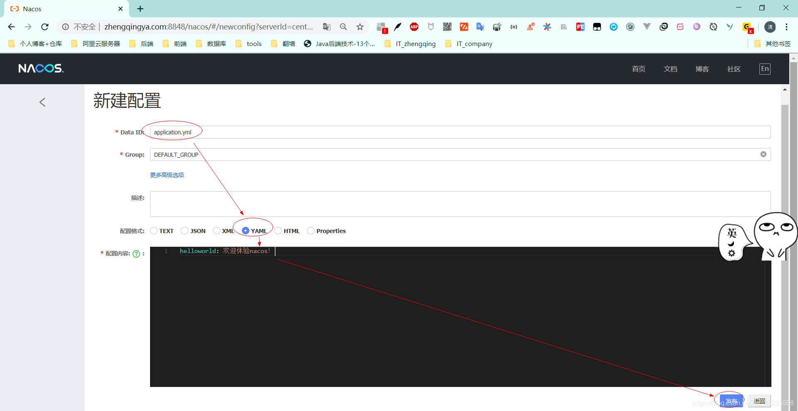
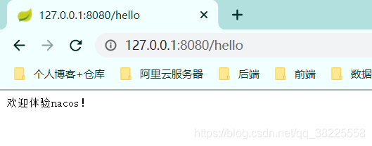
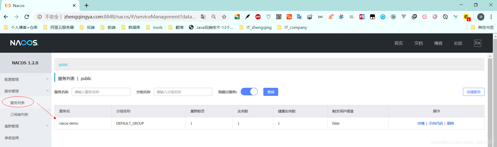
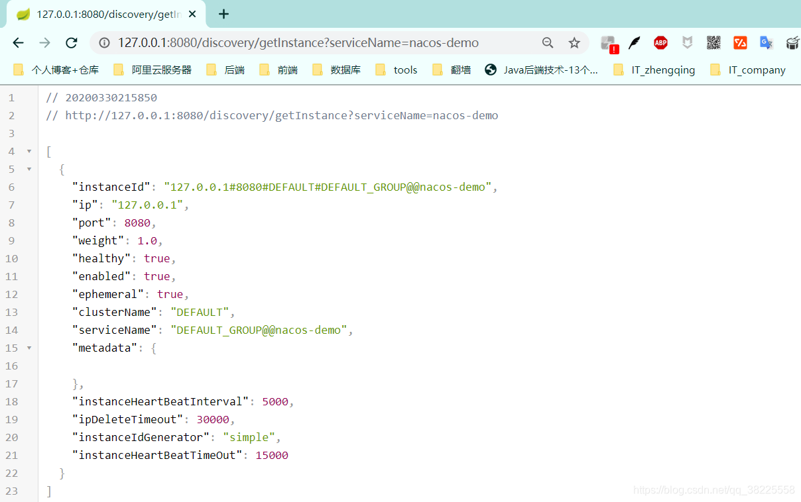

### 一、前言

本文将基于`springboot2.1.8.RELEASE`整合`Nacos`实现`配置管理(动态加载配置)`、`服务注册与发现`

> Nacos文档: [https://nacos.io/zh-cn/docs/what-is-nacos.html](https://nacos.io/zh-cn/docs/what-is-nacos.html)

### 二、`Docker`安装`Nacos`

```shell
# 单机模式运行【-e MODE=standalone】
docker run --name nacos_server -d -p 8848:8848 --restart=always -e MODE=standalone -v $PWD/logs:/home/nacos/logs nacos/nacos-server:latest
```

通过 `IP:8848/nacos` 访问，默认登录账号密码：`nacos/nacos`

ex: [www.zhengqingya.com:8848/nacos](http://www.zhengqingya.com:8848/nacos)


### 三、`SpringBoot`整合`Nacos`

#### 1、`pom.xml`中`引入nacos`相关`依赖`

```xml
<!-- nacos 配置管理 -->
<dependency>
    <groupId>com.alibaba.boot</groupId>
    <artifactId>nacos-config-spring-boot-starter</artifactId>
    <version>0.2.1</version>
</dependency>
<!-- nacos 服务发现 -->
<dependency>
    <groupId>com.alibaba.boot</groupId>
    <artifactId>nacos-discovery-spring-boot-starter</artifactId>
    <version>0.2.1</version>
</dependency>
<!--nacos配置-->
<dependency>
    <groupId>com.alibaba.nacos</groupId>
    <artifactId>nacos-client</artifactId>
    <version>1.1.4</version>
</dependency>
```

#### 2、`application.yml`中配置`nacos`

```yml
server:
  port: 8080

spring:
  application:
    name: nacos-demo # nacos服务名

# ======================== ↓↓↓↓↓↓ nacos相关配置 ↓↓↓↓↓↓ ===============================
nacos:
  # 配置管理
  config:
    server-addr: www.zhengqingya.com:8848 # TODO 这里换成自己的ip加端口
  # 服务注册与发现
  discovery:
    server-addr: ${nacos.config.server-addr}
```

#### 3、配置管理

###### ①启动类上添加`@NacosPropertySource`

```java
// 使用 @NacosPropertySource 加载 `dataId` 为 `application.yml` 的配置源，并开启自动更新
@NacosPropertySource(dataId = "application.yml", autoRefreshed = true)
@SpringBootApplication
public class DemoApplication {
    public static void main(String[] args) {
        SpringApplication.run(DemoApplication.class, args);
    }
}
```

######  ②新增动态加载配置测试Controller

```java
@RestController
public class HelloController {

    @NacosValue(value = "${helloworld:HelloWorld}", autoRefreshed = true)
    private String hello;

    @GetMapping("/hello")
    public String hello() {
        return hello;
    }

}
```

###### ③nacos服务端新增配置




###### ④ 启动项目，修改配置，刷新页面
启动项目访问[http://127.0.0.1:8080/hello](http://127.0.0.1:8080/hello)，修改nacos服务端配置参数，然后刷新页面，测试是否动态加载配置~


#### 4、服务注册

###### ①Nacos Api 直接注册服务方式 

```shell
curl -X PUT 'http://www.zhengqingya.com:8848/nacos/v1/ns/instance?serviceName=example&ip=127.0.0.1&port=8080'`
```

###### ②Java

通过`@PostConstruct`来实现注册服务

```java
@Component
public class RegisterNacos {

    @NacosInjected
    private NamingService namingService;

    @Value("${server.port}")
    private int serverPort;

    @Value("${spring.application.name}")
    private String applicationName;

    /**
     * 注册服务
     *
     * @throws NacosException
     */
    @PostConstruct // 修饰的方法会在服务器加载Servlet的时候运行，并且只会被服务器执行一次！！！
    public void registerInstance() throws NacosException {
        namingService.registerInstance(applicationName, "127.0.0.1", serverPort);
    }

}
```

###### ③查看服务


#### 5、服务发现

```java
@RestController
@RequestMapping("discovery")
public class DiscoveryController {

    @NacosInjected
    private NamingService namingService;

    /**
     * 获取实例
     *
     * @param serviceName: 服务名
     * @return
     * @throws NacosException
     */
    @GetMapping("/getInstance")
    public List<Instance> getInstance(@RequestParam String serviceName) throws NacosException {
        return namingService.getAllInstances(serviceName);
    }

}
```

访问[http://127.0.0.1:8080/discovery/getInstance?serviceName=nacos-demo](http://127.0.0.1:8080/discovery/getInstance?serviceName=nacos-demo)




---


### 本文案例demo源码

[https://gitee.com/zhengqingya/java-workspace](https://gitee.com/zhengqingya/java-workspace)
