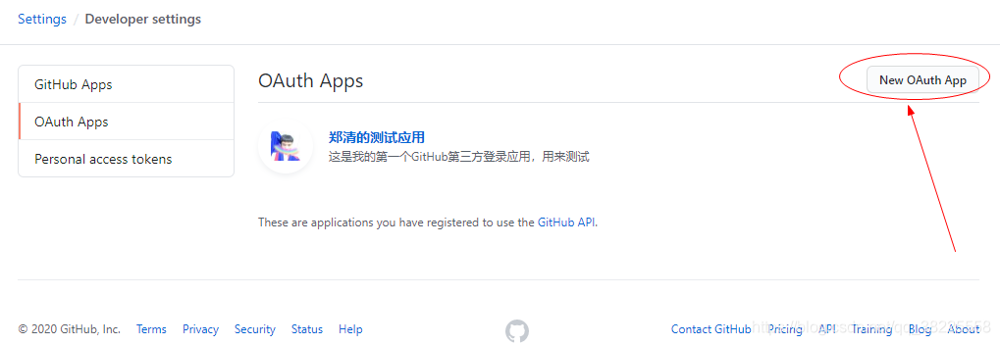
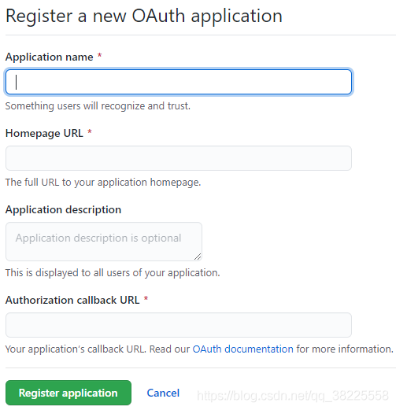
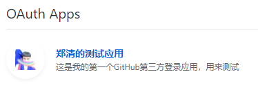
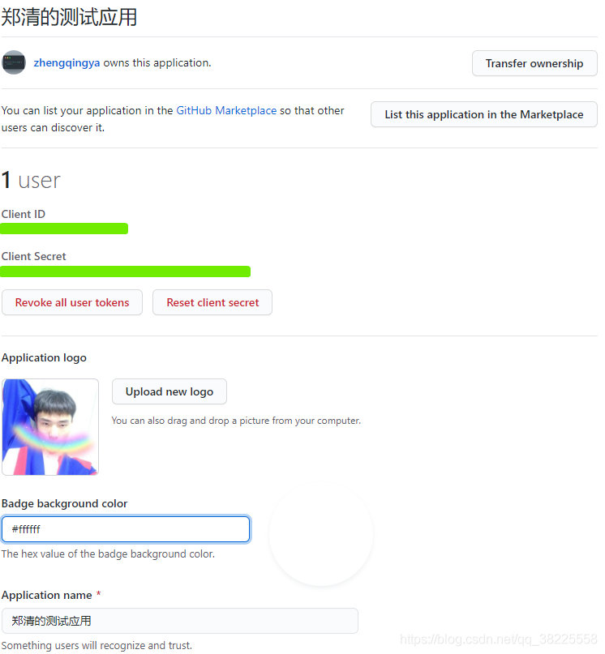
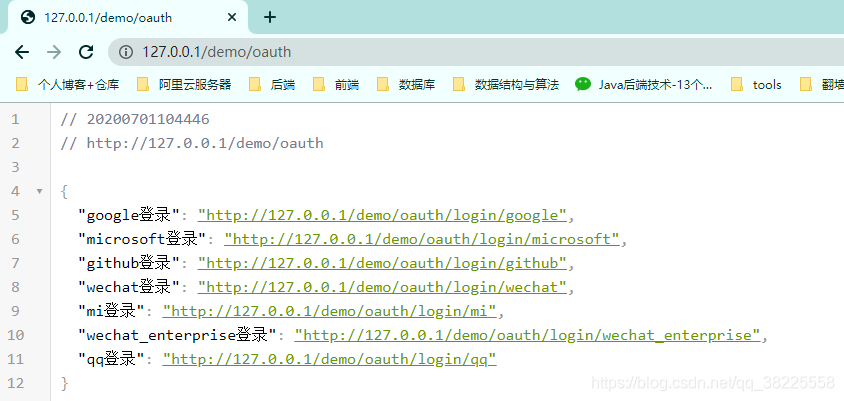
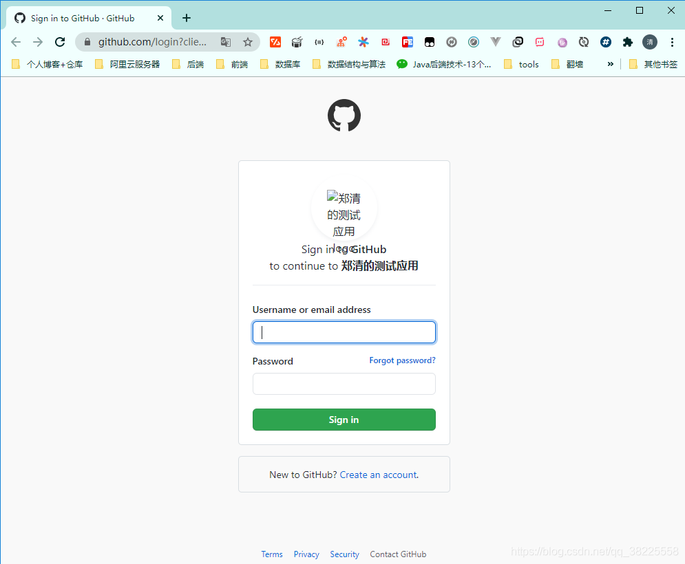
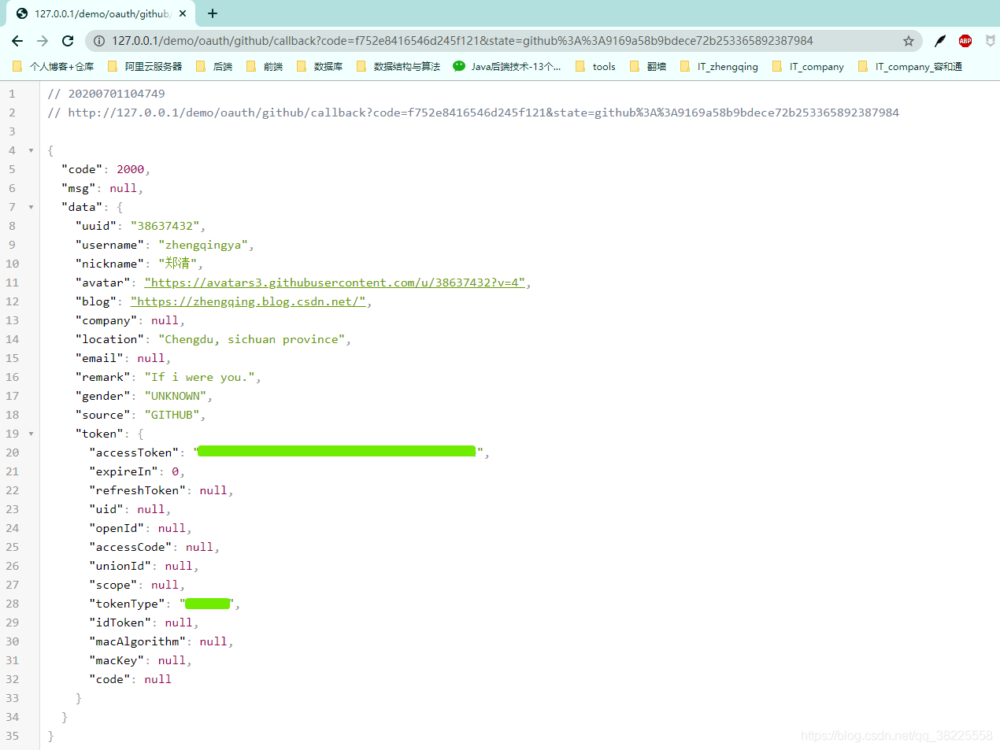

### 一、前言

`JustAuth`：一个第三方授权登录的工具类库 [https://gitee.com/yadong.zhang/JustAuth](https://gitee.com/yadong.zhang/JustAuth)

### 二、 基于SpringBoot整合JustAuth 三步曲

#### 1、`pom.xml`中引入相关依赖

```xml
<!-- reids -->
<dependency>
  <groupId>org.springframework.boot</groupId>
  <artifactId>spring-boot-starter-data-redis</artifactId>
</dependency>
<!-- 对象池，使用redis时必须引入 -->
<dependency>
  <groupId>org.apache.commons</groupId>
  <artifactId>commons-pool2</artifactId>
</dependency>

<!-- oauth工具类 -->
<dependency>
  <groupId>com.xkcoding</groupId>
  <artifactId>justauth-spring-boot-starter</artifactId>
  <version>1.1.0</version>
</dependency>

<!-- lombok插件 -->
<dependency>
  <groupId>org.projectlombok</groupId>
  <artifactId>lombok</artifactId>
  <optional>true</optional>
</dependency>

<!-- https://mvnrepository.com/artifact/cn.hutool/hutool-all -->
<dependency>
  <groupId>cn.hutool</groupId>
  <artifactId>hutool-all</artifactId>
  <version>5.3.8</version>
</dependency>

<!-- https://mvnrepository.com/artifact/com.google.guava/guava -->
<dependency>
  <groupId>com.google.guava</groupId>
  <artifactId>guava</artifactId>
  <version>29.0-jre</version>
</dependency>
```

#### 2、`application.yml`中相关配置

```yml
server:
  port: 80
  servlet:
    context-path: /demo

spring:
  application:
    name: demo

  # ======================== ↓↓↓↓↓↓ redis相关配置 ↓↓↓↓↓↓ ===============================
  redis:
    # Redis服务器地址
    host: 127.0.0.1
    # Redis服务器连接端口
    port: 6379
    # 连接超时时间（毫秒
    timeout: 10000ms
    # Redis服务器连接密码（默认为空）
    password:
    # Redis数据库索引（默认为0）
    database: 1
    lettuce:
      pool:
        # 连接池最大连接数（使用负值表示没有限制） 默认 8
        max-active: 8
        # 连接池最大阻塞等待时间（使用负值表示没有限制） 默认 -1
        max-wait: -1ms
        # 连接池中的最大空闲连接 默认 8
        max-idle: 8
        # 连接池中的最小空闲连接 默认 0
        min-idle: 0
      cache:
        # 一般来说是不用配置的，Spring Cache 会根据依赖的包自行装配
        type: redis

justauth:
  enabled: true
  type:
    github:
      client-id: 101d*************8b3a
      client-secret: 58e*************************5edd
      redirect-uri: http://127.0.0.1/demo/oauth/github/callback
    qq:
      client-id: 10******85
      client-secret: 1f7d************************d629e
      redirect-uri: http://127.0.0.1/demo/oauth/qq/callback
    wechat:
      client-id: wxdcb******4ff4
      client-secret: b4e9dc************************a08ed6d
      redirect-uri: http://127.0.0.1/demo/oauth/wechat/callback
    google:
      client-id: 716******17-6db******vh******ttj320i******userco******t.com
      client-secret: 9IBorn************7-E
      redirect-uri: http://127.0.0.1/demo/oauth/google/callback
    microsoft:
      client-id: 7bdce8******************e194ad76c1b
      client-secret: Iu0zZ4************************tl9PWan_.
      redirect-uri: https://127.0.0.1/demo/oauth/microsoft/callback
    mi:
      client-id: 288************2994
      client-secret: nFeTt89************************==
      redirect-uri: http://127.0.0.1/demo/oauth/mi/callback
    wechat_enterprise:
      client-id: ww58******f3************fbc
      client-secret: 8G6PCr00j************************rgk************AyzaPc78
      redirect-uri: http://127.0.0.1/demo/oauth/wechat_enterprise/callback
      agent-id: 1*******2
  cache:
    type: redis
    prefix: 'SOCIAL::STATE::'
    timeout: 1h
```

###### ex: 获取GitHub的`Client ID`和`Client Secret`

> 其它平台自行百度了解，本文只是单纯记录一个实现方式~

1. 申请地址：[https://github.com/settings/developers](https://github.com/settings/developers)
2. 点击`New OAuth App`


3. 申请之后点击应用我们就可以拿到自己所需的了
  
  

#### 3、编写第三方登录Controller类

```java
@Slf4j
@RestController
@RequestMapping("/oauth")
@RequiredArgsConstructor(onConstructor_ = @Autowired)
public class OauthController {

  private final AuthRequestFactory factory;

  /**
   * 登录类型
   */
  @GetMapping
  public Map<String, String> loginType() {
    List<String> oauthList = factory.oauthList();
    return oauthList.stream().collect(Collectors
        .toMap(oauth -> oauth.toLowerCase() + "登录",
            oauth -> "http://127.0.0.1/demo/oauth/login/" + oauth.toLowerCase()));
  }

  /**
   * 登录
   *
   * @param oauthType 第三方登录类型
   * @param response  response
   * @throws IOException
   */
  @RequestMapping("/login/{oauthType}")
  public void renderAuth(@PathVariable String oauthType, HttpServletResponse response)
      throws IOException {
    AuthRequest authRequest = factory.get(getAuthSource(oauthType));
    response.sendRedirect(authRequest.authorize(oauthType + "::" + AuthStateUtils.createState()));
  }

  /**
   * 登录成功后的回调
   *
   * @param oauthType 第三方登录类型
   * @param callback  携带返回的信息
   * @return 登录成功后的信息
   */
  @RequestMapping("/{oauthType}/callback")
  public AuthResponse login(@PathVariable String oauthType, AuthCallback callback) {
    AuthRequest authRequest = factory.get(getAuthSource(oauthType));
    AuthResponse response = authRequest.login(callback);
    log.info("【response】= {}", JSONUtil.toJsonStr(response));
    return response;
  }

  private AuthSource getAuthSource(String type) {
    if (StrUtil.isNotBlank(type)) {
      return AuthSource.valueOf(type.toUpperCase());
    } else {
      throw new RuntimeException("不支持的类型");
    }
  }

}
```

### 三、测试登录

运行项目后访问： [http://127.0.0.1/demo/oauth](http://127.0.0.1/demo/oauth)

举例点击github登录会跳转进入授权页面

授权成功后就会跳转到我们在`application.yml`中配置的回调地址


---

### 本文案例demo项目地址

[https://gitee.com/zhengqingya/java-workspace](https://gitee.com/zhengqingya/java-workspace)
