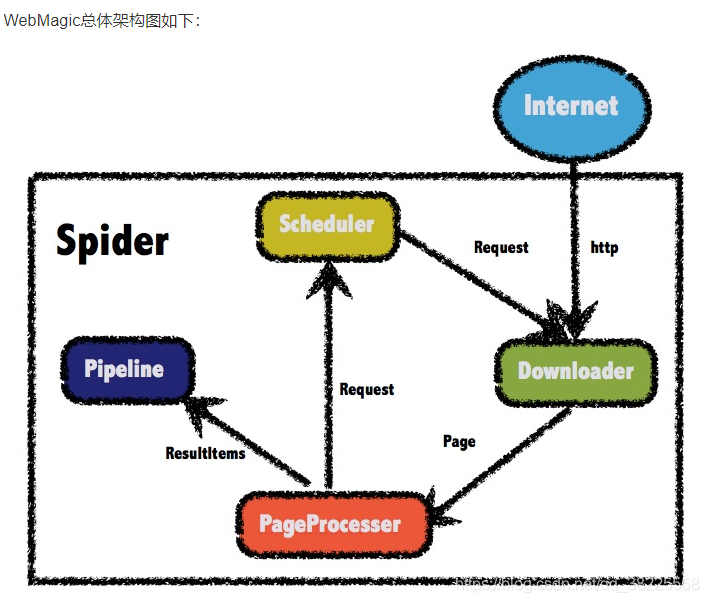
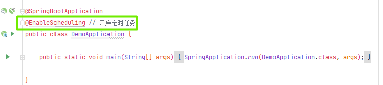
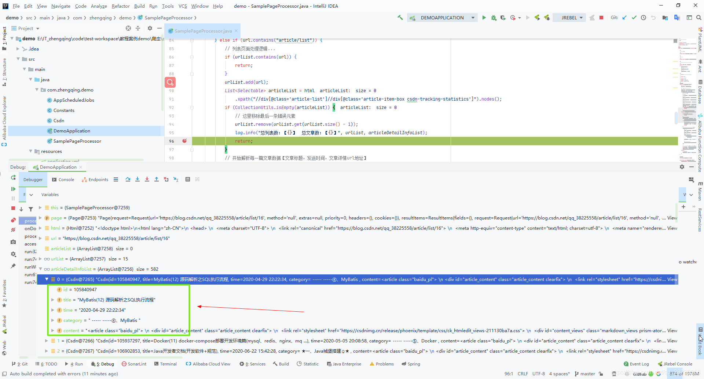

### 一、前言

1. `WebMagic`：一款简单灵活的爬虫框架，基于它我们可以非常容易的编写一个爬虫。
2. 官网文档地址：[http://webmagic.io/docs/zh/](http://webmagic.io/docs/zh/)



> 下面小编将通过爬取+解析自己的csdn文章数据来演示一个简单的爬虫案例demo

### 二、SpringBoot 整合 WebMagic

#### 1、`pom.xml`中引入相关依赖

```xml
<!-- WebMagic：爬虫 -->
<dependency>
  <groupId>us.codecraft</groupId>
  <artifactId>webmagic-core</artifactId>
  <version>0.7.3</version>
</dependency>
<dependency>
  <groupId>us.codecraft</groupId>
  <artifactId>webmagic-extension</artifactId>
  <version>0.7.3</version>
</dependency>
```

#### 2、定义全局常用变量-博主博客地址

```java
public class Constants {

    /**
     * csdn博主博客地址
     */
    public static final String CSDN_URL = "https://blog.csdn.net/qq_38225558/article/list/1";

}
```

#### 3、CSDN博客文章信息实体类

```java
@Data
@AllArgsConstructor
public class Csdn {

    /**
     * id
     */
    private int id;
    /**
     * 文章标题
     */
    private String title;
    /**
     * 文章发布时间
     */
    private String time;
    /**
     * 文章所属分类
     */
    private String category;
    /**
     * 文章内容
     */
    private String content;

}
```


#### 4、编写一个简单的爬虫

实现`PageProcessor`类

```java
@Slf4j
public class SamplePageProcessor implements PageProcessor {

    /**
     * 记录总分页列表url数
     */
    private static List<String> urlList = new ArrayList<>();

    /**
     * 文章详情信息
     */
    private static List<Csdn> articleDetailInfoList = new ArrayList<>();

    /**
     * 【部分一】：抓取网站的相关配置，包括编码、抓取间隔、重试次数等
     */
    private Site site = Site.me().
    // 重试次数
        setRetryTimes(3).
        // 抓取间隔
        setSleepTime(1000).
        // 超时时间
        setTimeOut(100 * 1000);

    /**
     * process是定制爬虫逻辑的核心接口，在这里编写抽取逻辑
     *
     * @param page:
     *            页面数据
     * @return: void
     * @author : zhengqing
     * @date : 2020/7/1 16:43
     */
    @Override
    public void process(Page page) {
        // 【部分二】：定义如何抽取页面信息，并保存下来
        Html html = page.getHtml();

        // 根据url判断该页面属于列表页还是文章详情页面
        String url = page.getUrl().toString();
        log.info("页面url地址：【{}】", url);
        if (url.contains("article/details")) {
            // 详情页面处理逻辑...
            // 文章id
            int articleId = Integer.parseInt(url.substring(url.lastIndexOf('/') + 1));
            // 文章标题
            String articleTitle = html.xpath("//h1[@class='title-article']//text()").toString();
            // 文章发布时间
            String articleTime = html.xpath("//div[@class='bar-content']//span[@class='time']//text()").toString();
            // 文章所属分类
            String articleCategory = html.xpath("//a[@class='tag-link']//text()").toString();
            // 文章内容
            String articleContent = html.xpath("//article[@class='baidu_pl']").toString();
            log.info("文章id：【{}】  文章标题：【{}】 文章所属分类：【{}】", articleId, articleTitle, articleCategory);
            Csdn csdn = new Csdn(articleId, articleTitle, articleTime, articleCategory, articleContent);
            if (articleDetailInfoList.contains(csdn)) {
                return;
            }
            articleDetailInfoList.add(csdn);
        } else if (url.contains("article/list")) {
            // 列表页面处理逻辑...
            if (urlList.contains(url)) {
                return;
            }
            urlList.add(url);
            List<Selectable> articleList = html
                .xpath("//div[@class='article-list']//div[@class='article-item-box csdn-tracking-statistics']").nodes();
            if (CollectionUtils.isEmpty(articleList)) {
                // 这里移除最后一条错误元素
                urlList.remove(urlList.get(urlList.size() - 1));
                log.info("总列表数：【{}】  总文章数：【{}】", urlList, articleDetailInfoList);
                return;
            }
            // 开始解析每一篇文章数据【文章标题，发送时间，文章详情url地址】
            articleList.forEach(article -> {
                // 文章标题
                String articleTitle = article.$("a", "text").toString();
                // 文章详情url地址
                String articleUrl = article.links().toString();
                // 文章发布时间
                String articleTime =
                    article.xpath("//div[@class='info-box d-flex align-content-center']//span[@class='date']/text()")
                        .toString();

                log.info("文章标题：【{}】 文章地址：【{}】 文章发布时间：【{}】", articleTitle, articleUrl, articleTime);

                // 进入文章内部获取文章详情内容
                page.addTargetRequests(article.links().all());
            });

            // 【部分三】：从页面发现后续的url地址来抓取 (这里因csdn暂时拿不了页面尾部的分页数，因此手动模拟了一下数据...)
            int nextPage = Integer.parseInt(url.substring(url.lastIndexOf('/') + 1)) + 1;
            String newUrl = "https://blog.csdn.net/qq_38225558/article/list/" + nextPage;
            page.addTargetRequest(newUrl);
        } else {
            // Other ...
            log.error("该页面url【{}】无法解析...", url);
        }
    }

    @Override
    public Site getSite() {
        return site;
    }

    public static void main(String[] args) {
        Spider.create(new SamplePageProcessor())
            // 从指定的url地址开始抓
            .addUrl(Constants.CSDN_URL)
            // 开启5个线程抓取
            .thread(5)
            // 启动爬虫
            .run();
    }

}
```

#### 5、定时器定时爬取数据

> 这部分看自己需求，不是必要...

① 启动类开启定时任务



② 编写定时任务

```java
@Slf4j
@Component
public class AppScheduledJobs {

    /**
     * 每10秒执行一次
     *
     * @return: void
     * @author : zhengqing
     * @date : 2020/7/1 11:44
     */
    @Scheduled(cron = "*/10 * * * * ?")
    public void cralwer() {
        log.info("<<<<<< Start: 【{}】 >>>>>>", LocalDateTime.now());
        Spider.create(new SamplePageProcessor())
            // .setDownloader(new HttpClientDownloader())
            // 从指定的url地址开始抓
            .addUrl(Constants.CSDN_URL)
            // 开启5个线程抓取
            .thread(5)
            // 启动爬虫
            .run();
    }

}
```

### 三、运行项目测试

可以看到我们解析获取到的文章标题，文章内容，文章发布时间等一系列信息...


---

### 本文案例demo源码

[https://gitee.com/zhengqingya/java-workspace](https://gitee.com/zhengqingya/java-workspace)
