### 一、前言

1. PageOffice官网： [http://www.zhuozhengsoft.com/](http://www.zhuozhengsoft.com/)
2. PageOffice集成说明: [https://www.kancloud.cn/pageoffice_course_group/pageoffice_course/652260](https://www.kancloud.cn/pageoffice_course_group/pageoffice_course/652260)

###### 准备集成环境

下载jar依赖：[http://www.zhuozhengsoft.com/dowm/](http://www.zhuozhengsoft.com/dowm/)
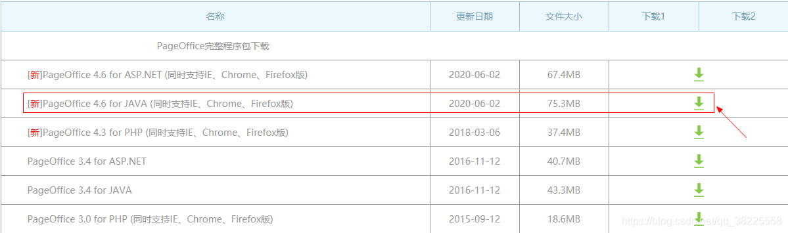
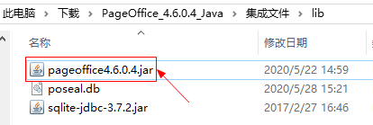

### 二、SpringBoot整合PageOffice实现在线编辑Word和Excel

> 本文基于springboot`2.3.1.RELEASE`版本集成pageoffice

#### 1、`pom.xml`中新增相关依赖

> 将下载的jar依赖放进项目的lib包下 （ 注：这里也可以自定义存放位置，然后修改本地引入位置`${project.basedir}/lib/pageoffice4.6.0.4.jar`即可 ）
> 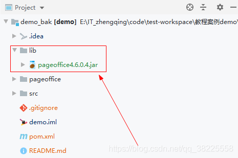


```xml
<!-- =================================== ↓↓↓↓↓↓ PageOffice所需依赖 start ↓↓↓↓↓↓ ==================================== -->
<dependency>
  <groupId>org.springframework.boot</groupId>
  <artifactId>spring-boot-starter-thymeleaf</artifactId>
</dependency>

<!-- 添加Sqlite依赖（可选：如果不需要使用印章功能的话，不需要添加此依赖）-->
<dependency>
  <groupId>org.xerial</groupId>
  <artifactId>sqlite-jdbc</artifactId>
  <version>3.7.2</version>
</dependency>
<!-- 添加PageOffice依赖（必须） -->
<dependency>
  <groupId>com.zhuozheng</groupId>
  <artifactId>pageoffice</artifactId>
  <version>4.6.0.4</version>
  <scope>system</scope>
  <systemPath>${project.basedir}/lib/pageoffice4.6.0.4.jar</systemPath>
</dependency>
<!-- =================================== ↑↑↑↑↑↑ PageOffice所需依赖 end ↑↑↑↑↑↑ ==================================== -->
```

本地jar包引入需再新增如下，可参考文末源码demo


#### 2、`application.yml`中新增pageoffice配置

```yml
spring:
  # THYMELEAF (ThymeleafAutoConfiguration)
  thymeleaf:
    prefix: classpath:/templates/
    suffix: .html
    cache: false

# ======================== ↓↓↓↓↓↓ PageOffice相关配置 ↓↓↓↓↓↓ ===============================
pageoffice:
  # 本地文件所在磁盘位置
  docpath: /pageoffice/doc/
  # 设置PageOffice自带印章管理程序的登录密码
  popassword: 123456
  # 指定一个磁盘目录用来存放PageOffice注册成功之后生成的license.lic文件
  posyspath: /pageoffice/lic/
```

#### 3、`resources/templates`下新增如下3个文件

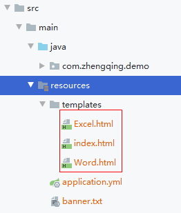

###### ① Excel.html

```html
<!DOCTYPE html>
<html xmlns="http://www.w3.org/1999/xhtml" xmlns:th="http://www.thymeleaf.org"
      xmlns:sec="http://www.thymeleaf.org/thymeleaf-extras-springsecurity3">
<head>
  <title>打开Excel文件</title>
  <script type="text/javascript">
    function Save() {
      document.getElementById("PageOfficeCtrl1").WebSave();
    }
  </script>
  <script type="text/javascript">
    function AddSeal() {
      try {
        document.getElementById("PageOfficeCtrl1").ZoomSeal.AddSeal();
      } catch (e) {
      }
    }
  </script>

</head>
<body>
<div style="width:auto;height:700px;" th:utext="${pageoffice}"></div>
</body>
</html>
```

###### ② Word.html

```html
<!DOCTYPE html>
<html xmlns="http://www.w3.org/1999/xhtml" xmlns:th="http://www.thymeleaf.org"
      xmlns:sec="http://www.thymeleaf.org/thymeleaf-extras-springsecurity3">
<head>
  <title>打开Word文件</title>
  <script type="text/javascript">
    function Save() {
      document.getElementById("PageOfficeCtrl1").WebSave();
    }

  </script>
  <script type="text/javascript">
    function AddSeal() {
      try {
        document.getElementById("PageOfficeCtrl1").ZoomSeal.AddSeal();
      } catch (e) {
      }
    }
  </script>

</head>
<body>
<div style="width:auto;height:700px;" th:utext="${pageoffice}"></div>
</body>
</html>
```

###### ③ index.html

```html
<!DOCTYPE html>
<html>
<head>
  <meta charset="utf-8">
  <title>HelloWorld</title>
  <style>
    #main {
      width: 15%;
      text-align: center;
    }

    ol {
      text-align: left;
      border: solid 1px gray;
    "
    }

    ol li {
      text-align: left;
      border-bottom: dotted 1px gray;
      height: 30px;
      margin-top: 10px;
    }
  </style>
  <!-- 引用后端项目中的pageoffice.js文件 -->
  <script type="text/javascript" src="http://localhost:8080/pageoffice.js"></script>
</head>
<body>
<div id="main">
  <h3>HelloWorld</h3>
  <ol>
    <li>
      <!-- openWindowModeless用法参考：http://www.zhuozhengsoft.com/help/js3/pobrowser/function/openwindowmodeless.htm -->
      <a href="javascript:POBrowser.openWindowModeless('http://localhost:8080/api/word','width=1200px;height=800px;');">打开Word文档</a>
    </li>
    <li>
      <a href="javascript:POBrowser.openWindowModeless('http://localhost:8080/api/excel','width=1200px;height=800px;');">打开Excel文档</a>
    </li>
  </ol>
</div>
</body>
</html>
```

#### 4、全局常用变量

```java
public class Constants {
    /**
     * 项目根目录
     */
    public static final String PROJECT_ROOT_DIRECTORY = System.getProperty("user.dir");
    /**
     * word文件名
     */
    public static final String FILE_NAME_WORD = "test.doc";
    /**
     * excel文件名
     */
    public static final String FILE_NAME_EXCEL = "test.xls";
}
```

#### 5、编写测试Controller

```java
@Slf4j
@RestController
@RequestMapping("/api")
public class DemoController {

    @Value("${pageoffice.posyspath}")
    private String poSysPath;

    @Value("${pageoffice.popassword}")
    private String poPassWord;

    @Value("${pageoffice.docpath}")
    private String docPath;

    /**
     * 被`@PostConstruct`修饰的方法会在服务器加载Servlet的时候运行，并且只会被服务器执行一次。PostConstruct在构造函数之后执行，init()方法之前执行。
     */
    @PostConstruct
    public void init() {
        poSysPath = Constants.PROJECT_ROOT_DIRECTORY + poSysPath;
        docPath = Constants.PROJECT_ROOT_DIRECTORY + docPath;
    }

    @RequestMapping("/hello")
    public String hello() {
        log.info("hello ...");
        return "HelloWorld~";
    }

    @RequestMapping(value = "/word", method = RequestMethod.GET)
    public ModelAndView showWord(HttpServletRequest request, Map<String, Object> map) {
        log.info("编辑word ...");
        PageOfficeCtrl poCtrl = new PageOfficeCtrl(request);
        // 设置服务页面
        poCtrl.setServerPage("/poserver.zz");
        // 添加自定义保存按钮
        poCtrl.addCustomToolButton("保存", "Save", 1);
        // 添加自定义盖章按钮
        poCtrl.addCustomToolButton("盖章", "AddSeal", 2);
        // 拿到请求前缀做拼接保存文件方法
        String requestApiPrefix = request.getServletPath().replace("/word", "");
        // 设置处理文件保存的请求方法
        poCtrl.setSaveFilePage(requestApiPrefix + "/save");
        // 打开word
        poCtrl.webOpen("file://" + docPath + Constants.FILE_NAME_WORD, OpenModeType.docAdmin, "张三");
        map.put("pageoffice", poCtrl.getHtmlCode("PageOfficeCtrl1"));

        ModelAndView mv = new ModelAndView("Word");
        return mv;
    }

    @RequestMapping(value = "/excel", method = RequestMethod.GET)
    public ModelAndView showExcel(HttpServletRequest request, Map<String, Object> map) {
        log.info("编辑excel ...");
        PageOfficeCtrl poCtrl = new PageOfficeCtrl(request);
        // 设置服务页面
        poCtrl.setServerPage("/poserver.zz");
        // 添加自定义保存按钮
        poCtrl.addCustomToolButton("保存", "Save", 1);
        // 添加自定义盖章按钮
        poCtrl.addCustomToolButton("盖章", "AddSeal", 2);
        // 拿到请求前缀做拼接保存文件方法
        String requestApiPrefix = request.getServletPath().replace("/excel", "");
        // 设置处理文件保存的请求方法
        poCtrl.setSaveFilePage(requestApiPrefix + "/save");
        // 打开word
        poCtrl.webOpen("file://" + docPath + Constants.FILE_NAME_EXCEL, OpenModeType.xlsNormalEdit, "张三");
        map.put("pageoffice", poCtrl.getHtmlCode("PageOfficeCtrl1"));

        ModelAndView mv = new ModelAndView("Excel");
        return mv;
    }

    @RequestMapping("/save")
    public void saveFile(HttpServletRequest request, HttpServletResponse response) {
        log.info("保存文件 ...");
        FileSaver fs = new FileSaver(request, response);
        fs.saveToFile(docPath + fs.getFileName());
        fs.close();
    }

    /**
     * 添加PageOffice的服务器端授权程序Servlet（必须）
     *
     * @return
     */
    @Bean
    public ServletRegistrationBean servletRegistrationBean() {
        com.zhuozhengsoft.pageoffice.poserver.Server poserver = new com.zhuozhengsoft.pageoffice.poserver.Server();
        // 设置PageOffice注册成功后,license.lic文件存放的目录
        poserver.setSysPath(poSysPath);
        ServletRegistrationBean srb = new ServletRegistrationBean(poserver);
        srb.addUrlMappings("/poserver.zz");
        srb.addUrlMappings("/posetup.exe");
        srb.addUrlMappings("/pageoffice.js");
        srb.addUrlMappings("/jquery.min.js");
        srb.addUrlMappings("/pobstyle.css");
        srb.addUrlMappings("/sealsetup.exe");
        return srb;
    }

    /**
     * 添加印章管理程序Servlet（可选）
     */
    @Bean
    public ServletRegistrationBean servletRegistrationBean2() {
        com.zhuozhengsoft.pageoffice.poserver.AdminSeal adminSeal =
            new com.zhuozhengsoft.pageoffice.poserver.AdminSeal();
        // 设置印章管理员admin的登录密码
        adminSeal.setAdminPassword(poPassWord);
        // 设置印章数据库文件poseal.db存放的目录
        adminSeal.setSysPath(poSysPath);
        ServletRegistrationBean srb = new ServletRegistrationBean(adminSeal);
        srb.addUrlMappings("/adminseal.zz");
        srb.addUrlMappings("/sealimage.zz");
        srb.addUrlMappings("/loginseal.zz");
        return srb;
    }
}
```

#### 6、准备测试word和excel文件

注意将测试word和excel文件(`文件不能为0字节`)放在`项目根目录/pageoffice/doc`目录下，以及新建`lic`文件夹...

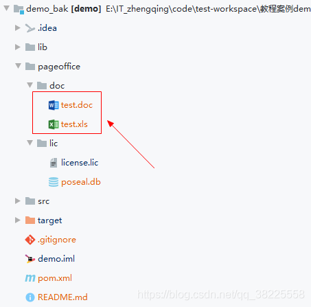

### 三、测试

访问[http://localhost:8080/](http://localhost:8080/)，点击`打开Word文档`
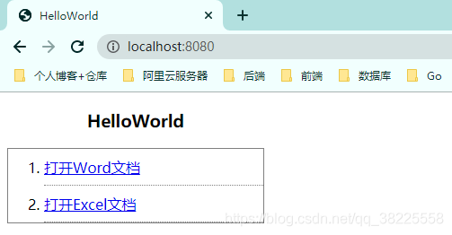
第一次使用的时候会提示`安装PageOffice`，直接下一步安装即可~

> 可参考PageOffice客户端安装步骤：[https://www.kancloud.cn/pageoffice_course_group/pageoffice_course/654031](https://www.kancloud.cn/pageoffice_course_group/pageoffice_course/654031)


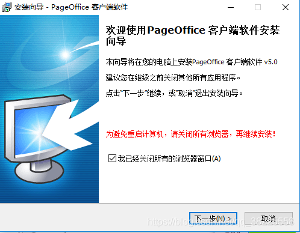
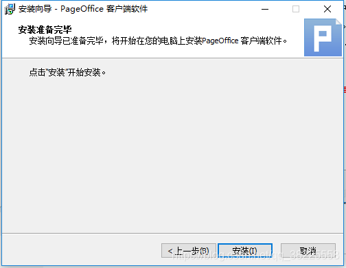
安装完成之后回到页面再次点击`打开Word文档`，这时候需要填写注册信息，序列号在之前下载的包里面可以找到
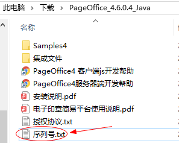
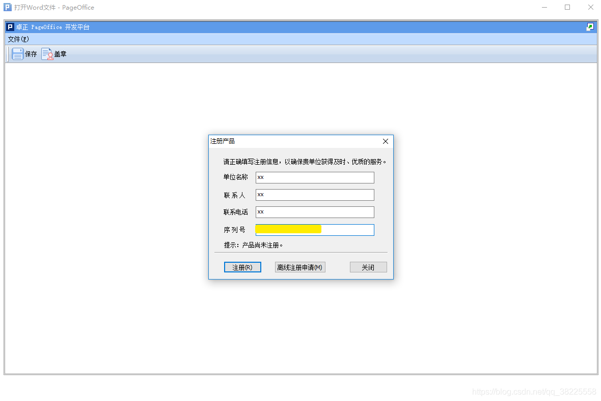
注册成功后，正常打开Word文件，之后就可以进行自己的神操作了...
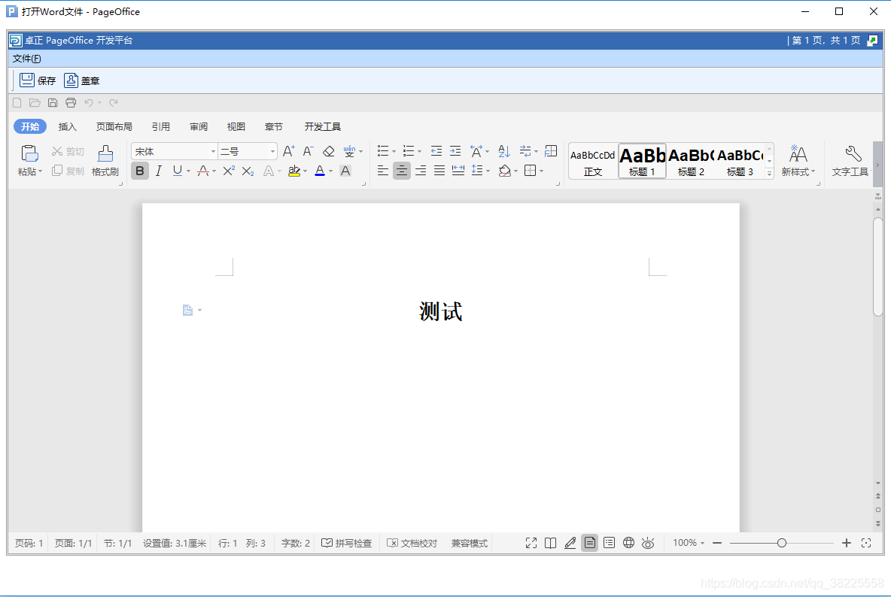
`打开Excel文档`如下：
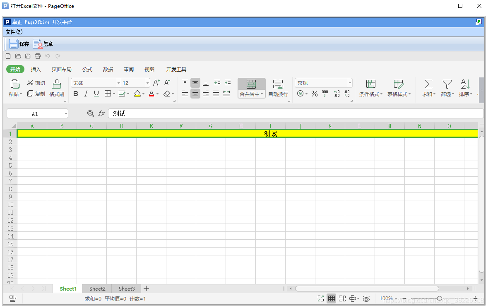

### 四、Vue页面集成PageOffice

#### 1、项目的`index.html`中引入`pageoffice.js`

```html
<!-- 引用后端项目中的pageoffice.js文件 -->
<script type="text/javascript" src="http://localhost:8080/pageoffice.js"></script>
```

#### 2、页面

```html
<template>
  <div class="app-container">
    <el-button><a href="javascript:POBrowser.openWindowModeless('http://localhost:8080/api/word','width=1200px;height=800px;');">打开Word文档</a></el-button>
    <el-button><a href="javascript:POBrowser.openWindowModeless('http://localhost:8080/api/excel','width=1200px;height=800px;');">打开Excel文档</a></el-button>
  </div>
</template>
<style lang="scss" scoped></style>
```

这里页面很简单就2个按钮...

主要通过`openWindowModeless` 使用非模态框的形式打开文件

> 用法可参考：[http://www.zhuozhengsoft.com/help/js3/pobrowser/function/openwindowmodeless.htm](http://www.zhuozhengsoft.com/help/js3/pobrowser/function/openwindowmodeless.htm)

#### 3、后端解决前后端分离情况下跨域问题

```java
@Configuration
public class CorsConfig {

    private CorsConfiguration config() {
        CorsConfiguration corsConfiguration = new CorsConfiguration();
        corsConfiguration.setAllowCredentials(true);
        // ① 设置你要允许的网站域名，如果全允许则设为 *
        corsConfiguration.addAllowedOrigin("*");
        // corsConfiguration.addAllowedOrigin("http://www.zhengqingya.com");
        // ② 如果要限制 HEADER 或 METHOD 请自行更改
        corsConfiguration.addAllowedHeader("*");
        corsConfiguration.addAllowedMethod("*");
        return corsConfiguration;
    }

    @Bean
    public CorsFilter corsFilter() {
        UrlBasedCorsConfigurationSource source = new UrlBasedCorsConfigurationSource();
        source.registerCorsConfiguration("/**", config());
        return new CorsFilter(source);
    }

}
```

### 五、问题 -> 使用Pageoffice打开Word时报`0x80040154`错误

问题出现可能原因：安装WPS时关联了.doc.xls.ppt等文件，导致Office无法自动关联

解决：

1. 想办法去掉默认关联
2. 直接卸载WPS
3. 自行谷歌


---

### 本文案例demo源码

[https://gitee.com/zhengqingya/java-workspace](https://gitee.com/zhengqingya/java-workspace)

