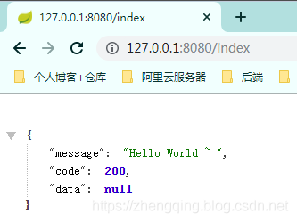
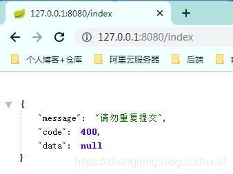

### 一、前言

在某些情况下，由于网速慢，用户操作有误(连续点击两下提交按钮)，页面卡顿等原因，可能会出现表单数据重复提交造成数据库保存多条重复数据。

存在如上问题可以交给前端解决，判断多长时间内不能再次点击保存按钮，当然，如果存在聪明的用户能够绕过前端验证，后端更应该去进行拦截处理，下面小编将基于 `SpringBoot 2.1.8.RELEASE` 环境通过 `AOP切面` + `自定义校验注解` + `Redis缓存` 来解决这一问题。

### 二、Spring Boot 校验表单重复提交操作

#### 1、`pom.xml` 中引入所需依赖

```xml
<!-- ==================  校验表单重复提交所需依赖 ===================== -->
<!-- AOP依赖 -->
<dependency>
    <groupId>org.springframework.boot</groupId>
    <artifactId>spring-boot-starter-aop</artifactId>
</dependency>
<!-- Redis -->
<dependency>
    <groupId>org.springframework.boot</groupId>
    <artifactId>spring-boot-starter-data-redis</artifactId>
</dependency>
```

#### 2、`application.yml` 中引入Redis配置

```yml
spring:
  redis:
    # Redis数据库索引（默认为0）
    database: 0
    # Redis服务器地址
    host: 127.0.0.1
    # Redis服务器连接端口
    port: 6379
    timeout: 6000
    # Redis服务器连接密码（默认为空）
    #      password:
    jedis:
      pool:
        max-active: 1000  # 连接池最大连接数（使用负值表示没有限制）
        max-wait: -1      # 连接池最大阻塞等待时间（使用负值表示没有限制）
        max-idle: 10      # 连接池中的最大空闲连接
        min-idle: 5       # 连接池中的最小空闲连接
```

#### 3、自定义注解 `@NoRepeatSubmit` 

```java
// 作用到方法上
@Target(ElementType.METHOD)
// 运行时有效
@Retention(RetentionPolicy.RUNTIME)
public @interface NoRepeatSubmit {
    /**
     * 默认时间3秒
     */
    int time() default 3 * 1000;
}
```

#### 4、AOP 拦截处理

注：这里redis存储的`key`值可由个人具体业务灵活发挥，这里只是示例
ex：单用户登录情况下可以组合 `token + url请求路径` , 多个用户可以同时登录的话，可以再加上 `ip地址`

```java
@Slf4j
@Aspect
@Component
public class NoRepeatSubmitAop {

    @Autowired
    RedisUtil redisUtil;

    /**
     * <p> 【环绕通知】 用于拦截指定方法，判断用户表单保存操作是否属于重复提交 <p>
     *
     *      定义切入点表达式： execution(public * (…))
     *      表达式解释： execution：主体    public:可省略   *：标识方法的任意返回值  任意包+类+方法(…) 任意参数
     *
     *      com.zhengqing.demo.modules.*.api ： 标识AOP所切服务的包名，即需要进行横切的业务类
     *      .*Controller ： 标识类名，*即所有类
     *      .*(..) ： 标识任何方法名，括号表示参数，两个点表示任何参数类型
     *
     * @param pjp：切入点对象
     * @param noRepeatSubmit:自定义的注解对象
     * @return: java.lang.Object
     */
    @Around("execution(* com.zhengqing.demo.modules.*.api.*Controller.*(..)) && @annotation(noRepeatSubmit)")
    public Object doAround(ProceedingJoinPoint pjp, NoRepeatSubmit noRepeatSubmit) {
        try {
            HttpServletRequest request = ((ServletRequestAttributes) Objects.requireNonNull(RequestContextHolder.getRequestAttributes())).getRequest();

            // 拿到ip地址、请求路径、token
            String ip = IpUtils.getIpAdrress(request);
            String url = request.getRequestURL().toString();
            String token = request.getHeader(Constants.REQUEST_HEADERS_TOKEN);

            // 现在时间
            long now = System.currentTimeMillis();

            // 自定义key值方式
            String key = "REQUEST_FORM_" + ip;
            if (redisUtil.hasKey(key)) {
                // 上次表单提交时间
                long lastTime = Long.parseLong(redisUtil.get(key));
                // 如果现在距离上次提交时间小于设置的默认时间 则 判断为重复提交  否则 正常提交 -> 进入业务处理
                if ((now - lastTime) > noRepeatSubmit.time()) {
                    // 非重复提交操作 - 重新记录操作时间
                    redisUtil.set(key, String.valueOf(now));
                    // 进入处理业务
                    ApiResult result = (ApiResult) pjp.proceed();
                    return result;
                } else {
                    return ApiResult.fail("请勿重复提交!");
                }
            } else {
                // 这里是第一次操作
                redisUtil.set(key, String.valueOf(now));
                ApiResult result = (ApiResult) pjp.proceed();
                return result;
            }
        } catch (Throwable e) {
            log.error("校验表单重复提交时异常: {}", e.getMessage());
            return ApiResult.fail("校验表单重复提交时异常!");
        }

    }

}
```

#### 5、其中用到的Redis工具类

由于太多，这里就不直接贴出来了，可参考文末给出的案例demo源码

### 三、测试

在需要校验的方法上加上自定义的校验注解 `@NoRepeatSubmit` 即可

```java
@RestController
public class IndexController extends BaseController {

    @NoRepeatSubmit
    @GetMapping(value = "/index", produces = "application/json;charset=utf-8")
    public ApiResult index() {
        return ApiResult.ok("Hello World ~ ");
    }

}
```

这里重复访问此 `index` api请求以模拟提交表单测试

第一次访问 [http://127.0.0.1:8080/index](http://127.0.0.1:8080/index)

多次刷新此请求，则提示`请勿重复提交!`


### 四、总结

###### 实现思路

1. 首先利用`AOP切面`在进入方法前`拦截` 进行表单重复提交校验逻辑处理
2. 通过 `Redis` 的 `key-value键值对` 存储 需要的逻辑判断数据 【ex：key存储用户提交表单的api请求路径，value存储提交时间】
3. `逻辑处理` ： 
     第一次提交时存入相应数据到redis中
     当再次提交保存时从redis缓存中取出上次提交的时间与当前操作时间做判断，
     如果当前操作时间距离上次操作时间在我们设置的 ‘判断为重复提交的时间(3秒内)’ 则为重复提交 直接 返回重复提交提示语句或其它处理，
     否则为正常提交，进入业务方法处理...

###### 补充

如果api遵从的是严格的`Restful风格` 即 `@PostMapping` 用于表单提交操作，则可不用自定义注解方式去判断需要校验重复提交的路径，直接在aop切面拦截该请求路径后，通过反射拿到该方法上的注解是否存在 `@PostMapping` 如果存在则是提交表单的api，即进行校验处理，如果不存在即是其它的 `@GetMapping` 、 `@PutMapping` 、`@DeleteMapping` 操作 ...

###### 本文案例demo源码

[https://gitee.com/zhengqingya/java-workspace](https://gitee.com/zhengqingya/java-workspace)

