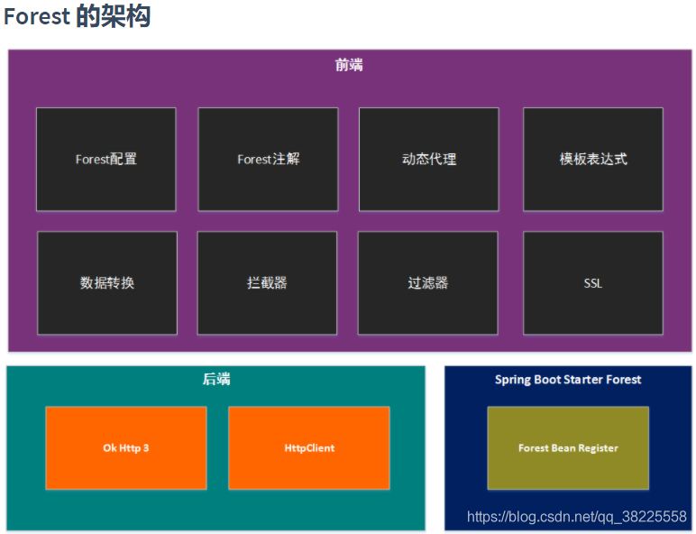
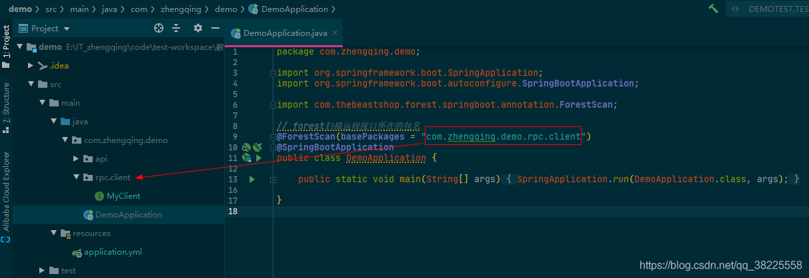
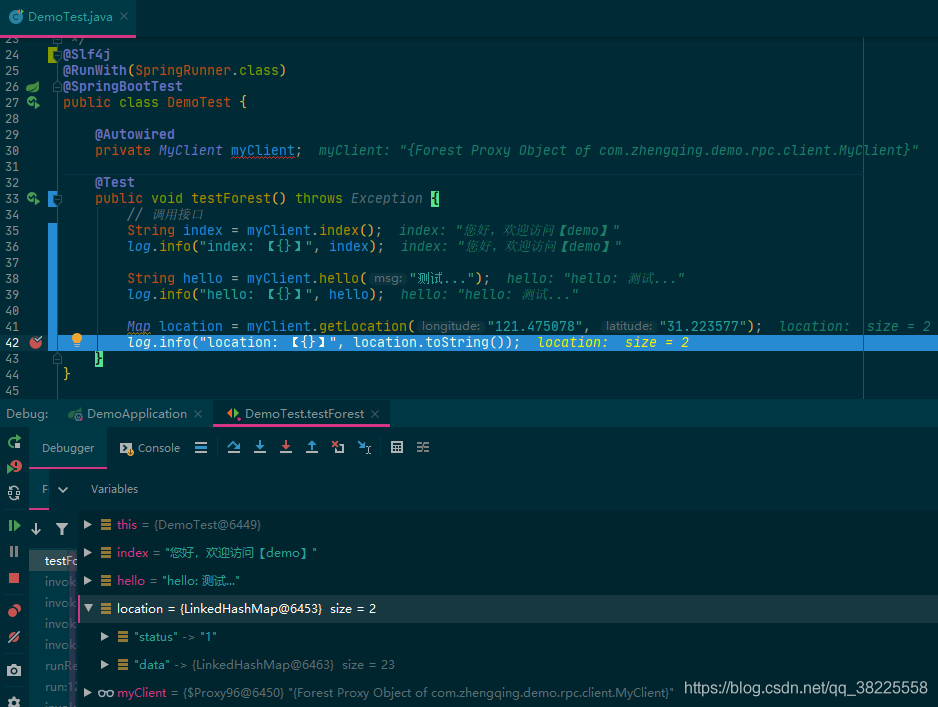

### 一、前言

###### Forest是什么？

`Forest`是一个`高层`的、`极简`的`轻量级` `HTTP调用API框架`，让Java发送`HTTP/HTTPS`请求不再难。它比OkHttp和HttpClient更高层，比Feign更轻量，是封装调用第三方restful api client接口的好帮手。

> 相比于直接使用Httpclient我们不再写一大堆重复的代码了，而是像调用本地方法一样去发送HTTP请求。


1. 项目地址：[https://gitee.com/dt_flys/forest](https://gitee.com/dt_flys/forest)
2. 中文文档：[https://dt_flys.gitee.io/forest/](https://dt_flys.gitee.io/forest/)



### 二、SpringBoot整合Forest实现调用第三方接口

#### 1、`pom.xml`中引入依赖

```xml
<!-- Forest -->
<dependency>
  <groupId>com.dtflys.forest</groupId>
  <artifactId>spring-boot-starter-forest</artifactId>
  <version>1.4.0</version>
</dependency>
```

#### 2、`application.yml`中相关配置

```yml
# ========================== ↓↓↓↓↓↓ forest配置 ↓↓↓↓↓↓ ==========================
forest:
  bean-id: config0 # 在spring上下文中bean的id, 默认值为forestConfiguration
  backend: okhttp3 # 后端HTTP API： okhttp3 【支持`okhttp3`/`httpclient`】
  max-connections: 1000 # 连接池最大连接数，默认值为500
  max-route-connections: 500 # 每个路由的最大连接数，默认值为500
  timeout: 3000 # 请求超时时间，单位为毫秒, 默认值为3000
  connect-timeout: 3000 # 连接超时时间，单位为毫秒, 默认值为2000
  retry-count: 0 # 请求失败后重试次数，默认为0次不重试
  ssl-protocol: SSLv3 # 单向验证的HTTPS的默认SSL协议，默认为SSLv3
  logEnabled: true # 打开或关闭日志，默认为true
```

#### 3、配置扫描接口

在启动类上加上`@ForestScan`注解，并在`basePackages`属性中填写远程接口所在的包名

```java
// forest扫描远程接口所在的包名
@ForestScan(basePackages = "com.zhengqing.demo.rpc.client")
@SpringBootApplication
public class DemoApplication {

    public static void main(String[] args) {
        SpringApplication.run(DemoApplication.class, args);
    }

}
```



#### 4、构建请求接口

> 温馨小提示：下面只是简单请求模拟测试，更多可参考官方文档！

```java
public interface MyClient {

    /**
     * 本地测试接口
     */
    @Get(url = "http://127.0.0.1:80/demo/index")
    String index();

    @Get(url = "http://127.0.0.1:80/demo/hello?msg=${msg}")
    String hello(@DataVariable("msg") String msg);

    /**
     * 高德地图API
     */
    @Get(url = "http://ditu.amap.com/service/regeo?longitude=${longitude}&latitude=${latitude}")
    Map getLocation(@DataVariable("longitude") String longitude, @DataVariable("latitude") String latitude);

}
```

#### 5、测试

```java
@Slf4j
@RunWith(SpringRunner.class)
@SpringBootTest
public class DemoTest {

    @Autowired
    private MyClient myClient;

    @Test
    public void testForest() throws Exception {
        // 调用接口
        String index = myClient.index();
        log.info("index: 【{}】", index);
        
        String hello = myClient.hello("测试...");
        log.info("hello: 【{}】", hello);

        Map location = myClient.getLocation("121.475078", "31.223577");
        log.info("location: 【{}】", location.toString());
    }
}
```



---

### 本文案例demo源码

[https://gitee.com/zhengqingya/java-workspace](https://gitee.com/zhengqingya/java-workspace)

---

> 今日分享语句：
> 能力配不上野心，是所有烦扰的根源。这个世界是公平的，你要想得到，就得学会付出和坚持。每个人都是通过自己的努力，去决定生活的样子。
