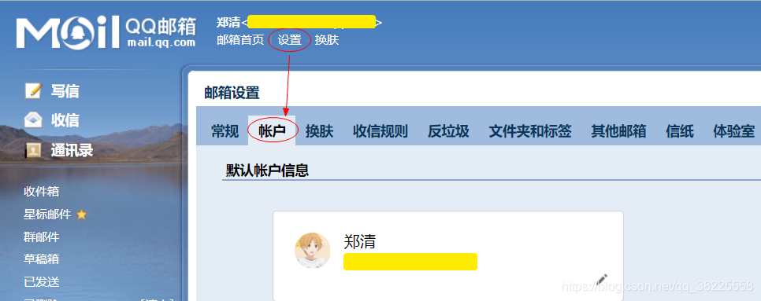
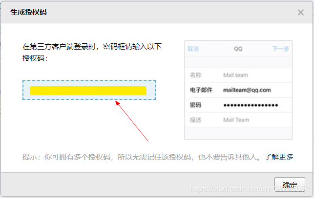
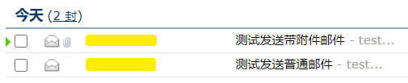

### 一、前言

本文主要基于`springboot2.3.3.RELEASE`和`spring-boot-starter-mail`实现发送纯文本与带附件的邮件

### 二、环境集成准备

> 以QQ邮箱为例

#### 1、开启`POP3/SMTP服务`，并生成`授权码`

`登录QQ邮箱`[https://mail.qq.com](https://mail.qq.com) -> `设置` -> `账号`



滑到下面有个`POP3/IMAP/SMTP/Exchange/CardDAV/CalDAV服务`，然后开启`POP3/SMTP服务`

然后点击`生成授权码`

> 注：这个授权码是之后需要配置的一项，先复制出来保存着~



#### 2、`pom.xml`中引入所需依赖

```xml
<!--发送邮件 -->
<dependency>
  <groupId>org.springframework.boot</groupId>
  <artifactId>spring-boot-starter-mail</artifactId>
</dependency>
```

#### 3、`application.yml`中相关配置

```yml
server:
  port: 80

spring:
  # ========================== ↓↓↓↓↓↓ 发送邮件配置（QQ邮箱） ↓↓↓↓↓↓ ==========================
  mail:
    host: smtp.qq.com
    username: xxx@qq.com # TODO 账号
    password: xxxxxxxxxx # TODO 注：这里填写 在邮箱 设置 -> 账号 里面生成的`授权码` !!!
    default-encoding: UTF-8
    form: xxx@qq.com     # TODO 邮件发送人地址
    properties:
      mail:
        smtp:
          auth: true
          starttls:
            enable: true
            required: true
```

### 三、发送邮件工具类

```java
@Component
public class EmailUtil {

    private static JavaMailSender javaMailSender;

    private static String formEmail;

    @Value("${spring.mail.form}")
    private String formEmail2;

    @Autowired
    private JavaMailSender javaMailSender2;

    @PostConstruct
    public void beforeInit() {
        javaMailSender = javaMailSender2;
        formEmail = formEmail2;
    }

    /**
     * 发送邮件 - 不带附件
     *
     * @param title：邮件标题
     * @param content：
     *            邮件内容
     * @param sendTo:
     *            收件人
     * @return: void
     * @author : zhengqing
     * @date : 2020/8/14 19:28
     */
    @SneakyThrows(Exception.class)
    public static void sendMail(String title, String content, String... sendTo) {
        MimeMessage message = javaMailSender.createMimeMessage();
        MimeMessageHelper helper = new MimeMessageHelper(message, true);
        // 发送人邮件地址
        helper.setFrom(formEmail);
        // 接收人邮件地址
        helper.setTo(sendTo);
        // 主题
        helper.setSubject(title);

        // html内容 (设置true标识发送html邮件)
        helper.setText(content, true);

        javaMailSender.send(message);
    }

    /**
     * 发送邮件 - 带附件
     *
     * @param title：邮件标题
     * @param content：
     *            邮件内容
     * @param attachmentFilename：附件文件名
     * @param file：附件
     * @param sendTo:
     *            收件人
     * @return: void
     * @author : zhengqing
     * @date : 2020/8/14 19:28
     */
    @SneakyThrows(Exception.class)
    public static void sendMail(String title, String content, String attachmentFilename, File file, String... sendTo) {
        MimeMessage message = javaMailSender.createMimeMessage();
        MimeMessageHelper helper = new MimeMessageHelper(message, true);
        // 发送人邮件地址
        helper.setFrom(formEmail);
        // 接收人邮件地址
        helper.setTo(sendTo);
        // 主题
        helper.setSubject(title);

        // ① html内容 (设置true标识发送html邮件)
        helper.setText(content, true);

        // ② 附件
        if (StringUtils.isNotBlank(attachmentFilename)) {
            helper.addAttachment(attachmentFilename, file);
        }

        javaMailSender.send(message);
    }

}
```

### 四、测试

```java
@RestController
@RequestMapping("/api/test")
public class TestController {

    @GetMapping("/sendEmailTest")
    public String sendEmailTest() {
        EmailUtil.sendMail("测试发送普通邮件", "test...", "xxx@qq.com");
        File file = new File("C:\\Users\\Administrator\\Desktop\\临时垃圾站\\test.docx");
        EmailUtil.sendMail("测试发送带附件邮件", "test...", "test.docx", file, "xxx@qq.com");
        return "SUCCESS ~";
    }

}
```

浏览器请求测试api接口发送邮件
[http://127.0.0.1/api/test/sendEmailTest](http://127.0.0.1/api/test/sendEmailTest)



---

### 本文案例demo源码

[https://gitee.com/zhengqingya/java-workspace](https://gitee.com/zhengqingya/java-workspace)


---

> 今日分享语句：
> 生活不能等待别人来安排，要自己去争取和奋斗，而不论其结果是喜是悲，你总不枉在这世界上活了一场人。有了这样的认识，你就会珍重生活，而不会玩世不恭；同时也会给人自身注入一种强大的内在力量。

