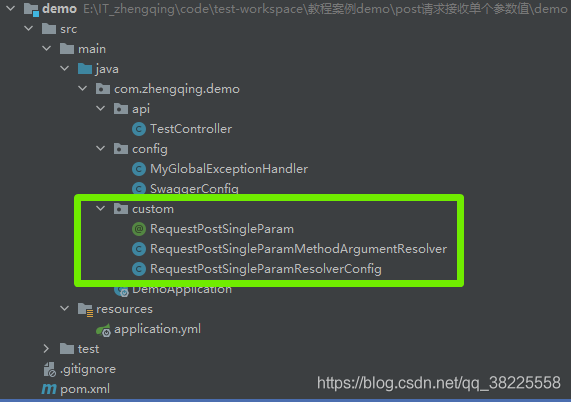
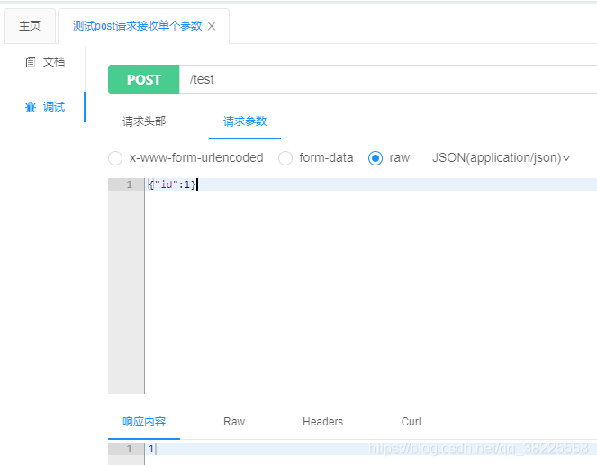
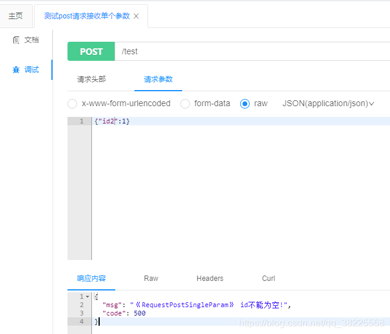

### 一、前言

本文将基于`springboot2.4.0`实现自定义注解`RequestPostSingleParam`接收post请求单个参数值




### 二、自定义注解`RequestPostSingleParam`

> 处理接收单个参数的`post`请求

```java
@Target(ElementType.PARAMETER)
@Retention(RetentionPolicy.RUNTIME)
@Documented
public @interface RequestPostSingleParam {

    /**
     * Alias for {@link #name}.
     */
    @AliasFor("name")
    String value() default "";

    /**
     * The name of the request parameter to bind to.
     *
     * @since 4.2
     */
    @AliasFor("value")
    String name() default "";

    /**
     * Whether the parameter is required.
     * <p>
     * Defaults to {@code true}, leading to an exception being thrown if the parameter is missing in the request. Switch
     * this to {@code false} if you prefer a {@code null} value if the parameter is not present in the request.
     * <p>
     * Alternatively, provide a {@link #defaultValue}, which implicitly sets this flag to {@code false}.
     */
    boolean required() default true;

    /**
     * The default value to use as a fallback when the request parameter is not provided or has an empty value.
     * <p>
     * Supplying a default value implicitly sets {@link #required} to {@code false}.
     */
    String defaultValue() default ValueConstants.DEFAULT_NONE;

}
```

### 三、参数解析器

```java
@Slf4j
public class RequestPostSingleParamMethodArgumentResolver implements HandlerMethodArgumentResolver {

    private static final String POST = "post";
    private static final String APPLICATION_JSON = "application/json";

    /**
     * 判断是否需要处理该参数
     *
     * @param parameter
     *            the method parameter to check
     * @return {@code true} if this resolver supports the supplied parameter; {@code false} otherwise
     */
    @Override
    public boolean supportsParameter(MethodParameter parameter) {
        // 只处理带有@RequestPostSingleParam注解的参数
        return parameter.hasParameterAnnotation(RequestPostSingleParam.class);
    }

    @Override
    public Object resolveArgument(MethodParameter parameter, ModelAndViewContainer mavContainer,
        NativeWebRequest webRequest, WebDataBinderFactory binderFactory) throws Exception {
        HttpServletRequest servletRequest = webRequest.getNativeRequest(HttpServletRequest.class);
        String contentType = Objects.requireNonNull(servletRequest).getContentType();

        if (contentType == null || !contentType.contains(APPLICATION_JSON)) {
            log.error("《RequestPostSingleParam》 contentType需为【{}】", APPLICATION_JSON);
            throw new RuntimeException("《RequestPostSingleParam》 contentType需为application/json");
        }

        if (!POST.equalsIgnoreCase(servletRequest.getMethod())) {
            log.error("《RequestPostSingleParam》 请求类型必须为post");
            throw new RuntimeException("《RequestPostSingleParam》 请求类型必须为post");
        }
        return this.bindRequestParams(parameter, servletRequest);
    }

    private Object bindRequestParams(MethodParameter parameter, HttpServletRequest servletRequest) {
        RequestPostSingleParam requestPostSingleParam = parameter.getParameterAnnotation(RequestPostSingleParam.class);
        Class<?> parameterType = parameter.getParameterType();
        String requestBody = this.getRequestBody(servletRequest);
        Map paramObj = JSONObject.parseObject(requestBody, Map.class);
        if (paramObj == null) {
            paramObj = new JSONObject();
        }
        // if (paramObj.size() > 1) {
        // throw new RuntimeException("《RequestPostSingleParam》 post请求只支持接收单个参数!");
        // }

        String parameterName = StringUtils.isBlank(requestPostSingleParam.value()) ? parameter.getParameterName()
            : requestPostSingleParam.value();
        Object value = paramObj.get(parameterName);

        if (requestPostSingleParam.required()) {
            if (value == null) {
                log.error("《RequestPostSingleParam》 require=true,参数【{}】不能为空!", parameterName);
                throw new RuntimeException("《RequestPostSingleParam》 " + parameterName + "不能为空!");
            }
        }

        return ConvertUtils.convert(value, parameterType);
    }

    /**
     * 获取请求body
     *
     * @param servletRequest:
     *            request
     * @return: 请求body
     */
    private String getRequestBody(HttpServletRequest servletRequest) {
        StringBuilder stringBuilder = new StringBuilder();
        try {
            BufferedReader reader = servletRequest.getReader();
            char[] buf = new char[1024];
            int length;
            while ((length = reader.read(buf)) != -1) {
                stringBuilder.append(buf, 0, length);
            }
        } catch (IOException e) {
            log.error("《RequestPostSingleParam》 读取流异常", e);
            throw new RuntimeException("《RequestPostSingleParam》 读取流异常");
        }
        return stringBuilder.toString();
    }

}
```

### 四、注册参数解析器

```java
@Configuration
public class RequestPostSingleParamResolverConfig implements WebMvcConfigurer {

    @Override
    public void addArgumentResolvers(List<HandlerMethodArgumentResolver> resolvers) {
        resolvers.add(new RequestPostSingleParamMethodArgumentResolver());
        WebMvcConfigurer.super.addArgumentResolvers(resolvers);
    }

}
```

### 五、测试

```java
@Slf4j
@RestController
@RequestMapping("/test")
@Api(tags = "测试api")
public class TestController {

    @PostMapping("")
    @ApiOperation("测试post请求接收单个参数")
    public Integer testPostParam(@ApiParam("id值") @RequestPostSingleParam Integer id) {
        log.info("id: 【{}】", id);
        return id;
    }

}
```


[http://127.0.0.1/doc.html](http://127.0.0.1/doc.html)





### 六、本文案例demo

[https://gitee.com/zhengqingya/java-workspace](https://gitee.com/zhengqingya/java-workspace)


---

> 今日分享语句：
> 每天安静的坐十五分钟，倾听你的气息，感觉它，感觉你自己，并且试着什么都不想。

