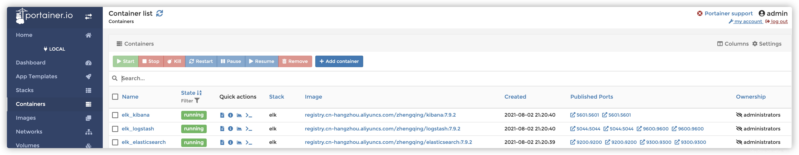
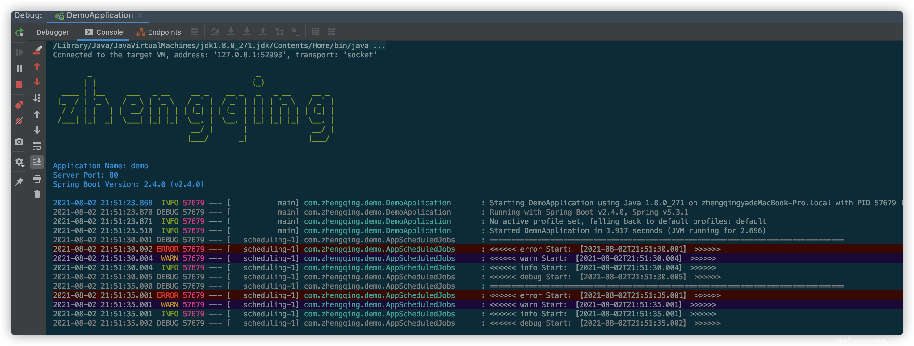
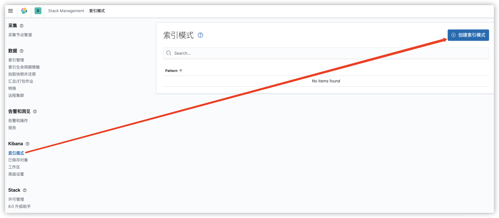
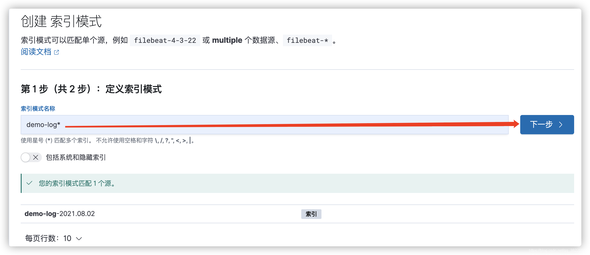
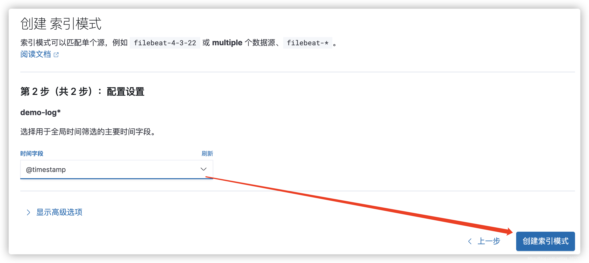
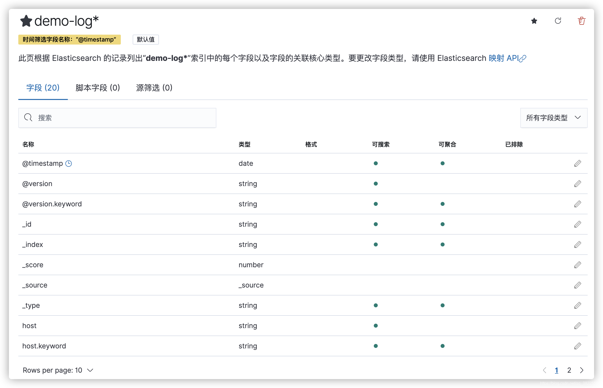
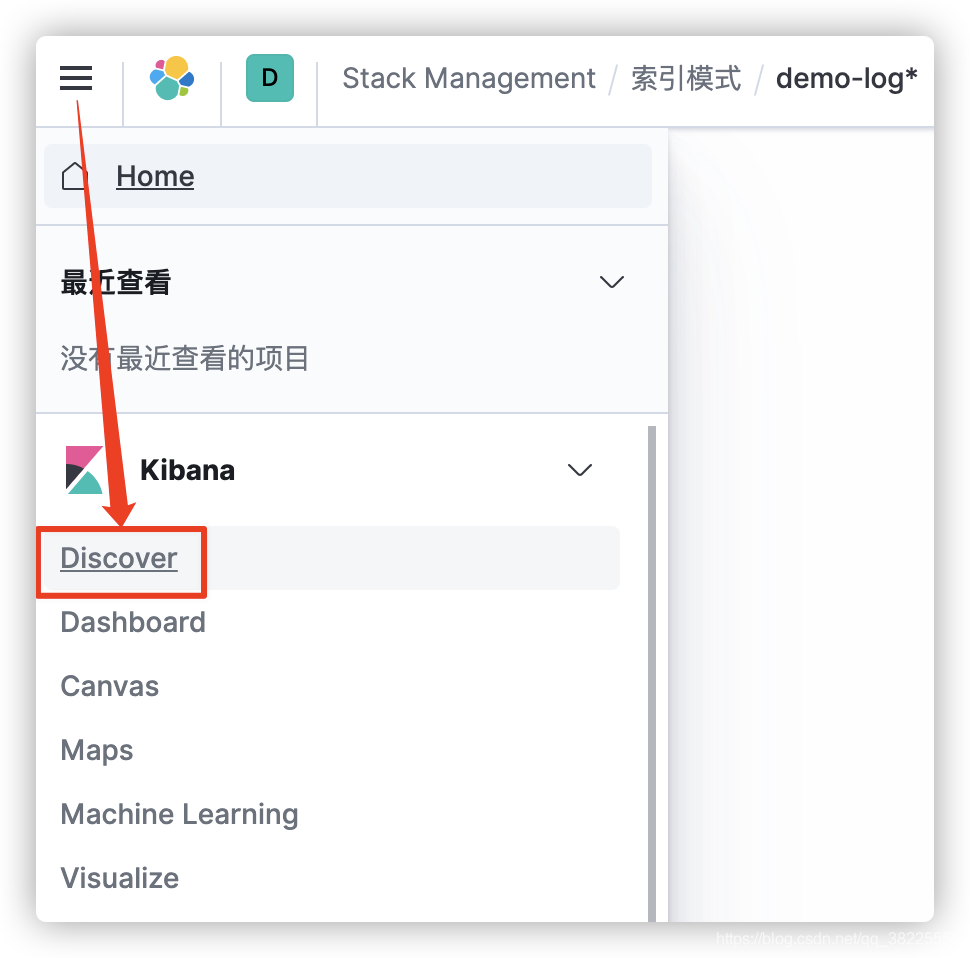
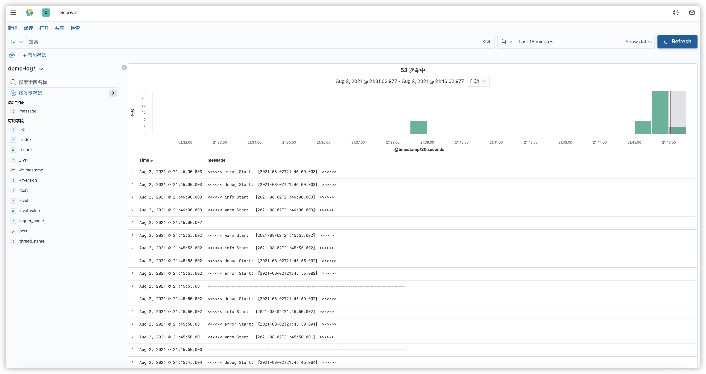

@[TOC](文章目录)

### 一、前言

本文将通过docker-compose搭建ELK，并基于springboot项目推送日志。

1. kibana:7.9.2
2. logstash:7.9.2
3. elasticsearch:7.9.2
4. springboot:2.4.0

### 二、docker-compose搭建ELK

```shell
# 环境准备
git clone https://gitee.com/zhengqingya/docker-compose.git
cd docker-compose/Liunx
# 当前目录下所有文件赋予权限(读、写、执行)
chmod -R 777 ./elk
# 运行
docker-compose -f docker-compose-elk.yml -p elk up -d
```

运行成功后，可通过Portainer查看容器


### 三、SpringBoot项目配置logstash推送日志

#### 1、`pom.xml`中引入依赖

```xml
<!-- logstash-logback-encoder -->
<!-- https://mvnrepository.com/artifact/net.logstash.logback/logstash-logback-encoder -->
 <dependency>
     <groupId>net.logstash.logback</groupId>
     <artifactId>logstash-logback-encoder</artifactId>
     <version>6.6</version>
 </dependency>
```

#### 2、`logback.xml`配置

> 温馨小提示：记得修改为自己的ip地址 `^_^`

```xml
<!-- 日志写入logstash -->
<appender name="LOGSTASH" class="net.logstash.logback.appender.LogstashTcpSocketAppender">
    <destination>www.zhengqingya.com:5044</destination>
    <encoder charset="UTF-8" class="net.logstash.logback.encoder.LogstashEncoder"/>
</appender>

<!-- 日志输出级别 -->
<root level="DEBUG">
    <appender-ref ref="LOGSTASH"/>
</root>
```

#### 3、定时小任务推送日志

```java
@Slf4j
@Component
@EnableScheduling
public class AppScheduledJobs {

    /**
     * 每5秒执行一次
     *
     * @return void
     * @author zhengqingya
     * @date 2021/8/2 8:10 下午
     */
    @Scheduled(cron = "*/5 * * * * ?")
    public void test() {
        log.debug("==================================================================================");
        log.error("<<<<<< error Start: 【{}】 >>>>>>", LocalDateTime.now());
        log.warn("<<<<<< warn Start: 【{}】 >>>>>>", LocalDateTime.now());
        log.info("<<<<<< info Start: 【{}】 >>>>>>", LocalDateTime.now());
        log.debug("<<<<<< debug Start: 【{}】 >>>>>>", LocalDateTime.now());
    }

}
```

配置好之后，运行程序


### 四、Kibana配置日志查看

#### 1、创建索引模式

> [http://127.0.0.1:5601/app/management/kibana/indexPatterns](http://127.0.0.1:5601/app/management/kibana/indexPatterns)





#### 2、查看日志

> [http://127.0.0.1:5601/app/discover](http://127.0.0.1:5601/app/discover)




### 五、本文案例demo源码

[https://gitee.com/zhengqingya/java-workspace](https://gitee.com/zhengqingya/java-workspace)

--- 

> 今日分享语句：
> 经历过风雨，才懂得阳光的温暖。
