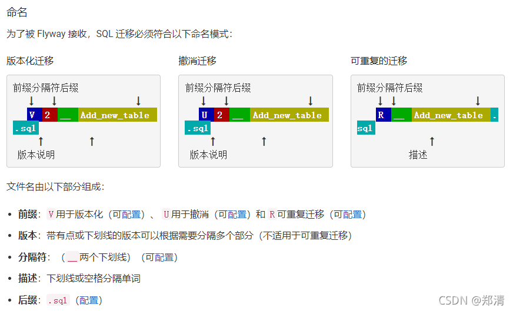
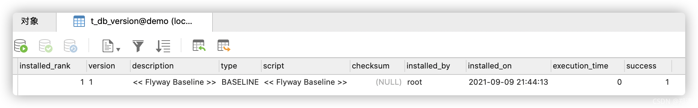
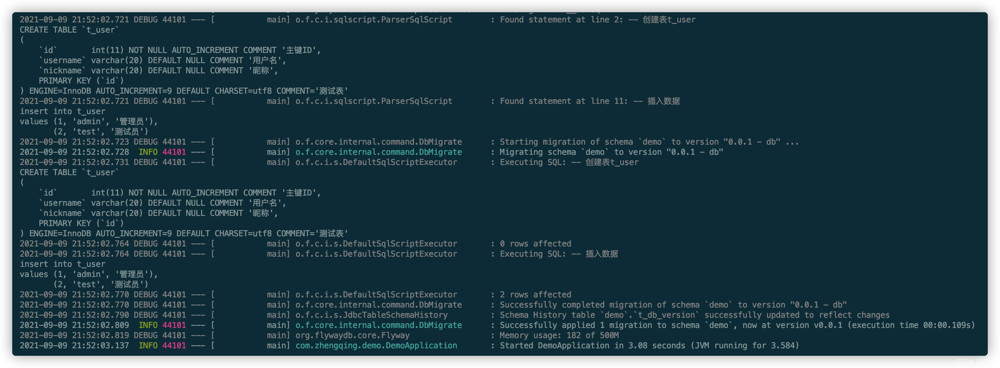
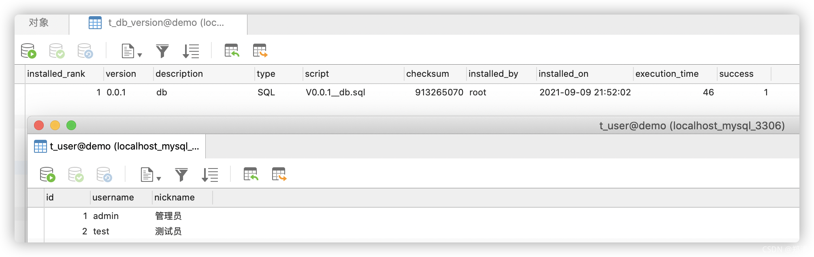
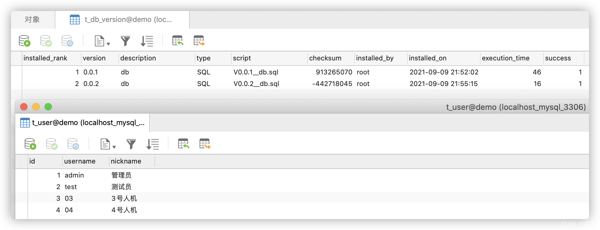

@[TOC](文章目录)

### 一、前言

本文将基于`springboot2.4.0`整合`Flyway`实现mysql数据库版本控制

官网：[https://flywaydb.org](https://flywaydb.org)

功能简述：
1. 通过flyway在数据库中建立一张版本变更历史记录表；
2. 在项目的指定目录下编写sql脚本；
3. 每次项目启动的时候，会去将本地sql脚本生成一个checksum检验码与数据库中的版本记录表做对比，如果不存在则会执行sql脚本内容；
4. ex: `开发环境` -> `测试环境` -> `生产环境` 可以通过维护sql脚本来进行数据库表结构和表数据的版本变更升级。

### 二、SpringBoot整合Flyway

#### 1、`pom.xml`中引入相关依赖

```xml
<!-- flywaydb -->
<!-- https://mvnrepository.com/artifact/org.flywaydb/flyway-core -->
<dependency>
    <groupId>org.flywaydb</groupId>
    <artifactId>flyway-core</artifactId>
    <version>7.15.0</version>
</dependency>
```

#### 2、`application.yml`配置

```yml
spring:
  # flyway配置 可参考：https://flywaydb.org/documentation/usage/commandline/migrate
  flyway:
    # 是否启用
    enabled: true
    # sql迁移 https://flywaydb.org/documentation/concepts/migrations.html#versioned-migrations
    locations:
      - classpath:db/zhengqingya # sql-based-migrations
      #      - classpath:com.zhengqing.demo.config.flyway.migration # java-based-migrations
    # 数据库信息
    url: jdbc:mysql://127.0.0.1:3306/demo?allowMultiQueries=true&useUnicode=true&characterEncoding=UTF8&zeroDateTimeBehavior=convertToNull&useSSL=false # MySQL在高版本需要指明是否进行SSL连接 解决则加上 &useSSL=false
    user: root
    password: root
    # 版本更新历史记录表
    table: t_db_version
    # 到新的环境中，数据库中有数据，且没有t_db_version表时，是否执行迁移操作
    # false：在启动时会报错，并停止迁移;
    # true: 生成history表并完成所有迁移;
    baseline-on-migrate: true
    # 在迁移时，是否校验旧脚本有变更
    validate-on-migrate: true
    # 检测迁移脚本的路径是否存在，若不存在则抛出异常
    check-location: false
    # 禁用Flyway所有drop相关逻辑
    clean-disabled: true
    # 验证错误时是否自动清除数据库
    clean-on-validation-error: false
```

#### 3、创建sql脚本

脚本目录：`resources/db/zhengqingya`

> 对应`application.yml`中`spring.flyway.locations`配置项

sql脚本文件命名格式可参考：[https://flywaydb.org/documentation/concepts/migrations.html#sql-based-migrations](https://flywaydb.org/documentation/concepts/migrations.html#sql-based-migrations)

示例：`V0.0.1__db.sql`

```sql
-- 创建表t_user
CREATE TABLE `t_user`
(
    `id`       int(11) NOT NULL AUTO_INCREMENT COMMENT '主键ID',
    `username` varchar(20) DEFAULT NULL COMMENT '用户名',
    `nickname` varchar(20) DEFAULT NULL COMMENT '昵称',
    PRIMARY KEY (`id`)
) ENGINE=InnoDB AUTO_INCREMENT=9 DEFAULT CHARSET=utf8 COMMENT='测试表';

-- 插入数据
insert into t_user
values (1, 'admin', '管理员'),
       (2, 'test', '测试员');

```

### 三、测试

启动项目，会在数据库中自动创建表`t_db_version`，并执行`db.zhengqingya`下面的`V0.0.1__db.sql`脚本数据

> 注：
> 1. 如果没有demo数据库，需要自己创建一下再启动项目
> 2. 如果当前连接数据库下存在其它数据表，会出现生成的记录如下，这时候需要删除该表中这一条初始数据，然后再重启项目才会正常执行`V0.0.1__db.sql`脚本；如果当前数据库是空的，则不会出现此问题
> 

idea控制台日志如下

数据库生成如下


第二次版本升级脚本`V0.0.2__db.sql`

```sql
-- 插入数据
insert into t_user
values (3, '03', '3号人机'),
       (4, '04', '4号人机');
```

启动项目，数据库生成如下


其它复杂操作请自行查看官网`^_^`

### 四、本文案例demo源码

[https://gitee.com/zhengqingya/java-workspace](https://gitee.com/zhengqingya/java-workspace)


--- 

> 今日分享语句：
> 只要不放下努力和追求,小草也有点缀春天的价值。

