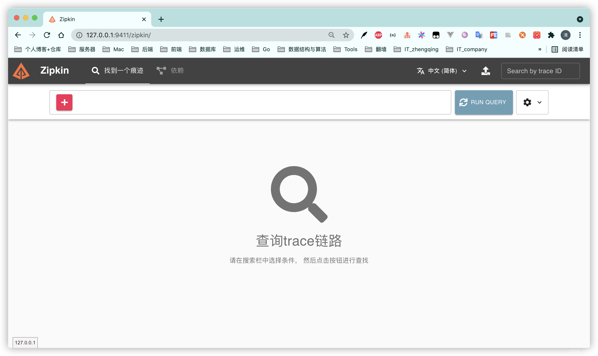
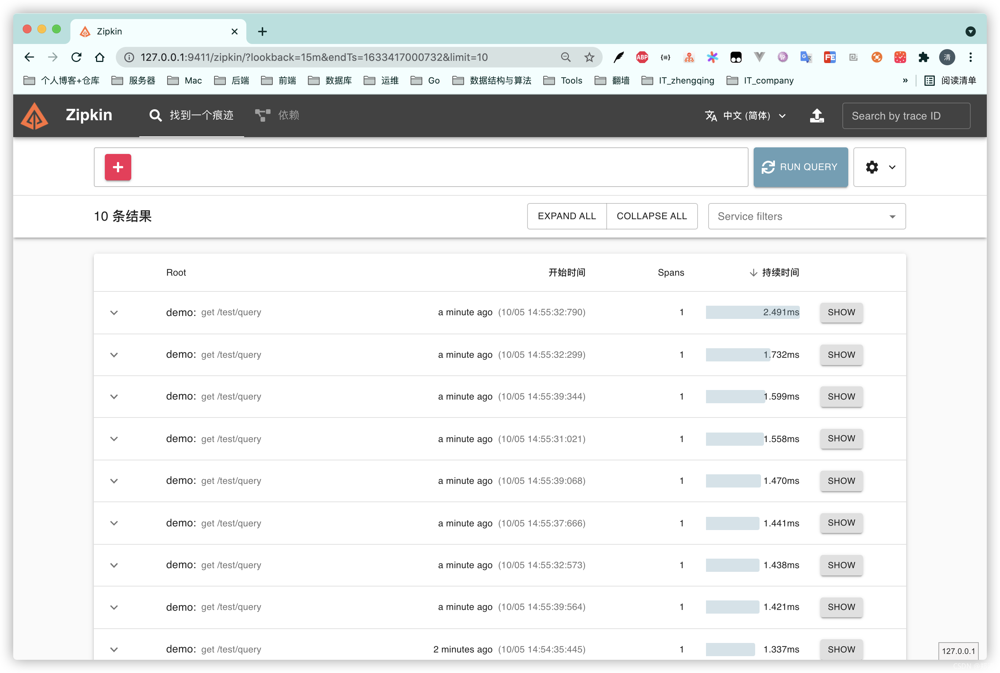
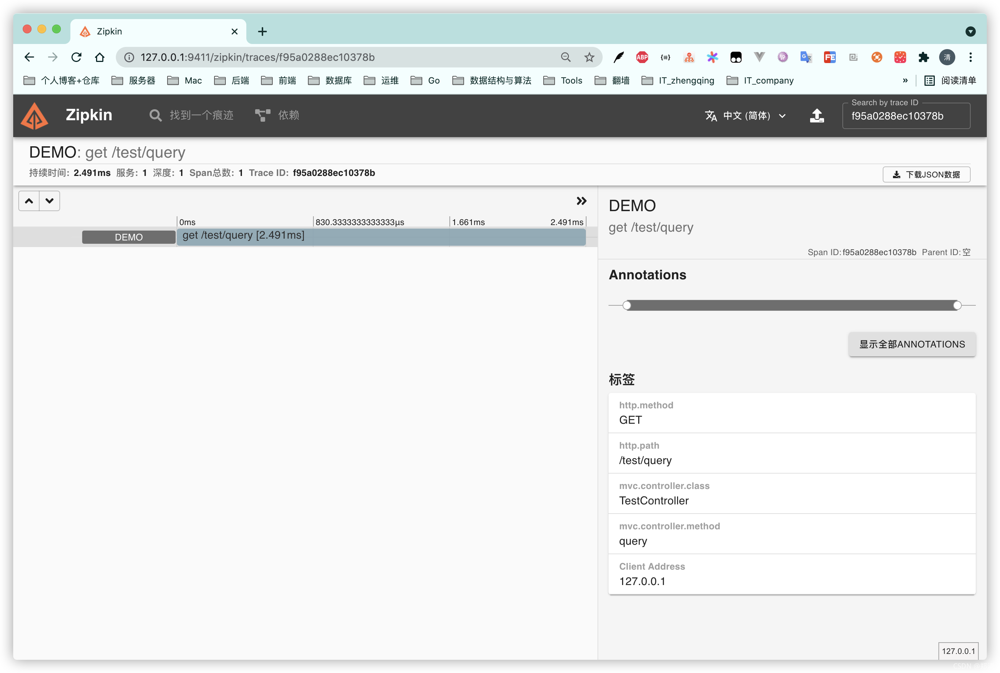

@[TOC](文章目录)

### 一、前言

本文将基于`springboot2.3.8.RELEASE`整合`Zipkin`实现分布式链路追踪

[https://github.com/openzipkin/zipkin](https://github.com/openzipkin/zipkin)

1. zipkin:2
2. docker-compose version 1.29.2, build 5becea4c
3. springboot:2.3.8.RELEASE
4. spring-cloud-starter-zipkin:2.2.8.RELEASE

### 二、docker-compose部署Zipkin

```shell
git clone https://gitee.com/zhengqingya/docker-compose.git
cd docker-compose/Liunx
# 运行 (注：记得创建相应zipkin库和表 & 修改mysql连接配置信息，自行查看`docker-compose/Liunx/zipkin`路径下的说明)
docker-compose -f docker-compose-zipkin.yml -p zipkin up -d
```

启动成功如下

访问地址 [`http://ip地址:9411/zipkin`](http://127.0.0.1:9411/zipkin)


#### docker-compose-zipkin.yml

```yml
# 可参考： https://github.com/openzipkin/zipkin/blob/master/docker/examples/docker-compose-mysql.yml
version: '3'
services:
  zipkin:
    image: registry.cn-hangzhou.aliyuncs.com/zhengqing/zipkin:2  # 原镜像`openzipkin/zipkin:2`
    container_name: zipkin                                       # 容器名为'zipkin'
    restart: unless-stopped                                      # 指定容器退出后的重启策略为始终重启，但是不考虑在Docker守护进程启动时就已经停止了的容器
    environment:                        # 设置环境变量,相当于docker run命令中的-e
      TZ: Asia/Shanghai
      LANG: en_US.UTF-8
      # 基于mysql存储
      STORAGE_TYPE: mysql
      # Point the zipkin at the storage backend
      # TODO 修改数据库配置信息
      MYSQL_HOST: www.zhengqingya.com
      MYSQL_TCP_PORT: 3306
      MYSQL_DB: zipkin
      MYSQL_USER: root
      MYSQL_PASS: root
    ports:                              # 映射端口
      - "9411:9411"
```

#### zipkin数据库&表

```sql
CREATE TABLE IF NOT EXISTS zipkin_spans
(
    `trace_id_high`       BIGINT       NOT NULL DEFAULT 0 COMMENT 'If non zero, this means the trace uses 128 bit traceIds instead of 64 bit',
    `trace_id`            BIGINT       NOT NULL,
    `id`                  BIGINT       NOT NULL,
    `name`                VARCHAR(255) NOT NULL,
    `remote_service_name` VARCHAR(255),
    `parent_id`           BIGINT,
    `debug`               BIT(1),
    `start_ts`            BIGINT COMMENT 'Span.timestamp(): epoch micros used for endTs query and to implement TTL',
    `duration`            BIGINT COMMENT 'Span.duration(): micros used for minDuration and maxDuration query',
    PRIMARY KEY (`trace_id_high`, `trace_id`, `id`)
) ENGINE = InnoDB
  ROW_FORMAT = COMPRESSED
  CHARACTER SET = utf8
  COLLATE utf8_general_ci;

ALTER TABLE zipkin_spans
    ADD INDEX (`trace_id_high`, `trace_id`) COMMENT 'for getTracesByIds';
ALTER TABLE zipkin_spans
    ADD INDEX (`name`) COMMENT 'for getTraces and getSpanNames';
ALTER TABLE zipkin_spans
    ADD INDEX (`remote_service_name`) COMMENT 'for getTraces and getRemoteServiceNames';
ALTER TABLE zipkin_spans
    ADD INDEX (`start_ts`) COMMENT 'for getTraces ordering and range';

CREATE TABLE IF NOT EXISTS zipkin_annotations
(
    `trace_id_high`         BIGINT       NOT NULL DEFAULT 0 COMMENT 'If non zero, this means the trace uses 128 bit traceIds instead of 64 bit',
    `trace_id`              BIGINT       NOT NULL COMMENT 'coincides with zipkin_spans.trace_id',
    `span_id`               BIGINT       NOT NULL COMMENT 'coincides with zipkin_spans.id',
    `a_key`                 VARCHAR(255) NOT NULL COMMENT 'BinaryAnnotation.key or Annotation.value if type == -1',
    `a_value`               BLOB COMMENT 'BinaryAnnotation.value(), which must be smaller than 64KB',
    `a_type`                INT          NOT NULL COMMENT 'BinaryAnnotation.type() or -1 if Annotation',
    `a_timestamp`           BIGINT COMMENT 'Used to implement TTL; Annotation.timestamp or zipkin_spans.timestamp',
    `endpoint_ipv4`         INT COMMENT 'Null when Binary/Annotation.endpoint is null',
    `endpoint_ipv6`         BINARY(16) COMMENT 'Null when Binary/Annotation.endpoint is null, or no IPv6 address',
    `endpoint_port`         SMALLINT COMMENT 'Null when Binary/Annotation.endpoint is null',
    `endpoint_service_name` VARCHAR(255) COMMENT 'Null when Binary/Annotation.endpoint is null'
) ENGINE = InnoDB
  ROW_FORMAT = COMPRESSED
  CHARACTER SET = utf8
  COLLATE utf8_general_ci;

ALTER TABLE zipkin_annotations
    ADD UNIQUE KEY (`trace_id_high`, `trace_id`, `span_id`, `a_key`, `a_timestamp`) COMMENT 'Ignore insert on duplicate';
ALTER TABLE zipkin_annotations
    ADD INDEX (`trace_id_high`, `trace_id`, `span_id`) COMMENT 'for joining with zipkin_spans';
ALTER TABLE zipkin_annotations
    ADD INDEX (`trace_id_high`, `trace_id`) COMMENT 'for getTraces/ByIds';
ALTER TABLE zipkin_annotations
    ADD INDEX (`endpoint_service_name`) COMMENT 'for getTraces and getServiceNames';
ALTER TABLE zipkin_annotations
    ADD INDEX (`a_type`) COMMENT 'for getTraces and autocomplete values';
ALTER TABLE zipkin_annotations
    ADD INDEX (`a_key`) COMMENT 'for getTraces and autocomplete values';
ALTER TABLE zipkin_annotations
    ADD INDEX (`trace_id`, `span_id`, `a_key`) COMMENT 'for dependencies job';

CREATE TABLE IF NOT EXISTS zipkin_dependencies
(
    `day`         DATE         NOT NULL,
    `parent`      VARCHAR(255) NOT NULL,
    `child`       VARCHAR(255) NOT NULL,
    `call_count`  BIGINT,
    `error_count` BIGINT,
    PRIMARY KEY (`day`, `parent`, `child`)
) ENGINE = InnoDB
  ROW_FORMAT = COMPRESSED
  CHARACTER SET = utf8
  COLLATE utf8_general_ci;
```

### 三、SpringBoot整合Zipkin

#### 1、pom.xml中引入依赖

```xml
<!-- zipkin -->
<!-- https://mvnrepository.com/artifact/org.springframework.cloud/spring-cloud-starter-zipkin -->
<dependency>
    <groupId>org.springframework.cloud</groupId>
    <artifactId>spring-cloud-starter-zipkin</artifactId>
    <version>2.2.8.RELEASE</version>
</dependency>
```

#### 2、application.yml配置

```yml
spring:
  # zipkin配置
  zipkin:
    base-url: http://127.0.0.1:9411 # TODO 服务器地址
    discovery-client-enabled: false # 关闭服务发现，否则springCloud会把zipkin的url当作服务名称
    sender.type: web                # 数据发送的方式：ACTIVEMQ RABBIT KAFKA WEB
  sleuth:
    sampler:
      probability: 1.0 # 设置抽样采集率，默认0.1（即10%），这里设置为100%-表示全部采样
```

#### 3、测试api

```java
@Slf4j
@RestController
@RequestMapping("/test")
@Api(tags = "测试api")
public class TestController {

    @GetMapping("query")
    @ApiOperation("查询数据")
    public void query() {
        log.info("查询数据: {}", DateTime.now());
    }

}
```

调用请求 [http://127.0.0.1/test/query](http://127.0.0.1/test/query)

查看zipkin

> 注：这里只是简单的一个测试api效果，可以集成到实际springcloud微服务项目中查看更多。




### 四、本文案例demo源码

[https://gitee.com/zhengqingya/java-workspace](https://gitee.com/zhengqingya/java-workspace)


---

> 今日分享语句：
> 生命对某些人来说是美丽的,这些人的一生都为某个目标而奋斗。
