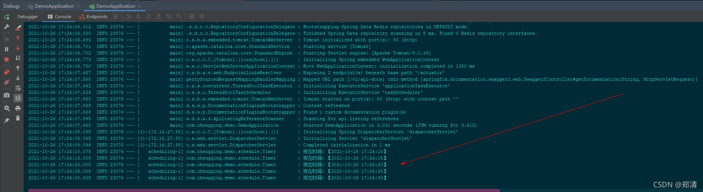
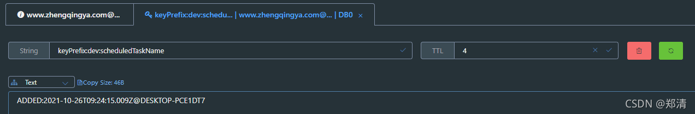

@[TOC](文章目录)

### 一、前言

本文将基于springboot2.4.0整合ShedLock实现分布式定时任务(redis版)

[https://github.com/lukas-krecan/shedlock](https://github.com/lukas-krecan/shedlock)

### 二、SpringBoot整合ShedLock

> 温馨小提示：redis相关配置省略，若有需要参考demo源码即可。

#### 1、`pom.xml`中引入依赖

```xml
<!-- shedlock: 分布式定时任务锁 -->
<!-- https://mvnrepository.com/artifact/net.javacrumbs.shedlock/shedlock-spring -->
<dependency>
    <groupId>net.javacrumbs.shedlock</groupId>
    <artifactId>shedlock-spring</artifactId>
    <version>4.29.0</version>
</dependency>
<!-- 使用redis做分布式任务 -->
<!-- https://mvnrepository.com/artifact/net.javacrumbs.shedlock/shedlock-provider-redis-spring -->
<dependency>
    <groupId>net.javacrumbs.shedlock</groupId>
    <artifactId>shedlock-provider-redis-spring</artifactId>
    <version>4.29.0</version>
</dependency>
```

#### 2、Shedlock配置类

```java
@Configuration
// 开启定时器
@EnableScheduling
// 开启定时任务锁，并设置默认锁最大时间为30分钟(PT为固定格式，M为时间单位-分钟)
@EnableSchedulerLock(defaultLockAtMostFor = "PT30M")
public class ShedlockConfig {

    @Value("${spring.profiles.active}")
    private String env;

    /**
     * 使用redis存储
     */
    @Bean
    public LockProvider lockProvider(RedisTemplate redisTemplate) {
        // keyPrefix: redis key的前缀
        // env和keyPrefix 主要用于区分数据来源，保证最终redis-key在使用时不串用即可  ex=> keyPrefix:dev:scheduledTaskName
        return new RedisLockProvider(redisTemplate.getConnectionFactory(), env, "keyPrefix");
    }

}
```

#### 3、测试数据定时任务

```java
@Slf4j
@Component
public class Timer {

    /**
     * 每5秒执行一次
     *
     * @SchedulerLock 注解参数
     * name：锁的名称，同一时间只能执行一个同名的任务
     * lockAtMostFor：该属性指定在执行节点死亡的情况下应保持锁定多长时间。这只是一个回退，在正常情况下，一旦任务完成就会释放锁。 您必须设置lockAtMostFor一个比正常执行时间长得多的值。如果任务花费的时间超过 lockAtMostFor所产生的行为可能是不可预测的（多个进程将有效地持有锁）
     * lockAtLeastFor：该属性指定应保留锁的最短时间。它的主要目的是在节点之间的任务和时钟差异非常短的情况下防止从多个节点执行。
     * <p>
     * 通过设置lockAtMostFor我们确保即使节点死亡也会释放锁，通过设置lockAtLeastFor 我们确保它在5s内不会执行超过一次。请注意，这lockAtMostFor只是一个安全网，以防执行任务的节点死亡，因此将其设置为明显大于最大估计执行时间的时间。 如果任务花费的时间超过lockAtMostFor，它可能会再次执行并且结果将是不可预测的（更多的进程将持有锁）。
     */
    @Scheduled(cron = "*/5 * * * * ?")
    @SchedulerLock(name = "scheduledTaskName", lockAtMostFor = "4s", lockAtLeastFor = "4s")
    public void printCurrentTime() {
        log.info("现在时间：【{}】", DateTime.now());
    }

}
```

自己启动项目运行测试即可...


redis-key


### 三、本文案例demo源码

[https://gitee.com/zhengqingya/java-workspace](https://gitee.com/zhengqingya/java-workspace)

---

> 今日分享语句：
> 至于未来会怎样,要走下去才知道,反正路还很长,天总会亮。
