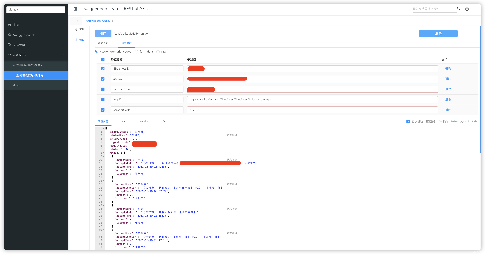

@[TOC](文章目录)

### 一、前言

本文将基于springboot2.4.0实现快递物流查询，物流信息的获取通过快递鸟第三方实现

[http://www.kdniao.com](http://www.kdniao.com)


### 二、快递物流查询

#### 1、快递鸟工具类

```java
@Slf4j
public class KdniaoUtil {

    /**
     * 快递查询接口
     *
     * @param queryDTO 请求参数
     * @return 物流信息
     * @author zhengqingya
     * @date 2021/10/25 17:39
     */
    public static KdniaoApiVO getLogisticInfo(KdniaoApiDTO queryDTO) {
        KdniaoApiVO kdniaoApiVO = new KdniaoUtil().getLogisticBase(queryDTO);
        Assert.isTrue("true".equals(kdniaoApiVO.getSuccess()), kdniaoApiVO.getReason());
        kdniaoApiVO.handleData();
        return kdniaoApiVO;
    }

    /**
     * 快递查询接口
     *
     * @param queryDTO 请求参数
     * @return 物流信息
     * @author zhengqingya
     * @date 2021/10/25 17:39
     */
    @SneakyThrows(Exception.class)
    private KdniaoApiVO getLogisticBase(KdniaoApiDTO queryDTO) {
        String EBusinessID = queryDTO.getEBusinessID();
        String ApiKey = queryDTO.getApiKey();
        String ReqURL = queryDTO.getReqURL();
        String shipperCode = queryDTO.getShipperCode();
        String logisticCode = queryDTO.getLogisticCode();

        // 组装应用级参数
        Map<String, String> requestParamMap = Maps.newHashMap();
        requestParamMap.put("shipperCode", shipperCode);
        requestParamMap.put("LogisticCode", logisticCode);
        String RequestData = JSON.toJSONString(requestParamMap);
        // 组装系统级参数
        Map<String, String> params = Maps.newHashMap();
        params.put("RequestData", this.urlEncoder(RequestData, "UTF-8"));
        params.put("EBusinessID", EBusinessID);
        params.put("RequestType", "8001");
        String dataSign = this.encrypt(RequestData, ApiKey, "UTF-8");
        params.put("DataSign", this.urlEncoder(dataSign, "UTF-8"));
        params.put("DataType", "2");
        // 以form表单形式提交post请求，post请求体中包含了应用级参数和系统级参数
        String resultJson = this.sendPost(ReqURL, params);
        return JSON.parseObject(resultJson, KdniaoApiVO.class);
    }

    /**
     * MD5加密
     * str 内容
     * charset 编码方式
     *
     * @throws Exception
     */
    @SuppressWarnings("unused")
    private String MD5(String str, String charset) throws Exception {
        MessageDigest md = MessageDigest.getInstance("MD5");
        md.update(str.getBytes(charset));
        byte[] result = md.digest();
        StringBuffer sb = new StringBuffer(32);
        for (int i = 0; i < result.length; i++) {
            int val = result[i] & 0xff;
            if (val <= 0xf) {
                sb.append("0");
            }
            sb.append(Integer.toHexString(val));
        }
        return sb.toString().toLowerCase();
    }

    /**
     * base64编码
     * str 内容
     * charset 编码方式
     *
     * @throws UnsupportedEncodingException
     */
    private String base64(String str, String charset) throws UnsupportedEncodingException {
        String encoded = Base64.encode(str.getBytes(charset));
        return encoded;
    }

    @SuppressWarnings("unused")
    private String urlEncoder(String str, String charset) throws UnsupportedEncodingException {
        String result = URLEncoder.encode(str, charset);
        return result;
    }

    /**
     * 电商Sign签名生成
     * content 内容
     * keyValue ApiKey
     * charset 编码方式
     *
     * @return DataSign签名
     * @throws UnsupportedEncodingException ,Exception
     */
    @SuppressWarnings("unused")
    private String encrypt(String content, String keyValue, String charset) throws UnsupportedEncodingException, Exception {
        if (keyValue != null) {
            return base64(MD5(content + keyValue, charset), charset);
        }
        return base64(MD5(content, charset), charset);
    }

    /**
     * 向指定 URL 发送POST方法的请求
     * url 发送请求的 URL
     * params 请求的参数集合
     *
     * @return 远程资源的响应结果
     */
    @SuppressWarnings("unused")
    private String sendPost(String url, Map<String, String> params) {
        OutputStreamWriter out = null;
        BufferedReader in = null;
        StringBuilder result = new StringBuilder();
        try {
            URL realUrl = new URL(url);
            HttpURLConnection conn = (HttpURLConnection) realUrl.openConnection();
            // 发送POST请求必须设置如下两行
            conn.setDoOutput(true);
            conn.setDoInput(true);
            // POST方法
            conn.setRequestMethod("POST");
            // 设置通用的请求属性
            conn.setRequestProperty("accept", "*/*");
            conn.setRequestProperty("connection", "Keep-Alive");
            conn.setRequestProperty("user-agent",
                    "Mozilla/4.0 (compatible; MSIE 6.0; Windows NT 5.1;SV1)");
            conn.setRequestProperty("Content-Type", "application/x-www-form-urlencoded");
            conn.connect();
            // 获取URLConnection对象对应的输出流
            out = new OutputStreamWriter(conn.getOutputStream(), "UTF-8");
            // 发送请求参数
            if (params != null) {
                StringBuilder param = new StringBuilder();
                for (Map.Entry<String, String> entry : params.entrySet()) {
                    if (param.length() > 0) {
                        param.append("&");
                    }
                    param.append(entry.getKey());
                    param.append("=");
                    param.append(entry.getValue());
                }
                log.info("[快递鸟] 请求参数: [{}]", param);
                out.write(param.toString());
            }
            // flush输出流的缓冲
            out.flush();
            // 定义BufferedReader输入流来读取URL的响应
            in = new BufferedReader(
                    new InputStreamReader(conn.getInputStream(), "UTF-8"));
            String line;
            while ((line = in.readLine()) != null) {
                result.append(line);
            }
        } catch (Exception e) {
            e.printStackTrace();
        }
        //使用finally块来关闭输出流、输入流
        finally {
            try {
                if (out != null) {
                    out.close();
                }
                if (in != null) {
                    in.close();
                }
            } catch (IOException ex) {
                ex.printStackTrace();
            }
        }
        return result.toString();
    }

}
```

#### 2、请求类

```java
@Data
@SuperBuilder
@NoArgsConstructor
@AllArgsConstructor
@ApiModel("快递鸟-物流-查询base参数")
public class KdniaoApiBaseDTO {

    @ApiModelProperty(value = "用户ID", required = true, example = "xx")
    private String eBusinessID;

    @ApiModelProperty(value = "API key", required = true, example = "xx")
    private String apiKey;

    @ApiModelProperty(value = "请求url", required = true, example = "https://api.kdniao.com/Ebusiness/EbusinessOrderHandle.aspx")
    private String reqURL;

}
```

```java
@Data
@SuperBuilder
@NoArgsConstructor
@AllArgsConstructor
@EqualsAndHashCode(callSuper = true)
@ApiModel("快递鸟-物流-查询参数")
public class KdniaoApiDTO extends KdniaoApiBaseDTO {

    @ApiModelProperty(value = "快递公司编码", required = true, example = "ZTO")
    private String shipperCode;

    @ApiModelProperty(value = "快递单号", required = true, example = "xxx")
    private String logisticCode;

}
```

#### 3、响应结果类

```java
@Data
@SuperBuilder
@NoArgsConstructor
@AllArgsConstructor
@ApiModel("快递鸟-物流-响应参数")
public class KdniaoApiVO {

    /**
     * {@link KdniaoLogisticsStatusEnum }
     * 增值物流状态：
     * 0-暂无轨迹信息
     * 1-已揽收
     * 2-在途中
     * 201-到达派件城市, 202-派件中, 211-已放入快递柜或驿站,
     * 3-已签收
     * 301-正常签收, 302-派件异常后最终签收, 304-代收签收, 311-快递柜或驿站签收,
     * 4-问题件
     * 401-发货无信息, 402-超时未签收, 403-超时未更新, 404-拒收(退件), 405-派件异常, 406-退货签收, 407-退货未签收, 412-快递柜或驿站超时未取
     */
    @ApiModelProperty("增值物流状态")
    private Integer StateEx;

    @ApiModelProperty("增值物流状态名称")
    private String statusExName;

    @ApiModelProperty("快递单号")
    private String LogisticCode;

    @ApiModelProperty("快递公司编码")
    private String ShipperCode;

    @ApiModelProperty("失败原因")
    private String Reason;

    @ApiModelProperty("事件轨迹集")
    private List<TraceItem> Traces;

    /**
     * {@link KdniaoLogisticsStatusEnum }
     */
    @ApiModelProperty("物流状态：0-暂无轨迹信息,1-已揽收,2-在途中,3-签收,4-问题件")
    private Integer State;

    @ApiModelProperty("状态名称")
    private String statusName;

    @ApiModelProperty("用户ID")
    private String EBusinessID;

    @ApiModelProperty("送货人")
    private String DeliveryMan;

    @ApiModelProperty("送货人电话号码")
    private String DeliveryManTel;

    @ApiModelProperty("成功与否 true/false")
    private String Success;

    @ApiModelProperty("所在城市")
    private String Location;

    @Data
    @Builder
    @NoArgsConstructor
    @AllArgsConstructor
    @ApiModel("事件轨迹集")
    public static class TraceItem {
        /**
         * {@link KdniaoLogisticsStatusEnum }
         */
        @ApiModelProperty("当前状态(同StateEx)")
        private Integer Action;

        @ApiModelProperty("状态名称")
        private String actionName;

        @ApiModelProperty("描述")
        private String AcceptStation;

        @ApiModelProperty("时间")
        private String AcceptTime;

        @ApiModelProperty("所在城市")
        private String Location;
    }


    public void handleData() {
        this.statusName = KdniaoLogisticsStatusEnum.getEnum(this.State).getDesc();
        this.statusExName = KdniaoLogisticsStatusEnum.getEnum(this.StateEx).getDesc();
        if (CollectionUtils.isEmpty(this.Traces)) {
            this.Traces = Lists.newArrayList();
        }
        this.Traces.forEach(item -> item.actionName = KdniaoLogisticsStatusEnum.getEnum(item.Action).getDesc());
    }

}
```

#### 4、物流编码、状态枚举类

> 温馨小提示：更多物流编码值可参考官网快递鸟接口支持的快递公司编码。

```java
@Getter
@AllArgsConstructor
public enum KdniaoLogisticsCodeEnum {

    /**
     * 申通
     */
    STO("STO", "申通"),
    /**
     * 中通
     */
    ZTO("ZTO", "中通"),
    /**
     * 圆通
     */
    YTO("YTO", "圆通"),
    /**
     * 韵达
     */
    YD("YD", "韵达"),
    /**
     * 顺丰
     */
    SF("SF", "顺丰");

    /**
     * 物流编码
     */
    private final String code;
    /**
     * 物流名
     */
    private final String name;


    private static final List<KdniaoLogisticsCodeEnum> LIST = Lists.newArrayList();

    static {
        LIST.addAll(Arrays.asList(KdniaoLogisticsCodeEnum.values()));
    }

    /**
     * 根据值查找相应枚举
     */
    @SneakyThrows(Exception.class)
    public static KdniaoLogisticsCodeEnum getEnumByName(String name) {
        for (KdniaoLogisticsCodeEnum itemEnum : LIST) {
            if (itemEnum.getName().equals(name)) {
                return itemEnum;
            }
        }
        throw new Exception("暂无此物流编码信息，请联系系统管理员！");
    }

}
```

```java
@Getter
@AllArgsConstructor
public enum KdniaoLogisticsStatusEnum {

    /**
     * 暂无轨迹信息
     */
    NO_TRACE(0, "暂无轨迹信息"),
    /**
     * 已揽收
     */
    HAVE_PAID(1, "已揽收"),
    /**
     * 已揽收 -----------------------------------------------------------------------------
     */
    ON_THE_WAY(2, "在途中"),
    /**
     * 到达派件城市
     */
    ARRIVE_AT_THE_DISPATCH_CITY(201, "到达派件城市"),
    /**
     * 派件中
     */
    IN_THE_DELIVERY(202, "派件中"),
    /**
     * 已放入快递柜或驿站
     */
    HAS_STORED(211, "已放入快递柜或驿站"),
    /**
     * 签收 -----------------------------------------------------------------------------
     */
    SIGN(3, "签收"),
    /**
     * 正常签收
     */
    SIGN_NORMAL(301, "正常签收"),
    /**
     * 派件异常后最终签收
     */
    SIGN_ABNORMAL(302, "派件异常后最终签收"),
    /**
     * 代收签收
     */
    SIGN_COLLECTION(304, "代收签收"),
    /**
     * 快递柜或驿站签收
     */
    SIGN_STORED(311, "快递柜或驿站签收"),
    /**
     * 问题件 -----------------------------------------------------------------------------
     */
    PROBLEM_SHIPMENT(4, "问题件"),
    /**
     * 发货无信息
     */
    DELIVERY_NO_INFO(401, "发货无信息"),
    /**
     * 超时未签收
     */
    NO_SIGN_OVER_TIME(402, "超时未签收"),
    /**
     * 超时未更新
     */
    NOT_UPDATED_DUE_TO_TIMEOUT(403, "超时未更新"),
    /**
     * 拒收(退件)
     */
    REJECTION(404, "拒收(退件)"),
    /**
     * 派件异常
     */
    SEND_A_ABNORMAL(405, "派件异常"),
    /**
     * 退货签收
     */
    RETURN_TO_SIGN_FOR(406, "退货签收"),
    /**
     * 退货未签收
     */
    RETURN_NOT_SIGNED_FOR(407, "退货未签收"),
    /**
     * 快递柜或驿站超时未取
     */
    STORED_OVER_TIME(412, "快递柜或驿站超时未取"),
    /**
     * -
     */
    DEFAULT(0, "-");

    /**
     * 状态
     */
    private final Integer status;
    /**
     * 描述
     */
    private final String desc;

    private static final List<KdniaoLogisticsStatusEnum> LIST = Lists.newArrayList();

    static {
        LIST.addAll(Arrays.asList(KdniaoLogisticsStatusEnum.values()));
    }

    /**
     * 根据物流状态查找相应枚举
     */
    public static KdniaoLogisticsStatusEnum getEnum(Integer status) {
        for (KdniaoLogisticsStatusEnum itemEnum : LIST) {
            if (itemEnum.getStatus().equals(status)) {
                return itemEnum;
            }
        }
        return KdniaoLogisticsStatusEnum.DEFAULT;
    }

}
```

#### 5、测试api

```java
@Slf4j
@RestController
@RequestMapping("/test")
@Api(tags = "测试api")
public class TestController {

    @ApiOperation("查询物流信息-快递鸟")
    @GetMapping("getLogisticByKdniao")
    public KdniaoApiVO getLogisticByKdniao(@ModelAttribute KdniaoApiDTO params) {
        return KdniaoUtil.getLogisticInfo(params);
    }

}
```

接口文档 [http://127.0.0.1/doc.html](http://127.0.0.1/doc.html)


### 三、本文demo源码

[https://gitee.com/zhengqingya/java-workspace](https://gitee.com/zhengqingya/java-workspace)


---

> 今日分享语句：
> 没有不会做的事,只有不想做的事。
