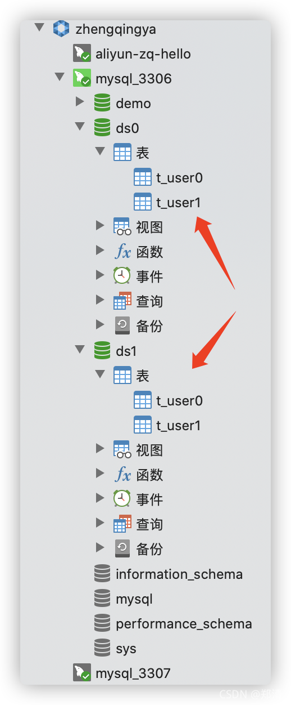

@[TOC](文章目录)

### 一、前言

本文将基于以下环境整合`sharding-jdbc`实现`分库分表`与`读写分离`

1. springboot2.4.0
2. mybatis-plus3.4.3.1
3. mysql5.7主从

[https://github.com/apache/shardingsphere](https://github.com/apache/shardingsphere)

### 二、数据库表准备

> 温馨小提示：此sql执行时，如果之前有存在相应库和表会进行自动删除后再创建！

```sql
DROP DATABASE IF EXISTS ds0;
CREATE DATABASE ds0;
USE ds0;

SET NAMES utf8mb4;
SET FOREIGN_KEY_CHECKS = 0;

-- ----------------------------
-- Table structure for t_user0
-- ----------------------------
DROP TABLE IF EXISTS `t_user0`;
CREATE TABLE `t_user0`  (
                            `user_id` bigint(20) UNSIGNED NOT NULL AUTO_INCREMENT COMMENT '主键ID',
                            `username` varchar(20) CHARACTER SET utf8mb4 COLLATE utf8mb4_general_ci NULL DEFAULT NULL COMMENT '用户名',
                            `password` varchar(50) CHARACTER SET utf8mb4 COLLATE utf8mb4_general_ci NULL DEFAULT NULL COMMENT '密码',
                            `sex` tinyint(4) NULL DEFAULT NULL COMMENT '性别',
                            `remark` varchar(100) CHARACTER SET utf8mb4 COLLATE utf8mb4_general_ci NULL DEFAULT NULL COMMENT '备注',
                            PRIMARY KEY (`user_id`) USING BTREE
) ENGINE = InnoDB AUTO_INCREMENT = 1 CHARACTER SET = utf8mb4 COLLATE = utf8mb4_general_ci COMMENT = '用户' ROW_FORMAT = Dynamic;

-- ----------------------------
-- Table structure for t_user1
-- ----------------------------
DROP TABLE IF EXISTS `t_user1`;
CREATE TABLE `t_user1`  (
                            `user_id` bigint(20) UNSIGNED NOT NULL AUTO_INCREMENT COMMENT '主键ID',
                            `username` varchar(20) CHARACTER SET utf8mb4 COLLATE utf8mb4_general_ci NULL DEFAULT NULL COMMENT '用户名',
                            `password` varchar(50) CHARACTER SET utf8mb4 COLLATE utf8mb4_general_ci NULL DEFAULT NULL COMMENT '密码',
                            `sex` tinyint(4) NULL DEFAULT NULL COMMENT '性别',
                            `remark` varchar(100) CHARACTER SET utf8mb4 COLLATE utf8mb4_general_ci NULL DEFAULT NULL COMMENT '备注',
                            PRIMARY KEY (`user_id`) USING BTREE
) ENGINE = InnoDB AUTO_INCREMENT = 1 CHARACTER SET = utf8mb4 COLLATE = utf8mb4_general_ci COMMENT = '用户' ROW_FORMAT = Dynamic;

SET FOREIGN_KEY_CHECKS = 1;


-- ===============================================================================================


DROP DATABASE IF EXISTS ds1;
CREATE DATABASE ds1;
USE ds1;

SET NAMES utf8mb4;
SET FOREIGN_KEY_CHECKS = 0;

-- ----------------------------
-- Table structure for t_user0
-- ----------------------------
DROP TABLE IF EXISTS `t_user0`;
CREATE TABLE `t_user0`  (
                            `user_id` bigint(20) UNSIGNED NOT NULL AUTO_INCREMENT COMMENT '主键ID',
                            `username` varchar(20) CHARACTER SET utf8mb4 COLLATE utf8mb4_general_ci NULL DEFAULT NULL COMMENT '用户名',
                            `password` varchar(50) CHARACTER SET utf8mb4 COLLATE utf8mb4_general_ci NULL DEFAULT NULL COMMENT '密码',
                            `sex` tinyint(4) NULL DEFAULT NULL COMMENT '性别',
                            `remark` varchar(100) CHARACTER SET utf8mb4 COLLATE utf8mb4_general_ci NULL DEFAULT NULL COMMENT '备注',
                            PRIMARY KEY (`user_id`) USING BTREE
) ENGINE = InnoDB AUTO_INCREMENT = 1 CHARACTER SET = utf8mb4 COLLATE = utf8mb4_general_ci COMMENT = '用户' ROW_FORMAT = Dynamic;

-- ----------------------------
-- Table structure for t_user1
-- ----------------------------
DROP TABLE IF EXISTS `t_user1`;
CREATE TABLE `t_user1`  (
                            `user_id` bigint(20) UNSIGNED NOT NULL AUTO_INCREMENT COMMENT '主键ID',
                            `username` varchar(20) CHARACTER SET utf8mb4 COLLATE utf8mb4_general_ci NULL DEFAULT NULL COMMENT '用户名',
                            `password` varchar(50) CHARACTER SET utf8mb4 COLLATE utf8mb4_general_ci NULL DEFAULT NULL COMMENT '密码',
                            `sex` tinyint(4) NULL DEFAULT NULL COMMENT '性别',
                            `remark` varchar(100) CHARACTER SET utf8mb4 COLLATE utf8mb4_general_ci NULL DEFAULT NULL COMMENT '备注',
                            PRIMARY KEY (`user_id`) USING BTREE
) ENGINE = InnoDB AUTO_INCREMENT = 1 CHARACTER SET = utf8mb4 COLLATE = utf8mb4_general_ci COMMENT = '用户' ROW_FORMAT = Dynamic;

SET FOREIGN_KEY_CHECKS = 1;
```



### 三、整合

#### 1、`pom`中引入依赖

```xml
<!-- sharding-jdbc -->
<!-- https://mvnrepository.com/artifact/org.apache.shardingsphere/sharding-jdbc-spring-boot-starter -->
<dependency>
    <groupId>org.apache.shardingsphere</groupId>
    <artifactId>sharding-jdbc-spring-boot-starter</artifactId>
    <version>4.1.1</version>
</dependency>
```

#### 2、`application.yml`配置

```yml
spring:
  # sharding-jdbc配置
  shardingsphere:
    # 是否开启SQL显示
    props:
      sql:
        show: true
    # ====================== ↓↓↓↓↓↓ 数据源配置 ↓↓↓↓↓↓ ======================
    datasource:
      names: ds-master-0,ds-slave-0-1,ds-slave-0-2,ds-master-1,ds-slave-1-1,ds-slave-1-2
      # ====================== ↓↓↓↓↓↓ 配置第1个主从库 ↓↓↓↓↓↓ ======================
      # 主库1
      ds-master-0:
        type: com.zaxxer.hikari.HikariDataSource
        driver-class-name: com.mysql.jdbc.Driver
        jdbc-url: jdbc:mysql://127.0.0.1:3306/ds0?allowMultiQueries=true&useUnicode=true&characterEncoding=UTF8&zeroDateTimeBehavior=convertToNull&useSSL=false # MySQL在高版本需要指明是否进行SSL连接 解决则加上 &useSSL=false
        username: root
        password: root
      # 主库1-从库1
      ds-slave-0-1:
        type: com.zaxxer.hikari.HikariDataSource
        driver-class-name: com.mysql.jdbc.Driver
        jdbc-url: jdbc:mysql://127.0.0.1:3307/ds0?allowMultiQueries=true&useUnicode=true&characterEncoding=UTF8&zeroDateTimeBehavior=convertToNull&useSSL=false # MySQL在高版本需要指明是否进行SSL连接 解决则加上 &useSSL=false
        username: root
        password: root
      # 主库1-从库2
      ds-slave-0-2:
        type: com.zaxxer.hikari.HikariDataSource
        driver-class-name: com.mysql.jdbc.Driver
        jdbc-url: jdbc:mysql://127.0.0.1:3307/ds0?allowMultiQueries=true&useUnicode=true&characterEncoding=UTF8&zeroDateTimeBehavior=convertToNull&useSSL=false # MySQL在高版本需要指明是否进行SSL连接 解决则加上 &useSSL=false
        username: root
        password: root
      # ====================== ↓↓↓↓↓↓ 配置第2个主从库 ↓↓↓↓↓↓ ======================
      # 主库2
      ds-master-1:
        type: com.zaxxer.hikari.HikariDataSource
        driver-class-name: com.mysql.jdbc.Driver
        jdbc-url: jdbc:mysql://127.0.0.1:3306/ds1?allowMultiQueries=true&useUnicode=true&characterEncoding=UTF8&zeroDateTimeBehavior=convertToNull&useSSL=false # MySQL在高版本需要指明是否进行SSL连接 解决则加上 &useSSL=false
        username: root
        password: root
      # 主库2-从库1
      ds-slave-1-1:
        type: com.zaxxer.hikari.HikariDataSource
        driver-class-name: com.mysql.jdbc.Driver
        jdbc-url: jdbc:mysql://127.0.0.1:3307/ds1?allowMultiQueries=true&useUnicode=true&characterEncoding=UTF8&zeroDateTimeBehavior=convertToNull&useSSL=false # MySQL在高版本需要指明是否进行SSL连接 解决则加上 &useSSL=false
        username: root
        password: root
      # 主库2-从库2
      ds-slave-1-2:
        type: com.zaxxer.hikari.HikariDataSource
        driver-class-name: com.mysql.jdbc.Driver
        jdbc-url: jdbc:mysql://127.0.0.1:3307/ds1?allowMultiQueries=true&useUnicode=true&characterEncoding=UTF8&zeroDateTimeBehavior=convertToNull&useSSL=false # MySQL在高版本需要指明是否进行SSL连接 解决则加上 &useSSL=false
        username: root
        password: root

    sharding:
      # ====================== ↓↓↓↓↓↓ 分库分表配置 ↓↓↓↓↓↓ ======================
      # 分库策略 => 根据user_id取模拆分到不同的库中
      default-database-strategy:
        inline:
          sharding-column: user_id
          algorithm-expression: ds-master-$->{user_id % 2}
      # 分表策略
      tables:
        t_user:
          actual-data-nodes: ds-master-$->{0..1}.t_user$->{0..1}
          key-generator:
            column: user_id  # 主键ID
            type: SNOWFLAKE  # 生成策略
          # 添加数据分表策略
          table-strategy:
            inline:
              # 添加数据分表字段(根据字段插入数据到那个表 ex：sex)
              sharding-column: sex
              # 分片算法表达式 => 根据用户性别取模拆分到不同的表中
              algorithm-expression: t_user$->{sex % 2}

      # ====================== ↓↓↓↓↓↓ 读写分离配置 ↓↓↓↓↓↓ ======================
      master-slave-rules:
        ds-master-0:
          # 主库
          masterDataSourceName: ds-master-0
          # 从库
          slaveDataSourceNames:
            - ds-slave-0-1
            - ds-slave-0-2
          # 从库查询数据的负载均衡算法 目前有2种算法 round_robin（轮询）和 random（随机）
          # 算法接口 org.apache.shardingsphere.spi.masterslave.MasterSlaveLoadBalanceAlgorithm
          # 实现类 RandomMasterSlaveLoadBalanceAlgorithm 和 RoundRobinMasterSlaveLoadBalanceAlgorithm
          loadBalanceAlgorithmType: ROUND_ROBIN
        ds-master-1:
          masterDataSourceName: ds-master-1
          slaveDataSourceNames:
            - ds-slave-1-1
            - ds-slave-1-2
          loadBalanceAlgorithmType: ROUND_ROBIN
```

#### 3、引入sharding-jdbc后数据源健康配置

解决启动报错问题: `ConnectionCallback; isValid; nested exception is java.sql.SQLFeatureNotSupportedException: isValid`
原因: springboot2.4数据源健康检查

```java
@Configuration
public class DataSourceHealthConfig extends DataSourceHealthContributorAutoConfiguration {

    @Value("${spring.datasource.dbcp2.validation-query:select 1}")
    private String defaultQuery;

    public DataSourceHealthConfig(Map<String, DataSource> dataSources, ObjectProvider<DataSourcePoolMetadataProvider> metadataProviders) {
        super(dataSources, metadataProviders);
    }

    @Override
    protected AbstractHealthIndicator createIndicator(DataSource source) {
        DataSourceHealthIndicator indicator = (DataSourceHealthIndicator) super.createIndicator(source);
        if (!StringUtils.hasText(indicator.getQuery())) {
            indicator.setQuery(defaultQuery);
        }
        return indicator;
    }

}
```

到此配置完成，然后就可以自己编写CRUD进行测试了，配置比较简单，属于入门篇

### 四、docker-compose部署mysql主从

```shell
# 环境准备
git clone https://gitee.com/zhengqingya/docker-compose.git
cd docker-compose/Liunx
# 运行
docker-compose -f docker-compose-mysql-master-slave.yml -p mysql-master-slave up -d
```

```shell
# ================== ↓↓↓↓↓↓ 配置主库 ↓↓↓↓↓↓ ==================
# 进入主库
docker exec -it mysql_master /bin/bash
# 登录mysql
mysql -uroot -proot
#  创建用户slave，密码123456
CREATE USER 'slave'@'%' IDENTIFIED BY '123456';
# 授予slave用户 `REPLICATION SLAVE`权限和`REPLICATION CLIENT`权限，用于在`主` `从` 数据库之间同步数据
GRANT REPLICATION SLAVE, REPLICATION CLIENT ON *.* TO 'slave'@'%';
# 授予所有权限则执行命令: GRANT ALL PRIVILEGES ON *.* TO 'slave'@'%';
# 使操作生效
FLUSH PRIVILEGES;
# 查看状态
show master status;
# 注：File和Position字段的值slave中将会用到，在slave操作完成之前不要操作master，否则将会引起状态变化，即File和Position字段的值变化 !!!
# +------------------+----------+--------------+------------------+-------------------+
# | File             | Position | Binlog_Do_DB | Binlog_Ignore_DB | Executed_Gtid_Set |
# +------------------+----------+--------------+------------------+-------------------+
# | mysql-bin.000003 |      769 |              |                  |                   |
# +------------------+----------+--------------+------------------+-------------------+
# 1 row in set (0.00 sec)


# ================== ↓↓↓↓↓↓ 配置从库 ↓↓↓↓↓↓ ==================
# 进入从库
docker exec -it mysql_slave /bin/bash
# 登录mysql
mysql -uroot -proot
change master to master_host='www.zhengqingya.com',master_port=3306, master_user='slave', master_password='123456', master_log_file='mysql-bin.000003', master_log_pos= 769, master_connect_retry=30;
# 开启主从同步过程  【停止命令：stop slave;】
start slave;
# 查看主从同步状态
show slave status \G
# Slave_IO_Running 和 Slave_SQL_Running 都是Yes的话，就说明主从同步已经配置好了！
# 如果Slave_IO_Running为Connecting，SlaveSQLRunning为Yes，则说明配置有问题，这时候就要检查配置中哪一步出现问题了哦，可根据Last_IO_Error字段信息排错或谷歌…
# *************************** 1. row ***************************
#                Slave_IO_State: Waiting for master to send event
#                   Master_Host: www.zhengqingya.com
#                   Master_User: slave
#                   Master_Port: 3306
#                 Connect_Retry: 30
#               Master_Log_File: mysql-bin.000003
#           Read_Master_Log_Pos: 769
#                Relay_Log_File: c598d8402b43-relay-bin.000002
#                 Relay_Log_Pos: 320
#         Relay_Master_Log_File: mysql-bin.000003
#              Slave_IO_Running: Yes
#             Slave_SQL_Running: Yes
#               Replicate_Do_DB:
```

### 五、本文案例demo源码

[https://gitee.com/zhengqingya/java-workspace](https://gitee.com/zhengqingya/java-workspace)


---

> 今日分享语句：
> 一点一点去靠近梦想，不抱侥幸的奢望，用踏实浇灌，用努力证明，你可以！
