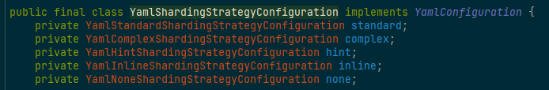
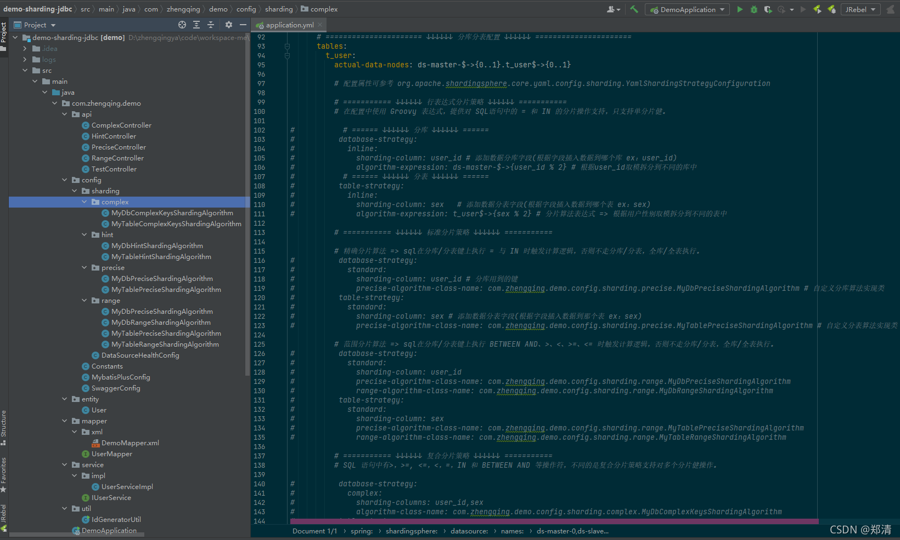
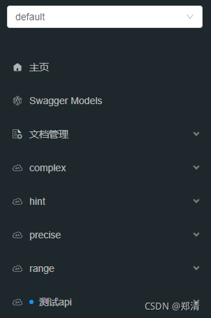

@[TOC](文章目录)

### 一、前言

[SpringBoot(48) 整合sharding-jdbc实现分库分表与读写分离](https://zhengqing.blog.csdn.net//article/details/121024815)

本文将通过自定义算法来实现定制化的分库分表来扩展相应业务

### 二、简介

#### 1、分片键

用于数据库/表拆分的关键字段

ex: 用户表根据user_id取模拆分到不同的数据库中

#### 2、分片算法

可参考：[https://shardingsphere.apache.org/document/current/cn/user-manual/shardingsphere-jdbc/configuration/built-in-algorithm/sharding](https://shardingsphere.apache.org/document/current/cn/user-manual/shardingsphere-jdbc/configuration/built-in-algorithm/sharding)

1. 精确分片算法
2. 范围分片算法
3. 复合分片算法
4. Hint分片算法

#### 3、分片策略（分片键+分片算法）

1. 行表达式分片策略
2. 标准分片策略
3. 复合分片策略
4. Hint分片策略
5. 不分片策略

可查看源码 `org.apache.shardingsphere.core.yaml.config.sharding.YamlShardingStrategyConfiguration`


### 三、程序实现

> 温馨小提示：详情可查看案例demo源码



这里先贴出完整的`application.yml`配置，后面实现每一种分片策略时，放开其相应配置即可~

```yml
# sharding-jdbc配置
spring:
  shardingsphere:
    # 是否开启SQL显示
    props:
      sql:
        show: true
    # ====================== ↓↓↓↓↓↓ 数据源配置 ↓↓↓↓↓↓ ======================
    datasource:
      names: ds-master-0,ds-slave-0-1,ds-slave-0-2,ds-master-1,ds-slave-1-1,ds-slave-1-2
      # ====================== ↓↓↓↓↓↓ 配置第1个主从库 ↓↓↓↓↓↓ ======================
      # 主库1
      ds-master-0:
        type: com.zaxxer.hikari.HikariDataSource
        driver-class-name: com.mysql.jdbc.Driver
        jdbc-url: jdbc:mysql://127.0.0.1:3306/ds0?allowMultiQueries=true&useUnicode=true&characterEncoding=UTF8&zeroDateTimeBehavior=convertToNull&useSSL=false # MySQL在高版本需要指明是否进行SSL连接 解决则加上 &useSSL=false
        username: root
        password: root
      # 主库1-从库1
      ds-slave-0-1:
        type: com.zaxxer.hikari.HikariDataSource
        driver-class-name: com.mysql.jdbc.Driver
        jdbc-url: jdbc:mysql://127.0.0.1:3307/ds0?allowMultiQueries=true&useUnicode=true&characterEncoding=UTF8&zeroDateTimeBehavior=convertToNull&useSSL=false # MySQL在高版本需要指明是否进行SSL连接 解决则加上 &useSSL=false
        username: root
        password: root
      # 主库1-从库2
      ds-slave-0-2:
        type: com.zaxxer.hikari.HikariDataSource
        driver-class-name: com.mysql.jdbc.Driver
        jdbc-url: jdbc:mysql://127.0.0.1:3307/ds0?allowMultiQueries=true&useUnicode=true&characterEncoding=UTF8&zeroDateTimeBehavior=convertToNull&useSSL=false # MySQL在高版本需要指明是否进行SSL连接 解决则加上 &useSSL=false
        username: root
        password: root
      # ====================== ↓↓↓↓↓↓ 配置第2个主从库 ↓↓↓↓↓↓ ======================
      # 主库2
      ds-master-1:
        type: com.zaxxer.hikari.HikariDataSource
        driver-class-name: com.mysql.jdbc.Driver
        jdbc-url: jdbc:mysql://127.0.0.1:3306/ds1?allowMultiQueries=true&useUnicode=true&characterEncoding=UTF8&zeroDateTimeBehavior=convertToNull&useSSL=false # MySQL在高版本需要指明是否进行SSL连接 解决则加上 &useSSL=false
        username: root
        password: root
      # 主库2-从库1
      ds-slave-1-1:
        type: com.zaxxer.hikari.HikariDataSource
        driver-class-name: com.mysql.jdbc.Driver
        jdbc-url: jdbc:mysql://127.0.0.1:3307/ds1?allowMultiQueries=true&useUnicode=true&characterEncoding=UTF8&zeroDateTimeBehavior=convertToNull&useSSL=false # MySQL在高版本需要指明是否进行SSL连接 解决则加上 &useSSL=false
        username: root
        password: root
      # 主库2-从库2
      ds-slave-1-2:
        type: com.zaxxer.hikari.HikariDataSource
        driver-class-name: com.mysql.jdbc.Driver
        jdbc-url: jdbc:mysql://127.0.0.1:3307/ds1?allowMultiQueries=true&useUnicode=true&characterEncoding=UTF8&zeroDateTimeBehavior=convertToNull&useSSL=false # MySQL在高版本需要指明是否进行SSL连接 解决则加上 &useSSL=false
        username: root
        password: root

    sharding:
      # ====================== ↓↓↓↓↓↓ 读写分离配置 ↓↓↓↓↓↓ ======================
      master-slave-rules:
        ds-master-0:
          # 主库
          masterDataSourceName: ds-master-0
          # 从库
          slaveDataSourceNames:
            - ds-slave-0-1
            - ds-slave-0-2
          # 从库查询数据的负载均衡算法 目前有2种算法 round_robin（轮询）和 random（随机）
          # 算法接口 org.apache.shardingsphere.spi.masterslave.MasterSlaveLoadBalanceAlgorithm
          # 实现类 RandomMasterSlaveLoadBalanceAlgorithm 和 RoundRobinMasterSlaveLoadBalanceAlgorithm
          loadBalanceAlgorithmType: ROUND_ROBIN
        ds-master-1:
          masterDataSourceName: ds-master-1
          slaveDataSourceNames:
            - ds-slave-1-1
            - ds-slave-1-2
          loadBalanceAlgorithmType: ROUND_ROBIN

      # ====================== ↓↓↓↓↓↓ 分库分表配置 ↓↓↓↓↓↓ ======================
      tables:
        t_user:
          actual-data-nodes: ds-master-$->{0..1}.t_user$->{0..1}

          # 配置属性可参考 org.apache.shardingsphere.core.yaml.config.sharding.YamlShardingStrategyConfiguration

          # =========== ↓↓↓↓↓↓ 行表达式分片策略 ↓↓↓↓↓↓ ===========
          # 在配置中使用 Groovy 表达式，提供对 SQL语句中的 = 和 IN 的分片操作支持，只支持单分片健。

#           # ====== ↓↓↓↓↓↓ 分库 ↓↓↓↓↓↓ ======
#          database-strategy:
#            inline:
#              sharding-column: user_id # 添加数据分库字段(根据字段插入数据到哪个库 ex：user_id)
#              algorithm-expression: ds-master-$->{user_id % 2} # 根据user_id取模拆分到不同的库中
#           # ====== ↓↓↓↓↓↓ 分表 ↓↓↓↓↓↓ ======
#          table-strategy:
#            inline:
#              sharding-column: sex   # 添加数据分表字段(根据字段插入数据到哪个表 ex：sex)
#              algorithm-expression: t_user$->{sex % 2} # 分片算法表达式 => 根据用户性别取模拆分到不同的表中

          # =========== ↓↓↓↓↓↓ 标准分片策略 ↓↓↓↓↓↓ ===========

          # 精确分片算法 => sql在分库/分表键上执行 = 与 IN 时触发计算逻辑，否则不走分库/分表，全库/全表执行。
#          database-strategy:
#            standard:
#              sharding-column: user_id # 分库用到的键
#              precise-algorithm-class-name: com.zhengqing.demo.config.sharding.precise.MyDbPreciseShardingAlgorithm # 自定义分库算法实现类
#          table-strategy:
#            standard:
#              sharding-column: sex # 添加数据分表字段(根据字段插入数据到那个表 ex：sex)
#              precise-algorithm-class-name: com.zhengqing.demo.config.sharding.precise.MyTablePreciseShardingAlgorithm # 自定义分表算法实现类

          # 范围分片算法 => sql在分库/分表键上执行 BETWEEN AND、>、<、>=、<= 时触发计算逻辑，否则不走分库/分表，全库/全表执行。
#          database-strategy:
#            standard:
#              sharding-column: user_id
#              precise-algorithm-class-name: com.zhengqing.demo.config.sharding.range.MyDbPreciseShardingAlgorithm
#              range-algorithm-class-name: com.zhengqing.demo.config.sharding.range.MyDbRangeShardingAlgorithm
#          table-strategy:
#            standard:
#              sharding-column: sex
#              precise-algorithm-class-name: com.zhengqing.demo.config.sharding.range.MyTablePreciseShardingAlgorithm
#              range-algorithm-class-name: com.zhengqing.demo.config.sharding.range.MyTableRangeShardingAlgorithm

          # =========== ↓↓↓↓↓↓ 复合分片策略 ↓↓↓↓↓↓ ===========
          # SQL 语句中有>，>=, <=，<，=，IN 和 BETWEEN AND 等操作符，不同的是复合分片策略支持对多个分片健操作。

#          database-strategy:
#            complex:
#              sharding-columns: user_id,sex
#              algorithm-class-name: com.zhengqing.demo.config.sharding.complex.MyDbComplexKeysShardingAlgorithm
#          table-strategy:
#            complex:
#              sharding-columns: user_id,sex
#              algorithm-class-name: com.zhengqing.demo.config.sharding.complex.MyTableComplexKeysShardingAlgorithm

          # =========== ↓↓↓↓↓↓ hint分片策略 ↓↓↓↓↓↓ ===========
          # 通过 Hint API实现个性化配置 => 可查看 com.zhengqing.demo.service.impl.UserServiceImpl.listPageForHint

          database-strategy:
            hint:
              algorithm-class-name: com.zhengqing.demo.config.sharding.hint.MyDbHintShardingAlgorithm
          table-strategy:
            hint:
              algorithm-class-name: com.zhengqing.demo.config.sharding.hint.MyTableHintShardingAlgorithm
```


#### 1、行表达式分片策略

```yml
# =========== ↓↓↓↓↓↓ 行表达式分片策略 ↓↓↓↓↓↓ ===========
# 在配置中使用 Groovy 表达式，提供对 SQL语句中的 = 和 IN 的分片操作支持，只支持单分片健。

# ====== ↓↓↓↓↓↓ 分库 ↓↓↓↓↓↓ ======
database-strategy:
  inline:
    sharding-column: user_id # 添加数据分库字段(根据字段插入数据到哪个库 ex：user_id)
    algorithm-expression: ds-master-$->{user_id % 2} # 根据user_id取模拆分到不同的库中
# ====== ↓↓↓↓↓↓ 分表 ↓↓↓↓↓↓ ======
table-strategy:
  inline:
    sharding-column: sex   # 添加数据分表字段(根据字段插入数据到哪个表 ex：sex)
    algorithm-expression: t_user$->{sex % 2} # 分片算法表达式 => 根据用户性别取模拆分到不同的表中
```

#### 2、标准分片策略

##### A: 精确分片算法

```yml
# 精确分片算法 => sql在分库/分表键上执行 = 与 IN 时触发计算逻辑，否则不走分库/分表，全库/全表执行。
database-strategy:
  standard:
    sharding-column: user_id # 分库用到的键
    precise-algorithm-class-name: com.zhengqing.demo.config.sharding.precise.MyDbPreciseShardingAlgorithm # 自定义分库算法实现类
table-strategy:
  standard:
    sharding-column: sex # 添加数据分表字段(根据字段插入数据到那个表 ex：sex)
    precise-algorithm-class-name: com.zhengqing.demo.config.sharding.precise.MyTablePreciseShardingAlgorithm # 自定义分表算法实现类
```

```java
@Slf4j
public class MyDbPreciseShardingAlgorithm implements PreciseShardingAlgorithm<Long> {

    /**
     * 分片策略
     *
     * @param dbNameList    所有数据源
     * @param shardingValue SQL执行时传入的分片值
     * @return 数据源名称
     */
    @Override
    public String doSharding(Collection<String> dbNameList, PreciseShardingValue<Long> shardingValue) {
        log.info("[MyDbPreciseShardingAlgorithm] SQL执行时传入的分片值: [{}]", shardingValue);
        // 根据user_id取模拆分到不同的库中
        Long userId = shardingValue.getValue();
        for (String dbNameItem : dbNameList) {
            if (dbNameItem.endsWith(String.valueOf(userId % 2))) {
                return dbNameItem;
            }
        }
        return null;
    }

}
```

```java
@Slf4j
public class MyTablePreciseShardingAlgorithm implements PreciseShardingAlgorithm<Byte> {

    /**
     * 分片策略
     *
     * @param tableNameList 所有表名
     * @param shardingValue SQL执行时传入的分片值
     * @return 表名
     */
    @Override
    public String doSharding(Collection<String> tableNameList, PreciseShardingValue<Byte> shardingValue) {
        log.info("[MyTablePreciseShardingAlgorithm] SQL执行时传入的分片值: [{}]", shardingValue);
        // 根据用户性别取模拆分到不同的表中
        Byte sex = shardingValue.getValue();
        for (String tableNameItem : tableNameList) {
            if (tableNameItem.endsWith(String.valueOf(sex % 2))) {
                return tableNameItem;
            }
        }
        return null;
    }

}
```


##### B: 范围分片算法

```yml
# 范围分片算法 => sql在分库/分表键上执行 BETWEEN AND、>、<、>=、<= 时触发计算逻辑，否则不走分库/分表，全库/全表执行。
database-strategy:
  standard:
    sharding-column: user_id
    precise-algorithm-class-name: com.zhengqing.demo.config.sharding.range.MyDbPreciseShardingAlgorithm
    range-algorithm-class-name: com.zhengqing.demo.config.sharding.range.MyDbRangeShardingAlgorithm
table-strategy:
  standard:
    sharding-column: sex
    precise-algorithm-class-name: com.zhengqing.demo.config.sharding.range.MyTablePreciseShardingAlgorithm
    range-algorithm-class-name: com.zhengqing.demo.config.sharding.range.MyTableRangeShardingAlgorithm
```

```java
@Slf4j
public class MyDbPreciseShardingAlgorithm implements PreciseShardingAlgorithm<Long> {

    /**
     * 分片策略
     *
     * @param dbNameList    所有数据源
     * @param shardingValue SQL执行时传入的分片值
     * @return 数据源名称
     */
    @Override
    public String doSharding(Collection<String> dbNameList, PreciseShardingValue<Long> shardingValue) {
        log.info("[MyDbPreciseShardingAlgorithm] SQL执行时传入的分片值: [{}]", shardingValue);
        // 根据user_id取模拆分到不同的库中
        Long userId = shardingValue.getValue();
        for (String dbNameItem : dbNameList) {
            if (dbNameItem.endsWith(String.valueOf(userId % 2))) {
                return dbNameItem;
            }
        }
        return null;
    }

}
```

```java
@Slf4j
public class MyDbRangeShardingAlgorithm implements RangeShardingAlgorithm<Long> {

    @Override
    public Collection<String> doSharding(Collection<String> dbNameList, RangeShardingValue<Long> shardingValue) {
        log.info("[MyDbRangeShardingAlgorithm] shardingValue: [{}]", shardingValue);
        List<String> result = Lists.newLinkedList();
        int dbSize = dbNameList.size();
        // 从sql 中获取 Between 1 and 1000 的值
        // lower：1
        // upper：1000
        Range<Long> rangeValue = shardingValue.getValueRange();
        Long lower = rangeValue.lowerEndpoint();
        Long upper = rangeValue.upperEndpoint();
        // 根据范围值取偶选择库
        for (Long i = lower; i <= upper; i++) {
            for (String dbNameItem : dbNameList) {
                if (dbNameItem.endsWith(String.valueOf(i % 2))) {
                    result.add(dbNameItem);
                }
                if (result.size() >= dbSize) {
                    return result;
                }
            }
        }
        return result;
    }

}
```

```java
@Slf4j
public class MyTablePreciseShardingAlgorithm implements PreciseShardingAlgorithm<Byte> {

    /**
     * 分片策略
     *
     * @param tableNameList 所有表名
     * @param shardingValue SQL执行时传入的分片值
     * @return 表名
     */
    @Override
    public String doSharding(Collection<String> tableNameList, PreciseShardingValue<Byte> shardingValue) {
        log.info("[MyTablePreciseShardingAlgorithm] SQL执行时传入的分片值: [{}]", shardingValue);
        // 根据用户性别取模拆分到不同的表中
        Byte sex = shardingValue.getValue();
        for (String tableNameItem : tableNameList) {
            if (tableNameItem.endsWith(String.valueOf(sex % 2))) {
                return tableNameItem;
            }
        }
        return null;
    }

}
```

```java
@Slf4j
public class MyTableRangeShardingAlgorithm implements RangeShardingAlgorithm<Byte> {

    @Override
    public Collection<String> doSharding(Collection<String> tableNameList, RangeShardingValue<Byte> shardingValue) {
        log.info("[MyTableRangeShardingAlgorithm] shardingValue: [{}]", shardingValue);
        Set<String> tableNameResultList = new LinkedHashSet<>();
        Range<Byte> rangeValue = shardingValue.getValueRange();
        Byte lower = rangeValue.lowerEndpoint();
        Byte upper = rangeValue.upperEndpoint();
        // between 0 and 1
        // 根据性别值选择表
        for (String tableNameItem : tableNameList) {
            if (tableNameItem.endsWith(String.valueOf(lower))
                    || tableNameItem.endsWith(String.valueOf(upper))) {
                tableNameResultList.add(tableNameItem);
            }
        }
        return tableNameResultList;
    }

}
```


#### 3、复合分片策略

```yml
# =========== ↓↓↓↓↓↓ 复合分片策略 ↓↓↓↓↓↓ ===========
# SQL 语句中有>，>=, <=，<，=，IN 和 BETWEEN AND 等操作符，不同的是复合分片策略支持对多个分片健操作。

database-strategy:
  complex:
    sharding-columns: user_id,sex
    algorithm-class-name: com.zhengqing.demo.config.sharding.complex.MyDbComplexKeysShardingAlgorithm
table-strategy:
  complex:
    sharding-columns: user_id,sex
    algorithm-class-name: com.zhengqing.demo.config.sharding.complex.MyTableComplexKeysShardingAlgorithm
```

```java
@Slf4j
public class MyDbComplexKeysShardingAlgorithm implements ComplexKeysShardingAlgorithm<String> {

    @Override
    public Collection<String> doSharding(Collection<String> dbNameList, ComplexKeysShardingValue<String> complexKeysShardingValue) {
        log.info("[MyDbComplexKeysShardingAlgorithm] complexKeysShardingValue: [{}]", complexKeysShardingValue);
        List<String> dbResultList = new ArrayList<>();
        int dbSize = dbNameList.size();
        // 得到每个分片健对应的值
        // 用户id 范围查询
        Range<String> rangeUserId = complexKeysShardingValue.getColumnNameAndRangeValuesMap().get("user_id");
        // 性别
        List<String> sexValueList = this.getShardingValue(complexKeysShardingValue, "sex");
        // 对两个分片健进行逻辑操作，选择最终数据进哪一库？ TODO
        for (String sex : sexValueList) {
            String suffix = String.valueOf(Long.parseLong(sex) % 2);
            for (String dbNameItem : dbNameList) {
                if (dbNameItem.endsWith(suffix)) {
                    dbResultList.add(dbNameItem);
                }
                if (dbResultList.size() >= dbSize) {
                    return dbResultList;
                }
            }
        }
        return dbResultList;
    }

    private List<String> getShardingValue(ComplexKeysShardingValue<String> shardingValues, final String key) {
        List<String> valueList = new ArrayList<>();
        Map<String, Collection<String>> columnNameAndShardingValuesMap = shardingValues.getColumnNameAndShardingValuesMap();
        if (columnNameAndShardingValuesMap.containsKey(key)) {
            valueList.addAll(columnNameAndShardingValuesMap.get(key));
        }
        return valueList;
    }

}
```

```java
@Slf4j
public class MyTableComplexKeysShardingAlgorithm implements ComplexKeysShardingAlgorithm<Long> {

    @Override
    public Collection<String> doSharding(Collection<String> tableNameList, ComplexKeysShardingValue<Long> complexKeysShardingValue) {
        log.info("[MyTableComplexKeysShardingAlgorithm] complexKeysShardingValue: [{}]", complexKeysShardingValue);
        Set<String> tableNameResultList = new LinkedHashSet<>();
        int tableSize = tableNameList.size();
        // 用户id 范围查询
        Range<Long> rangeUserId = complexKeysShardingValue.getColumnNameAndRangeValuesMap().get("user_id");
        Long lower = rangeUserId.lowerEndpoint();
        Long upper = rangeUserId.upperEndpoint();
        // 根据user_id选择表 TODO ...
        for (String tableNameItem : tableNameList) {
            if (tableNameItem.endsWith(String.valueOf(lower % 2))
                    || tableNameItem.endsWith(String.valueOf(upper % 2))) {
                tableNameResultList.add(tableNameItem);
            }
            if (tableNameResultList.size() >= tableSize) {
                return tableNameResultList;
            }
        }
        return tableNameResultList;
    }

}
```

#### 4、Hint分片策略

```yml
#=========== ↓↓↓↓↓↓ hint分片策略 ↓↓↓↓↓↓ ===========
# 通过 Hint API实现个性化配置 => 可查看 com.zhengqing.demo.service.impl.UserServiceImpl.listPageForHint

database-strategy:
  hint:
    algorithm-class-name: com.zhengqing.demo.config.sharding.hint.MyDbHintShardingAlgorithm
table-strategy:
  hint:
    algorithm-class-name: com.zhengqing.demo.config.sharding.hint.MyTableHintShardingAlgorithm
```

```java
@Slf4j
public class MyDbHintShardingAlgorithm implements HintShardingAlgorithm<Integer> {

    @Override
    public Collection<String> doSharding(Collection<String> dbNameList, HintShardingValue<Integer> hintShardingValue) {
        log.info("[MyDbHintShardingAlgorithm] hintShardingValue: [{}]", hintShardingValue);
        Collection<String> dbResultList = new ArrayList<>();
        int dbSize = dbNameList.size();
        for (String dbNameItem : dbNameList) {
            for (Integer shardingValue : hintShardingValue.getValues()) {
                if (dbNameItem.endsWith(String.valueOf(shardingValue % 2))) {
                    dbResultList.add(dbNameItem);
                }
                if (dbResultList.size() >= dbSize) {
                    return dbResultList;
                }
            }
        }
        return dbResultList;
    }
}
```

```java
@Slf4j
public class MyTableHintShardingAlgorithm implements HintShardingAlgorithm<Integer> {

    @Override
    public Collection<String> doSharding(Collection<String> tableNameList, HintShardingValue<Integer> hintShardingValue) {
        log.info("[MyTableHintShardingAlgorithm] hintShardingValue: [{}]", hintShardingValue);
        Collection<String> tableResultList = new ArrayList<>();
        int tableSize = tableNameList.size();
        Collection<Integer> hintShardingValueValueList = hintShardingValue.getValues();
        for (String tableName : tableNameList) {
            for (Integer shardingValue : hintShardingValueValueList) {
                if (tableName.endsWith(String.valueOf(shardingValue % 2))) {
                    tableResultList.add(tableName);
                }
                if (tableResultList.size() >= tableSize) {
                    return tableResultList;
                }
            }
        }
        return tableResultList;
    }

}
```

使用时动态触发如下：

```java
public IPage<User> listPageForHint() {
   // 清除掉上一次的规则，否则会报错
    HintManager.clear();
    // HintManager API 工具类实例
    HintManager hintManager = HintManager.getInstance();

    // 库 => 主要是将value值传送到 MyDbHintShardingAlgorithm 中做逻辑分库处理
    hintManager.addDatabaseShardingValue("t_user", 100);
    hintManager.addDatabaseShardingValue("t_user", 1000);

    // 指定表的分片健 => 指定查t_user0
    hintManager.addTableShardingValue("t_user", 0);
//        hintManager.addTableShardingValue("t_user", 1);

    // 读写分离强制读主库，避免造成主从复制导致的延迟
    hintManager.setMasterRouteOnly();

    // 查询数据
    Page<User> result = this.userMapper.selectPage(new Page<>(1, 10),
            new LambdaQueryWrapper<User>()
                    .eq(User::getSex, "0")
                    .between(User::getUserId, 1L, 1000L)
    );

    // 清除规则
    hintManager.close();
    return result;
}
```

---

运行项目，接口文档：[http://127.0.0.1/doc.html](http://127.0.0.1/doc.html)  提供了几个测试api如下


### 本文案例demo源码

[https://gitee.com/zhengqingya/java-workspace](https://gitee.com/zhengqingya/java-workspace)


---

> 今日分享语句：
> 在最美的年龄为最纯真的梦做最大的努力。
