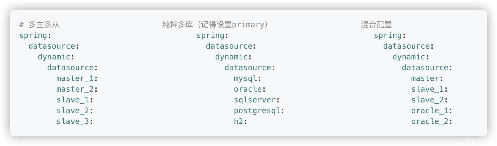
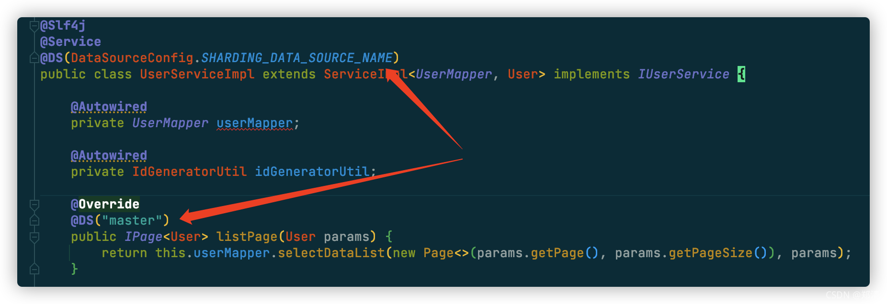

@[TOC](文章目录)

### 一、前言

1. [SpringBoot(48) 整合sharding-jdbc实现分库分表与读写分离](https://zhengqing.blog.csdn.net//article/details/121024815)
2. [SpringBoot(49) 整合sharding-jdbc实现自定义分库分表](https://zhengqing.blog.csdn.net//article/details/121087197)

本文将整合sharding-jdbc和多数据源(dynamic-datasource-spring-boot-starter)

### 二、整合sharding-jdbc和多数据源

springboot整合sharding-jdbc可参看之前的案例，小编这里将基于之前的配置加入多数据源配置

#### 1、`pom.xml`中引入依赖

```xml
<!-- 动态数据源 -->
<!-- https://mvnrepository.com/artifact/com.baomidou/dynamic-datasource-spring-boot-starter -->
<dependency>
    <groupId>com.baomidou</groupId>
    <artifactId>dynamic-datasource-spring-boot-starter</artifactId>
    <version>3.3.2</version>
</dependency>
```

#### 2、`application.yml`中新增多数据源配置

```yml
# 多数据源配置 可参考 https://gitee.com/baomidou/dynamic-datasource-spring-boot-starter
spring:
  datasource:
    dynamic:
      primary: master # 设置默认的数据源或者数据源组,默认值即为master
      strict: false   # 严格匹配数据源,默认false. true未匹配到指定数据源时抛异常,false使用默认数据源
      datasource:
        master:
          url: jdbc:mysql://127.0.0.1:3306/demo?allowMultiQueries=true&useUnicode=true&characterEncoding=UTF8&zeroDateTimeBehavior=convertToNull&useSSL=false # MySQL在高版本需要指明是否进行SSL连接 解决则加上 &useSSL=false
          username: root
          password: root
          driver-class-name: com.mysql.jdbc.Driver
#        db-test:
#          url: jdbc:mysql://127.0.0.1:3306/demo?allowMultiQueries=true&useUnicode=true&characterEncoding=UTF8&zeroDateTimeBehavior=convertToNull&useSSL=false # MySQL在高版本需要指明是否进行SSL连接 解决则加上 &useSSL=false
#          username: root
#          password: root
#          driver-class-name: com.mysql.jdbc.Driver
```



#### 3、sharding-jdbc集成动态数据源配置类

```java
/**
 * <p> sharding-jdbc集成动态数据源配置 </p>
 *
 * @author zhengqingya
 * @description 使用 {@link com.baomidou.dynamic.datasource.annotation.DS} 注解，切换数据源
 * ex: 切换为sharding-jdbc数据源 => @DS(DataSourceConfig.SHARDING_DATA_SOURCE_NAME)
 * @date 2021/11/2 10:13
 */
@Configuration
@AutoConfigureBefore({DynamicDataSourceAutoConfiguration.class, SpringBootConfiguration.class})
public class DataSourceConfig {
    /**
     * 分表数据源名称
     */
    public static final String SHARDING_DATA_SOURCE_NAME = "sharding-data-source";
    /**
     * 动态数据源配置项
     */
    @Autowired
    private DynamicDataSourceProperties properties;

    /**
     * sharding-jdbc有四种数据源，需要根据业务注入不同的数据源
     * <p>
     * 1.未使用分片, 脱敏的名称(默认): shardingDataSource;
     * 2.主从数据源: masterSlaveDataSource;
     * 3.脱敏数据源：encryptDataSource;
     * 4.影子数据源：shadowDataSource
     */
    @Lazy
    @Resource(name = "shardingDataSource")
    private AbstractDataSourceAdapter shardingDataSource;

    @Bean
    public DynamicDataSourceProvider dynamicDataSourceProvider() {
        Map<String, DataSourceProperty> datasourceMap = properties.getDatasource();
        return new AbstractDataSourceProvider() {
            @Override
            public Map<String, DataSource> loadDataSources() {
                Map<String, DataSource> dataSourceMap = createDataSourceMap(datasourceMap);
                // 将 shardingjdbc 管理的数据源也交给动态数据源管理
                dataSourceMap.put(SHARDING_DATA_SOURCE_NAME, shardingDataSource);
                return dataSourceMap;
            }
        };
    }

    /**
     * 将动态数据源设置为首选的
     * 当spring存在多个数据源时, 自动注入的是首选的对象
     * 设置为主要的数据源之后，就可以支持sharding-jdbc原生的配置方式了
     */
    @Primary
    @Bean
    public DataSource dataSource(DynamicDataSourceProvider dynamicDataSourceProvider) {
        DynamicRoutingDataSource dataSource = new DynamicRoutingDataSource();
        dataSource.setPrimary(properties.getPrimary());
        dataSource.setStrict(properties.getStrict());
        dataSource.setStrategy(properties.getStrategy());
        dataSource.setProvider(dynamicDataSourceProvider);
        dataSource.setP6spy(properties.getP6spy());
        dataSource.setSeata(properties.getSeata());
        return dataSource;
    }

}
```

#### 4、使用`@DS`切换数据源

@DS 可以注解在`方法`/`类`上，同时存在就近原则 方法上注解 优先于 类上注解。

| 注解          | 结果                                     |
| ------------- | ---------------------------------------- |
| 没有@DS       | 默认数据源                               |
| @DS("dsName") | dsName可以为组名也可以为具体某个库的名称 |





### 三、本文案例demo源码

[https://gitee.com/zhengqingya/java-workspace](https://gitee.com/zhengqingya/java-workspace)


---

> 今日分享语句：
> 能力不在脸上，本事不在嘴上！要脚踏实地做实事，生活不会因为某个节点的疏忽就永远灰暗，未来的幸运都是过往努力的积攒！
