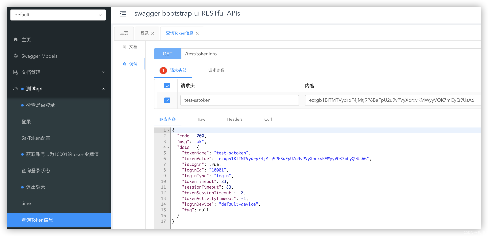

@[TOC](文章目录)

### 一、前言

Sa-Token 是一个轻量级 Java 权限认证框架，主要解决：登录认证、权限认证、Session会话、单点登录、OAuth2.0、微服务网关鉴权 等一系列权限相关问题。

[https://sa-token.dev33.cn/doc/index.html#/](https://sa-token.dev33.cn/doc/index.html#/)

### 二、整合Sa-Token实现权限认证

#### 1、`pom.xml`中引入依赖

```xml
<!-- Sa-Token 权限认证, 在线文档：http://sa-token.dev33.cn/ -->
<dependency>
    <groupId>cn.dev33</groupId>
    <artifactId>sa-token-spring-boot-starter</artifactId>
    <version>1.27.0</version>
</dependency>

<!-- Sa-Token 整合 Redis （使用jackson序列化方式） -->
<dependency>
    <groupId>cn.dev33</groupId>
    <artifactId>sa-token-dao-redis-jackson</artifactId>
    <version>1.27.0</version>
</dependency>

<!-- 提供Redis连接池 -->
<dependency>
    <groupId>org.apache.commons</groupId>
    <artifactId>commons-pool2</artifactId>
</dependency>
```

#### 2、`application.yml`配置

> 温馨小提示：这里的配置是假设前后端分离情况下，通过请求头参数信息进行认证~


```yml
spring:
  # redis配置
  redis:
    # Redis数据库索引（默认为0）
    database: 1
    # Redis服务器地址
    host: 127.0.0.1
    # Redis服务器连接端口
    port: 6379
    # Redis服务器连接密码（默认为空）
    # password: 
    # 连接超时时间
    timeout: 10s
    lettuce:
      pool:
        # 连接池最大连接数
        max-active: 200
        # 连接池最大阻塞等待时间（使用负值表示没有限制）
        max-wait: -1ms
        # 连接池中的最大空闲连接
        max-idle: 10
        # 连接池中的最小空闲连接
        min-idle: 0


# Sa-Token配置
sa-token:
  # token名称 (同时也是cookie名称)  注意不能带冒号:
  token-name: test-satoken
  # token有效期，单位s 这里设置2分钟, -1代表永不过期
  timeout: 120
  # token临时有效期 (指定时间内无操作就视为token过期) 单位: 秒
  activity-timeout: -1
  # 是否允许同一账号并发登录 (为true时允许一起登录, 为false时新登录挤掉旧登录)
  is-concurrent: true
  # 在多人登录同一账号时，是否共用一个token (为true时所有登录共用一个token, 为false时每次登录新建一个token)
  is-share: false
  # token风格
  token-style: random-128
  # 是否从cookie中读取token
  is-read-cookie: false
  # 是否从请求体里读取token
  is-read-body: false
  # 是否从head中读取token
  is-read-head: true
  # 是否输出操作日志
  is-log: true
  # 拦截url
  intercept-url-list:
    - /test/**
  # 开放url
  open-url-list:
    - /test/doLogin
    - /test/time
```

#### 3、自定义sa-token生成策略

```java
@Configuration
public class SaTokenCustomConfig {

    /**
     * 重写 Sa-Token 框架内部算法策略
     */
    @Autowired
    public void rewriteSaStrategy() {
        // 重写 Token 生成策略
        SaStrategy.me.createToken = (loginId, loginType) -> {
            // 随机60位长度字符串
            return SaFoxUtil.getRandomString(60);
        };
    }

}
```

#### 4、Sa-Token 拦截/开放 URL 配置类

```java
@Data
@Configuration
@ConfigurationProperties(prefix = "sa-token", ignoreUnknownFields = true)
public class SaTokenUrlConfig {

    /**
     * 拦截url
     */
    private List<String> interceptUrlList;

    /**
     * 开放url
     */
    private List<String> openUrlList;

}
```

#### 5、注册 Sa-Token 路由拦截器

```java
@Configuration
public class SaTokenWebMvcConfig implements WebMvcConfigurer {

    @Autowired
    private SaTokenUrlConfig saTokenUrlConfig;

    @Override
    public void addInterceptors(InterceptorRegistry registry) {
        // 注册1个登录认证拦截器
        registry.addInterceptor(new SaRouteInterceptor())
                .addPathPatterns(this.saTokenUrlConfig.getInterceptUrlList())
                .excludePathPatterns(this.saTokenUrlConfig.getOpenUrlList());
    }

}
```

#### 6、全局异常处理器

```java
@Slf4j
@RestControllerAdvice
public class MyGlobalExceptionHandler {

    @ExceptionHandler({SaTokenException.class})
    public SaResult saTokenException(SaTokenException e) {
        log.error("SaTokenException: ", e);
        return SaResult.error(e.getMessage());
    }

    @ExceptionHandler({NotLoginException.class})
    public SaResult notLoginException(NotLoginException e) {
        log.error("NotLoginException: ", e);
        return SaResult.error(e.getMessage());
    }

}
```

### 三、测试

```java
@Slf4j
@RestController
@RequestMapping("/test")
@Api(tags = "测试api")
public class TestController {

    @GetMapping("time")
    @ApiOperation("time")
    public String time() {
        log.info("time: {}", DateTime.now());
        return DateTime.now().toString();
    }

    @GetMapping("getSaTokenConfig")
    @ApiOperation("Sa-Token配置")
    public SaTokenConfig getSaTokenConfig() {
        log.info("Sa-Token配置：{}", SaManager.getConfig());
        return SaManager.getConfig();
    }

    @GetMapping("doLogin")
    @ApiOperation("登录")
    public String doLogin(String username, String password) {
        // 此处仅作模拟示例，真实项目需要从数据库中查询数据进行比对
        if ("zhang".equals(username) && "123456".equals(password)) {
            StpUtil.logout();
            StpUtil.login(10001);
            return "登录成功" + StpUtil.getLoginId();
        }
        StpUtil.logout();
        return "登录失败";
    }

    @GetMapping("isLogin")
    @ApiOperation("查询登录状态")
    public String isLogin() {
        return "当前会话是否登录：" + StpUtil.isLogin();
    }

    @GetMapping("logout")
    @ApiOperation("退出登录")
    public String logout(String loginId) {
        StpUtil.logoutByLoginId(loginId);
        return "SUCCESS";
    }

    @GetMapping("checkLogin")
    @ApiOperation("检查是否登录")
    public String checkLogin() {
        try {
            StpUtil.checkLogin();
        } catch (Exception e) {
            log.info("登录认证失效：{}", e.getMessage());
            return "FAIL:" + e.getMessage();
        }
        log.info("登录了...");
        return "SUCCESS";
    }

    @GetMapping("tokenInfo")
    @ApiOperation("查询Token信息")
    public SaResult tokenInfo() {
        return SaResult.data(StpUtil.getTokenInfo());
    }

    @GetMapping("getTokenValueByLoginId")
    @ApiOperation("获取账号id为10001的token令牌值")
    public String getTokenValueByLoginId() {
        return StpUtil.getTokenValueByLoginId(10001);
    }

}
```

接口文档 [http://127.0.0.1/doc.html](http://127.0.0.1/doc.html)


其它的自己看着sa-token官方文档玩吧， 比较简单，就不多展示了`^_^`

### 本文案例demo源码

[https://gitee.com/zhengqingya/java-workspace](https://gitee.com/zhengqingya/java-workspace)


---

> 今日分享语句：
> 你在学习上这种尝试精神很可贵。
