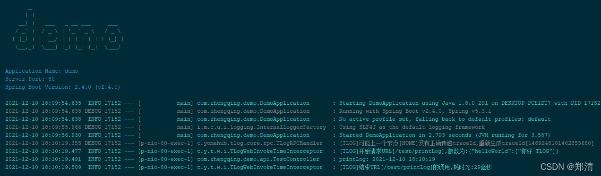

@[TOC](文章目录)

### 一、前言

本文将基于`springboot2.4.0`集成TLog 轻量级的分布式日志标记追踪神器

[https://tlog.yomahub.com](https://tlog.yomahub.com)

### 二、SpringBoot整合TLog

#### 1、`pom.xml`中引入依赖

```xml
<!-- tlog -->
<dependency>
    <groupId>com.yomahub</groupId>
    <artifactId>tlog-all-spring-boot-starter</artifactId>
    <version>1.3.6</version>
</dependency>
```

#### 2、`application.yml`中配置

```yml
tlog:
  # 自动打印调用参数和时间
  enable-invoke-time-print: true
  # 打印上层服务名称、ip
  pattern: '[$preApp][$preIp][$spanId][$traceId]'
```


#### 3、测试api

```java
@Slf4j
@RestController
@RequestMapping("/test")
@Api(tags = "测试api")
public class TestController {

    @GetMapping("printLog")
    @ApiOperation("printLog")
    public String printLog(@RequestParam String helloWorld) {
        log.info("printLog: {}", DateTime.now());
        return helloWorld;
    }

}
```

[http://127.0.0.1/doc.html](http://127.0.0.1/doc.html)




### 三、本文案例demo源码

[https://gitee.com/zhengqingya/java-workspace](https://gitee.com/zhengqingya/java-workspace)


---

> 今日分享语句：
> 虽然我走得很慢,但我从不后退!
