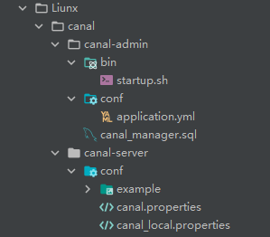
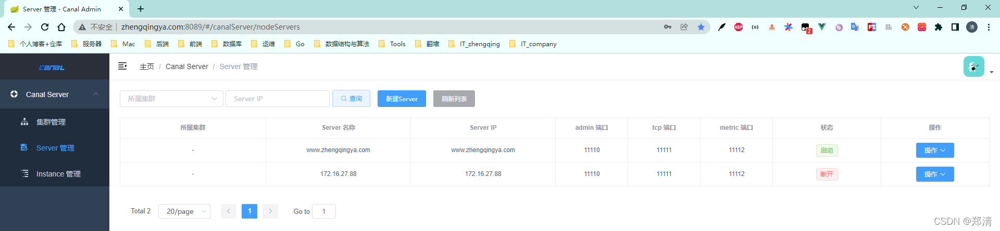
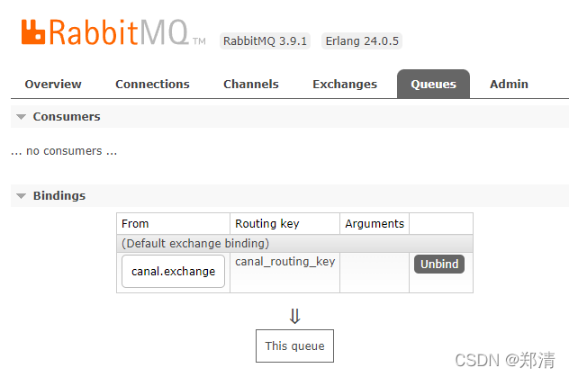
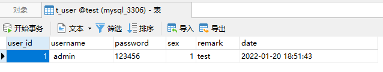
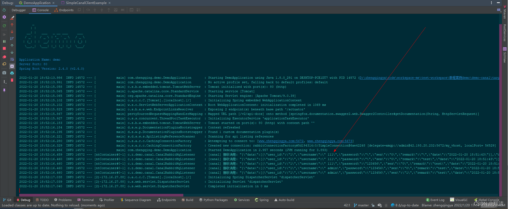
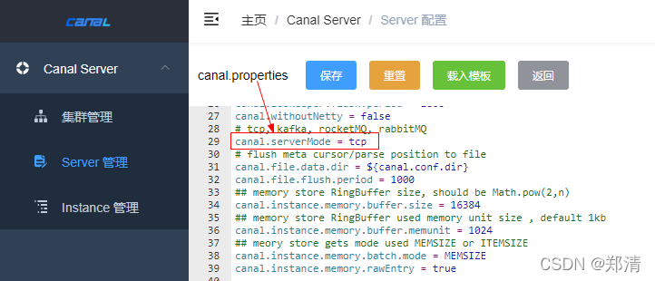
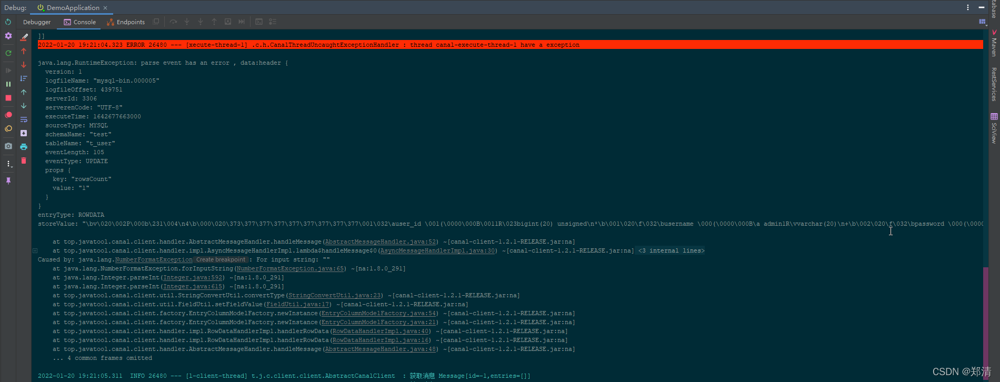

@[TOC](文章目录)

### 一、前言

canal：阿里巴巴 MySQL binlog 增量订阅&消费组件  
[https://github.com/alibaba/canal](https://github.com/alibaba/canal)

> tips: 环境要求和配置参考 [https://github.com/alibaba/canal/wiki/AdminGuide](https://github.com/alibaba/canal/wiki/AdminGuide)

这里额外提下Redis缓存和MySQL数据一致性解决方案
1. 延时双删策略
2. 异步更新缓存(基于订阅binlog的同步机制)
3. ...

我们的canal即可作为MySQL binlog增量订阅消费组件+MQ消息队列将增量数据更新到redis

### 二、docker-compose部署canal

> tips: 详情可查看 [https://gitee.com/zhengqingya/docker-compose](https://gitee.com/zhengqingya/docker-compose)

```shell
# 准备
git clone https://gitee.com/zhengqingya/docker-compose.git
cd docker-compose/Liunx

# 导入初始化SQL
Liunx/canal/canal_admin/canal_manager.sql

# 运行  (tips:先修改配置文件信息)
docker-compose -f docker-compose-canal.yml -p canal up -d
```

相关配置文件



###### docker-compose-canal.yml

```yml
# 可参考 https://github.com/alibaba/canal/wiki/QuickStart

version: '3'

# 网桥canal -> 方便相互通讯
networks:
  canal:

services:
  canal_admin:
    image: registry.cn-hangzhou.aliyuncs.com/zhengqing/canal-admin:v1.1.5      # 原镜像`canal/canal-admin:v1.1.5`
    container_name: canal_admin               # 容器名为'canal_admin'
    restart: unless-stopped                   # 指定容器退出后的重启策略为始终重启，但是不考虑在Docker守护进程启动时就已经停止了的容器
    volumes: # 数据卷挂载路径设置,将本机目录映射到容器目录
      - "./canal/canal-admin/bin/startup.sh:/home/admin/canal-admin/bin/startup.sh"
      - "./canal/canal-admin/logs:/home/admin/canal-admin/logs"
    environment: # 设置环境变量,相当于docker run命令中的-e
      TZ: Asia/Shanghai
      LANG: en_US.UTF-8
      canal.adminUser: admin
      canal.adminPasswd: 123456
      spring.datasource.address: www.zhengqingya.com:3306
      spring.datasource.database: canal_manager
      spring.datasource.username: root
      spring.datasource.password: root
    ports:
      - "8089:8089"
    networks:
      - canal

  canal_server:
    image: registry.cn-hangzhou.aliyuncs.com/zhengqing/canal-server:v1.1.5      # 原镜像`canal/canal-server:v1.1.5`
    container_name: canal_server              # 容器名为'canal_server'
    restart: unless-stopped                   # 指定容器退出后的重启策略为始终重启，但是不考虑在Docker守护进程启动时就已经停止了的容器
    volumes:                                  # 数据卷挂载路径设置,将本机目录映射到容器目录
      - "./canal/canal-server/logs:/home/admin/canal-server/logs"
    environment:                              # 设置环境变量,相当于docker run命令中的-e
      TZ: Asia/Shanghai
      LANG: en_US.UTF-8
      canal.admin.manager: canal_admin:8089
      canal.admin.port: 11110
      canal.admin.user: admin
      canal.admin.passwd: 6BB4837EB74329105EE4568DDA7DC67ED2CA2AD9
    ports:
      - "11110:11110"
      - "11111:11111"
      - "11112:11112"
    depends_on:
      - canal_admin
    links:
      - canal_admin
    networks:
      - canal
```

访问地址：`http://ip地址:8089`
默认登录账号密码：`admin/123456`



### 三、`canal-admin`可视化管理

> tips: 页面使用自行多点点就会了`^_^`
> 将数据投递到RabbitMQ配置为例，附带些其中重要的配置信息
> mq的交换机和队列可通过后面java代码自动生成，无需自己手动建立

#### 1、canal.properties

```yml
# canal admin config
#canal.admin.manager = 127.0.0.1:8089
canal.admin.port = 11110
canal.admin.user = admin
canal.admin.passwd = 6BB4837EB74329105EE4568DDA7DC67ED2CA2AD9

# tcp, kafka, rocketMQ, rabbitMQ
canal.serverMode = rabbitMQ

rabbitmq.host = www.zhengqingya.com:5672
rabbitmq.virtual.host = my_vhost
rabbitmq.exchange = canal.exchange
rabbitmq.username = admin
rabbitmq.password = admin
```

#### 2、instance.propertios 

```yml
canal.instance.master.address=www.zhengqingya.com:3306
# username/password
canal.instance.dbUsername=canal
canal.instance.dbPassword=canal
canal.instance.connectionCharset = UTF-8

# table regex 只同步test数据库下的t_user表
canal.instance.filter.regex=test\\.t_user
# table black regex
canal.instance.filter.black.regex=mysql\\.slave_.*

# mq config
canal.mq.topic=canal_routing_key
```

### 四、springboot整合canal实现数据同步

#### 1、`pom.xml`引入mq依赖

```xml
<dependency>
    <groupId>org.springframework.boot</groupId>
    <artifactId>spring-boot-starter-amqp</artifactId>
</dependency>
```

#### 2、`application.yml`配置

```yml
# RabbitMQ配置
spring:
  rabbitmq:
    addresses: www.zhengqingya.com:5672,www.zhengqingya.com:5673 # 指定client连接到的server的地址，多个以逗号分隔
    # 填写自己安装rabbitmq时设置的账号密码，默认账号密码为`guest`
    username: admin
    password: admin
    virtual-host: my_vhost # 填写自己的虚拟机名，对应可查看 `127.0.0.1:15672/#/users` 下Admin中的`Can access virtual hosts`信息
```


#### 3、mq监听canal消息数据

```java
@Slf4j
@Component
public class CanalRabbitMqListener {

    @RabbitListener(bindings = {
            @QueueBinding(
                    value = @Queue(value = MqConstant.CANAL_QUEUE, durable = "true"),
                    exchange = @Exchange(value = MqConstant.CANAL_EXCHANGE),
                    key = MqConstant.CANAL_ROUTING_KEY
            )
    })
    public void handleCanalDataChange(String message) {
        log.info("[canal] 接收消息: {}", JSON.toJSONString(message));
    }

}
```

```java
public interface MqConstant {

    String CANAL_EXCHANGE = "canal.exchange";
    String CANAL_QUEUE = "canal_queue";
    String CANAL_ROUTING_KEY = "canal_routing_key";

}
```

#### 4、测试

先启动项目让程序自动建立所需mq中的交换机和队列

再修改canal监听的表数据

查看程序监听的mq消息数据如下，拿到数据就可以进行数据解析处理了...


### 五、canal-spring-boot-starter

> tips: 可参考 [https://github.com/NormanGyllenhaal/canal-client](https://github.com/NormanGyllenhaal/canal-client)
> 此方式需将`canal.properties`配置文件中的`canal.serverMode`属性值修改为`tcp`
> 


#### 1、`pom.xml`中引入依赖

```xml
<!-- https://mvnrepository.com/artifact/top.javatool/canal-spring-boot-starter -->
<dependency>
    <groupId>top.javatool</groupId>
    <artifactId>canal-spring-boot-starter</artifactId>
    <version>1.2.1-RELEASE</version>
</dependency>
```

#### 2、`application.yml`配置

```yml
canal:
  server: www.zhengqingya.com:11111
  destination: example
```

#### 3、监听canal数据 -- 订阅数据库增删改操作

```java
@Slf4j
@Component
@CanalTable(value = "t_user")
public class UserHandler implements EntryHandler<User> {

    @Override
    public void insert(User user) {
        log.info("insert message  {}", user);
    }

    @Override
    public void update(User before, User after) {
        log.info("update before {} ", before);
        log.info("update after {}", after);
    }

    @Override
    public void delete(User user) {
        log.info("delete  {}", user);
    }

}
```

```java
@Data
@Table(name = "t_user")
public class User implements Serializable {

    /**
     * 主键
     */
    @Id
    @GeneratedValue(strategy = GenerationType.IDENTITY)
    @Column(name = "user_id")
    private Integer userId;

    /**
     * 用户名
     */
    @Column(name = "username")
    private String username;

    /**
     * 密码
     */
    @Column(name = "password")
    private String password;

    /**
     * 性别
     */
    @Column(name = "sex")
    private Integer sex;

    /**
     * 备注
     */
    private String remark;

    /**
     * 时间
     */
    private Date date;

}
```

经测试发现这个jar存在一些bug，ex：针对表字段，数据原本为空，修改为有值的时候，如果java这边用非String字段类型去接收会报错！



### 本文案例demo源码

[https://gitee.com/zhengqingya/java-workspace](https://gitee.com/zhengqingya/java-workspace)


---

> 今日分享语句：
> 如果心胸不似海，又怎能有海一样的事业。
