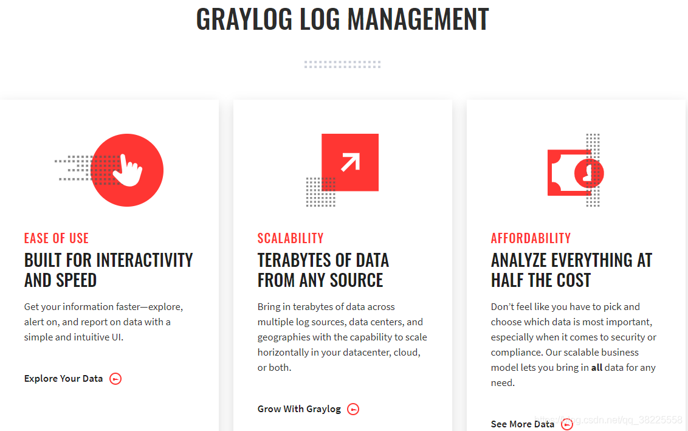
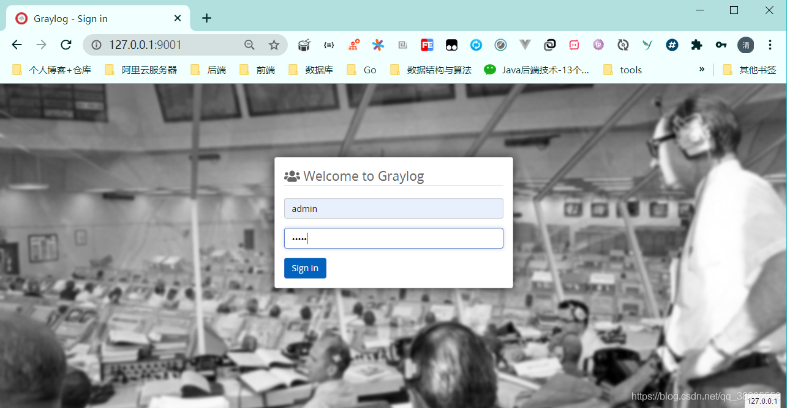
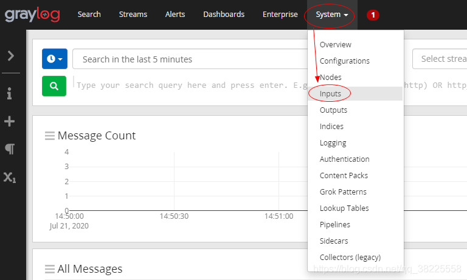
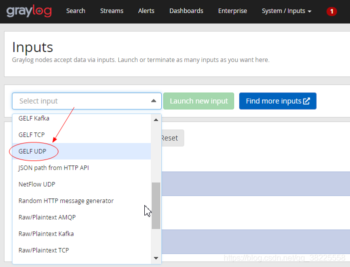
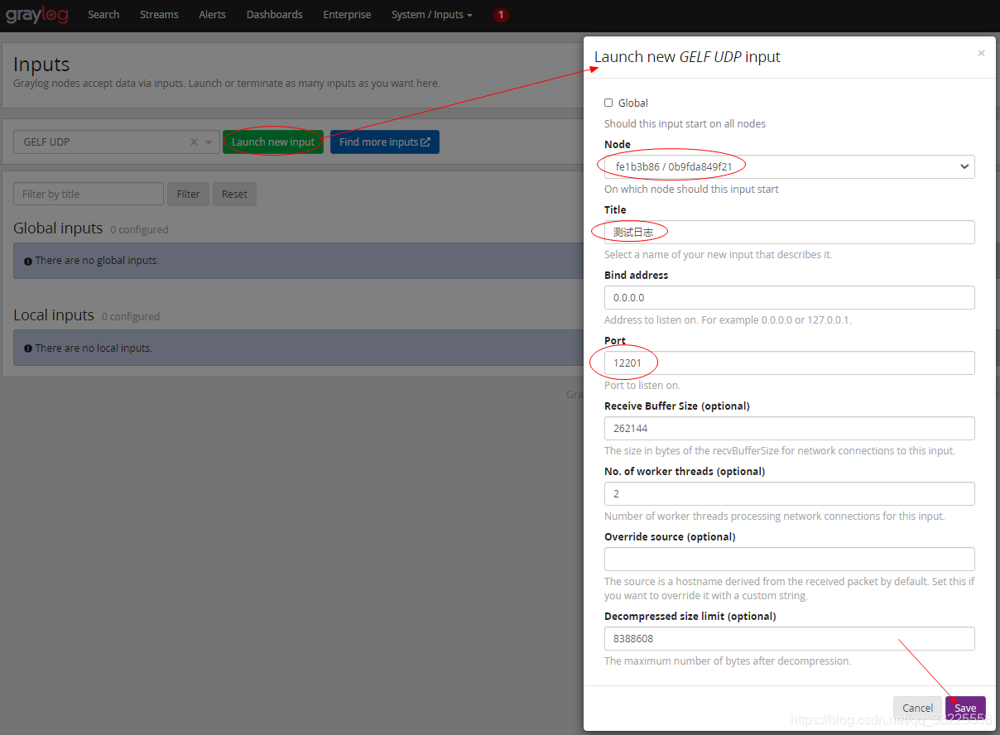
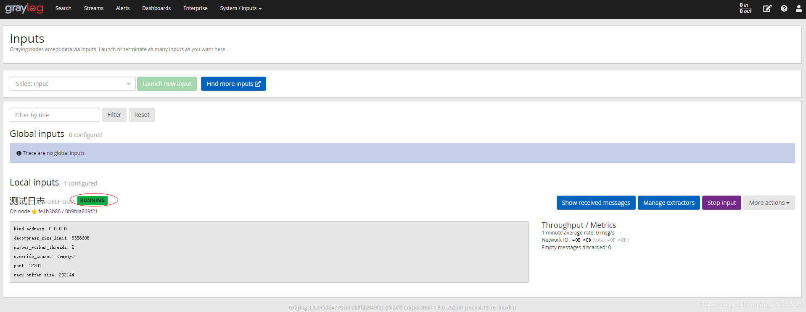
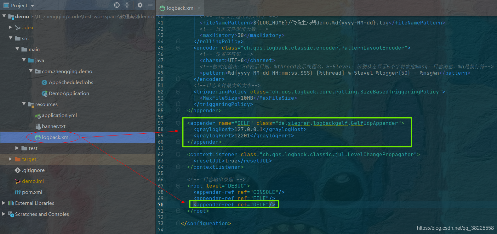
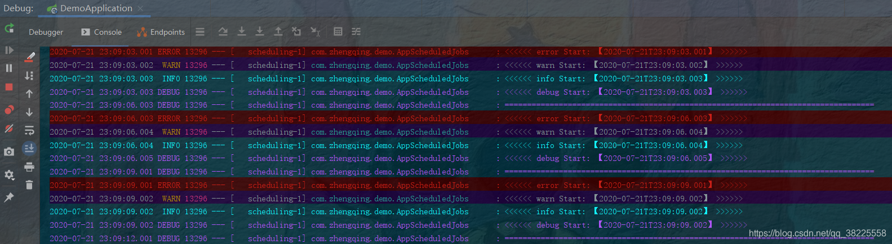
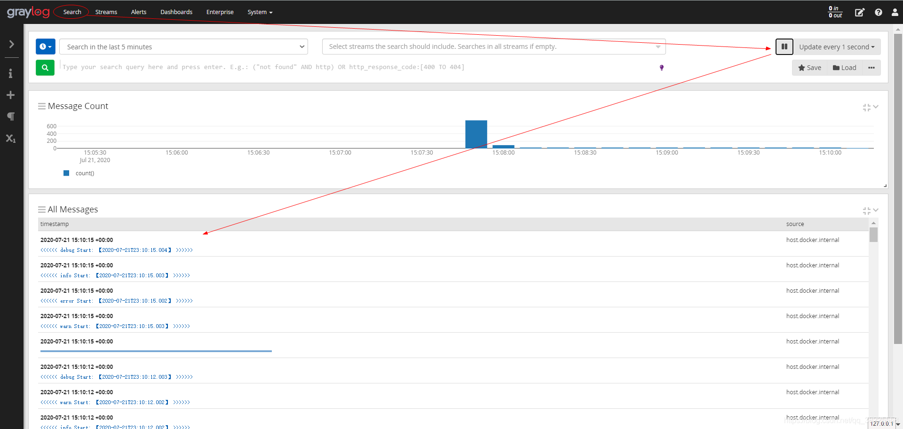
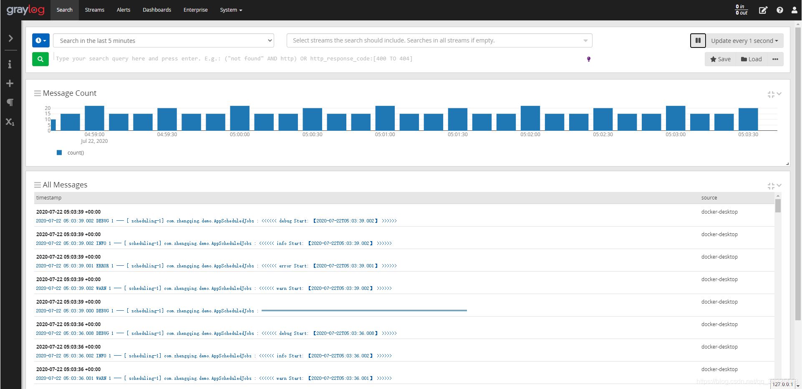

### 一、前言

1. Graylog官网：[https://www.graylog.org/](https://www.graylog.org/)
2. Graylog Docker安装文档：[https://docs.graylog.org/en/3.3/pages/installation/docker.html](https://docs.graylog.org/en/3.3/pages/installation/docker.html)

###### Graylog是什么？

一个比`ELK`轻的分布式日志管理平台...




### 二、`docker-compose`安装`Graylog`

```shell
# 环境准备
git clone https://gitee.com/zhengqingya/docker-compose.git

# Liunx系统走此路径
cd docker-compose/Liunx
# Windows系统走此路径
cd docker-compose/Windows

# 运行服务
docker-compose -f docker-compose-graylog.yml -p graylog_demo up -d
```

等待运行完成...


### 三、Graylog配置

访问地址：[`http://127.0.0.1:9001`](http://127.0.0.1:9001)
默认登录账号密码：`admin/admin`

① `System` -> `Inputs`

② 选择`GELF UDP`

③ `Launch new input`

④ 如下图完成配置


### 四、SpringBoot - Logback日志案例demo

> 项目基于springboot2.3.1.RELEASE

#### 1、`pom.xml`中新增`logback-gelf`依赖

```xml
<!-- logback-gelf -->
<!-- https://mvnrepository.com/artifact/de.siegmar/logback-gelf -->
<dependency>
  <groupId>de.siegmar</groupId>
  <artifactId>logback-gelf</artifactId>
  <version>3.0.0</version>
</dependency>
```

#### 2、`logback.xml`日志文件中新增如下配置



```xml
<appender name="GELF" class="de.siegmar.logbackgelf.GelfUdpAppender">
    <graylogHost>127.0.0.1</graylogHost>
    <graylogPort>12201</graylogPort>
</appender>

<!-- 日志输出级别 -->
<root level="DEBUG">
    <appender-ref ref="GELF"/>
</root>
```

#### 3、编写定时器测试日志输出

> 每3秒执行1次

```java
@Slf4j
@Component
@EnableScheduling
public class AppScheduledJobs {

    @Scheduled(cron = "*/3 * * * * ?")
    public void test() {
        log.debug("==================================================================================");
        log.error("<<<<<< error Start: 【{}】 >>>>>>", LocalDateTime.now());
        log.warn("<<<<<< warn Start: 【{}】 >>>>>>", LocalDateTime.now());
        log.info("<<<<<< info Start: 【{}】 >>>>>>", LocalDateTime.now());
        log.debug("<<<<<< debug Start: 【{}】 >>>>>>", LocalDateTime.now());
    }

}
```

#### 4、启动项目



### 五、Graylog中查看日志输出

[http://127.0.0.1:9001/search](http://127.0.0.1:9001/search)



### 六、Docker容器日志测试

#### 1、docker

```shell
# 启动一个docker测试日志:  ->  设置docker的log驱动为GELF
docker run -d \
--log-driver=gelf \
--log-opt gelf-address=udp://graylog服务器地址:12201 \
--log-opt tag=<容器服务标签 -> graylog查询分类使用> \
<IMAGE> <COMMAND>
```

docker-demo

```shell
docker run \
-d -p 88:88 --name log-java-demo \
--log-driver=gelf \
--log-opt gelf-address=udp://127.0.0.1:12201 \
--log-opt tag="{{.ImageName}}/{{.Name}}/{{.ID}}" \
registry.cn-hangzhou.aliyuncs.com/zhengqing/log-java-demo:latest
```

#### 2、docker-compose

```yml
logging:
  driver:"gelf"
  options:
    gelf-address:"udp://graylog服务器地址:12201"
    tag:"容器服务标签"
```

docker-compose-demo

```yml
version: '3'
services:
  log-java-demo:
    image: registry.cn-hangzhou.aliyuncs.com/zhengqing/log-java-demo:latest
    container_name: log-java-demo 
    ports:
      - "88:88"
    logging:
      driver: "gelf"
      options:
        gelf-address: "udp://127.0.0.1:12201"
        tag: log-java-demo
```

运行后回到graylog中查看相应日志信息



### 七、问题

docker-compose v2和v3版本之间的编排命令有所差异，刚开始在graylog官网看的2.x的compose v2版本的编排命令直接拿来在小编的v3版本中跑，出现坑... 最后习惯性的再查看graylog最新3.x版本的文档，重新来了一次，成功！  造成耗时原因在于纠结在那一个版本上了... (害~ 年轻人不能太钻牛角尖!!!)

---

### 本文案例demo源码地址

[https://gitee.com/zhengqingya/java-workspace](https://gitee.com/zhengqingya/java-workspace)

---

> 今日分享语句：一个人最大的智慧是透过别人的阅历而读懂自己的未来。
