@[TOC](文章目录)

### 一、前言

1. Prometheus：一个开源系统监控和警报工具包。
2. Grafana：Go语言开发的开源数据可视化工具，可以做数据监控和数据统计，带有告警功能。
3. Micrometer：收集Java性能数据

[运维(12) Prometheus+Grafana 搭建监控系统监控Liunx主机](https://zhengqing.blog.csdn.net/article/details/120464947)

### 二、SpringBoot集成Micrometer

#### 1、`pom.xml`中引入依赖

```xml
<!-- micrometer:收集Java性能数据 -->
<dependency>
    <groupId>io.micrometer</groupId>
    <artifactId>micrometer-registry-prometheus</artifactId>
</dependency>
```

#### 2、`application.yml`配置

```yml
server:
  port: 9200

spring:
  application:
    name: demo

management:
  endpoints:
    web:
      exposure:
        include: '*'
  metrics:
    tags:
      application: ${spring.application.name}
```

#### 3、Micrometer配置

```java
@Configuration
public class MetricsConfig {

    @Bean
    MeterRegistryCustomizer<MeterRegistry> configurer(
            @Value("${spring.application.name}") String applicationName) {
        return (registry) -> registry.config().commonTags("application", applicationName);
    }

}
```

启动应用，访问 [http://127.0.0.1:9200/actuator/prometheus](http://127.0.0.1:9200/actuator/prometheus)
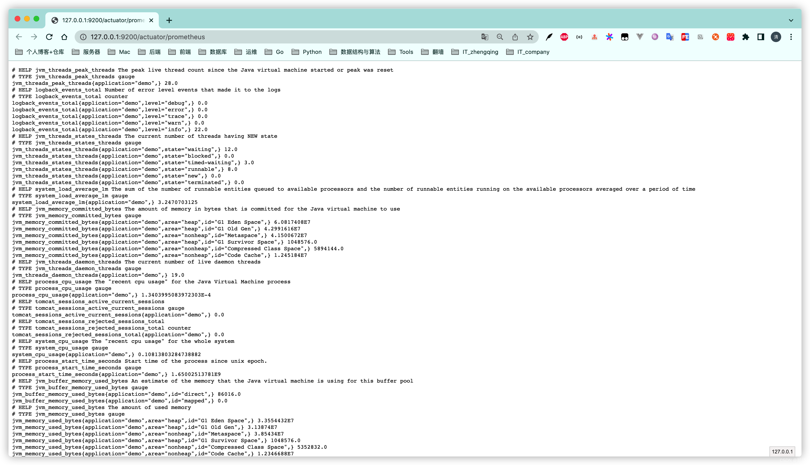

### 三、部署Prometheus+Grafana

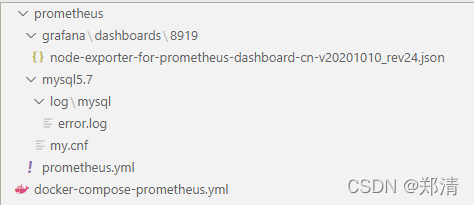

```shell
# 准备
git clone https://gitee.com/zhengqingya/docker-compose.git
cd docker-compose/Liunx

# `docker-compose-prometheus.yml` 需修改grafana中配置的mysql连接信息
# `prometheus.yml` 自行配置

# 运行服务
docker-compose -f docker-compose-prometheus.yml -p prometheus up -d
```


1. grafana访问地址 `ip地址:3000`
   默认登录账号密码：`admin/admin`
2. prometheus访问地址: `ip地址:9090`
3. exporter访问地址: `ip地址:9100/metrics`

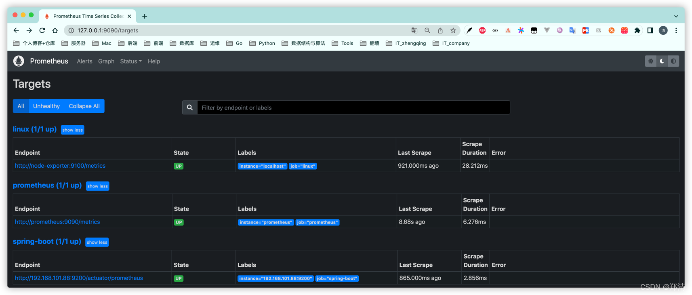

注意`prometheus.yml`配置需和`springboot`应用对应
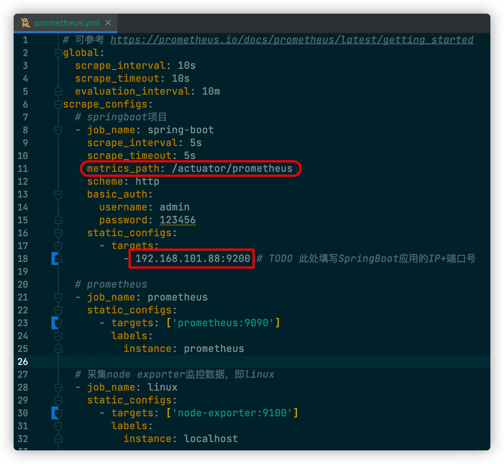


### 四、监控SpringBoot

#### 1、新增Prometheus数据源

`Configuration` -> `Data sources` -> `Add data source` -> `Prometheus`
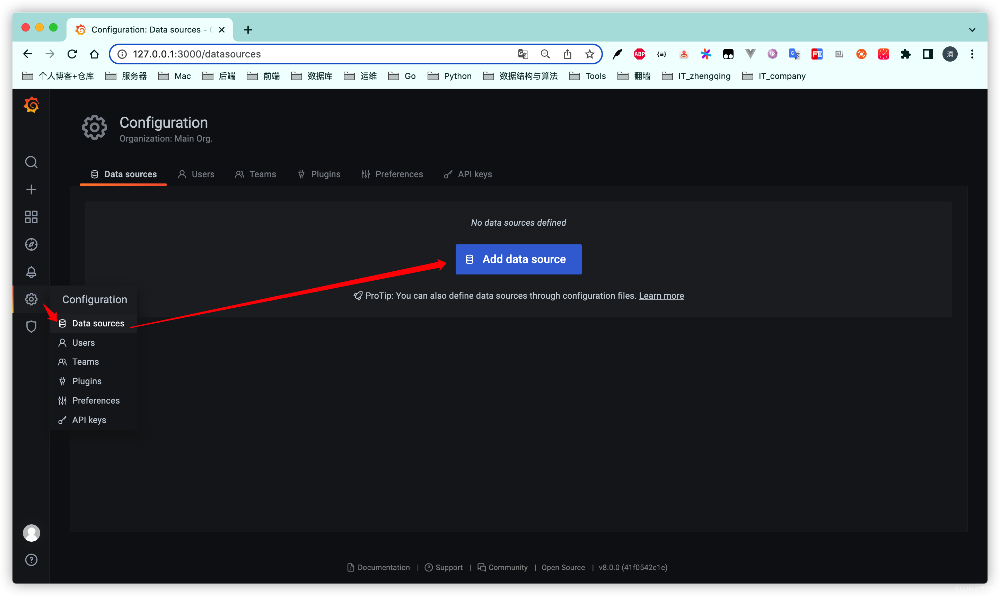

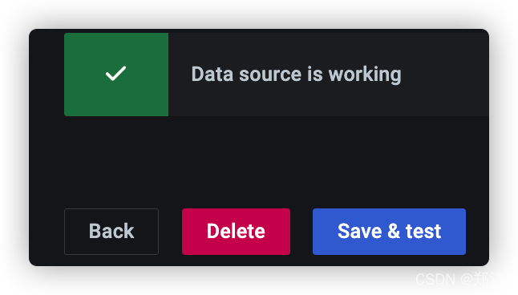

#### 2、导入Dashboard

`Create` -> `Import`

> grafana面板资源 [https://grafana.com/grafana/dashboards/4701](https://grafana.com/grafana/dashboards/4701)


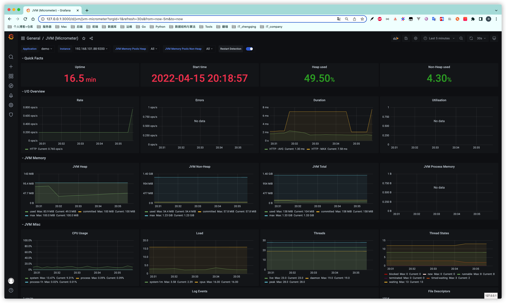

### 五、邮件告警

#### 1、配置`grafana.ini`


```
#################################### SMTP / Emailing ##########################
[smtp]
# 是否启用
enabled = true
# 服务地址
host = smtp.qq.com:465
# 邮箱用户名
user = xxx@qq.com
# If the password contains # or ; you have to wrap it with triple quotes. Ex """#password;"""
# 授权密码
password = xxx
;cert_file =
;key_file =
skip_verify = true
# 邮件From地址
from_address = xxx@qq.com
from_name = Grafana
# EHLO identity in SMTP dialog (defaults to instance_name)
;ehlo_identity = dashboard.example.com
# SMTP startTLS policy (defaults to 'OpportunisticStartTLS')
;startTLS_policy = NoStartTLS

[emails]
;welcome_email_on_sign_up = false
;templates_pattern = emails/*.html
```

#### 2、`Alerting` -> `Notification channels`

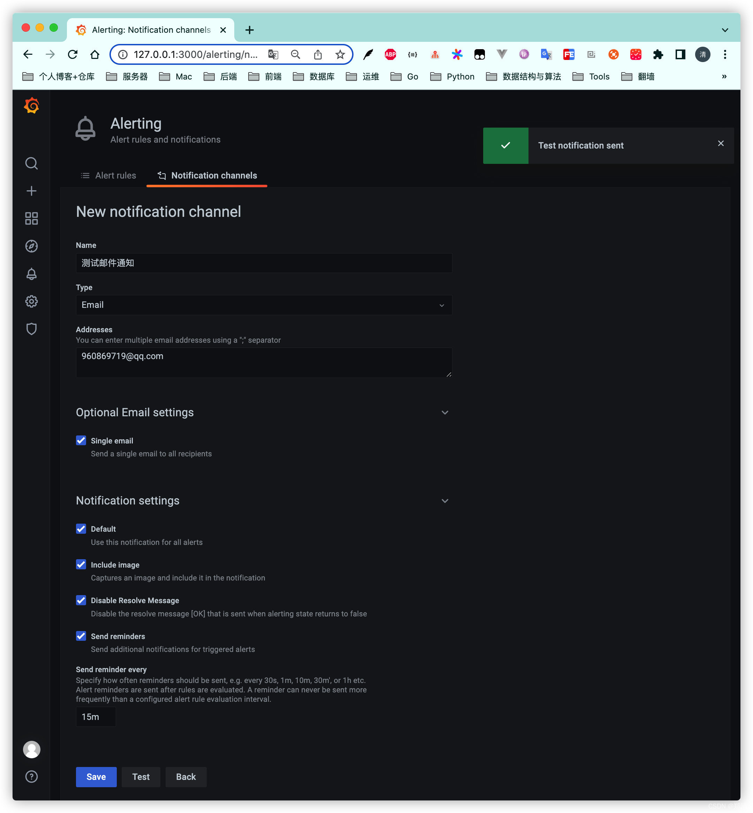
测试发送通知


#### 3、`Add panel`

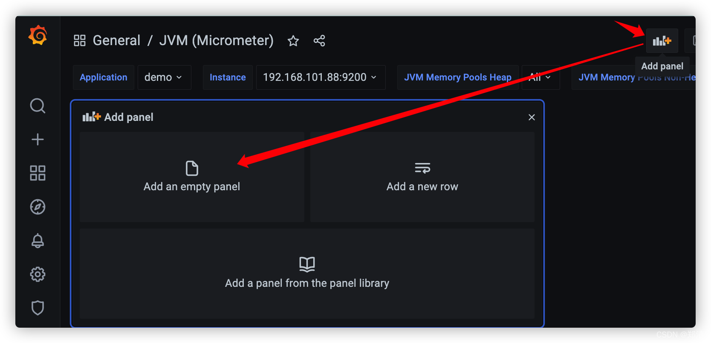
仿造`Heap used`配置一个

> tips: `Metrics browser`中不支持`模板变量` ( ex: `$application` )

```
sum(jvm_memory_used_bytes{application="demo", instance="192.168.101.88:9200", area="heap"})*100/sum(jvm_memory_max_bytes{application="demo",instance="192.168.101.88:9200", area="heap"})
```

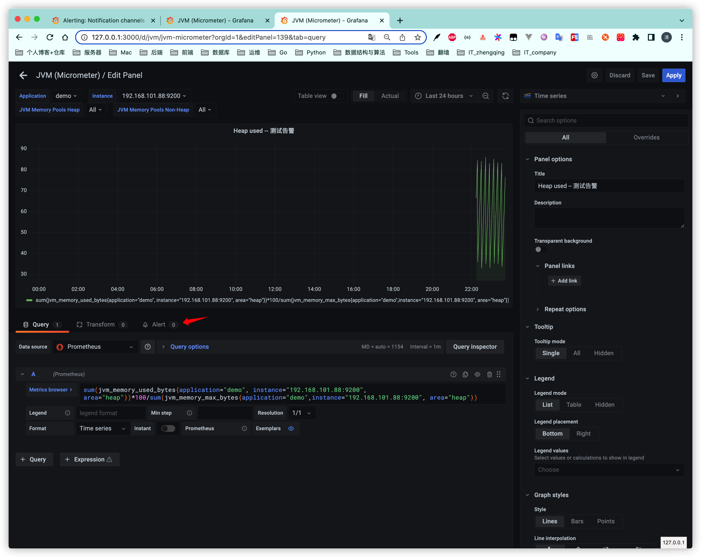
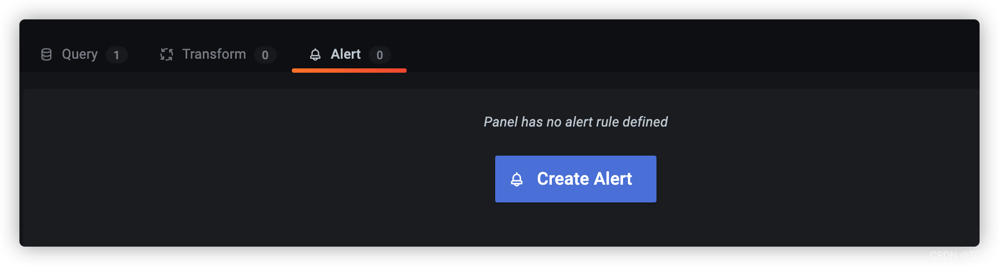
Apply

超标告警通知
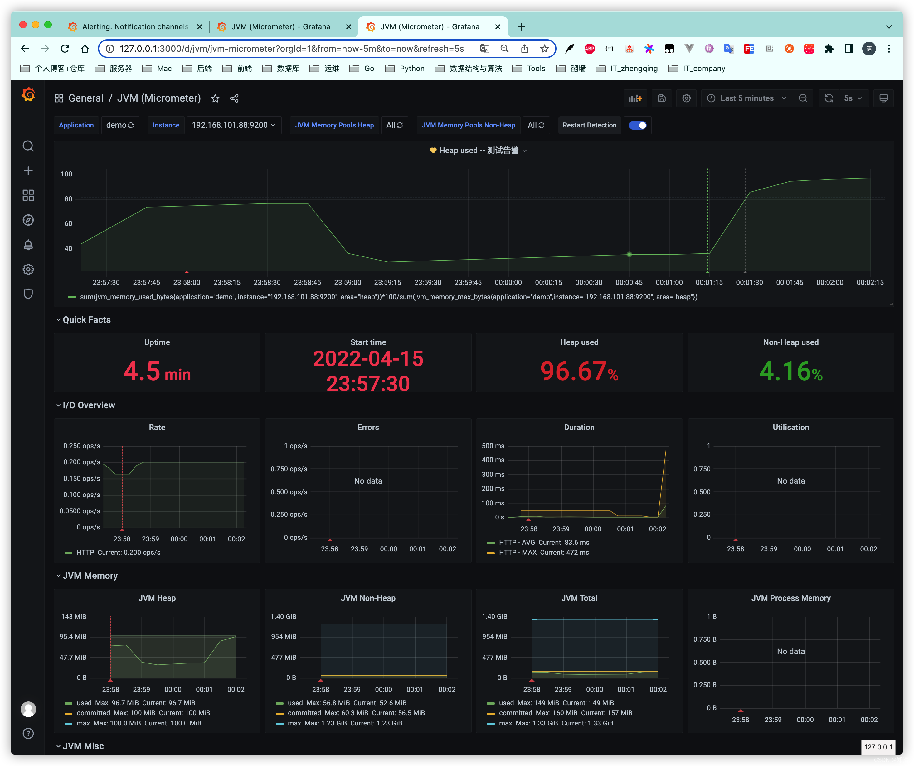


### 六、本文案例demo源码

[https://gitee.com/zhengqingya/java-workspace](https://gitee.com/zhengqingya/java-workspace)


---

> 今日分享语句：
> 不奋斗，你的才华如何配得上你的任性。
> 不奋斗，你的脚步如何赶得上父母老去的速度。
> 不奋斗，世界这么大你靠什么去看看。
