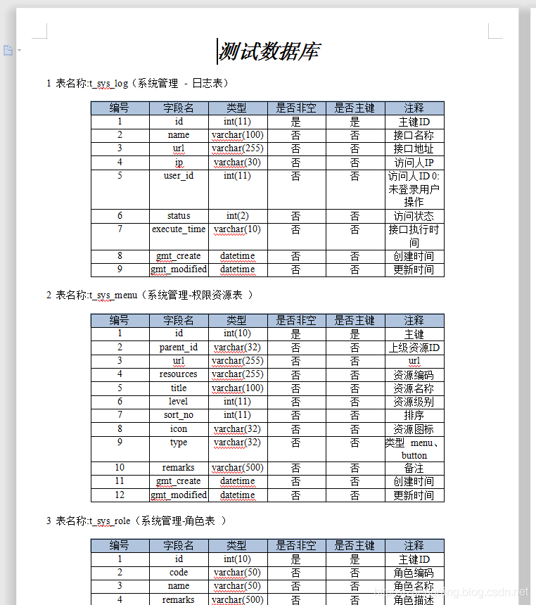
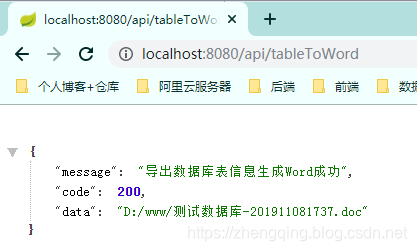
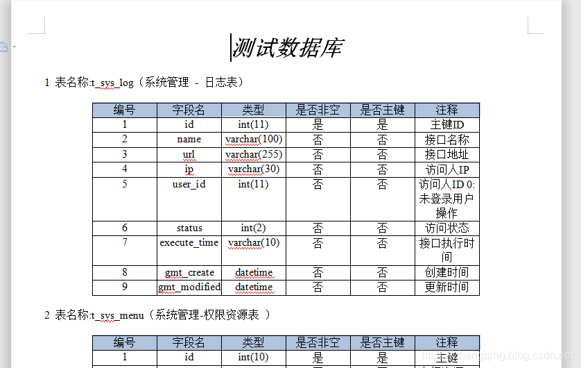

### 一、前言

最近看见朋友写了一个导出数据库生成word文档的业务，感觉很有意思，研究了一下，这里也拿出来与大家分享一波~

先来看生成word文档效果吧


下面我们也来一起简单的实现吧

### 二、Java 导出数据库表信息生成Word文档

温馨小提示：下面只是简单的展示一些主要代码，详情可参考文末给出的案例demo源码

###### 基本环境

1. spring-boot 2.1.8
2. mybatis-plus 2.2.0
3. mysql 数据库

#### 1、新增依赖

```xml
		<!-- ================== 将数据库表信息生成word文档信息所需 ====================== -->
        <!-- https://mvnrepository.com/artifact/com.lowagie/itext -->
        <dependency>
            <groupId>com.lowagie</groupId>
            <artifactId>itext</artifactId>
            <version>2.1.7</version>
        </dependency>
        <!-- https://mvnrepository.com/artifact/com.itextpdf/itext-asian -->
        <dependency>
            <groupId>com.itextpdf</groupId>
            <artifactId>itext-asian</artifactId>
            <version>5.2.0</version>
        </dependency>
        <!-- https://mvnrepository.com/artifact/com.lowagie/itext-rtf -->
        <dependency>
            <groupId>com.lowagie</groupId>
            <artifactId>itext-rtf</artifactId>
            <version>2.1.7</version>
        </dependency>
```

#### 2、查询表数据信息

```java
@Mapper
public interface TableMapper {

    /**
     * 获取指定数据库下所有表名和注释
     *
     * @param dbName:数据库名
     * @return: java.util.List<com.zhengqing.demo.modules.system.entity.Tables>
     */
    @Select("select table_name as name,table_comment as comment from information_schema.tables where table_schema =#{dbName} order by table_name")
    List<Tables> getAllTables(@Param("dbName") String dbName);

    /**
     * 获取指定表信息
     *
     * @param tableName:表
     * @return: java.util.List<com.zhengqing.demo.modules.system.entity.TableFileds>
     */
    @Select("SHOW FULL FIELDS FROM ${tableName}")
    List<TableFileds> getTable(@Param("tableName") String tableName);

}
```

#### 3、生成word文档实现类

```java
@Service
public class TableService implements ITableService {

    @Autowired
    private TableMapper tableMapper;
    @Autowired
    private TableToWordUtil tableToWordUtil;

    @Override
    public String getTableInfo() {
        // 1、获取数据库所有表信息
        List<Tables> tables = tableMapper.getAllTables(Constants.DATABASE);

        // 2、生成文件名信息 - 年月日时分秒
        String date = null;
        try {
            date = DateTimeUtils.dateFormat(new Date(), DateTimeUtils.PARSE_PATTERNS[12]);
        } catch (ParseException e) {
            e.printStackTrace();
        }
        String docFileName = Constants.FILE_PATH + "\\" + Constants.FILE_NAME + "-" + date + ".doc";

        // 3、调用工具类生成文件
        tableToWordUtil.toWord(tables, docFileName, Constants.FILE_NAME);

        // 4、返回文件地址
        String filePath = docFileName.replaceAll("\\\\", "/");
        return filePath;
    }
}

```

#### 4、其中生成word文档工具类

```java
@Service
public class TableToWordUtil {

    @Autowired
    TableMapper tableMapper;

    /**
     * 生成word文档
     *
     * @param tables：该数据库下所有表信息
     * @param fileName：生成文件地址
     * @param title:文件内容标题
     * @return: void
     */
    public void toWord(List<Tables> tables, String fileName, String title) {
        Document document = new Document(PageSize.A4);
        try {
            // 创建文件夹
            File dir = new File(Constants.FILE_PATH);
            dir.mkdirs();

            // 创建文件
            File file = new File(fileName);
            if (file.exists() && file.isFile()) {
                file.delete();
            }
            file.createNewFile();

            // 写入文件信息
            RtfWriter2.getInstance(document, new FileOutputStream(fileName));
            document.open();
            Paragraph ph = new Paragraph();
            Font f = new Font();
            Paragraph p = new Paragraph(title, new Font(Font.NORMAL, 24, Font.BOLDITALIC, new Color(0, 0, 0)));
            p.setAlignment(1);
            document.add(p);
            ph.setFont(f);
            for (int i = 0; i < tables.size(); i++) {
                String table_name = tables.get(i).getName();
                String table_comment = tables.get(i).getComment();
                List<TableFileds> fileds = tableMapper.getTable(tables.get(i).getName());
                String all = "" + (i + 1) + " 表名称:" + table_name + "（" + table_comment + "）";
                Table table = new Table(6);

                document.add(new Paragraph(""));

                table.setBorderWidth(1);
                table.setPadding(0);
                table.setSpacing(0);

                //添加表头的元素，并设置表头背景的颜色
                Color chade = new Color(176, 196, 222);

                Cell cell = new Cell("编号");
                addCell(table, cell, chade);
                cell = new Cell("字段名");
                addCell(table, cell, chade);
                cell = new Cell("类型");
                addCell(table, cell, chade);
                cell = new Cell("是否非空");
                addCell(table, cell, chade);
                cell = new Cell("是否主键");
                addCell(table, cell, chade);
                cell = new Cell("注释");
                addCell(table, cell, chade);

                table.endHeaders();

                // 表格的主体
                for (int k = 0; k < fileds.size(); k++) {
                    addContent(table, cell, (k + 1) + "");
                    addContent(table, cell, fileds.get(k).getField());
                    addContent(table, cell, fileds.get(k).getType());
                    addContent(table, cell, fileds.get(k).getNull().equals("YES") ? "否" : "是");
                    addContent(table, cell, fileds.get(k).getKey() != "" ? "是" : "否");
                    addContent(table, cell, fileds.get(k).getComment());
                }
                Paragraph pheae = new Paragraph(all);
                //写入表说明
                document.add(pheae);
                //生成表格
                document.add(table);
            }
            document.close();
        } catch (Exception e) {
            e.printStackTrace();
        }
    }

    /**
     * 添加表头到表格
     *
     * @param table
     * @param cell
     * @param chade
     */
    private void addCell(Table table, Cell cell, Color chade) {
        cell.setHorizontalAlignment(Element.ALIGN_CENTER);
        cell.setBackgroundColor(chade);
        table.addCell(cell);
    }

    /**
     * 添加内容到表格
     *
     * @param table
     * @param content
     */
    private void addContent(Table table, Cell cell, String content) {
        cell = new Cell(content);
        cell.setHorizontalAlignment(Element.ALIGN_CENTER);
        table.addCell(cell);
    }

}
```

#### 5、其中的一些常量参数

```java
public class Constants {

    /**
     * 需要生成word文档的数据库
     */
    public static final String DATABASE = "demo";
    /**
     * 生成文件名前缀
     */
    public static final String FILE_NAME = "测试数据库";

    /**
     * 生成文件地址
     */
    public static String FILE_PATH = "D:\\www";

}
```

### 三、测试生成效果

小编在demo中提供了一个`get`请求的接口`http://localhost:8080/api/tableToWord` 



接下来我们就可以去返回的地址中查看生成文件了



### 案例demo源码

[https://gitee.com/zhengqingya/java-workspace](https://gitee.com/zhengqingya/java-workspace)
